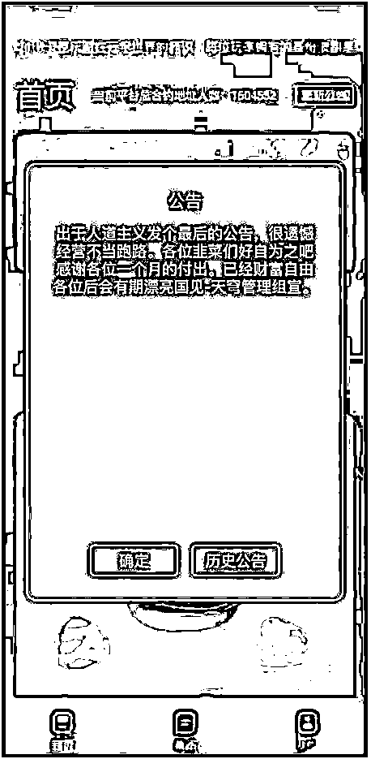
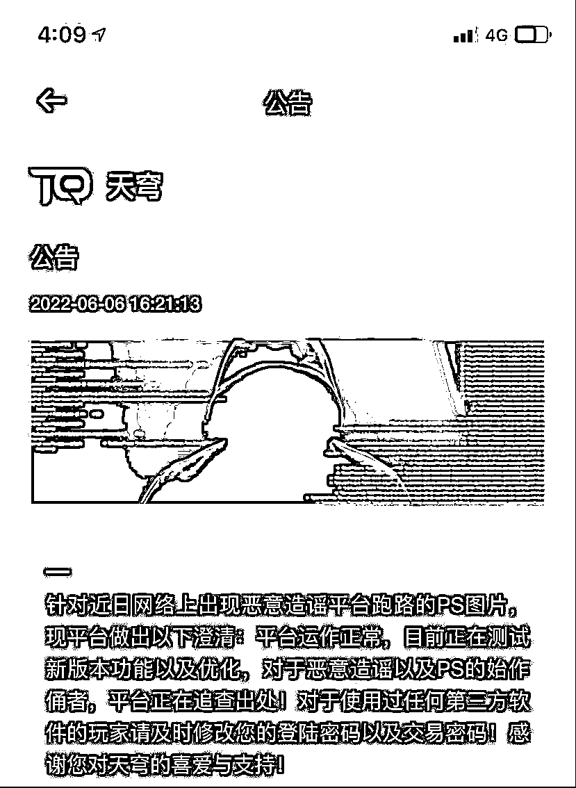
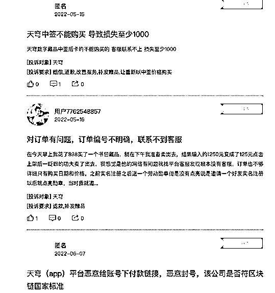
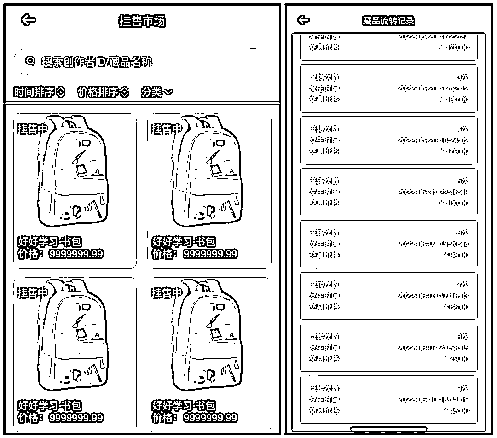

# 百万用户 NFT 平台传“跑路”，多位用户投诉恶意封号、虚假交易、涉嫌欺诈

> 原文：[`mp.weixin.qq.com/s?__biz=MzIyMDYwMTk0Mw==&mid=2247537808&idx=8&sn=e012c70a12d4b5c546724b2390ba3472&chksm=97cb9fa8a0bc16be58ed14dd07f104447dc0fa10bc46119515d4d39e83dd4620189179fe8360&scene=27#wechat_redirect`](http://mp.weixin.qq.com/s?__biz=MzIyMDYwMTk0Mw==&mid=2247537808&idx=8&sn=e012c70a12d4b5c546724b2390ba3472&chksm=97cb9fa8a0bc16be58ed14dd07f104447dc0fa10bc46119515d4d39e83dd4620189179fe8360&scene=27#wechat_redirect)

一场“跑路”风波在 NFT 数字藏品圈掀起风浪。

“出于人道主义发个最后的公告，很遗憾由于经营不当跑路。”近日，一张疑似热门交易平台天穹 NFT（原名“天穹数藏”）的公告截图在数字藏品投资者群里流传。

图片来源：网络

随后，天穹 NFT 官方发布公告称，平台运行正常，网上图片系“恶意造谣平台跑路的 PS 图片”。

虚惊一场，也让今年 4 月上线、短短数月吸粉逾百万的天穹 NFT 再度站上风口浪尖。“跑路”风波前，该平台还曾遭遇黑客攻击，引发网友感慨：数字藏品圈太乱。

**风波不断**

天穹 NFT 是一个区块链数字藏品交易流通平台。自 4 月正式上线后，受到不少投资者追捧，截至 6 月 10 日 20 时许，该平台合约地址人数已超 157 万。

近日，一张网络流传的截图让天穹 NFT 平台深陷“跑路”传闻。不久后，天穹 NFT 发布公告称此公告为“谣言”，并表示“平台运行正常，目前正在测试新版本功能以及优化，对于恶意造谣以及 PS 的始作俑者，平台正在追查出处。”

图片来源：天穹 NFT

这并非天穹数藏首次陷入风波。

上线两个月以来，天穹 NFT 平台多次发布“拉新”公告，鼓励玩家拉入更多新用户。与此同时，天穹 NFT 平台也多次出现异常。据多位投资者反映，平台曾出现支付通道维护、账号被盗等问题。

5 月中旬，天穹 NFT 平台的藏品售价曾突然猛涨上千倍，标价近千万元的藏品被“秒售”。彼时，平台公告称，这是被黑客攻击所致，黑客利用虚假余额虚假购买盗取用户的藏品，平台已报警处理。

6 月 11 日，一位 NFT 的资深玩家对中国证券报记者表示，曾经上午花 898 元在平台买了一件藏品，当天下午秒卖 1250 元，让他直呼“躺赢，秒赚钱”。记者注意到，投资者从平台买入的藏品，可以直接转手进行挂售与拍卖，实际上变相为炒作数字藏品提供了土壤。

记者注意到，在黑猫投诉上，天穹 NFT 的相关投诉多达数十条，多位用户投诉平台恶意封号、虚假交易、卡顿、涉嫌欺诈等。

图片来源：黑猫投诉

**标价近 1000 万的书包藏品**

**曾以 45 元交易**

6 月 11 日，记者在天穹 NFT 的挂售市场上看到，多款标价近 1000 万元的“好好学习·书包”藏品被挂售。其中一件藏品的流转记录显示，其在 6 月 10 日的交易价格仅为 45 元。

图片来源：天穹 NFT

天穹 NFT 平台显示，目前挂售的数字藏品最高价近 1000 万元，也有众多售价 10 元左右的藏品。

中国移动通信联合会元宇宙产业委员会执行主任于佳宁对中国证券报记者表示，目前数字藏品的价值并没有公认的衡量标准，因而可能出现投机、炒作甚至是欺诈、传销、非法集资等状况，消费者要仔细辨别。

**防范 NFT 相关金融风险**

据财通证券研究所 5 月数据，今年 1 月以来，数字藏品每月活跃的平台数量维持增长。3 月参与发行数字藏品的平台数首次突破 100 个，月活跃平台数增速在 3 月达到今年以来峰值，为 75.5%。

全球范围内，NFT 市场也持续在发展。市场追踪机构 DappRadar 的调查显示，2021 年全球的数字藏品总销售额为 249 亿美元，相比 2020 年上涨约 260 倍。

随着 NFT、数字藏品炒作风潮愈演愈烈，监管机构也对 NFT 提示了风险。

4 月 13 日，中国互联网金融协会、中国银行业协会、中国证券业协会联合发布关于防范 NFT 相关金融风险的倡议。在倡议声明中，三家协会提出了多项行为规范，其中包括：要求会员单位不为 NFT 交易提供集中交易（集中竞价、电子撮合、匿名交易、做市商等）、持续挂牌交易、标准化合约交易等服务等。

6 月 6 日，香港证监会发文称，NFT 与其他虚拟资产一样存在较高的风险，包括二手市场流通性不足、价格波动、定价欠缺透明度、遭黑客入侵及欺诈的风险，投资者应注意这些风险。如未能完全理解 NFT 和承受潜在亏损，便不应投资这些资产。

于佳宁对记者表示，目前数字藏品产业尚处于早期发展阶段，部分企业风险和合规意识薄弱，出现了投机炒作、滥用技术、盗用版权、虚构价值、交易不规范、潜在金融化等问题，甚至存在欺诈、传销、洗钱、非法集资等风险隐患。消费者需要冷静看待数字藏品的价值，切忌头脑发热冲动行事，特别在任何大额消费或投资事宜上都要极为谨慎。 

来源：中国证券报，利箭在出击

](https://mp.weixin.qq.com/s?__biz=Mzg5ODAwNzA5Ng==&mid=2247487973&idx=1&sn=1b62da6f2018402862a5c375e10c355e&chksm=c06878b2f71ff1a4fbe7df4dec626aa7e696154751693bf16f6c6a302ceaa4d1959040c70518&scene=21#wechat_redirect)

← 向右滑动与灰产圈互动交流 →

