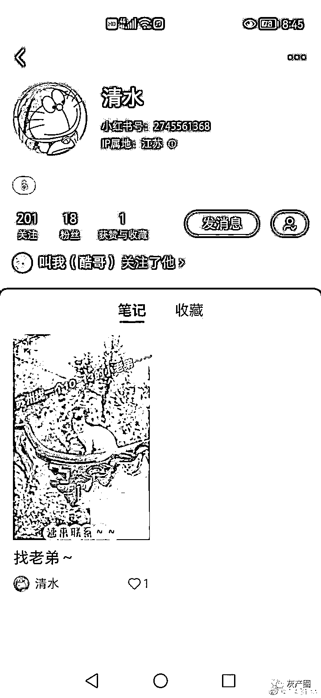
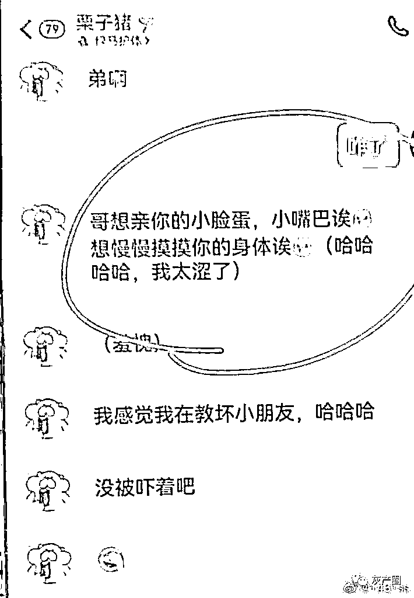
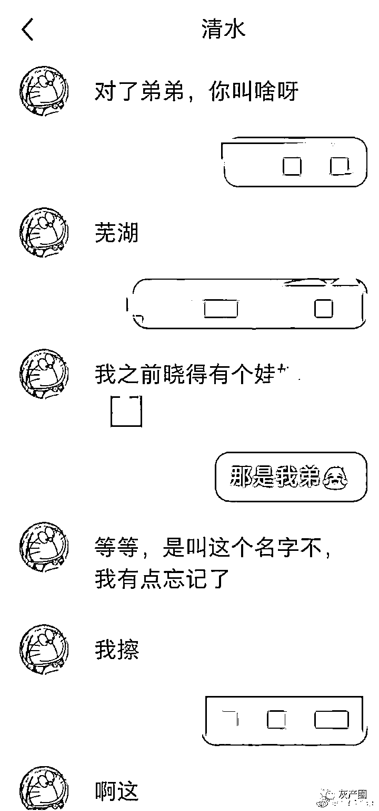

# 新东方老师骚扰 11 岁男童

> 原文：[`mp.weixin.qq.com/s?__biz=MzIyMDYwMTk0Mw==&mid=2247537886&idx=3&sn=f6b027fccda50309378a9e045723cfe2&chksm=97cb9fe6a0bc16f08d21febb0fde201ae1e137e8a786a5ae1edd8b763fb2f0ad0586305779c1&scene=27#wechat_redirect`](http://mp.weixin.qq.com/s?__biz=MzIyMDYwMTk0Mw==&mid=2247537886&idx=3&sn=f6b027fccda50309378a9e045723cfe2&chksm=97cb9fe6a0bc16f08d21febb0fde201ae1e137e8a786a5ae1edd8b763fb2f0ad0586305779c1&scene=27#wechat_redirect)

近日，“江苏一老师言语骚扰 11 岁男孩”的事件在网络上受到广泛关注。据一名孩子家长刘女士（化姓）反映，自己 11 岁的儿子受到了一名男老师的言语骚扰，家长发现后用孩子口吻与该男子聊天，约好线下见面并报警。

[`v.qq.com/iframe/preview.html?width=500&height=375&auto=0&vid=l33426gkz0o`](https://v.qq.com/iframe/preview.html?width=500&height=375&auto=0&vid=l33426gkz0o)

刘女士表示，骚扰自己儿子的男老师史某曾在新东方任教。据澎湃新闻报道，新东方相关人士回应到**，史某今年一月份已辞职，正在核实情况。**

**男老师主动加男孩并发送露骨内容**

6 月 11 日，刘女士的丈夫发现孩子晚上 11 点多还在玩手机，第二天早上刘女士在儿子手机里发现，一个陌生男子通过小红书 app 联系到儿子，并要求孩子提供 QQ 账号。“看到那个男的发送的信息后，我们非常震惊。”

刘女士表示，这个男老师 2021 年 2 月份在新东方辅导班教过自己两个儿子数学，在他通过小红书要到儿子 QQ 账号后，聊天中发送了“哥想亲你的小脸蛋”“馋了好久的小正太”等露骨信息，随后该男子还约儿子去饭店吃饭。

刘女士和丈夫偶然间看见孩子的聊天记录后非常气愤，随后向警方报案。刘女士用儿子的口吻同意史某的邀约，答应线下见面。史某到达指定见面地点后，却改口称自己“不会带孩子去哪里，只是想跟他一起玩”，随后被等候多时的民警带走。

**任职学校：该男老师已被开除**

6 月 14 日，苏州市中加枫华国际学校的工作人员李老师表示，史某于今年 5 月份入职，正在试用期，在接到家长反馈其有骚扰男孩的行为后，**学校将其开除**，“学校对这类事件是零容忍的态度”。

目前，该案件警方仍在处理当中。

来源：大象新闻 记者：张子琪，澎湃新闻，观察者网

](https://mp.weixin.qq.com/s?__biz=Mzg5ODAwNzA5Ng==&mid=2247487973&idx=1&sn=1b62da6f2018402862a5c375e10c355e&chksm=c06878b2f71ff1a4fbe7df4dec626aa7e696154751693bf16f6c6a302ceaa4d1959040c70518&scene=21#wechat_redirect)

← 向右滑动与灰产圈互动交流 →

