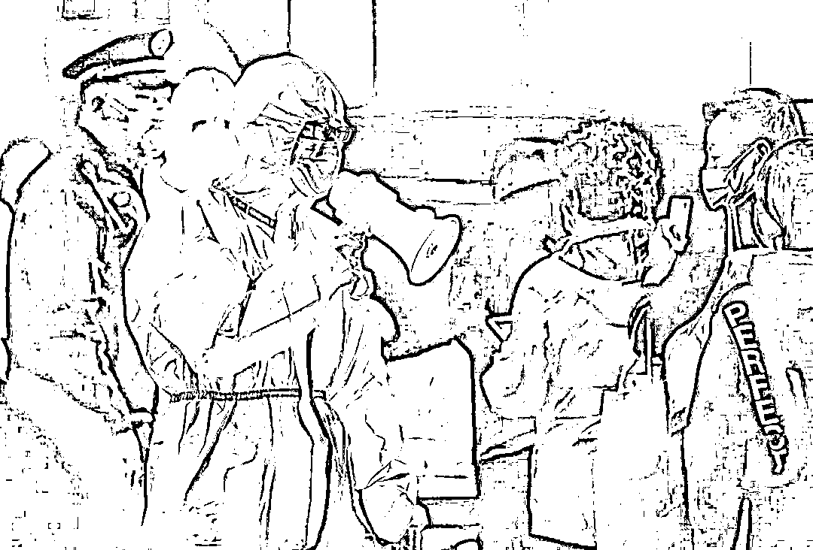

# "人在家中坐，红码天上来" 郑州回应

> 原文：[`mp.weixin.qq.com/s?__biz=MzIyMDYwMTk0Mw==&mid=2247537886&idx=4&sn=42ecf34c96f7cb2aef28d284ea5650d2&chksm=97cb9fe6a0bc16f0c5025f7b8a4ba0dca103d579ff7d1a32e28c25a62da566af832e217913a7&scene=27#wechat_redirect`](http://mp.weixin.qq.com/s?__biz=MzIyMDYwMTk0Mw==&mid=2247537886&idx=4&sn=42ecf34c96f7cb2aef28d284ea5650d2&chksm=97cb9fe6a0bc16f0c5025f7b8a4ba0dca103d579ff7d1a32e28c25a62da566af832e217913a7&scene=27#wechat_redirect)

6 月 13 日，网络流传的信息显示，前往郑州沟通村镇银行“取款难”的储户被赋“红码”。 

对于“红码”是否仅针对储户，工作人员表示具体情况并不了解，但经过查证是因大数据信息库出现了一些问题，现在已将该情况上报政府，正在积极改进中，“建议进行后续的关注”。

而 14 日中午，多位接受第一财经采访的河南村镇银行储户告诉记者，他们的健康码，突然又转为绿色了。

据南方都市报，6 月 13 日，网络流传的信息显示，**前往郑州沟通村镇银行“取款难”的储户被赋“红码”。**多位接受南都记者采访的储户称，**在扫码填报个人信息后，其场所码或豫康码显示为“红码”，“赋码原因”为，“正在实施集中或居家医学隔离观察的入境人员”等；但同行赴郑州的非储户人员健康码则未受影响。**此外，还有多位未前往郑州的储户在填报信息后被赋为“红码”。

[`v.qq.com/iframe/preview.html?width=500&height=375&auto=0&vid=b3342vifz4d`](https://v.qq.com/iframe/preview.html?width=500&height=375&auto=0&vid=b3342vifz4d)

图片来源：南方日报微博

## **百思不得其解的“红码”**

据第一财经，这些健康码突然变红的人，有一个共同的身份，即河南一些村镇银行的储户，据介绍，他们原本准备在 6 月 13 日从各地赶到郑州。

此前，由于河南多家村镇银行无法正常取款，一些储户非常焦虑，便通过多种途经反映自己的遭遇。

邓先生说，自己是石家庄人，**近 14 天一直待在石家庄的家中，并未到过河南。**

6 月 11 日晚，邓先生在他们自发组建的村镇银行储户沟通群中看到，一些储户因为扫了一个显示地址为“郑州车站西南出口”的场所码，结果健康码突然变红，自己还颇为惊奇，几乎不敢相信，随后，好奇的邓先生也扫了这个场所码，结果发现，自己的健康码也变红了，但他拿出家人的手机扫描这个场所码后，却发现家人的健康码仍为绿色，并未变红。

**“同在一所房子，行程码也一模一样，结果，健康码却一个是红色，一个是绿色。****”**邓先生对此百思不得其解，本该用于疫情防控的健康码，怎么会变得这么随意和“精准”？

根据国家有关规定，健康码是以真实数据为基础形成的个人二维码，其中健康码分别有三种颜色，分别是绿码、黄码和红码，其中红码是指核酸检测阳性人员、确诊病例、无症状感染者、疑似病例、密切接触者、次密切接触者以及近 14 天内有国内中高风险地区旅居史人员。 

邓先生发现，自己被赋红码的原因，是“通过数据库查询，您有一个出行提示：河南省将您的健康风险等级定位高，健康报告日期为 2022-6-11。”

图片来源：视觉中国-VCG111302565506（资料图，图文无关）

可是，近 14 天自己并没到过河南啊。邓先生赶紧查询河南省的赋码规则，其中，根据河南省 2021 年 8 月发布的健康码赋码规则，确诊病例、密接隔离、特殊工作人员、境外入境以及高风险地区来人等可以赋予红码。

邓先生仔细对照后发现，自己并不符合其中的赋码规则。

很快，更多群友都将自己被赋红码的截图发到了上述微信群，有在北京被赋红码的，也有在山东聊城被赋红码的。

突然被赋红码，给邓先生带去了意想不到的麻烦，他说，自己想去超市购物，却被告知，不得进入，他想去公园，也被拒绝，他想去理发，同样也被拒绝。

邓先生与当地疫情防控指挥部联系，希望尽快消除红码，却被告知，**红码由河南省赋予，他们无权消除**，他又赶紧跟河南联系，对方表示，会把他这种情况上报。

截至 6 月 14 日上午，邓先生的健康码仍为红色。

不过，6 月 14 日中午，多位接受第一财经采访的河南村镇银行储户告诉记者，**他们的健康码，突然又转为绿色了。**

 ****[`v.qq.com/iframe/preview.html?width=500&height=375&auto=0&vid=v3343fo05q0`](https://v.qq.com/iframe/preview.html?width=500&height=375&auto=0&vid=v3343fo05q0)**** 

## ******郑州 12345：大数据信息库出问题******

****据南方都市报，针对储户所疑问的“红码”情况，郑州市 12345 热线 13 日晚回应南都记者称：**目前没有接到“外地来郑州一律赴红码”通知**，如果被赋“红码”，建议先联系信息排查专班了解赋码原因。目前低风险地区来郑州只需要 48 小时核酸检测阴性证明，出示行程码和健康码。 ****

****据天目新闻，郑州市 12345 工作人员回复记者称，今天已接到多个来电反映未出行或者无缘由被河南省赋红码的情况。****

****对于“红码”是否仅针对储户，工作人员表示具体情况并不了解，**但经过查证是因大数据信息库出现了一些问题，现在已将该情况上报政府，正在积极改进中，“建议进行后续的关注”。******

****此外，12345 工作人员告诉记者，“河南省赋红码的情况，是省级单位进行处理的。建议可以尝试向社区咨询，**但据其接到的通知是目前社区也无法处理。如果是郑州市的红码，我们可以进行受理。”******

## ******郑州市 12320 卫生健康热线：**不太清楚是哪个部门进行的赋码********

****据南方都市报，郑州方面或已了解到多人被意外赋“红码”的情况。南都记者获取的一份录音显示，**一位储户反复询问工作人员自己为“红码”次日能否离开郑州，工作人员称，“应该没啥问题，你们不用管。****”**储户接着询问，上车以后能否变为绿码？“应该是没啥问题，我接到的通知应该是没啥问题。”工作人员说，“你看今天走了这么多都没啥问题。”****

****此外，郑州市 12320 卫生健康热线在 6 月 14 日上午回应一位储户的转码请求时称，“像您这个村镇银行的问题，我们这边已经接到了很多市民的电话，**我们这边是没办法解决的，我们不太清楚是哪个部门进行的赋码，如果有问题可以直接到国务院平台投诉。”******

****据了解，目前，前往郑州沟通的储户被分别安置在多处居住。有人尚为“红码”，也有人在未做核酸检测的情况下已变为“绿码”。被安置在某处的小叶告诉南都记者，他所在之处有工作人员表示，只要离开返乡，豫康码就能恢复正常。截至发稿时，有离开郑州的储户已变为“绿码”，但也有人返乡后仍为“红码”。****

## ******健康码无故“变红”，该怎么办？******

****据界面新闻，北京天平（长沙）律师事务所专职律师刘京成表示，随便赋予公众健康码红码，损害了防疫和政府等方面的公信力。****

****对于防疫而言，其他地方的卫健系统会将防疫资源投入到这些被赋红码，但原本阴性的普通人身上，造成资源浪费。公民为了防疫让渡自己的隐私权及出行数据，是为了公共利益，不能为公权力的滥用、扩张留下空间。****

****刘京成表示，**如果市民遇到健康码无故变红的情况，可以为自己维权，首先需要去做核酸，证明自己属于阴性，要求复核恢复正常状态，然后收集证据，可以向监察委等部门控告，后续也可以起诉，要求相关方面承担赔偿责任。******

****各地此前在发布健康码赋码规则时，同时也会提供市民自主申诉功能，包括可以通过电话和网络申报等方式为自己转码。上海德禾翰通律师事务所杨卫华律师告诉界面新闻，公众如遇这种情况，**可以投诉核查要求改正，并提起行政诉讼。******

****来源：第一财经，每日经济新闻，南方都市报，观察者网****

************](https://mp.weixin.qq.com/s?__biz=Mzg5ODAwNzA5Ng==&mid=2247487973&idx=1&sn=1b62da6f2018402862a5c375e10c355e&chksm=c06878b2f71ff1a4fbe7df4dec626aa7e696154751693bf16f6c6a302ceaa4d1959040c70518&scene=21#wechat_redirect)****

****← 向右滑动与灰产圈互动交流 →****

********