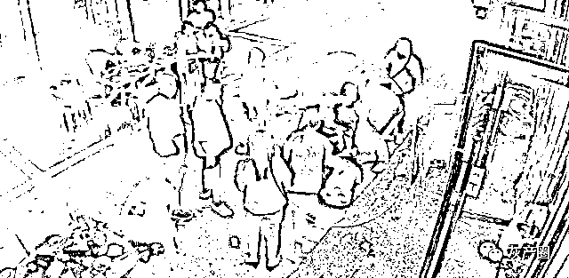
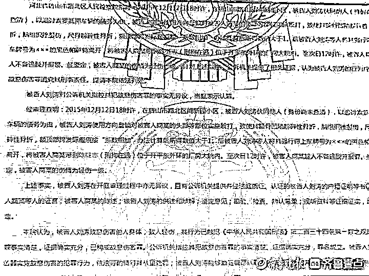

# 唐山打人案主嫌犯被抓时仍是逃犯？廊坊广阳刑警回应

> 原文：[`mp.weixin.qq.com/s?__biz=MzIyMDYwMTk0Mw==&mid=2247537886&idx=6&sn=ec232716460143660a58fea33983e35d&chksm=97cb9fe6a0bc16f08b4453c5f51f721ce71e7efb57efb58780870d3805d13edec244a4b9928c&scene=27#wechat_redirect`](http://mp.weixin.qq.com/s?__biz=MzIyMDYwMTk0Mw==&mid=2247537886&idx=6&sn=ec232716460143660a58fea33983e35d&chksm=97cb9fe6a0bc16f08b4453c5f51f721ce71e7efb57efb58780870d3805d13edec244a4b9928c&scene=27#wechat_redirect)

唐山打人事件中多名嫌犯有前科，其中主嫌犯陈继志涉及 2015 年的一起刑事案件，涉嫌“刑拘在逃”。此次陈继志被抓时，是否仍是逃犯？6 月 14 日上午，廊坊市公安局广阳分局刑警表示，专案组正在调查中。

根据唐山警方发出的[相关通报](http://mp.weixin.qq.com/s?__biz=MzIyMDYwMTk0Mw==&mid=2247537687&idx=2&sn=d1f224a9f3f8f204e7ebeeda093ba195&chksm=97cb9f2fa0bc16393576b80eb674fc8d7c0f010d457e815d6d97fa32e2ad11d26b58849b189a&scene=21#wechat_redirect)显示，打人案件中，主犯为陈继志和刘某。

记者检索发现，在一个名为“路北巡控”的美篇账号上，曾在 2019 年 7 月发布过标题为“110 那些事——光明里派出所抓获一名涉嫌非法拘禁的网上逃犯”的文章。在该文章提及了一起发生在 2015 年 12 月 13 日的案件，该案件中两名犯罪嫌疑人名为刘某和陈继志。

记者查阅中国裁判文书网发现，2015 年 12 月 12 日 18 时许，在唐山市路北区闻新园小区，被告人刘某伙同他人（身份尚未查清），以追讨索要抵押车辆的债务为由，被告人刘某使用方向盘锁对被害人商某的头部等部位实施殴打，致使其额骨凹陷粉碎性骨折，脑组织挫裂伤，尺骨粉碎性骨折，额顶部跨发际瘢痕按“系数相加”办法计算后所得数值大于 1。后被告人刘某等人将其强行带上车牌号为×××的黑色帕萨特离开，将被害人商某带到陈继志（刑拘在逃）位于开平东外环的厂房大院内。至次日 12 时许，被害人商某趁人不备逃脱并报警。经鉴定，被害人商某的伤情为轻伤一级。

2018 年 3 月 21 日，犯罪嫌疑人刘某被唐山市公安局路北分局依法刑事拘留。2018 年 4 月 27 日，唐山市路北区人民检察院以涉嫌故意伤害罪对刘某批准逮捕。之后，2018 年 12 月 20 日，唐山市路北区人民法院认定刘某已构成故意伤害罪，依法判处刘某有期徒刑二年零一个月。

事后，刘某提起上诉，2019 年 3 月 11 日，唐山市中级人民法院终审裁定，驳回上诉，维持原判。

在 2015 年的这起故意伤害案中，两份判决书中均提到陈继志，并且标注“刑拘在逃”。

所谓的刑拘在逃是指公安机关经查证针对犯罪嫌疑人所犯有的罪行已经下达《刑事拘留证》，但犯罪嫌疑人为逃避刑事责任而潜逃，公安机关对于这种人员通常会进行网上追逃。

**如此一来，2019 年 3 月 11 日终审判决时，陈继志依旧处于刑拘在逃。记者在中国裁判文书网中输入陈继志以及唐山之后，发现自 2019 年 3 月 11 日终审判决后，并不存在对陈继志的刑事诉讼。**

难道 2019 年 3 月 11 日之后，陈继志的“逃犯”之名被撤销？又或者是 2019 年 3 月 11 日至今，逃犯陈继志就未被公安机关抓获？

如果逃犯陈继志一直未被抓获的话，那么，此次唐山打人案件，警方抓获陈继志时，他不仅是该案件的犯罪嫌疑人，是否还是一名在逃逃犯？

对此，6 月 14 日上午，记者联系到廊坊市公安局广阳分局刑警大队，值班民警告诉记者，这个案件是归该刑警大队管，专案组正在调查具体情况，随着该案件的调查，相关情况会及时向社会公布。

[`v.qq.com/iframe/preview.html?width=500&height=375&auto=0&vid=o33422okihi`](https://v.qq.com/iframe/preview.html?width=500&height=375&auto=0&vid=o33422okihi)

（记者 张国桐）

来源：齐鲁晚报·齐鲁壹点

](https://mp.weixin.qq.com/s?__biz=Mzg5ODAwNzA5Ng==&mid=2247487973&idx=1&sn=1b62da6f2018402862a5c375e10c355e&chksm=c06878b2f71ff1a4fbe7df4dec626aa7e696154751693bf16f6c6a302ceaa4d1959040c70518&scene=21#wechat_redirect)

← 向右滑动与灰产圈互动交流 →

