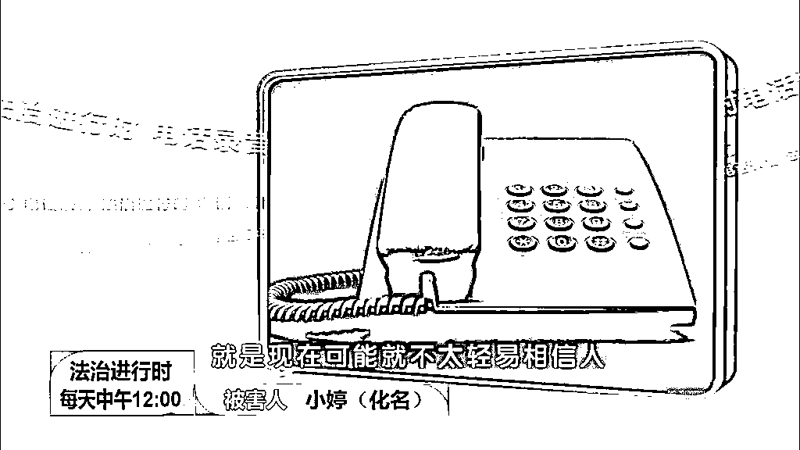

# 扫黄抓了诈骗犯，13 名受害者竟无一人报警，这是什么犯罪心理学大师？

> 原文：[`mp.weixin.qq.com/s?__biz=MzIyMDYwMTk0Mw==&mid=2247537886&idx=7&sn=9e7356a1aaacf5ff16f5d65069c9bec3&chksm=97cb9fe6a0bc16f0fb45c0b9c74ac62c9beabcf1ba73e98b00d3bfb1943130e851b60ead5e68&scene=27#wechat_redirect`](http://mp.weixin.qq.com/s?__biz=MzIyMDYwMTk0Mw==&mid=2247537886&idx=7&sn=9e7356a1aaacf5ff16f5d65069c9bec3&chksm=97cb9fe6a0bc16f0fb45c0b9c74ac62c9beabcf1ba73e98b00d3bfb1943130e851b60ead5e68&scene=27#wechat_redirect)

小时候总听妈妈数落我说：

**你被卖了还要帮人数钱。**

****

**这句话给我留下一种印象，好像骗子的最高境界就是骗了你你还帮他数钱。**

**以前我一直不相信真有这样的骗子。**

**直到看了小婷的经历，我才相信这世界上真的有犯罪心理学大师。**

****01****

****扫黄组抓了个诈骗犯****

**2021 年 11 月 11 日，北京朝阳区某酒店内。**

**小婷正在宽衣解带，一旁的床上躺着一名身材矮小、体型肥硕的男子。**

**这一男一女看来即将发生一些不好描述的事情。** 

**就在此时，为了文章能够顺利过审（不是**

**为了阻止肮脏的交易，西城区警方及时破门而入，人赃并获。**

********

**奇怪的是，**这并不是一起简单的卖淫嫖娼案件。****

****因为就连开房的钱都来自女方。****

****这时候就有人要跳出来说了：“就不能是男的被嫖了吗？”****

****你看看上面被抓捕的图片，还能说出这样的话吗？**** 

********

****经过警方的询问，发现这的确不是卖淫嫖娼，而是一起诈骗案！****

****诈骗者正是肥硕男子，而小婷遭遇了骗财骗色还浑然不知。**** 

************

****这个被扫黄组抓到的诈骗犯到底是谁？其中又发生了什么？****

****让我们从早些时候开始说起。****

******02******

******骗财骗色骗模特******

****小婷今年 28 岁，长相艳丽、身材姣好，美貌两字就写在脸上。****

****硬件这么顶，小婷就想把身体条件发挥出来，干些常人干不了的工作——模特。**** 

********

****图为维密超模****

****虽说想法很美好，但现实里模特工作却并不好找。****

****为此小婷加了不少模特工作群，希望能捞点机会。****

****2020 年 11 月，机会来了。****

****年前她在模特群里加到了一个演艺公司老板助理，这个助理在朋友圈发了一条模特招聘广告。****

****广告说**招聘符合条件的漂亮模特，审核一经通过，轻松日入几大千。******

****************

******小婷有些心动了。****** 

******又能当模特，又有钱赚，这不正是自己心心念念的工作机会吗？******

******二话不说，小婷赶紧主动联系了助理。******

******助理先是介绍了公司情况，随后又着重强调了老板陈某多么年轻有为、事业有成云云。******

******小婷虽然有些奇怪为什么要如此强调老板的身份，但转念一想，这不正说明公司实力强大吗？******

******一通介绍之后，助理约小婷面试，并表示老板对于模特要求很高，会亲自面试。******

****************

******谁面不是面呢？小婷不疑有他，欣然前往。****** 

******首轮面试中，老板陈某一不讲工作内容，二不说岗位要求，反而开始大吹特吹自己在圈内人脉有多广、资源有多好。****** 

******聊到动情处还会拿出手机，给小婷看之前合作过的模特的聊天记录，**以及动辄上万元的转账往来。********

****************

******牛是越吹越大，一门心思想当模特的小婷也是越听越信，积极展示着自己的优势，生怕被淘汰。******

******面试结束后，为了第一时间知道结果，小婷依然和陈某保持着联系。****** 

********奇怪的是，这个“年少有为”“事业有成”的老板陈某，却时常以各种原因向她要钱。********

******要么说是借，要么说是打赏助理红包，要么说是面试费用，总之就是变着法的找小婷要钱。******

****************

******小婷当然也没钱，但是为了不失去这次机会，她尽量讨好陈某。******

********前前后后共向陈某转了几千元。********

****************

******这种没上班先给老板发钱的事，本身就够奇怪了，然而更奇怪的还在后面。******

******面试也面了，钱也转了，过了几天助理突然通知小婷：******

******“面试没过”。****** 

************

******当时的小婷除了脏话估计没什么好说的。****** 

******正当小婷绝望之际，助手突然扭头又说：******

******“按照一般方法呢，你肯定是通不过了，但是还有特殊方法，你要不要试试😳”******

********特殊方法？********

****************

******所谓特殊方法呢，自然就是圈内“潜规则”那一套了。******

******钱也给了，机会又如此难得，思来想去小婷答应了。****** 

******之后，两人在朝阳区某酒店内开始了第二轮“面试”。****** 

******就在万众期待的关键时刻，警察及时破门而入。******

******经过简单地询问，老骗子的事迹逐渐浮出水面。******

********03********

********犯罪心理学大师********

******陈某当然不是模特公司老板，他的真实身份是一个瓷砖销售，中专学历。****** 

******他之前有过一段失败的婚姻，已经离婚，两个孩子归前妻抚养。****** 

******瓷砖生意也并不成功，还带着高额负债。****** 

****************

******婚姻和生意的双重失败，将陈某的生活打入谷底。******

******糟糕的生活让他整个人都消沉下来，也越发好逸恶劳。****** 

******2017 年，陈某在网上接触到了模特圈，花枝招展的模特让他萌生出诈骗的想法。******

******陈某的想法很简单：******

********“女模****特的虚荣心比较强，就想着靠年轻漂亮轻松赚钱。既然如此，冒充有钱人骗她们应该很容易得手。”********

******有了想法，陈某立即展开行动。****** 

******他瞄准的多是刚毕业的女大学生，以及想兼职赚取外快的年轻女孩。****** 

******为了骗取受害人信任，他设定了多个角色——公司老板、老板助理、摄影师、人事等等。******

********其实这些人都是由他一人假扮。********

********************

******为了装得更像，陈某特意买了两部手机，注册了六七个微信号。******

******受害者以为自己在跟公司不同部门的人对接，实际上全都是在跟陈某打交道。****** 

******一套组合拳下来，让小婷如在云里雾里，根本分不清真假。****** 

******最终被骗钱骗色也毫不知觉。****** 

********************

******小婷并不是唯一的受害者，后续警方从陈某手机中翻出超过 200G 的数据。******

******数据显示，**起码还有另外 12 个年轻女子被陈某用同样的方式诈骗过。********

********************

******然而令人匪夷所思的是，**包括小婷在内的 13 个人，竟无一人主动报警。********

******若非陈某落网，她们可能还在做着通过潜规则入圈赚大钱的美梦。******

********04********

********审判终将到来********

******这起 21 年发生的案件，在不久前宣布了审判结果。******

******有点讽刺的是，虽然陈某既骗财又骗色，但由于受骗的女孩们意识清楚，是自愿与其发生关系的，所以最终无法构成更严重的强奸罪。******

******而只能以较轻的诈骗罪论处。******

******最终，**陈某因诈骗 4 万元，数额较大，被判处有期徒刑 1 年。********

****************************

**审判过程中有个片段让人印象深刻。**

**陈某向法官请求从轻发落，他说：**

****“希望法庭从轻判罚，我出去以后好好改造、回报社会。”****

************************

他实在是个很好的犯罪者，被捕后做的都是对他有利的正确决定。

当然前提是被捕后。

**05**

**来钱快，骗子在**

最后，谈谈对本次案例的看法。

不知道大家有没有注意到，但凡是来钱快的行业，必定骗子扎堆。

所谓「犯罪心理学」说破天去，无非就是利用人性的弱点。

小婷因为虚荣被骗，还会有小小婷因为贪婪被骗。 

**并非骗子技艺精湛，而是人自身太多弱点。**

************

**大部分人都是在被骗后，才开始了解自己。**

**来源：黑白呸**

******](https://mp.weixin.qq.com/s?__biz=Mzg5ODAwNzA5Ng==&mid=2247487973&idx=1&sn=1b62da6f2018402862a5c375e10c355e&chksm=c06878b2f71ff1a4fbe7df4dec626aa7e696154751693bf16f6c6a302ceaa4d1959040c70518&scene=21#wechat_redirect)**

**← 向右滑动与灰产圈互动交流 →**

****