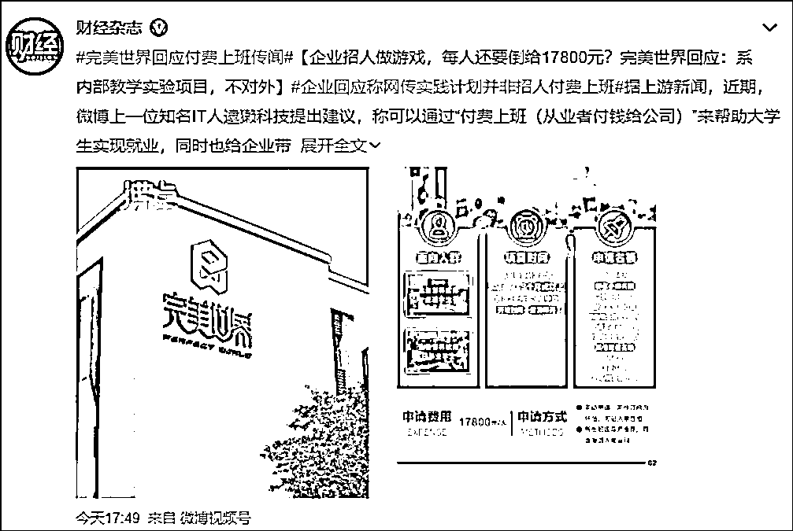
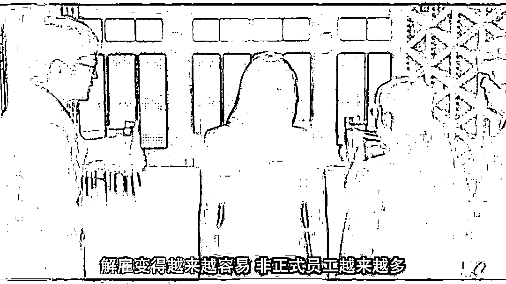
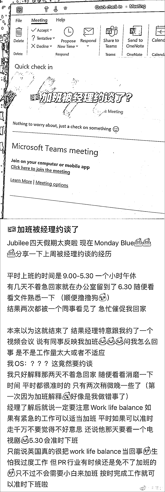

# 哪个天才想出来的“付费打工”

> 原文：[`mp.weixin.qq.com/s?__biz=MzIyMDYwMTk0Mw==&mid=2247537886&idx=8&sn=1eef6d3d6c33808faa1a070236e026d5&chksm=97cb9fe6a0bc16f046e1bacbf7b60c6f5754d6ca2ba63316c049e3da3949805534bbe83b0ed5&scene=27#wechat_redirect`](http://mp.weixin.qq.com/s?__biz=MzIyMDYwMTk0Mw==&mid=2247537886&idx=8&sn=1eef6d3d6c33808faa1a070236e026d5&chksm=97cb9fe6a0bc16f046e1bacbf7b60c6f5754d6ca2ba63316c049e3da3949805534bbe83b0ed5&scene=27#wechat_redirect)

**01.**

最近有一张图片在互联网流传，就是这个“体验割麦子”项目。 

**“收费标准：10 元/人”**

**“数量有限**

**先到先割**

**时间不限**

**不准带走”**

我也不清楚它有没有落地，但可以肯定它绝不首创。

因为付费摘草莓，农家乐里摘葡萄，鱼塘里钓鱼的项目很多。

先例数不胜数，早已是成熟的商业形态。

这些项目并不千篇一律，草莓、葡萄、番茄等等蔬果往往可以拿回家，钓鱼则很难说，有的鱼塘主不允许外带。

说回割麦子项目，之所以令人愤愤不平，也正在于广告上的四个字——不准带走。

现在经济不景气，我花了钱，还得不到成果，我的成果（小麦）反倒被你拿去接着赚钱——兜售收割完的小麦。

也就是你在我身上赚了两次，太过分了。

所以网友们群情激愤。

除了制造怨气以外，这反倒启发了一位网友。

博主“逮獭科技”提出带不走工资，但可以花钱上班的形式——“付费打工”：

“我就想了一个办法可以解决这两个问题。其实很简单，可以让大学生付费上班，然后企业加强培训，让员工付费获得的经验物超所值。这样企业就有现金流度过难关了，大学生也都就业了。

两全其美。”

这个方案一下子解决了经济和社会两大领域的两大难题。

从此 1100 多万的毕业生不用再担心失业待业问题，从此 4500 万家中小企业也不用担心用工荒、用人贵的问题了。 

人们面对如此敢说狠话的人，不得不称呼他是“天才”，调侃他的想法或许能改变行业规范。

虽然绝大多数语境下，都是针对他的嘲讽。

不管究竟是不是天才，但博主的奇异思路确实挺多： 

**02.**

严格来说，“逮獭科技”只是一位网友，最多算草根建言者，绝不是专家。

相比于他，专家们的建议会更加具体，指向性明确，可供操作。

**有人提议，可以把闲置的房子租出去，拿手头的汽车开滴滴赚钱。**

**有人提议，劳动者工资不能提高，因为这是我们的优势，不能让外商跑了！**

**有人提议，年轻人放弃高薪职业，到赚钱少的地方去锻炼自己的意志，要多为全局考虑。**

句句都是专家肺腑之言，看来花了功夫研究的。

“逮獭科技”言论的出现，不过是加重了这些“何不食肉糜”观点的情绪扩散。

网友们害怕自己成为他们口中的牺牲品，所以对此口诛笔伐。

这时候一个实例的出现恰恰又让网友们心上的弦紧绷了 。 

一家名为完美世界教育的公司，对外宣称打算开发一款无缝大世界多人在线生存类网络游戏，邀请有能力者参加项目，面向人群是完美世界教育在读学生或已毕业学生。

到这一步是很通俗易懂的传统项目。

企业要做项目，人手不够，需要广纳贤才，而为了成为贤才，你得提前成为这家企业的学生。

按照企业的说法，申请名额 14 人，申请费用为 17800 元。

到这一步，很多人开始疑惑，需要出成果的项目怎么变成了付费制的培训班呢？ 

但也没多大关系，背后的公司完美世界名头大，大不了算给自己的简历镀金。因为进入工作组的学员们，可以经历策划、原画、3D 建模、动作、特效等一系列工作。

后来完美世界表示，这不是对外的项目，言外之意是，即使付费也不算付费上班项目。

而且参与项目之后，学员将进行 3 个月或更长时间的实践，超过三个月的部分将不再额外收费。

实践不给工资，还收费，连着三个月收费，共计 17800 元。

到这里，网友坐不住了，发问：

**这样的付费实践，真的不是付费实习吗，不是付费打工吗？**

**03.**

从劳动法的角度衡量，只要双方建立了劳动关系，哪怕是实习阶段，用人单位就需要支付劳动报酬。

但我们知道，纸上谈兵终觉浅，绝知此事要躬行。

说白了就是现实和理想是有差距的。

尤其是实习生，更可能遭遇各种不公正待遇。

想必你忘不了经典一幕： 

上海财经大学的研究生去某互联网大厂实习，结果 12 点睡觉了，被兄弟部门笑话。

想离职，摆脱纠缠，让自己远离是非之地，可以吗？

不，想离职都不会太顺利。 

一位北京大学的学生在某互联网大厂实习，三个月期满后，准备离职，另谋高就。

这时候她的领导告诉她除非她找到继任者 backup，不然不给批离职。

在这样的情况下，继任者有可能还是一位实习生。

北大女生告诉领导，自己不要实习工资了，通通不要，这样可以了吧。 

领导还是说，不行。

你得去找新人，别人找来的顶替者也不行。

就算她回学校准备毕业事宜，但她还是需要：

**“每天必有的工作量和每天需要有一个及以上的继任候选人进入面试流程。”**

不过某家大厂否认这一切，包括否认存在职场 PUA 等等乱象，说这一切只是误会。

面对这些倒霉的事，名校实习生都很难维护好自己的权益，那么普通毕业生更可能陷入刀山火海中。

云南一职业院校 17 岁学生实习“劳累病死”的新闻还发生在几个月前。

更普遍的现象，就像一些媒体披露的。

> 有的工厂缺人，给劳务公司报价 25 元每人 1 小时的费用，劳务公司找到学校相关人士，给学校 22 元每人 1 小时的费用，学校给学生 15 元的工价，差价 7 元就是提成。
> 
> 假如学校组织 300 人，一个人工作 1 个月，每天 10 小时，那么学校就能提成 63 万元。

好家伙，逮着实习生，一次又一次薅羊毛。

这些都直指一个残酷的现实：实习环节上每一种角色都觉得实习生毫无价值，可以压榨其劳动力。

反复压榨，乐此不疲。

末了，解雇起来也得心应手。 

因为实习生真的好用、听话，顾全大局。 

也因为你不干有的是人干。 

**04.**

万般无奈下，劳动者只好把尊严让渡给企业和老板，为拥有一份工作。

当有了打工人诚恳的态度后，付费打工的方式可以非常灵活。

**让你自愿降薪不就是为了你好吗？**

**让你忘记底薪，忘记双休不就是为了你好吗？** 

**只给你 800 元工资不就是为了你好吗？**

花样还可以很多。

**这是不是很像付费打工呢？**

吊诡的正是，薪酬待遇上的创新，往往是这些公司最有原创精神的地方，反正就是不愿意善待员工，包括实习生。

劳动者的尊严不值一提。

用他们的注解来说：“这是一个用命拼的时代，你可以选择安逸的日子，但你就要选择安逸带来的后果。”

几年前的职场 PUA 情形更甚，咪蒙文章《职场不相信眼泪，要哭回家哭》里展示得淋漓尽致。

高傲的管理者对于实习生的俯视，往往带着义正言辞的鸡汤说教和尼采金句： 

> 职场不相信什么眼泪。
> 
> 别哭了，要哭回家哭。
> 
> 更酷的姿态是，把所有的委屈咽回去，变成我们的斗志。
> 
> 尼采说了，“ 那些杀不死我们的，终将让我们更强大。”

**05.**

说了那么多社会背景和企业文化以外，有什么具体的方法引诱打工人到“付费打工”事业中，并保证他们离不开“打工付费”呢？

物质上的操作也有。

**我可以做一个大胆的猜想，不负责任的猜想，比如开发“付费打工贷款”。**

你没听错。

实习生本身没钱，那他们怎么还付费实习呢？打工人本身就缺钱，那他们怎么还付费打工呢？ 

**借他们钱。** 

这又不是没有经历过。 

一边打工，一边续费，一边还贷。

接着，打下一份工，续下一个月的费用，还下一个月的贷款，听上去就是更加闭环的循环。

王多鱼听了都得说“要尊重这样的梦想”！

按照我的设想，不需要直接大范围开展，可以局部探索。 

**比如先开展“付费如厕”。** 

一直以来一些知名企业总是跟员工的如厕自由过不去。

那么我们就可以顺势开发一个厕所贷，用这部分贷款来抵消上厕所被扣的工资。

不止如此，有了“付费厕所贷”，那可以来一个对应的“偿还付费厕所贷的贷款”。

你可能想问，打工人本身没钱，他们凭什么借贷呢？

只要你是一个人，总能借到钱的。

三和大神都借得到，你会借不到吗？

再说了，全球范围的一些互联网企业和金融机构特别能在贷款上做文章，他们会帮你想办法。 

不用担心。

当然我宁愿这些内容都是纯粹的空想，毕竟它们要是在现实落地，受伤的只会是我这样的普通人。 

生命诚可贵。

尤其喝多了咖啡、更加焦虑的我，一天得去四五趟洗手间。

**06.**

很多时候，人是会不自然的悲观的，尤其是现在的数字带来的预期。

**1193 万。**

高考考生数量庞大，带来的高强度竞争，令人无比焦虑。

**457 万、202 万。**

考研、考公人数庞大，屡创新高，同样令人感到窒息。

**1076 万。**

截至 2022 年 4 月 17 日，1000 多万高校毕业生里，75%以上的还没落实就业，因为你不干有的是人干。

**18.2%。**

国家统计局公布的 4 月份青年失业率高达 18.2%。

所以，如今的竞争压力更为指数级上涨，光是有份工作算不错了。

越来越难，大家都难。

有时候你找一家合格的公司都难。

“每个人都活得那么枯燥，可每个人又都在那么拼命地活着。”这里的每个人就是时代中的你我他。

而时代是，学历在过剩，人才在过剩，打工人更在过剩。

目前来说，还是不太会有打工付费的模式存在，再怎么说，这严重违反法律和道德了。

# 要知道，“打工人也有尊严”，这不应该是偶得的小幸运，应该是常态的底线。

而不是相反。

所以说，“打工付费”或许不存在，但其背后的时代背景依然令人苦恼。 

我不知道该如何去改变现状，惟愿身处其中的打工人们能多一点点的快乐，选一个相对较好的去处。

**如果我的祝福有用，那就希望你们遇上加班被经理约谈的企业。**

](https://mp.weixin.qq.com/s?__biz=Mzg5ODAwNzA5Ng==&mid=2247487973&idx=1&sn=1b62da6f2018402862a5c375e10c355e&chksm=c06878b2f71ff1a4fbe7df4dec626aa7e696154751693bf16f6c6a302ceaa4d1959040c70518&scene=21#wechat_redirect)

← 向右滑动与灰产圈互动交流 →

