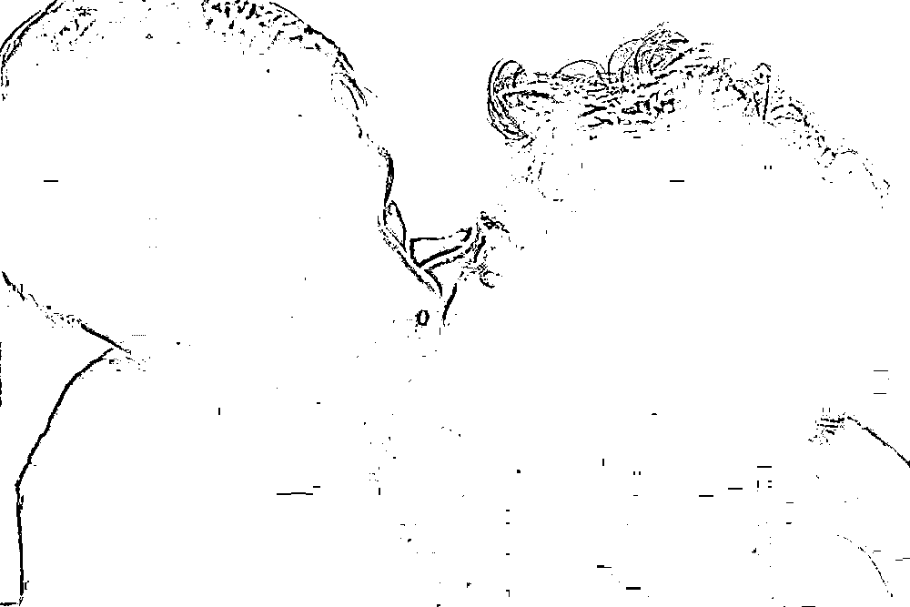
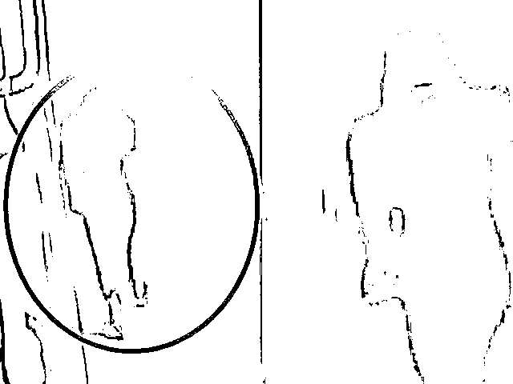
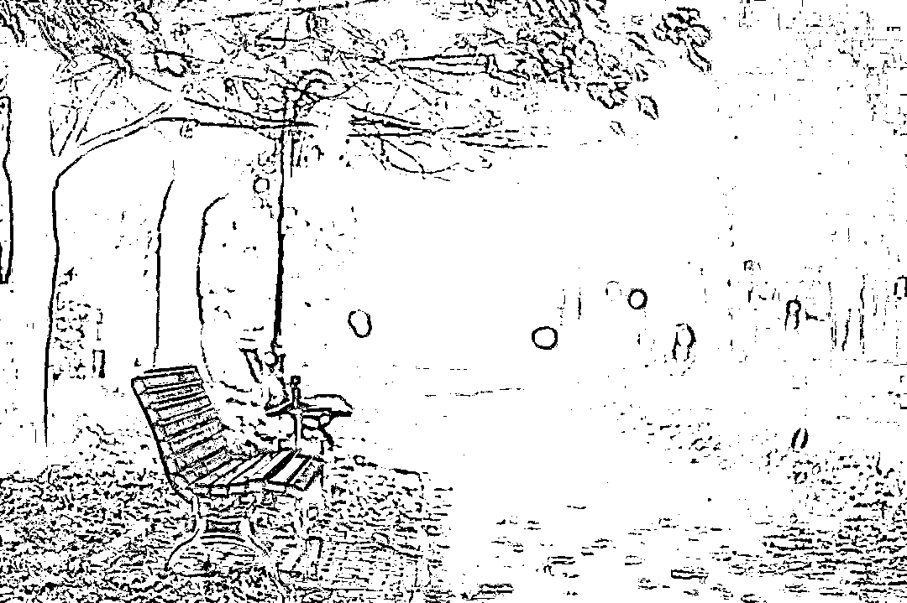
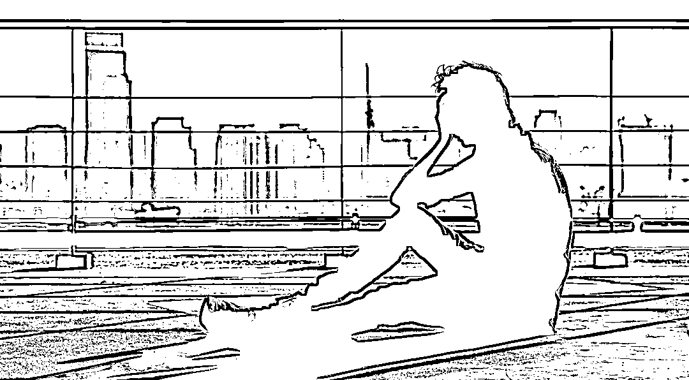
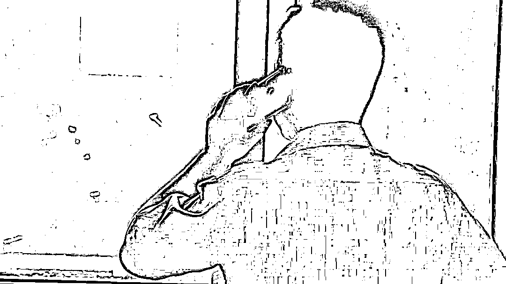
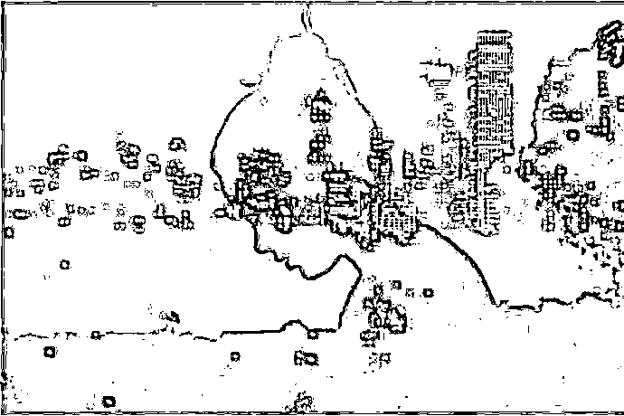

# 29 岁人妻下班路上被性侵，主动用避孕套后…还有更可怕后续…

> 原文：[`mp.weixin.qq.com/s?__biz=MzIyMDYwMTk0Mw==&mid=2247537953&idx=2&sn=a646f7707eb66b1c4cfeb0317233c509&chksm=97cb9e19a0bc170f9423cc1e5d5f5f614db59f00fa674e59fa082744c35de85d1468da1929e0&scene=27#wechat_redirect`](http://mp.weixin.qq.com/s?__biz=MzIyMDYwMTk0Mw==&mid=2247537953&idx=2&sn=a646f7707eb66b1c4cfeb0317233c509&chksm=97cb9e19a0bc170f9423cc1e5d5f5f614db59f00fa674e59fa082744c35de85d1468da1929e0&scene=27#wechat_redirect)

图文均来源网络

河南商丘那个 18 岁女孩遇害了。

那个寂静之夜，

她一袭黑衣，踽踽独行。

步伐踉跄，显然喝醉了。

只是，她却不知道危险已经盯上了她，

尾随，盗窃，杀害……

失联 8 天后，噩耗传出。

调查中透露：**凶手是因为盗窃时被女孩发现了，才痛下杀手。**

让人愤怒，也让人痛心惋惜！

危险来临总是很突然，当遇到歹徒时，一定要记住：给对方一个不杀人的理由！

曾经的一段故事，也许能给大家一些思考……

女子深夜遭黑车司机强奸，为求自保也为保留证据，她假意配合甚至提议要求男子不戴套。

事后，这名女子保留证据及时报警，歹徒被抓捕归案，并最终受到了法律的严惩，被告人洪某被判处，有期徒刑四年四个月。

此案件引来网友热议：有网友认为不应该戴套，戴套算自愿不算强奸，主动递套会刺激强奸犯。

> @gongyimihelaozhao：能！这个女的很聪明，因为她是在取证据。怕这个人到时候不承认，最起码避孕套里有你的精液，到时法院认可的证据！
> 
> @用户因果 111172146391：只要是违背妇女意志的性行为，都属于强奸罪！不管嫌疑人是不是熟人！主动递上避孕套是妇女为了保护自己不受到进一步的伤害而不得已而为之！
> 
> @悠闲才思敏捷沙滩 KX：当然能定强奸，女人很理智不激怒对方，主动拿保险套是为了保护自己，同时也给罪犯一个“顺从”他的错觉。所以女人要守身如玉端庄大方，有危险的地方不去，尽量减少与异性单独相处的机会

> @成熟河流 7l：不能算强奸罪，双方有意，没有反抗，只能算通奸！如果定罪，估计定罪不大，教育一下，还是可以！
> 
> @魔法师贝弗利 6a：是是非非，谁人能看透？孤男寡女，瓜田李下，谁人能说的清楚？干柴遇烈火，明明是你情我愿，某种原因反咬一口，女人咬男人一口，既为强奸，收监判刑女人强奸男人，法无明文规定，莫事没有
> 
> @安逸星空 Z：这问题有意思，你说一个女的遇到一个熟悉的男人，就可以上床睡觉，还主动递上避孕套，这叫什么玩意，这明是两人愉情作欢，这是情奸，应不算强奸罪，如这个女人还不满十八岁，男人同志们可还是要少去碰哟，不然的话，你可要挑起法律这个重担哦！！！

**遭性侵后，**

**女性要如何保留证据？**

**简单来说有“三不要”：不要洗澡、不要上厕所、不要换衣服；对于物证有“三要”：要低温、要干燥、要防污染，比如现场捡到的避孕套、纸巾等，我们要戴上手套，把它晾干，然后放到冰箱里面保存就好了，这样才是正确的保存方法。**

在性侵中女生本来，就承受着巨大的伤害，该被谴责的是那个无良的恶徒面对反抗无济于事的状况，你肯定不能指望着强奸犯自己放弃。

女性只能自己保护自己，尽量把伤害降到最小主动递套以减免患病甚至怀孕，这不是妥协，更加不是合作，而是保护和爱护自己的一种方式。

比如《雪在烧》中，剧中善良的妹妹罗一差点被坏人强暴，关键时刻被人及时救了。

但饶是如此，女孩子在医院里醒来后第一时间是把其他人都赶走，然后跑浴室把自己全身上下搓一遍。

编导演大概是想表达女孩的痛苦，觉得被坏人碰了，脏了，想洗干净。

殊不知现实中这么做，只会白白便宜性侵者。

还有一部影响力更广的琼瑶剧《情深深雨朦朦》，说起来也真的是让人捏拳头。

剧里有一个情节是梦萍被强奸，她满身伤痕地回到家，既没报警，也没去医院。

而姐姐如萍呢，第一时间竟然也是让她先去洗澡，还说：

“我们检查一下，清洗一下。”

姐妹俩既不去医院，也不告诉父母。

最绝的是，最后连梦萍被强奸时穿的衣服，也一并扔掉了。

得，这下更是什么证据也没有了！

被强奸后把自己洗干净，其实是一个相当大的“误区”。

受害方身体里残存的体液，警方可以用来验明犯罪分子的 DNA，从而确认其身份。

哪怕是对方不小心留在受害方衣物、体表上的皮屑、毛发等，都是可以拿来取证的。

但受害方一洗澡，一丢内衣物，最直接的证据就都被冲洗没了。

而要靠其它的周边证据链来取证立案，会非常困难。

洗澡，等于变相帮罪犯洗脱罪名啊！

甚至还会有人觉得，女孩子被强奸后洗澡，是因为强奸犯不戴套，洗澡能避免怀孕……

洗澡完全不能避孕，这是常识，尽快口服避孕药才能避免怀孕。

**当我们被坏人盯上时，不仅仅是得与失的较量，也是人性的较量，有时候更是生与死的较量。**

**对方是暴躁的？是偏激的？还是良心未泯的？**

**我们都无从知晓，也意味着风险的不确定。**

**盲目冲动的反抗，不亚于一场豪赌。**

**而赌输了，可能命都没了。**

**这时候，一定要让自己冷静。**

**要知道，有时候比义正言辞更有用的是温柔一刀，比奋力反抗更明智的是四两拨千斤。**

这样的悲剧很多，也再次给我们敲响警钟。

今天，夫人分享一些日常安全防备知识，希望耐心看完，关键时刻也许能救命！

**1：怎样不容易坏人盯上？**

小偷和抢劫，主要是图财。

**所以，一定要谨记不要露富。**

生活中不要太张扬和傲慢，平时少带现金出门，贵重物品要收好，家里不要搁保险柜，客厅也不要搁值钱的东西。

毕竟“不怕贼偷，就怕贼惦记”。

**当然，我们也不能显弱。**

在路上的时候，不要戴耳机听音乐，只顾着做自己的事，**要多观察周围的变化，多点警惕心。**

出行时，尤其是晚上，要尽量避免独自出行，更不要单独走安静狭窄的路段。

家里的窗户也要勤擦，如果灰尘很多，会被误认为屋里没人，小偷就会找这样的下手，因为被发现的风险小。

**如果是独居女性，或是孤儿寡母，最好在阳台上凉一件男士衣服，门口摆双男士拖鞋，不暴露家里的情况。**

这一切都是为了不显弱！

有句话叫：你弱的时候，坏人就多。

其实搁在这里，也同样适用。

**2：怎样避免遇到性侵害？**

除了注意不要独行，不要夜晚走僻静的路段，提防陌生人提供的饮料，这些日常生活中的防备之外，更需要提防来自熟人的伤害。

有研究表明，**有 60%以上都是熟人作案。**

**因为，熟人更容易让你放松警惕，更了解你的生活习惯，更容易找到你的弱点。**

所以，我要提醒年轻的女孩们：

一定要适当避免与男性熟人在私密空间独处。

对自己持暧昧态度或人品有瑕疵的男性要保持警惕。

可能发生醉酒或各类心理暗示的场合一定要提防。

如果感觉对方有性侵的意向，哪怕只是你的直觉，也请在保证自己人身安全的情况下尽快离开。

**3：遇到色狼时怎么做？**

**如果是在公交车，地铁上遇到，一般车厢还会有其他乘客。**

**直接大声喊，绝不沉默和纵容，不然对方只会得寸进尺。**

同时立刻拉开距离，避免对方情急伤人。

但是，并非任何场合都适合大声呼喊。

如果身边有男朋友，或者有几个同伴一起，可以大声喊。

如果是在白天，周围人流量多，也可以喊。

如果旁边有警察，更可以喊，警察一定会挺身而出。

**如果是晚上，周围又没多少人，就不要喊，容易激怒对方。**

**如果直觉很危险，比如对方可能有几个人一起，觉得喊了对方就会对你不利，也不要喊。**

**4：被人尾随怎么脱险？**

如果你感觉有人在尾随，

有个方法叫“走到马路对面去”。

如果对方跟着走过来，你就再走回去，看对方有没有再跟过来。

这是为了验证你的感觉。

要是又跟过来，那就确定对方真在跟踪你了。

这时候，就拼命逃吧，有机会就向周围的人求助。

如果被对方追上了，你已经跑不动了，也不要放弃。

**第一招，对方扑上来的时候，让他越近越好，这时你往后退一步，然后到地上抓一把土，撒到他的脸上。**

**第二招，扣他的眼睛。**

**第三招，踢他的裆部。**

当然，要是没土怎么办？

平时可以准备一些可替代的东西，有一位妈妈就给上夜班的女儿备了一包生石灰。

**5：如果被抓住，逃不了，怎么办？**

如果被坏人抓住，打又打不过，跑又没地方跑，周围也没有其他人求助。

**这已经是非常糟糕的情况了，只能和对方斗智。**

首先，千万不要激怒对方，先保住自己的命再说。

要知道并不是所有的坏人都是杀人不眨眼的凶手，

如果这时候你还大喊大叫，言语上还放狠话，就很容易激怒对方，招来不可预测的后果。

这时候，就要给对方一个不下杀手的理由。

要钱，就给他钱。

为了自己的生命能放弃就放弃。

也可以直接表示：“我不看你的脸。”

让对方觉得没有太大的后顾之忧。

其次，让对方放松警惕后，然后寻找脱困的最佳机会。

就好像文章前面提到的周女士，面对入室抢劫，关心对方的情况，让对方放松下来。

还有一个故事，是一个女司机被劫匪挟持后的自救。

劫匪都拿出绳子和刀，都打算杀人了，她一把抱住对方，就哭了起来。

先是说家里老公出轨，又说干脆把车卖了，自己跟他私奔。

劫匪一听还有这好事，就打消了杀人的念头。

后来一路上，女人一边安抚劫匪，一边开车上路找机会脱困。

遇到个骑自行车的，发现是老人，她没有贸然求救。

又遇到个开出租车的，发现对方是一个人，她依旧不动声色。

后来又遇到一个开长途的货车，她还是没有作声。

**因为，她觉得这些人都救不了她。**

直到遇到一辆卖水果的车，车上有 6 个小伙子，她直接开车撞上去，然后下车求救。

就这样，她成功靠自己的智慧脱险了。

**6：孩子应该注意什么？**

成年人尚且有和歹徒周旋的能力，但孩子一般不具备这样的本事。

所以，我们要教孩子这些：

不和陌生人说话，不吃陌生人的东西，如果对方纠缠，就大声呼喊引起旁人注意。

如果只有自己在家，及时把门锁好，除了爸爸妈妈，爷爷奶奶，任何人敲门都不开，不答应。

成年人向你寻求帮助，一定要懂得拒绝，因为大多数大人解决不了的问题，小孩更解决不了。

面对坏人，要记住两点：

**可以说谎和欺骗，骗坏人不要有负担。**

**遇到危险时要懂得逃，而不是在原地哭泣。**

**写在最后****：**

最近看了很多犯罪新闻，发现有些伤害真的有机会避免。

比如轰动全国的沈阳“三八”大案，作案 42 起，杀死 21 人，杀伤 24 人.

罪犯汪家礼在行刑前的一段采访说：**“之所以杀人，大多是遇到了反抗。”**

**我尊敬每一个和犯罪分子斗争的人。**

**但作为普通人，应该把保护自己的生命安全放在首位。**

所以，我想提醒所有人：

万一真的遇到犯罪分子如果对方的目的只是求财，破财免灾绝对不是懦弱的表现。

**尤其对方还有武器的时候，更不要激怒对方，第一目的永远是逃跑和安抚对方，用我们的智慧去避免更多的伤害。**

而且，只有保全了自己，也才能为警方提供更多线索打击犯罪，为自己讨回公道。

本文干货满满，值得大家收藏！

小叽 幸福小酒馆

](https://mp.weixin.qq.com/s?__biz=Mzg5ODAwNzA5Ng==&mid=2247487973&idx=1&sn=1b62da6f2018402862a5c375e10c355e&chksm=c06878b2f71ff1a4fbe7df4dec626aa7e696154751693bf16f6c6a302ceaa4d1959040c70518&scene=21#wechat_redirect)

← 向右滑动与灰产圈互动交流 →

