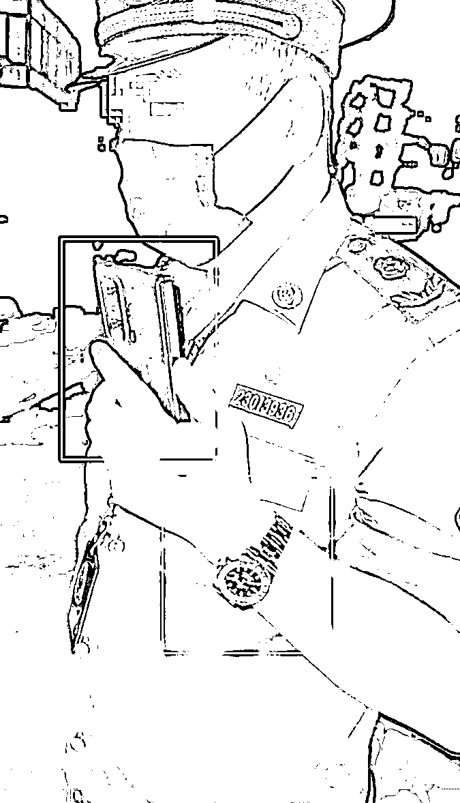
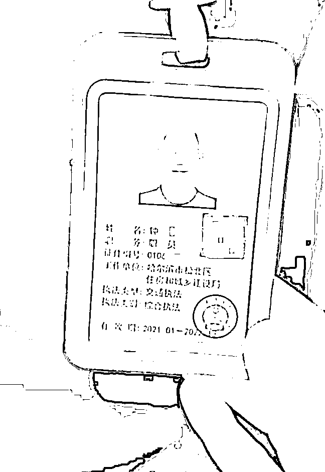
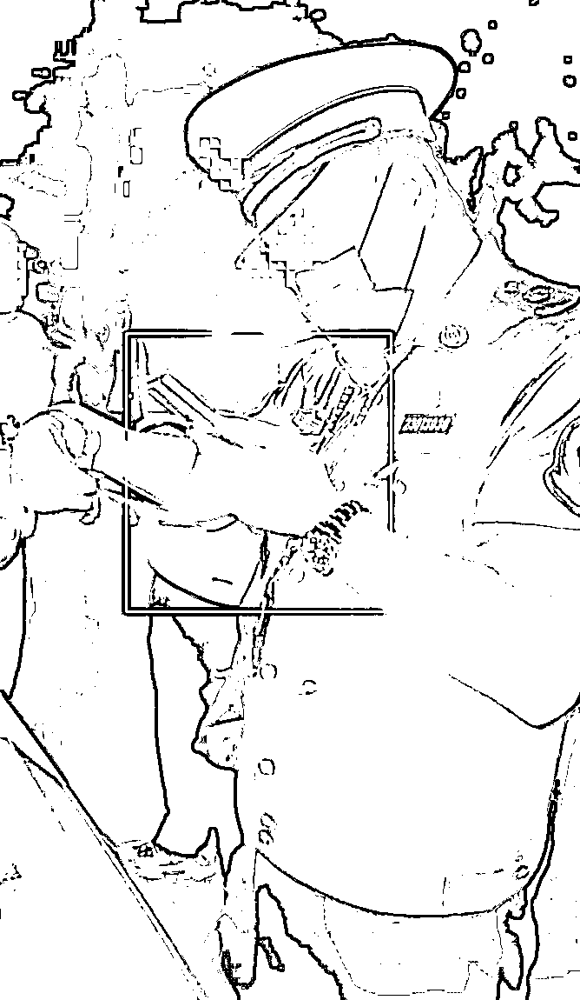
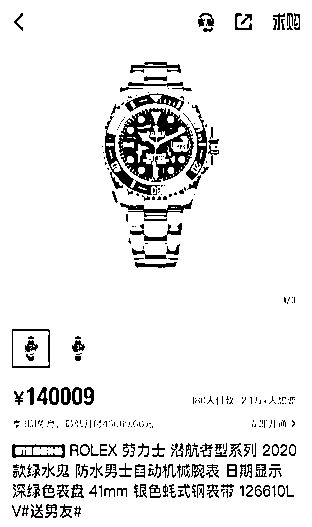
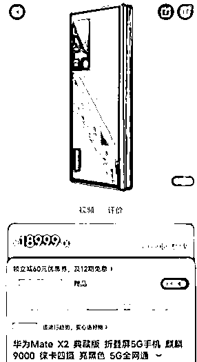

# 网约车“钓鱼”执法人员戴 14 万劳力士绿水鬼？哈尔滨纪委介入

> 原文：[`mp.weixin.qq.com/s?__biz=MzIyMDYwMTk0Mw==&mid=2247537953&idx=4&sn=f6eaef038ca9764a4964f1ba11ff1046&chksm=97cb9e19a0bc170fa47d5f65bc10ec7a203ceaf102b14724674630067f3061406c7c509b86ee&scene=27#wechat_redirect`](http://mp.weixin.qq.com/s?__biz=MzIyMDYwMTk0Mw==&mid=2247537953&idx=4&sn=f6eaef038ca9764a4964f1ba11ff1046&chksm=97cb9e19a0bc170fa47d5f65bc10ec7a203ceaf102b14724674630067f3061406c7c509b86ee&scene=27#wechat_redirect)

“我就想抽根烟你还不让我抽，办你！一会儿让你认识认识我……”6 月 11 日晚，黑龙江哈尔滨松北区交通局借用人员杨云博在网约车上因吸烟被司机制止，通过电话“安排”两位执法人员来到现场执法，分别为一位身着制服的执法人员及另一位普通衣着的男子（**此前报道：**[“办你！”网约车司机拒绝乘客吸烟，遭公报私仇？最新通报来了！](http://mp.weixin.qq.com/s?__biz=MzIyMDYwMTk0Mw==&mid=2247537808&idx=6&sn=e6586739e4e1a914f4183eed7b3892b7&chksm=97cb9fa8a0bc16bef196206f0248b9878fd2d344011d29340e50fc894e8cfeffd4681ac1e96a&scene=21#wechat_redirect)）。

<mpvideosnap class="js_uneditable custom_select_card channels_iframe videosnap_video_iframe" data-pluginname="videosnap" data-id="export/UzFfAgtgekIEAQAAAAAAXL00FEXuPAAAAAstQy6ubaLX4KHWvLEZgBPEzaMwDyd2VrKDzNPgMIu6gvnTsi5tnN4zzWh2dnEU" data-url="https://findermp.video.qq.com/251/20304/stodownload?encfilekey=S7s6ianIic0ia4PicKJSfB8EjyjpQibPUAXolqEsibx9pDSvbPmmF75iag8sPiaticMsLSOVg39r6VEykMDSiaicqVeicYI3daiaA4q4sBdueia7bCt6XPwAn1tIL1S1SJ0Q&amp;adaptivelytrans=0&amp;bizid=1023&amp;dotrans=0&amp;hy=SH&amp;idx=1&amp;m=&amp;scene=0&amp;token=AxricY7RBHdW7MSY5E1T0W9AgeZEVjG8KoqKAIzKQvmurqIiawxRtsiaKvUG4OrEBsmWfwiaNsY9cJw" data-headimgurl="http://wx.qlogo.cn/finderhead/ibq4aVwOt6HNqrr8OD3sCviaytF3B8TqCwHicxsuIanAJo/0" data-username="v2_060000231003b20faec8c6e48a1acbd3ce04ef33b077a1e41d0d3794ed88ea537878dbe65910@finder" data-nickname="灰产圈+" data-desc="昨天哈尔滨网约车事件：一男子乘坐网约车要抽烟，被司机拒绝，这男的就直接给“相关部门”的朋友打电话要查车，还对司机说：“让你认识认识我！”。结果，他的两名执法部门的朋友来了，发现这司机证件齐全。。#唐山打人#唐山烧烤#唐山@灰产圈+ " data-nonceid="6649295344454556785" data-type="video" data-width="1080" data-height="1312"></mpvideosnap>

6 月 13 日下午，据哈尔滨新闻网消息，针对网上反映 6 月 11 日晚，松北区交通局借用人员杨云博在网约车上因吸烟被制止而引发的问题，松北区交通局运管站周兴旺等人在执法过程中存在的问题，松北区高度重视，立即成立专项调查组，依法依规开展调查，对区交通局借用人员杨云博（网约车乘客）予以清退，相关人员受到严肃处理。

随后有网友称，视频中身着制服的执法人员佩戴手表为“劳力士 2020 款绿水鬼，售价约为 14 万，使用的手机为华为 Mate X2，售价约为 1.9 万”。6 月 15 日下午，哈尔滨市纪委监委工作人员告诉潇湘晨报（报料微信：xxcbbaoliao）记者：“已接到多位群众反映这个问题，我们已经受理了，如果有相关证据及线索，可以向我们提供。”

**交通局借用人员因吸烟被司机制止**

**电话“安排”执法**

据网传的车内监控视频显示，6 月 11 日 22 时 34 分，一辆网约车副驾驶乘坐的一位男乘客试图在车内抽烟。遭司机拒绝后，男乘客拿出手机拨打电话，对着电话那头说：“回局里吧兄弟，我打个车，还没有营业资格证，也没有网约资格证……一个小黑车，我要回家还不让我抽烟，那我就收拾他就完了呗。”挂断电话后，男乘客对司机称：“我就想抽根烟你还不让我抽，办你！一会儿让你认识认识我……”

随后男乘客又拨通电话，询问其“哥们儿”网约的黑车怎么罚？对方回复：“5000 元到 20000 元。”司机称：“这属于公共交通，你抽完别人能闻着烟味。”男乘客再次拨通电话，让电话那头的人带上执法证，并称“一个人不行，两个执法人员”。该男子还表示，“处罚审核在我。”随后司机问男乘客“是哪个单位”，男子回答：“我就是热心市民。”

另一段视频显示，车开到男子口中的“站里”后，两位执法人员来到现场执法，分别为一位身着制服的执法人员及另一位普通衣着的男子。司机想查看身着制服执法人员的工作证件，被其挡开。随后司机查看了普通衣着男子佩戴的工作证件，显示为“哈尔滨市松北区住房和城乡建设局”钟姓工作人员。司机表示自己在车上说没有证，这位乘客就举报自己。

穿制服的工作人员查验司机证件后表示，“半夜接到举报来了”，经过检查发现该网约车司机证件全部有效，该乘客举报无效。

**当地：清退该借用人员**

**严肃处理相关人员**

6 月 13 日下午，据哈尔滨新闻网消息，针对网上反映 6 月 11 日晚，松北区交通局借用人员杨云博在网约车上因吸烟被制止而引发的问题，松北区交通局运管站周兴旺等人在执法过程中存在的问题，松北区高度重视，立即成立专项调查组，依法依规开展调查，对区交通局借用人员杨云博（网约车乘客）予以清退，相关人员受到严肃处理。

据了解，松北区交通局运管站相关工作人员在执法过程中，存在执法程序、执法行为不规范问题，区司法局存在行政执法证件日期审核把关不严问题，造成不良社会影响，依法依纪对相关人员给予严肃处理。

责令区住建局、区司法局党组作出书面检查并切实整改。分别给予区交通局运管站执法人员周兴旺、钟晨党内严重警告处分，调离执法岗位；给予区交通局运管站站长刘平和党内警告处分；对区交通局相关负责人丁志超诫勉谈话处理；对区交通局上级主管部门区住建局局长唐红斌责令检查处理。对区司法局办公室主任解巍诫勉谈话处理；对区司法局副局长张翠责令检查处理；对区司法局局长唐耀义批评教育处理。

**网友质疑执法人员佩戴名表**

**当地纪委：已受理**

该事件引发网友热议后，有网友爆料，视频中身着制服的执法人员佩戴手表为劳力士 2020 款绿水鬼，售价约为 14 万，使用的手机为华为 Mate X2，在电商平台售价为 18999 元。

6 月 15 日下午，哈尔滨市纪委监委工作人员告诉潇湘晨报（报料微信：xxcbbaoliao）记者：“已接到多位群众反映这个问题，我们已经受理了，如果有相关证据及线索，可以向我们提供。”

来源 : 潇湘晨报  记者: 陈梦娟

](https://mp.weixin.qq.com/s?__biz=Mzg5ODAwNzA5Ng==&mid=2247487973&idx=1&sn=1b62da6f2018402862a5c375e10c355e&chksm=c06878b2f71ff1a4fbe7df4dec626aa7e696154751693bf16f6c6a302ceaa4d1959040c70518&scene=21#wechat_redirect)

← 向右滑动与灰产圈互动交流 →

