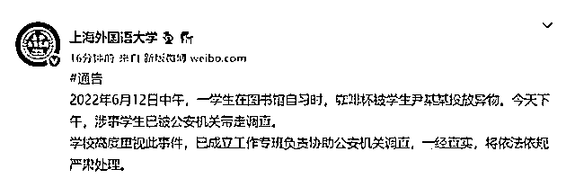
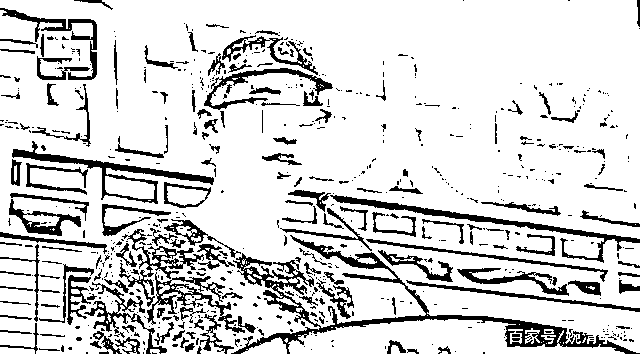
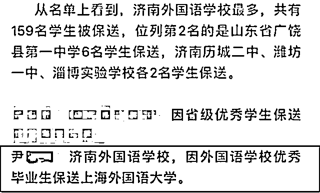
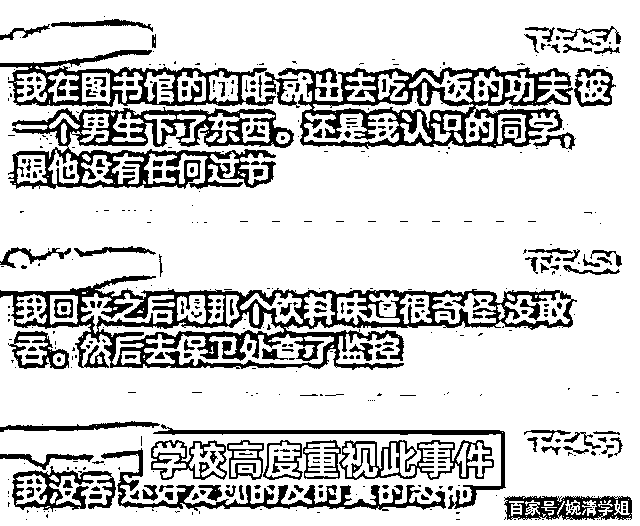
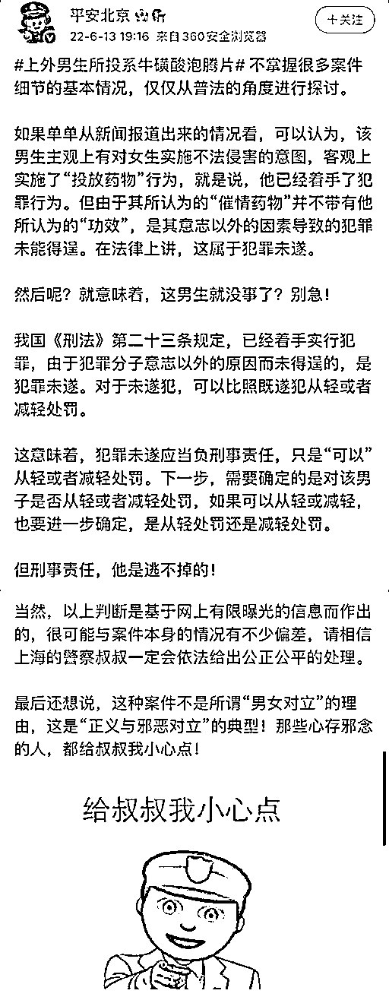

# 向女生杯中投放异物的上外人渣是保送生，曾代表军训新生上台发言

> 原文：[`mp.weixin.qq.com/s?__biz=MzIyMDYwMTk0Mw==&mid=2247537953&idx=5&sn=808a8774d468db4b9ce00e505cc833ae&chksm=97cb9e19a0bc170f0021bec6aec463a877cb0b317c139853255ec775cf562a04c9623d8f221b&scene=27#wechat_redirect`](http://mp.weixin.qq.com/s?__biz=MzIyMDYwMTk0Mw==&mid=2247537953&idx=5&sn=808a8774d468db4b9ce00e505cc833ae&chksm=97cb9e19a0bc170f0021bec6aec463a877cb0b317c139853255ec775cf562a04c9623d8f221b&scene=27#wechat_redirect)

2022 年 6 月 12 日中午，上海外国语大学一女生在图书馆自习时，咖啡杯被学生尹某某投放异物。

　　

女生称自己咖啡杯被投放异物（图源：视频截图）

当日中午 12 时许，该校学生尹某某（男，21 岁）在学校图书馆内趁该女生离开座位之际，向其咖啡杯中投放异物。

该女生称，吃饭回来后尝到咖啡杯里的东西“味道很怪”没敢喝下，然后到保卫处查看监控，发现尹某某往杯中投放了异物，**“还坐在我斜后方观察我喝没喝”**，上外尹某某投放异物后观察女生有无喝下，发现饮料异常后，女生到洗手间倒饮料，**“他还跟在我后面”。**

**女生称，尹某某她还认识，出于害怕的心理，于是报案。**

女生向学校保卫部门报告。经医院检查，未发现该女生身体异常。

警方随后找到尹某某，其承认在女生咖啡杯中投放了半片牛磺酸泡腾片，该泡腾片系从网上购买。

**因尹某某行为情节严重，影响恶劣，校方于 6 月 14 日按程序给予尹某某开除学籍处分。同时，根据党规党纪，取消其预备党员资格。**

**网络信息称——该男生，保送生、曾代表新生发言**

尹某某是山东省的保送学生，**因为在济南外国语学校表现优秀，所以，被保送到了上外，**还曾代表上海外国语大学军训新生上台发言，真的是让人意想不到。

他在发言时还讲到，他是在军队的故事中潜移默化地成长起来的，**所以结合女生的评价和他个人的表现来看，简直是将道貌岸然体现得淋漓尽致，**不知道他这么多年的书有没有白读，简直是辜负了学校的信任！

女生不仅知道这个男生是班长，**还透露出他每个月在捐款的消息，简直是太讽刺了！**要知道，无论男生在女生杯子里放的什么东西，哪怕是大白兔奶糖，没有经过他人的允许，不能放就是不能放。

女生表示，这个男生是德语系一九级卓越学院的高翻班班长，听起来头衔很长，但做的事也足够吓人，**女生去医院做了检查，但心里多多少少也有点阴影，**女生决定追究到底。

首先给机灵的女生点赞，发现异常，寻根问底，及时报案，就是在保护自己的安全。这件事引发网友的热议，就是关乎安全感。不管尹某某下的什么“异物”，毕竟是喝到嘴里的东西，不干不净先不说，要是有毒呢？

往他人杯中投异物，无非是以下几种可能：一种，是同学之间的恶作剧，投的是可食用或无害的东西，不会给人体造成实质性的伤害；另一种，是为了满足变态的欲望或报复他人，以投放污秽之物等；还有一种，就是蓄谋已久，直接下毒将人迷晕或造成人身伤害……

尹某某的行为属于哪一种，动机如何，希望警方快速查明真相，给公众关切一个回应。可以肯定，如果尹某某的行为属于最后一种，等待他的将是法律的严惩。

因为，根据“投毒罪”的司法解释，投毒罪的成立并不需要出现不特定多数人的中毒或重大公私财产遭受毁损的实际结果，只要行为人实施了投放毒物的行为，足以危害公共安全的，就构成投毒罪。

如果是第二种，尹某某就可能涉嫌违反《治安管理处罚法》，警方可以对其进行罚款和采取行政拘留等措施。

这也提醒，不论学生也好，还是打工人也好，都要有保护自己的警惕性，对于水杯或饭盒之类，一定要看管好，不要离开自己的视线。特别是高校的学子要注意，一些学生喜欢用水杯在图书馆或自习室占座，容易给他人可乘之机。

也要特别提醒，有些异物有“味道”，而有些异物你是尝不出来味道的。只要发现异常，一定要保留好水杯及其内容物作为证据，并及时报警处理，不要认为没有恶劣后果就算了。

同时，学生们也要明白，往他人食物中“投放异物”，是一件不能开玩笑的事。在一些大学对学生的违纪处分条例中，也有相关条款。比如说东南大学，“投放异物，对他人造成不良影响者”，视情节轻重，分别给予警告、严重警告、记过、留校察看，直至开除学籍处分。

这一点，其他学校不妨加以借鉴，以杜绝学生这种没有边界感的恶作剧行为。

上海外国语大学表示，学校高度重视此事件，已成立工作专班负责协助公安机关调查，一经查实，将依法依规严肃处理。这里，也为学校旗帜鲜明的态度点赞。

在相关的新闻留言区，众多网友认为，高校应该加强对学生的教育，让他们知道，往他人食物里投放异物，不管动机如何，投放的是什么，都可能会造成无法承受，不可挽回的后果。

**东方网的报道称——**

****网传所投“异物”系某氨基酸类商品，**此说法仍待有关部门调查。不过，东方网•纵相新闻记者从多方了解到，**过量服用该类药物存在一定的风险，多个电商平台上可以搜到诸多相关商品信息。****

****此前，被投异物的女生聊天记录截图显示，其表示“不论他买的药是否有催情效果，他都已经有这个主观意图。”****

****记者据此在电商平台上搜索，这类商品名称中多含有**“女性专用”“速效”“保健品”**等词汇，**商品图中也多见女性图片**，部分商家还使用了较为**露骨的文字与图片进行了低俗的宣传。******

******@平安北京发布长文，解读上外男生投泡腾片事件：******

******如果单单从新闻报道出来的情况看，可以认为，该男生主观上有对女生实施不法侵害的意图，客观上实施了“投放药物”行为，就是说，他已经着手了犯罪行为。但由于其所认为的“催情药物”并不带有他所认为的“功效”，是其意志以外的因素导致的犯罪未能得逞。在法律上讲，这属于犯罪未遂。******

******我国《刑法》第二十三条规定，已经着手实行犯罪，由于犯罪分子意志以外的原因而未得逞的，是犯罪未遂。对于未遂犯，可以比照既遂犯从轻或者减轻处罚。******

******这意味着，犯罪未遂应当负刑事责任，只是“可以”从轻或者减轻处罚。下一步，需要确定的是对该男子是否从轻或者减轻处罚，如果可以从轻或减轻，也要进一步确定，是从轻处罚还是减轻处罚。******

******但刑事责任，他是逃不掉的！******

******▼****** 

************

******来源：宾曰语云综合 极目新闻、东方网•纵相新闻、上观新闻、上海外国语大学官网微博、@平安北京、新华社客户端  记者：潘旭 朱翃、人民日报客户端等******

******************](https://mp.weixin.qq.com/s?__biz=Mzg5ODAwNzA5Ng==&mid=2247487973&idx=1&sn=1b62da6f2018402862a5c375e10c355e&chksm=c06878b2f71ff1a4fbe7df4dec626aa7e696154751693bf16f6c6a302ceaa4d1959040c70518&scene=21#wechat_redirect)******

******← 向右滑动与灰产圈互动交流 →******

************