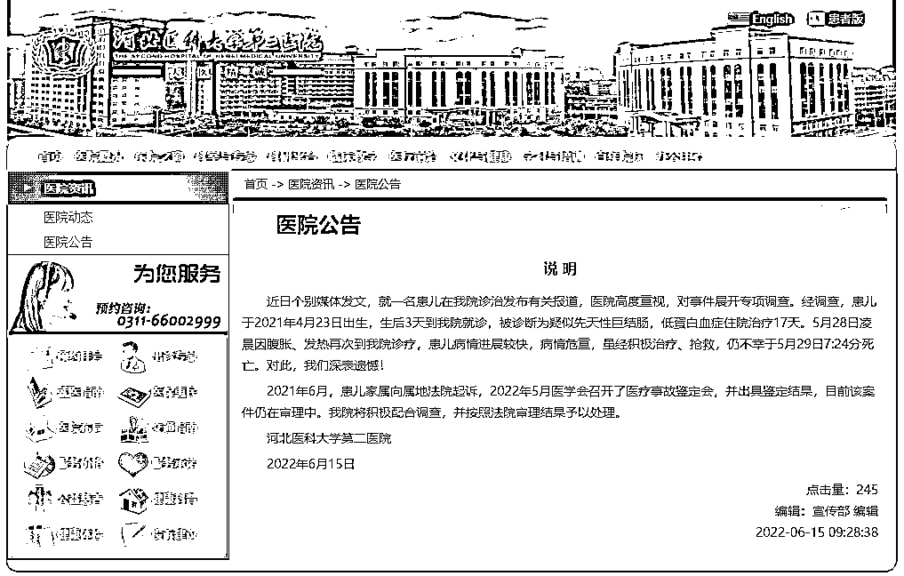
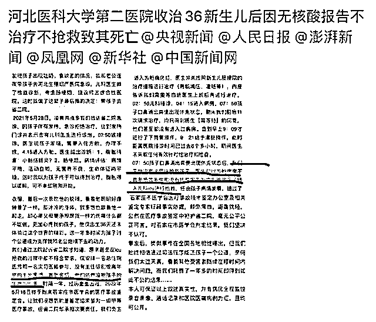
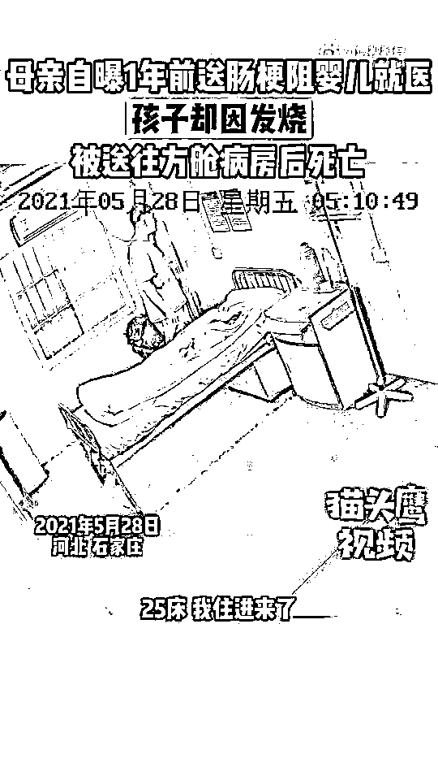
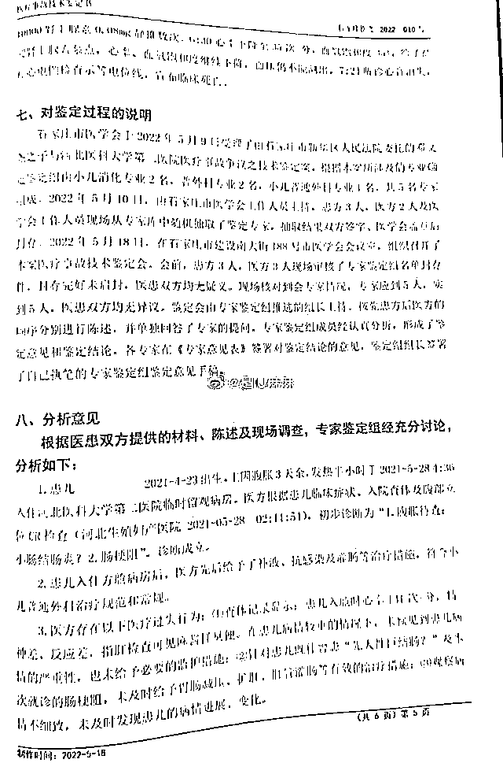
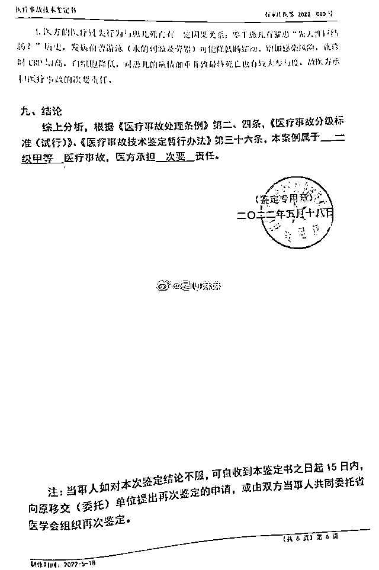
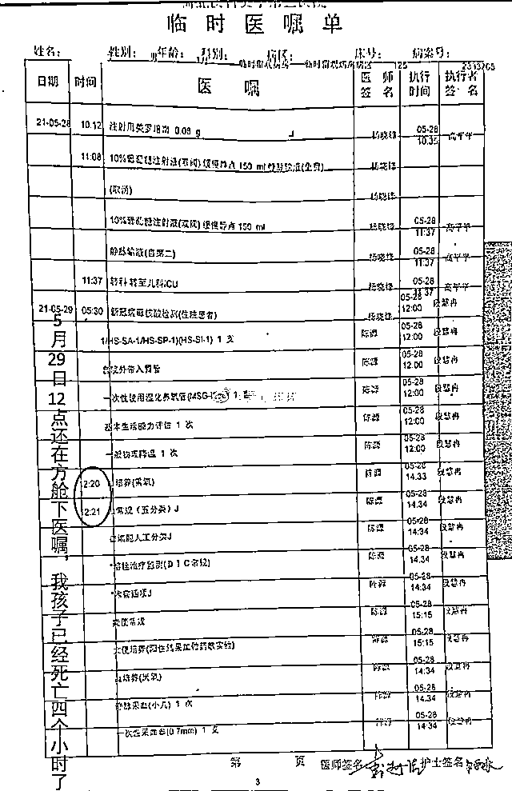
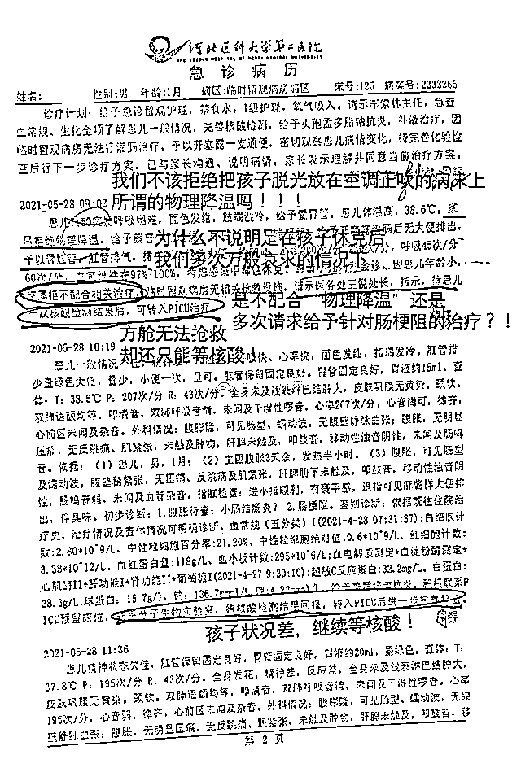

# 肠梗阻婴儿因发热被送方舱后死亡？一年后，医院回应！

> 原文：[`mp.weixin.qq.com/s?__biz=MzIyMDYwMTk0Mw==&mid=2247537953&idx=6&sn=b9964e220c96ba2131470b2137a58650&chksm=97cb9e19a0bc170f690fee3b930834d985a818b855f46af095ca6d005a3a77e982c2b3e9c0eb&scene=27#wechat_redirect`](http://mp.weixin.qq.com/s?__biz=MzIyMDYwMTk0Mw==&mid=2247537953&idx=6&sn=b9964e220c96ba2131470b2137a58650&chksm=97cb9e19a0bc170f690fee3b930834d985a818b855f46af095ca6d005a3a77e982c2b3e9c0eb&scene=27#wechat_redirect)

<mpvideosnap class="js_uneditable custom_select_card channels_iframe videosnap_video_iframe" data-pluginname="videosnap" data-id="export/UzFfAgtgekIEAQAAAAAABFsC4dNN4QAAAAstQy6ubaLX4KHWvLEZgBPEzKMocUlbDryDzNPgMIugivBATCTLaJD6ZegAU4px" data-url="https://findermp.video.qq.com/251/20304/stodownload?encfilekey=rjD5jyTuFrIpZ2ibE8T7YmwgiahniaXswqzbQ1xVTuGza37h8mSiaADmFX2ic3wK5uFjkGv8MZ01f2ibuYtNS2QDaALoupG0PkLOrCUiaCQhVVwBicbot8yWxjvK5g&amp;adaptivelytrans=0&amp;bizid=1023&amp;dotrans=0&amp;hy=SH&amp;idx=1&amp;m=&amp;scene=0&amp;token=x5Y29zUxcibB1oDIM181f9w4YdT89IQia7npvLbtyFGvAxvnUgWibibqy1syJ66pBtwhxXTrvzibm4ec" data-headimgurl="http://wx.qlogo.cn/finderhead/ibq4aVwOt6HNqrr8OD3sCviaytF3B8TqCwHicxsuIanAJo/0" data-username="v2_060000231003b20faec8c6e48a1acbd3ce04ef33b077a1e41d0d3794ed88ea537878dbe65910@finder" data-nickname="灰产圈+" data-desc="#肠梗阻婴儿因发热被送方舱后死亡#【母亲自曝 1 年前送肠梗阻婴儿就医，孩子却因发烧被送往方舱病房后死亡】近日，河北石家庄，一名母亲@是 IU 麻麻  在社交平台发文称，2021 年 5 月 28 日凌晨，自己刚出生的孩子因肠梗阻进入河北医科大学第二附属医院（以下简称省二院）治疗，因有发热症状，急诊拒收，从而入住方舱病房。进入方舱病房后，医生并未按照新生儿肠梗阻的治疗措施进行治疗，而是告知需等白班医生上班后再进行。

7 时 50 分左右，婴儿口鼻涌出粪便出现休克状态，方舱病房不具备抢救条件，医生以没有核酸报告为由，拒绝将孩子转入 PICU（儿科重症监护室）进行抢救。至 11 时 51 分左右，核酸结果已出，经医院领导联系后，婴儿转入 PICU，经过 19 小时抢救无效后，宣布死亡。#婴儿发热等核酸报告无法进 ICU 死亡#

2022 年 5 月 18 日，石家庄市医学会召开医疗事故鉴定会，鉴定结果为一级甲等医疗事故，省二院承担次要责任。" data-nonceid="14718799714989675417" data-type="video" data-width="1080" data-height="1920"></mpvideosnap>

6 月 15 日，河北医科大学第二医院发布说明称，近日，个别媒体发文，就一名患儿在我院诊治发布有关报道，医院高度重视，对事件展开专项调查。经调查，患儿于 2021 年 4 月 23 日出生，生后 3 天到我院就诊，被诊断为疑似先天性巨结肠，低蛋白血症住院治疗 17 天。5 月 28 日凌晨因腹胀、发热再次到我院诊疗，患儿病情进展较快，病情危重，虽经积极治疗、抢救，仍不幸于 5 月 29 日 7:24 分死亡。对此，我们深表遗憾！

2021 年 6 月，患儿家属向属地法院起诉，2022 年 5 月医学会召开了医疗事故鉴定会，并出具鉴定结果，目前该案件仍在审理中。我院将积极配合调查，并按照法院审理结果予以处理。

另据此前济南时报·新黄河客户端消息称，河北石家庄一名母亲在社交平台发文称，2021 年 5 月 28 日凌晨，自己刚出生的孩子因肠梗阻进入河北医科大学第二附属医院（以下简称省二院）治疗，因有发热症状，急诊拒收，从而入住方舱病房。进入方舱病房后，医生并未按照新生儿肠梗阻的治疗措施进行治疗，而是告知需等白班医生上班后再进行。

7 时 50 分左右，婴儿口鼻涌出粪便出现休克状态，方舱病房不具备抢救条件，医生以没有核酸报告为由，拒绝将孩子转入 PICU（儿科重症监护室）进行抢救。至 11 时 51 分左右，核酸结果已出，经医院领导联系后，婴儿转入 PICU，经过 19 小时抢救无效后，宣布死亡。

2022 年 5 月 18 日，石家庄市医学会召开医疗事故鉴定会，鉴定结果为一级甲等医疗事故，省二院承担次要责任，婴儿家长负主要责任。

另外根据微博上显示的医疗事故鉴定报告如下：全文仅显示医方担次要责任。

@是 IU 麻麻 微博还称医院篡改医嘱病例。

来源：观察者网

](https://mp.weixin.qq.com/s?__biz=Mzg5ODAwNzA5Ng==&mid=2247487973&idx=1&sn=1b62da6f2018402862a5c375e10c355e&chksm=c06878b2f71ff1a4fbe7df4dec626aa7e696154751693bf16f6c6a302ceaa4d1959040c70518&scene=21#wechat_redirect)

← 向右滑动与灰产圈互动交流 →

