# 陈继志哥哥愿出 100 万求放过：这是钱的事吗？

> 原文：[`mp.weixin.qq.com/s?__biz=MzIyMDYwMTk0Mw==&mid=2247538017&idx=1&sn=7af311a9d03e10202ebb836b4c51c7e6&chksm=97cb9e59a0bc174f6b468a43088eb12e30f8f122219c8b7c9dce003c30e447824d7b7c576ea0&scene=27#wechat_redirect`](http://mp.weixin.qq.com/s?__biz=MzIyMDYwMTk0Mw==&mid=2247538017&idx=1&sn=7af311a9d03e10202ebb836b4c51c7e6&chksm=97cb9e59a0bc174f6b468a43088eb12e30f8f122219c8b7c9dce003c30e447824d7b7c576ea0&scene=27#wechat_redirect)

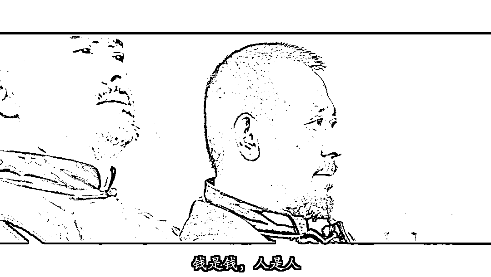

图源：电影《让子弹飞》

宜将剩勇追穷寇，不可沽名学霸王。

唐山烧烤店打人案中，如果说有一个人名字我记住了，那一定是陈继志。 

陈继志是哪一个？ 

施暴现场，穿绿衣服去骚扰受害女生的那个。 

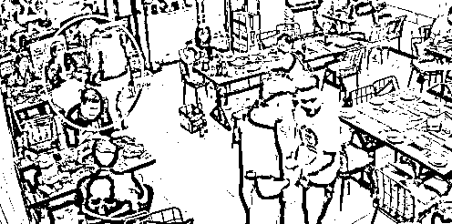

也是首先发难动手的那个，如果不是他那个耳光，后续也不会如此发生。 

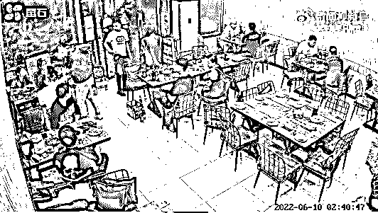

就是他，长这样↓↓↓

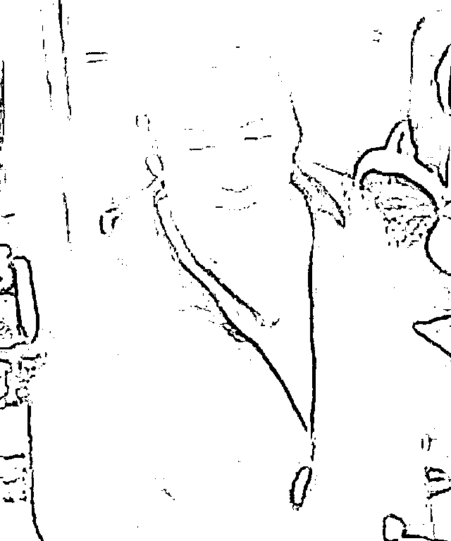

**罪魁祸首陈继志，本案最具“玄机“的一个人。**

陈继志曾以追讨债务为名，对他人进行殴打、拘禁。

这张@河北省唐山市路北区人民法院刑事判决书 显示，2018 年一审时，陈继志是刑拘在逃状态。

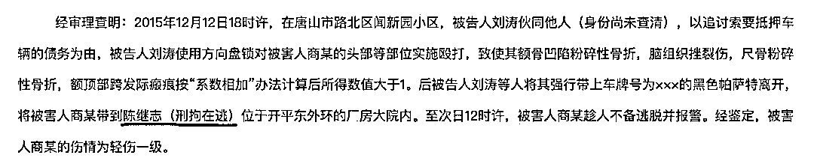

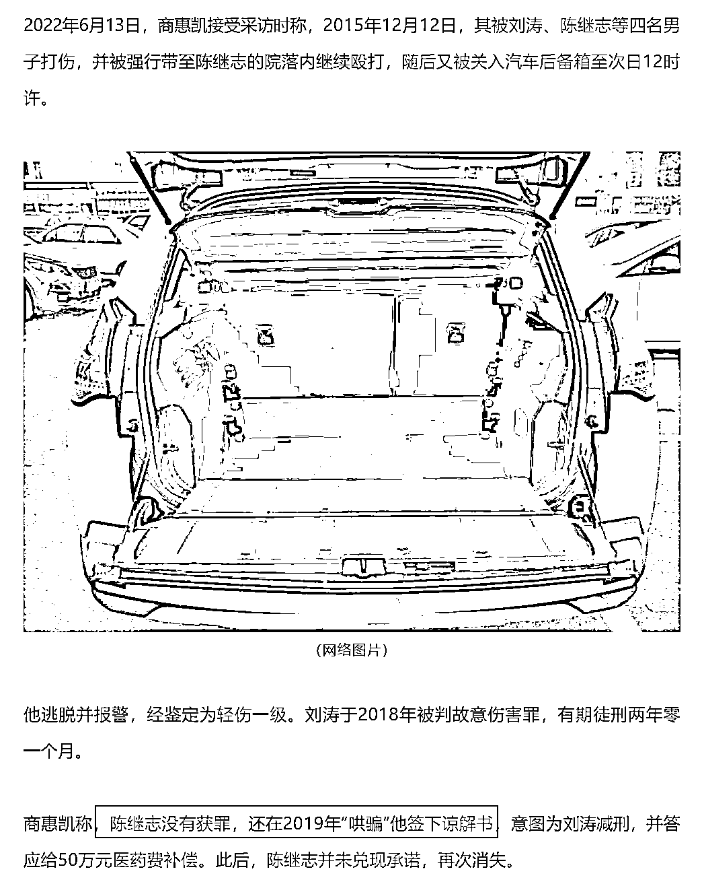

一审判决后刘涛不服提出上诉，直到 2019 年二审维持原判，陈继志仍是刑拘在逃人员。

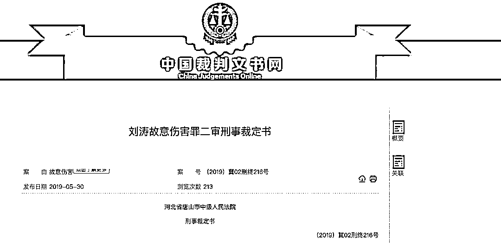

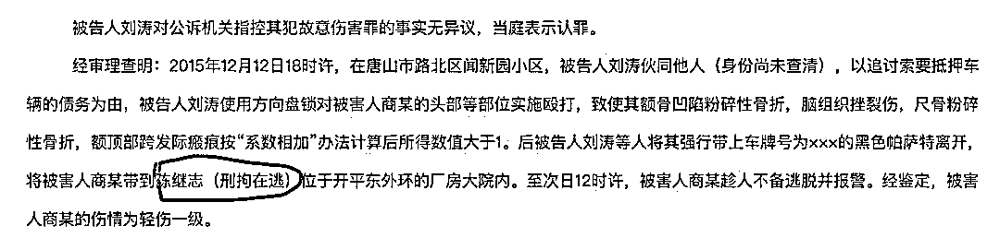

但据@企查查 显示，2018 年陈继志出资 50 万成为一家水产养殖公司的老板。

**刑拘在逃人员也能开公司吗？**

落款于 2019 年 3 月 11 日的（2019）冀 02 刑终 216 号《刘涛故意伤害罪二审刑事裁定书》，依然对陈继志标为“刑拘在逃”。

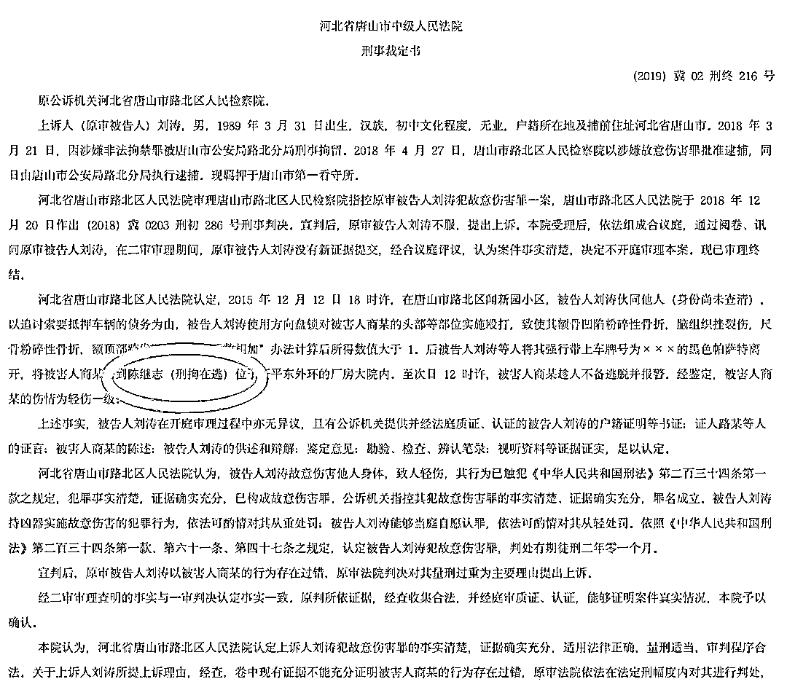

美篇账号“路北巡控”发布于 2019 年 7 月的一篇文章曾披露商惠凯被打一案的嫌犯抓捕情况称，犯罪嫌疑人刘涛、陈继志、高杰纷纷落网，侯程亮一直在逃，最终于 2019 年 7 月 1 日 12 时许成功抓捕归案。

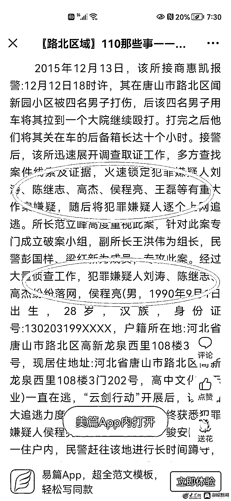

但在中国裁判文书网中搜索，发现自 2019 年 3 月 11 日终审判决后，并不存在对陈继志的刑事诉讼。

总结如下：**2018 年 12 月，陈继志刑拘在逃；2019 年 3 月，陈继志仍刑拘在逃；2019 年 7 月前，陈继志落网。**

可以这么说，如果涉黑，陈继志肯定是在团队中占有重要地位和重要能量的，不然怎么能在一次次违法犯罪边缘反复横跳。

**问题是，现在疫情期间，在逃犯很容易识破定位，天天做核酸，做核酸都是拿身份证实名做的，怎么会逮不着？**

更离奇的是，2019 年 7 月前陈继志落网，他落网后是否已受到应有的处罚？

2019 年至今的 3 年里，陈继志经历了什么？

直至此次公然在烧烤店殴打他人。

在一个视频中，网传唐山打人事件主犯陈继志的哥哥表示，他对弟弟陈继志的所作所为而感到羞愧，并向大家表示诚挚的道歉。 

[`mp.weixin.qq.com/mp/readtemplate?t=pages/video_player_tmpl&action=mpvideo&auto=0&vid=wxv_2442895627660754945`](https://mp.weixin.qq.com/mp/readtemplate?t=pages/video_player_tmpl&action=mpvideo&auto=0&vid=wxv_2442895627660754945)

**他还表示，自己愿意出钱与受害方和解，如果 50 万不行那就 100 万。**

他说每个家庭都有妈妈、姥姥和媳妇，他希望能够得到大家的谅解。

我理解陈继志的家属和他发声的哥哥，但是有可能吗？

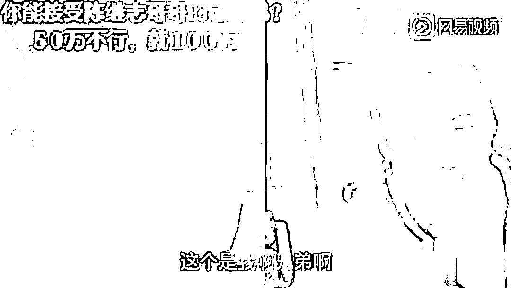

真是财大气粗，以为有钱就可以解决一切，要是受害者是你的女儿，你能同意和解吗？

其中一名受害女生母亲回应：

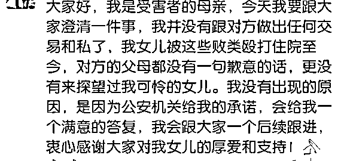

打人事件发生自此，施暴者的父母都没有出来道个歉，这位母亲表示绝对不会和施暴方和解私了，语气特别坚决！ 

**自己是成年人，就不要让家人抹黑遭罪。**

凶手家里有老人，那被害人家里老人呢？以后是老人照顾被打的女儿？还是被打致残的女儿坐轮椅照顾老人？

**放虎归山，下一次又不知道谁又是受害者？**

陈继志已经退无可退，闹这么大，他把自己害了。

要我说：

**经济赔偿与刑事责任没有冲突，钱照赔，刑照判。**

来源：昌南大队长

](https://mp.weixin.qq.com/s?__biz=Mzg5ODAwNzA5Ng==&mid=2247487973&idx=1&sn=1b62da6f2018402862a5c375e10c355e&chksm=c06878b2f71ff1a4fbe7df4dec626aa7e696154751693bf16f6c6a302ceaa4d1959040c70518&scene=21#wechat_redirect)

← 向右滑动与灰产圈互动交流 →

