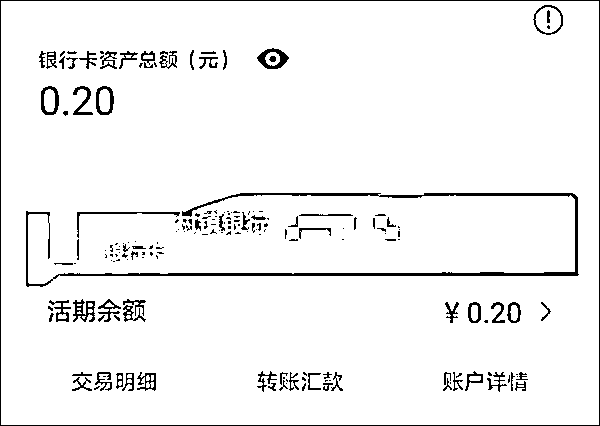
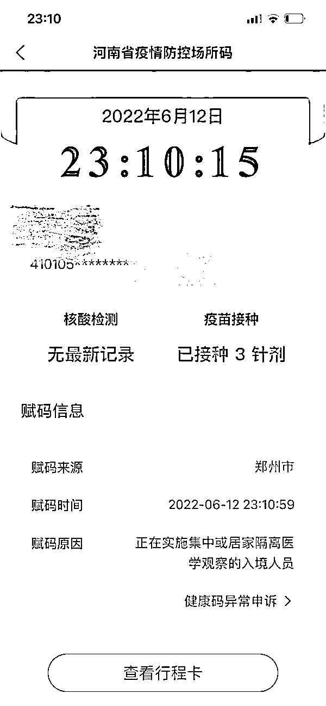
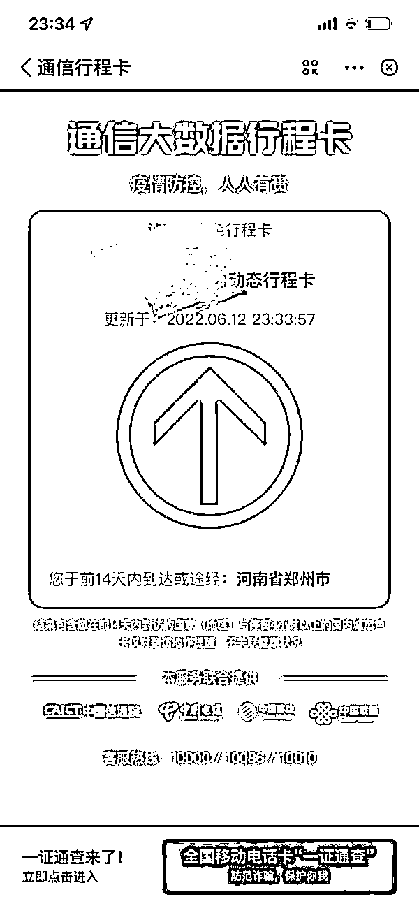
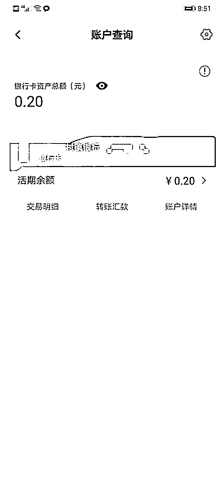
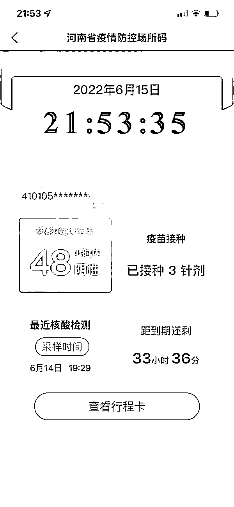

# "卡里就两毛钱，健康码红了 3 天"

> 原文：[`mp.weixin.qq.com/s?__biz=MzIyMDYwMTk0Mw==&mid=2247538017&idx=2&sn=3e3d4bb1ddd48600af710d491ba75b26&chksm=97cb9e59a0bc174f9c5c00ebabed2218d25fbb3815e4e49b857e81a83248238c80135f9eb2df&scene=27#wechat_redirect`](http://mp.weixin.qq.com/s?__biz=MzIyMDYwMTk0Mw==&mid=2247538017&idx=2&sn=3e3d4bb1ddd48600af710d491ba75b26&chksm=97cb9e59a0bc174f9c5c00ebabed2218d25fbb3815e4e49b857e81a83248238c80135f9eb2df&scene=27#wechat_redirect)

“拿完外卖我发现自己健康码红了，来帮忙处理的警察态度很好，但问过我的个人信息之后他却突然问我有没有在村镇银行存过款。健康码怎么会和银行存款有关系呢？”6 月 15 日晚，健康码已经转绿的赵嫣然（化名）对这次持续 3 天的红码体验还是有些后怕。

近日，河南多家村镇银行储户面临取款难的同时又被无故赋了红码，这一问题引起社会舆论高度关注。很多人的巨额存款无法取出已经让他们陷入到了莫大的恐慌之中，健康码变红更是让他们寸步难行。

和大部分着急取钱的储户不同，常住郑州的赵嫣然在这之前就把钱转走了，只是他没有留意到，那张卡上不知什么时候多出了两毛钱利息。以下是他的自述。

**姓名：赵嫣然（化名） 年龄：30 岁   职业：失业**

**红码或和村镇银行的两毛钱存款有关**

6 月 12 号下午 6 点左右我下楼拿了个外卖，进小区扫码的时候，屏幕上的二维码居然变红了，手机还发出“红码人员！红码人员！”的警报声。我记得中午的时候这个码还是绿的，现在不仅红了，赋码原因那里还写着一行小字“正在实施集中或居家隔离医学观察的入境人员”，可我 14 天都没有离开过郑州市而且据我所知最近郑州也没有疫情。

扫场所码后变成红码。受访者供图

但行程码还是绿码。受访者供图

我的行程卡也还是绿的，但门卫就不敢让我进小区了，告诉我联系社区工作人员或者是派出所。

打郑州防疫热线没打通，我就联系了社区，等了 20 分钟左右社区工作人员和派出所民警都到了。工作人员和警察的态度都特别好，问我基本信息我也都回答了，这个时候我一点也不紧张，觉得这就是不小心给我搞错了，没往别的方面想。

突然，警察开始问我在银行的开卡情况，我一开始认为这和疫情防控无关而且属于个人隐私拒绝回答。警察却和我说：“你以为没关系其实这可能是有关系的。”

我为了配合工作最后还是把我的银行账户信息都告诉他们了。但我只在河南的村镇银行办过一张卡，而且那张卡里的余额也只有两毛钱。

卡里还有 2 毛钱。受访者供图

其实这个时候我还不太确定红码是不是真的和这两毛钱有关。在他们交流情况的时候，我就打电话给了另一个也在村镇银行存过钱的朋友。结果，他告诉我，他和我在同一时间健康码变红也进不了小区了。我在河南村镇银行只办过一张借记卡，因为那家银行离我当时在开封工作的地方就隔了一条街，平时存钱取钱比较方便。这张卡除了存钱取钱其他什么操作都没有，连贷款都没有过。一个月前有朋友和我说起过他存在村镇银行的钱取不出来了，当时我还觉得自己很幸运，那张卡里的钱很早之前就被我取出来了，只剩了不知道什么时候多出来的两毛钱利息。现在想想如果不是这两毛钱利息，估计这次还影响不到我。

晚上 8 点多，警察和社区工作人员告诉我可以先回家了，估计 3 天之内健康码就会变绿，但这 3 天里我不能出门。到这时，我确信自己这次变成红码绝对和疫情没有半点关系，如果和疫情有关，怎么会不让我去隔离而直接放我回家呢？

健康码变红的第一天，我折腾了将近 3 个小时，下楼的时候是为了拿外卖，等我上楼的时候那份驴肉火烧已经冷透了不能吃了。

**等待红码转绿的三天，我在知乎发了帖子**

12 号晚上，我在知乎看了很多河南村镇银行取款难问题的相关回答，发现和我一样健康码变红的储户有很多。我看的时候这个话题有一千万的浏览量排在知乎热榜的第 11 名，但其实那天热榜第一名的阅读量只有七百万。当晚，我也在相关问题下面写了自己的亲身经历，非常多的网友都在回复我。

其实 3 天不出去也没什么，我最近失业在家也不需要出去上班，小区楼下保安也知道我的情况可以让我下楼拿外卖。但我没有办法去看我奶奶，她今年 80 岁，一个人住，我现在红码肯定进不去她的小区，平时经常去看她，老人年纪大了身体再好也是会担心的。

在家等待健康码从红转绿的 3 天，我不间断地在知乎浏览相关消息，回复网友们的评论，回累了就扫一下回家之前我拍下的小区场所码，三天扫了能有二十多次吧，已经是“为扫而扫”了。在这个过程中我很想知道到底是谁给我赋的红码。有网友给我评论说：“两毛的余额配合着这么惨的事儿忍不住有点好笑，这种滥用真的离谱到家了。”我回复他：“谁说不是呢？”

我不是为了我自己的那两毛钱才发帖的，两毛钱金额太小了，我是想为其他那些真正面临“取款难”的人鸣不平。去村镇银行存钱的大部分都是周围的村民，很多人存下的都是一辈子的血汗钱，他们没有什么其他的救济路径，甚至也不懂什么法律。

不管怎么说，我想让大家能关注到这件事。我听说想去烂尾楼维权的人也有变成红码的了，这会不会是一个糟糕的开始呢？

14 号我的健康码就恢复成绿色了，15 号我去看了奶奶，她没有责怪我为什么这几天没有来看她，老人总是这样，怕给我们添麻烦，什么都不问。

3 天后，健康码恢复了绿码。受访者供图

来源：上观新闻，观察者网

](https://mp.weixin.qq.com/s?__biz=Mzg5ODAwNzA5Ng==&mid=2247487973&idx=1&sn=1b62da6f2018402862a5c375e10c355e&chksm=c06878b2f71ff1a4fbe7df4dec626aa7e696154751693bf16f6c6a302ceaa4d1959040c70518&scene=21#wechat_redirect)

← 向右滑动与灰产圈互动交流 →

