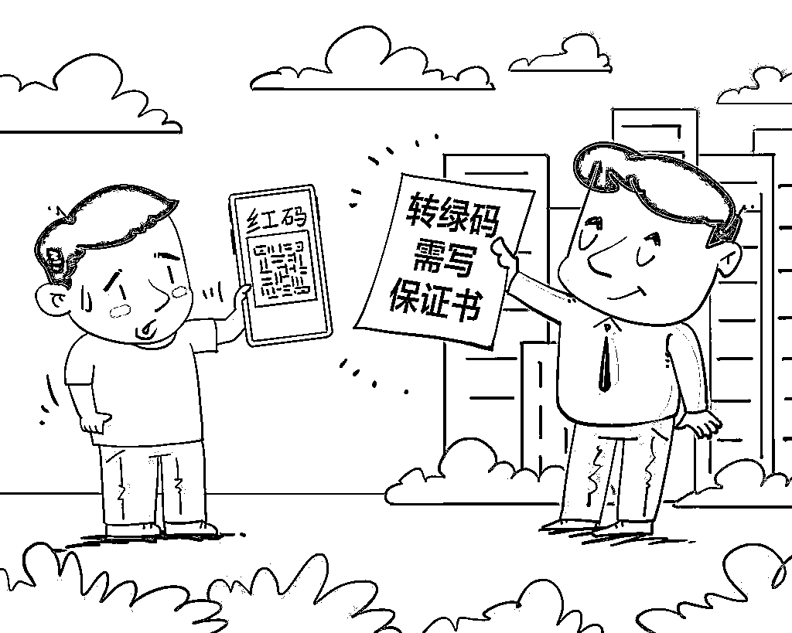

# 多位上海市民也中招：豫康码莫名红了

> 原文：[`mp.weixin.qq.com/s?__biz=MzIyMDYwMTk0Mw==&mid=2247538017&idx=3&sn=3e1e2ab3cbc95bd653a78f42e1481604&chksm=97cb9e59a0bc174fc40ddb538508ef44fca30a8acf4f217da6dc20219b8c23671f16b7d4be04&scene=27#wechat_redirect`](http://mp.weixin.qq.com/s?__biz=MzIyMDYwMTk0Mw==&mid=2247538017&idx=3&sn=3e1e2ab3cbc95bd653a78f42e1481604&chksm=97cb9e59a0bc174fc40ddb538508ef44fca30a8acf4f217da6dc20219b8c23671f16b7d4be04&scene=27#wechat_redirect)

近日，河南村镇银行储户 

被赋红码引起了大家的关注

有储户表示

豫康码在 6 月 14 日午间已变回绿码

不过，目前还有不少外地储户

仍反映豫康码或者

扫描郑州火车站的场所码为红码

**而这样的情况也牵涉到了**

**居住在上海的市民**

****没有踏出过上海半步****

******码却“被”红了******

******居住在上海闵行区的吴先生称，2020 年 8 月起，他在河南省驻马店市的上蔡惠民村镇银行、禹州新民生村镇银行存了一些钱。******

******6 月 11 日，******

******他看到储户群里有人反映******

******被赋红码的情况后，******

********他也打开了健康码********

**********发现自己的豫康码显示****红色**********

**********↓↓↓**********

********************

**********吴先生提供的一张截图显示，6 月 15 日下午 17 时许，他的豫康码为红码，提示**“有高风险地区旅居史隔离未满 14 天的人员”**，由郑州市 6 月 11 日推送。**但最近这段时间，吴先生一直都在上海**。吴先生用母亲的信息尝试后发现，**不是储户的母亲豫康码显示为绿码。************

**********一段吴先生在 6 月 15 日咨询郑州市政府热线 037112345 的录音显示，接线员称：“河南健康码并不是郑州市负责，它的范围是整个河南省省域的。”对方表示暂无权限更改，称可以**通过****河南健康码提交转码申诉来进行更改。************

********************

**********上海浦东新区花木街道的储户豫康码显示红色。受访者提供**********

**********另外还有居住在上海浦东新区**********

**********金桥镇、周浦镇、花木街道**********

**********以及闵行区莘庄镇等区域的四名储户**********

**********截至 6 月 15 日 17 点**********

**********他们的豫康码同样显示为红色**********

**********此外，**家人的健康码同样变红了！************

**********↓↓↓**********

**********●居住在浦东金桥的一名储户说，6 月 15 日，她发现自己的豫康码以及扫描郑州火车站西南出口的场所码均为红色。此后，**她用了自己不满 4 岁女儿的身份证以及不是银行留存的电话，扫描郑州火车站的场所码也显示红色。************

**********●居住在浦东新区花木街道的祁姓储户也称，6 月 14 日下午，其通过群友发来的截图扫描了郑州火车站的场所码，显示为红码，**且不在同一户口本的家人也是红码。************

**********据悉，此前在郑州或从郑州返回的储户们，健康码已转绿。6 月 15 日 19 点，一名从郑州返回广州的储户表示，其接到河南政府部门工作人员电话，经核实地理位置后，其粤康码与豫康码均已转绿。****但为何未前往过郑州的上海储户们仍被赋红码，原因尚待当地进一步调查。**************

**************郑州多名楼房维权业主**************

**************也****被莫名赋红码**************

**************继河南村镇银行储户被赋红码后**************

**************6 月 15 日，又有**河南郑州****************

****************一楼盘的多名业主反映****************

****************健康码被莫名赋****红码****************

********************************

**************多名业主表示**************

**************他们是当地**停工楼盘****************

****************“融创中原大观”**的业主**************

******************都曾去当地银监会等部门******************

****************反映楼盘的相关违规问题****************

************不久后被赋红码************

**************显示为“正在实施集中或居家隔离**************

**************医学观察的入境人员”**************

************目前，************

************多名业主通过申诉红码已转绿************

************但疑虑仍然未消除************

************↓↓↓************

************赵婷（化名）于去年全款买下了，融创中原大观的一套房子，当时还正在建设中，但几个月之后停工，且一直未复工。随后，赵婷和其他业主曾于今年 4 月份前去河南省银保监会提交相关材料，**反映业主的购房款没有被打到资金监管账户的问题。**************

************6 月 12 日，当她被一家店铺拒绝进入时，赵婷第一次发现自己的豫康码变红了。虽然当天就去做了核酸，结果显示为阴性，但是**居委会回应称，他们的系统里显示赵婷是绿码，因此无法上报。**************

************赵婷说，在向银保监局递交材料时，她曾遇到过来银保监局反映问题的村镇银行储户。不久后，她又接到了户籍地派出所打来的电话，询问她是否为某理财平台的用户，她给了否定的回答。************ 

************6 月 14 日，她拨打 12320 河南卫生健康热线反映该问题，之后工作人员表示也不清楚是什么原因给的红码，只能上报。但在**14 日下午 1 点多，赵婷的码重新变绿了。**************

************************

************还有一名业主苏小姐************

************和赵婷的经历相似************

************但是，在豫康码转绿之后************

************苏小姐还被社区要求写一份保证书************

************内容包括**保证不去高风险地区**************

**************不再去有关部门等**************

************苏小姐告诉记者，还有和她有相同遭遇的部分业主在提出申请改绿码时，被社区要求本人先签署这份类似内容的保证书，**在写完了保证书之后才能改回绿码。**************

************************

****************涉事楼盘停工数月****************

**************赵婷说，他们购买的是**************

**************融创中原大观二期的房子**************

****************已经停工数月****************

**************他们担心会变为烂尾楼**************

**************所以多次向相关方反映情况**************

**************但截至目前，该楼盘仍未复工**************

****************本来这批房将于****************

****************今年 7 月底和 12 月底交付****************

****************但按照目前的情况****************

****************可能明年也交不了房****************

****************************

**************对此，**河南省住房和城乡建设厅****************

**************一名工作人员表示：**************

**************↓↓↓**************

**************他们已经将该楼盘纳入问题楼盘清单，因为历史遗留问题，各方相关诉求比较复杂，目前已协调各部门全力推进该楼盘项目的化解工作，具体事宜由楼盘所在地郑州市的主管部门处理。针对网传“业主维权被赋红码”一事，该工作人员表示不清楚，需咨询其他相关部门。**************

****************郑州市卫生健康热线****************

**************一名工作人员表示**************

**************↓↓↓**************

**************如果人一直在郑州市本地，且社区后台里显示为绿码，应该就是没问题的，对于为何会出现莫名被赋红码的问题，他们暂不清楚，**用户可以通过在系统里申诉的方式转码。****************

******************健康码必须“健康”******************

****************绝不能被滥用！****************

**************健康码是疫情防控系统的重要一环**************

**************是每个人为了自己**************

**************和公众健康而让渡权利的结果**************

****************其存在目的只能是疫情防控****************

**************这是全社会的共识**************

****************************

**************任何人、任何部门都没有权力突破健康码为公众健康而存在的角色设定，把健康码另做他用。**唯有完善健康码规范使用制度，建立起防范滥用的追责机制，才能防止乱动的手滥用健康码，让健康码回归其本真功能。****************

**************来源：新闻坊，观察者网**************

******************************************](https://mp.weixin.qq.com/s?__biz=Mzg5ODAwNzA5Ng==&mid=2247487973&idx=1&sn=1b62da6f2018402862a5c375e10c355e&chksm=c06878b2f71ff1a4fbe7df4dec626aa7e696154751693bf16f6c6a302ceaa4d1959040c70518&scene=21#wechat_redirect)**************

**************← 向右滑动与灰产圈互动交流 →**************

****************************