# 给大家推荐一部网约车司机反杀钓鱼执法的“大片”

> 原文：[`mp.weixin.qq.com/s?__biz=MzIyMDYwMTk0Mw==&mid=2247538017&idx=4&sn=7008ed3bed35c37e2981e0e49a687a1a&chksm=97cb9e59a0bc174f9e39cf152b191a546d0b346643cb0dc00ad50192b82e6b016419f5b8fc4f&scene=27#wechat_redirect`](http://mp.weixin.qq.com/s?__biz=MzIyMDYwMTk0Mw==&mid=2247538017&idx=4&sn=7008ed3bed35c37e2981e0e49a687a1a&chksm=97cb9e59a0bc174f9e39cf152b191a546d0b346643cb0dc00ad50192b82e6b016419f5b8fc4f&scene=27#wechat_redirect)

**01**

很难想象，最近网上流传的一段群众用手机拍下的视频，竟然在短短 13 分钟内包含了

激烈的人物冲突、充满悬念的剧情设置和出乎意料的反转。

拍摄手法上更是采用了倒叙，所有的疑惑在最后关头解开，看完令人感觉酣畅淋漓。

这放到豆瓣上少说能也评个 9.8 分。任何人错过这样一部精彩的大片，我都会感到可惜。

[`mp.weixin.qq.com/mp/readtemplate?t=pages/video_player_tmpl&action=mpvideo&auto=0&vid=wxv_2445603894736371716`](https://mp.weixin.qq.com/mp/readtemplate?t=pages/video_player_tmpl&action=mpvideo&auto=0&vid=wxv_2445603894736371716)

考虑到有些人很忙没法点开视频，我简单描述一下剧情。

影片一开始，一名男子对着镜头怒目而视，给人极大的压迫感。因为穿着动画片《足球小将》的 T 恤，我们暂且叫他“足球哥”。

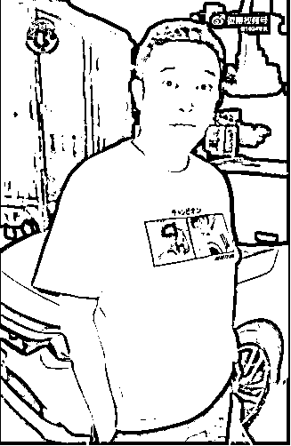

这时候作为旁白的司机娓娓道来，描述本片的背景故事：2022 年 6 月 11 日,足球哥打了一辆网约车，因为司机不让他抽烟而起了冲突，在谈话中得知司机居然没有运营网约车的相关证件，一怒之下打电话准备实名举报司机。

说时迟那时快，两个执法人员立马就到场了。

正常人看到这场面估计腿都吓软了，但司机确实见过世面的，临危不惧直接指出了他半夜执法不穿工装的问题。

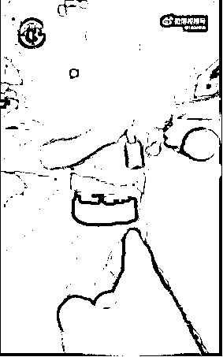

重点来了，当镜头特写给到这位“便衣警察”证件的时候，有眼尖的观众发现了一个问题：

**怎么这人的证件有效期是 2021.1-2022.13 啊？**

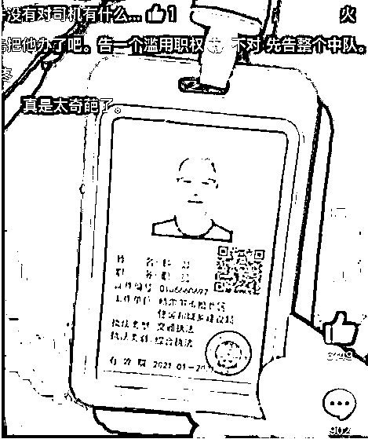

对于这段有争议的情节，网友们议论纷纷，有人说这个证件是假的，有人说他的工作单位和工作内容相矛盾。

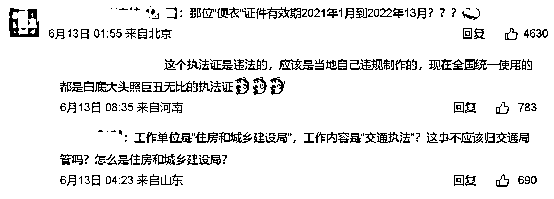

不过也有人说，应该是真的，因为办假证肯定会避开这种低级错误。福尔摩斯看了都要对这逆向推理技巧自愧不如。

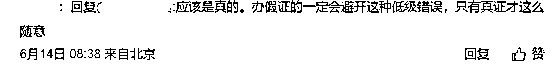

还没等我大脑处理完眼前巨大的信息量，另一位执法人员就做到了另一个极端，虽然穿着制服，但就是死活不给你看他的证件。

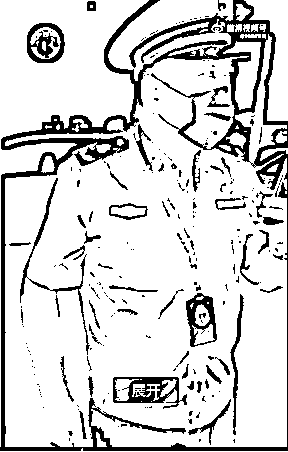

执法过程相当粗暴，不仅没好气，还直接甩开了当事人的手。

就连拍摄者赶来看情况的朋友也被这位执法人员一并调查了。

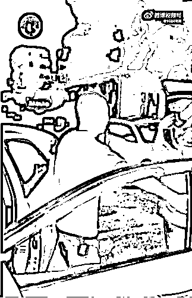

面对这种仿佛争执一触即发的紧张场面，心理素质极强的拍摄者还不忘阴阳怪气一下足球哥，说他是实名举报违法行为的热心市民，并不断持续输出，说他想在车里抽烟这件事很没素质。

足球哥不依不挠，他认为一码事归一码事，他举报司机就是因为他没证。别看你现在输出我，等会儿有你好看。

接下来反转来了！

在执法人员检查了司机的全套证件后，发现他相关材料都是齐的，可以搞网约车，没有任何问题。

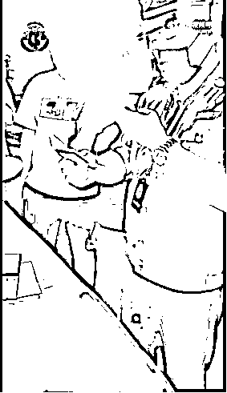

？？？

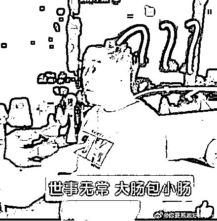

这次换成足球哥一脸懵逼了。

“原来你有证？那你为什么说你没有证呢?”

他内心一定在想：我是看你没证必把你拿下才举报的你啊？你怎么能欺骗人对你的信任捏？

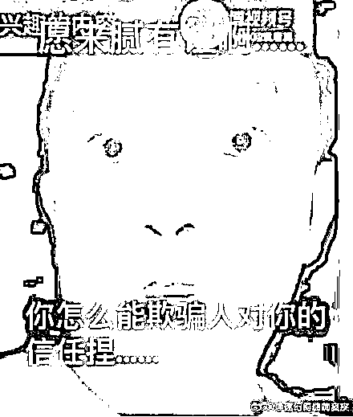

虽然镜头没拍到司机的表情，我相信他此刻一定笑得比歪嘴龙王更灿烂。

**这妥妥一出爽文的剧本啊!**

原来司机早有一手，面对足球哥的钓鱼执法，他将计就计说自己没证，等他自信心膨胀到极点的时候再让事实给他啪啪来两个耳光。

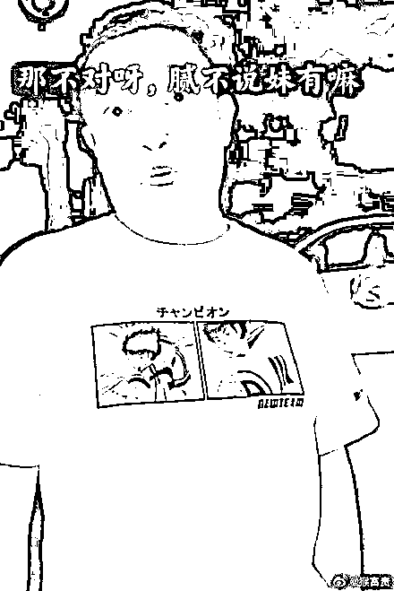

隔着屏幕都能感受到足球哥的气急败坏。

如果说剧情只在这里戛然而止，那挺多只是算是一部还算可看的“电影”，真正让它封神的还是最后补拍的一段车内监控画面。

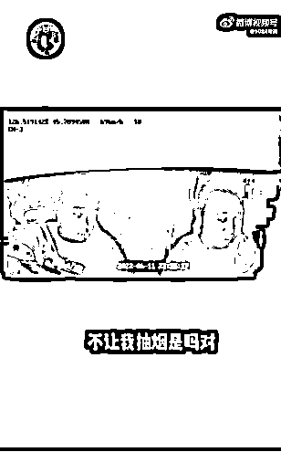

**足球哥在一开始抽烟被制止之后，立马打了几个私人电话，他走的并不是正规实名举报程序，而是动用私人关系叫两个好兄弟回局里处理一下。**

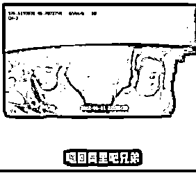

**他越说是越趾高气扬，你不让我抽烟，那我就把你给办了。**

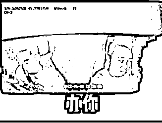

面对司机，他说：“处罚审核在我这。”“一会让你认识认识我。”

虽然此刻在陪他演的司机已经控制不住嘴角的笑容了，足球哥依然在打电话给好兄弟想要补刀，故意高声说给司机听，黑车怎么罚。

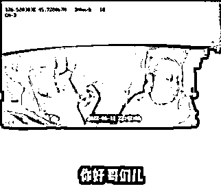

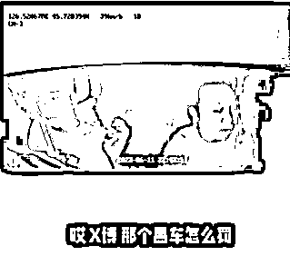

**对面告诉他 5000 到 2 万。**

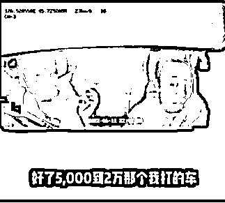

但是由于足球哥实在是喝多了，嘴瓢了说成五万到两万。

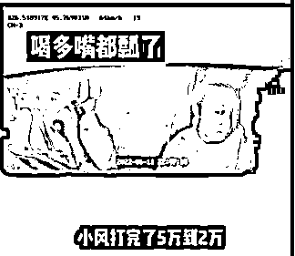

贴心的司机还不忘提醒他你说错了，背后的原因令人暖心。

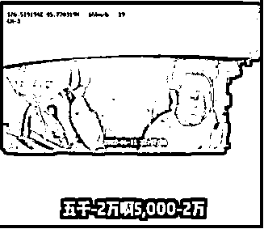

足球哥眼看胜券在握，就说今天就能给你批了。司机问了句明天批你这公章也开不出来啊？

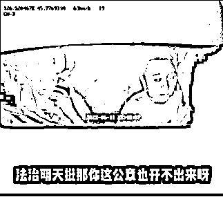

但看起来一切的担忧都是多余的，公章在你那，啊那没事了。

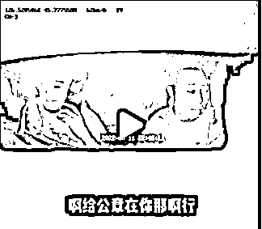

可以说，足球哥当初在车里有多猖狂，最后被无情打脸的时候就有多狼狈。

这位疑似公职人员的人酒后因为抽烟被拒想要打击报复，结果被司机反向钓鱼。确实真的相当精彩，不仅如此还直接踩个油门用自爆卡车把自己的几个好哥们全曝光了。堪称中国好兄弟。

**02**

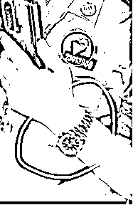

该事件引发网友热议后，有人爆料，说视频中身着制服的执法人员佩戴手表为劳力士 2020 款绿水鬼售价约为 14 万；

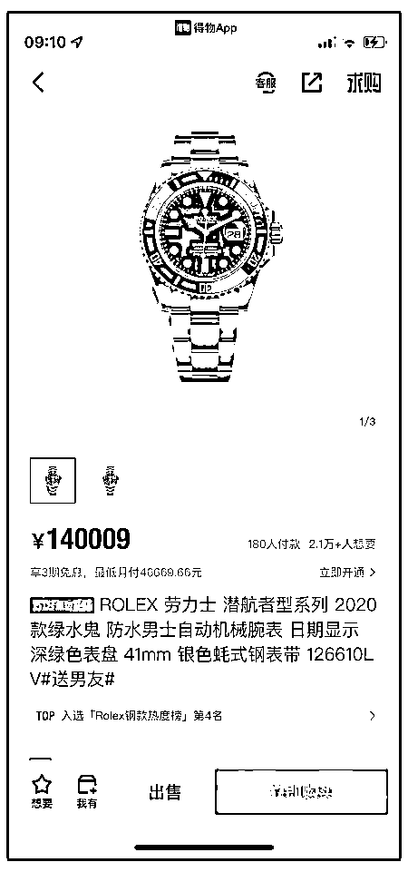

而他使用的手机为华为 Mate X2，在电商平台售价为 18999 元。

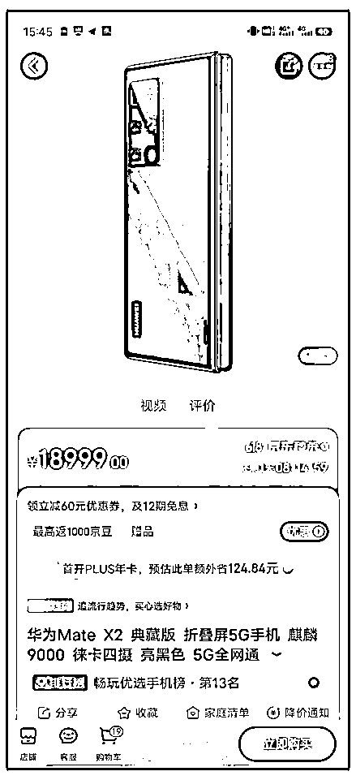

6 月 15 日，哈尔滨纪委回应，已接到许多市民举报，群众提供信息说这是劳力士绿水鬼，价值 14 万，目前正在调查。

对了，当事人还不忘发视频补刀，详细回归了事件的全过程。

他认为该乘客与执法人员相识，所以合理怀疑乘客本身也是公职人员。他提出质疑：公职人员在公共交通工具内抽烟是否妥当，其举报行为有打击报复之嫌。

其中说到：**当看到他有证的时候，他们三个对视一眼，好像一种很失望的样子。**

[`mp.weixin.qq.com/mp/readtemplate?t=pages/video_player_tmpl&action=mpvideo&auto=0&vid=wxv_2445604913163714560`](https://mp.weixin.qq.com/mp/readtemplate?t=pages/video_player_tmpl&action=mpvideo&auto=0&vid=wxv_2445604913163714560)

并上传了一段事后足球哥和自己的电话录音。

一开始足球哥说想私下见司机一面，遭到了斩钉截铁的拒绝：滴滴平台有规定不能和乘客见面。

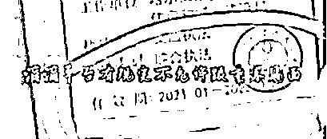

有人说足球哥在电话中画风突变，昔日风光的样子不再，说话特别唯唯诺诺。反倒是司机说：你等着吧，我已经给纪委去完电话了。

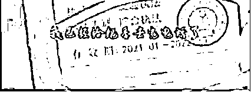

面对司机的接连轰炸，最后竟然怂到不敢回应自己把电话挂了。

有网友说看完这段视频非常爽，**面对流氓逻辑最好的方法就是不听他的话，一直强调自己的点，用魔法打败魔法。**

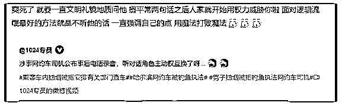

**03**

事情的最后，以一个“喜大普奔”的结果迎来了尾声。

哈尔滨松北区回应网约车司机遭到钓鱼执法的事件。**对区交通局借用人员杨云博（网约车乘客）予以清退，相关人员严肃处理，相关单位做出书面检查并切实整改。**

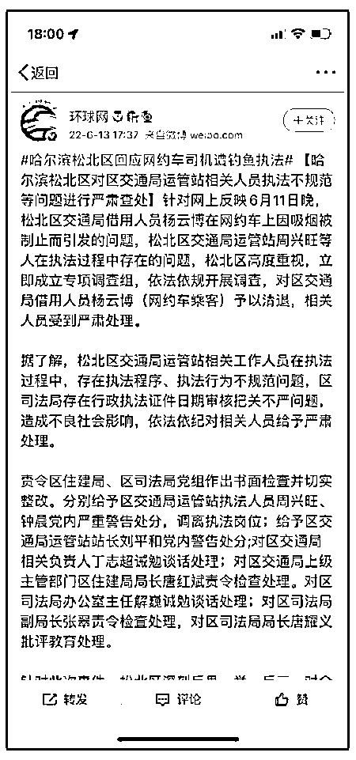

我们之所以看到视频中这些人的行为很愤怒，是因为当事人作为公职人员，却利用职务关系来进行有针对性的执法。与其说是执法，不如说是刁难。

虽然这件事情得到了一个“爽文式”的解决。

但得以解决的很大一个原因，是因为全程录音录像了。

不免让人有些害怕，如果缺少了这些证据，会不会这件事最后就不了了之了呢?

根据“千蟑定律”，当你看到有一只蟑螂的之后，屋子里其实已经有 1000 只蟑螂了。

我们能看到的只是一个不怕事，敢怼敢曝光的司机，才将公职人员的有意刁难曝光出来。万一当事人胆小怕事，那是不是这件事情永远就无法浮出水面了呢？

有网友说如果自己是那个司机，可能打完电话后就立马认怂，问他给多少钱能私了。

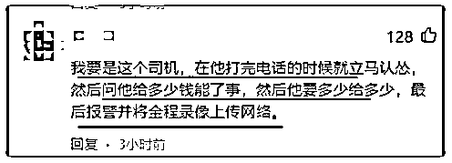

看着他们熟练的样子，很难不让人怀疑会不会平日里经常以此为借口敲诈其他司机。

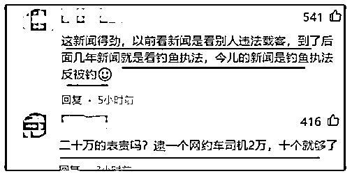

希望这方面有关部分也可以彻底调查一下，尤其是钟某拿着三四千块工资是如何买下十几万手表的事情，否则真的很难说服大家。

“有权就任性”确实很恐怖。

都说要把权利关进笼子里，却没想到有些本该“为人民服务”爬到人民头上作威作福。

是什么助长了他们的“任性”，又是什么让他们对这份职业失去了敬畏之心，如何防止类似的事情重演，都应该是有关部门应该思考的问题。

就像中央纪委国家监委网站说的那样：公权力不是耍特权、抖威风的私器。

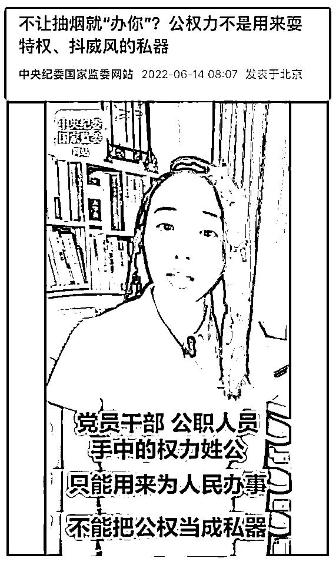

希望接下来有越多越多这样仗势欺人、滥用公权的人能得到严惩吧。

来源：雷叔说事

](https://mp.weixin.qq.com/s?__biz=Mzg5ODAwNzA5Ng==&mid=2247487973&idx=1&sn=1b62da6f2018402862a5c375e10c355e&chksm=c06878b2f71ff1a4fbe7df4dec626aa7e696154751693bf16f6c6a302ceaa4d1959040c70518&scene=21#wechat_redirect)

← 向右滑动与灰产圈互动交流 →

