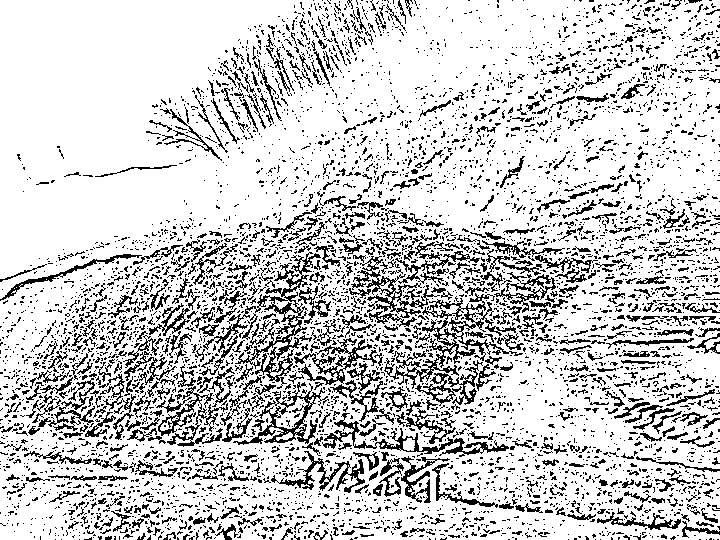
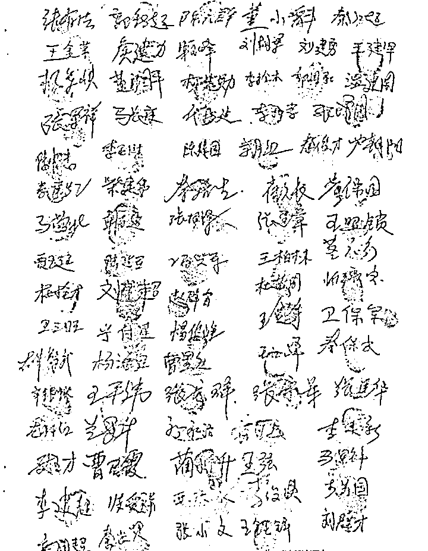
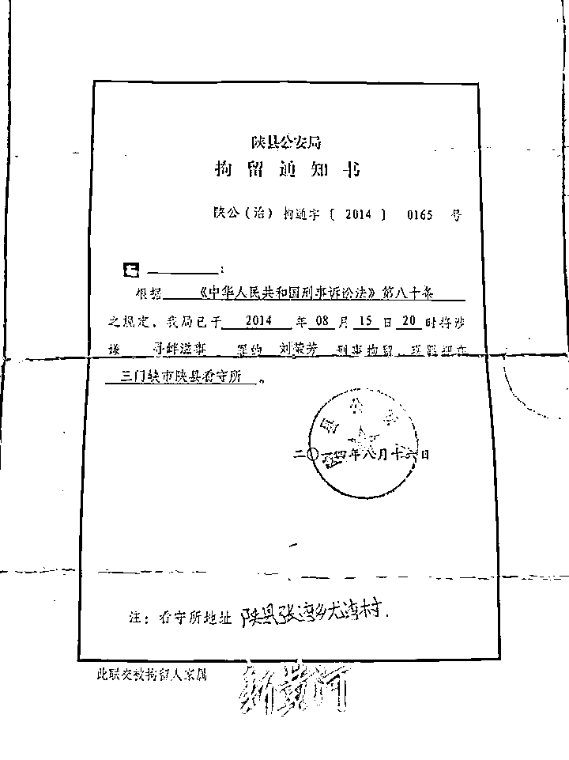
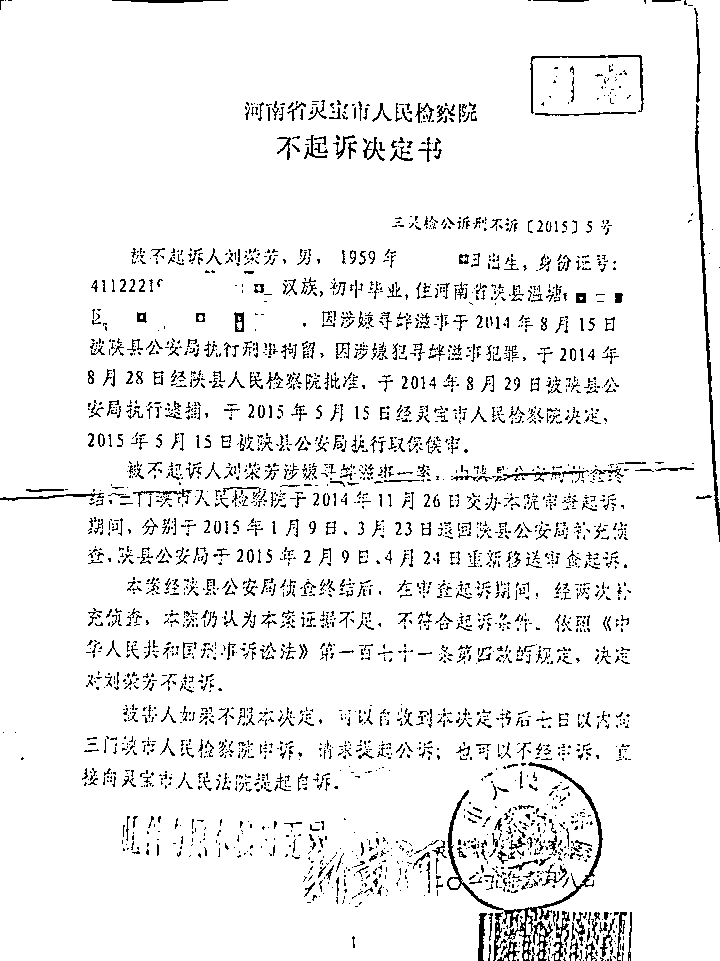

# 实名举报涉黑团伙，却被羁押 9 个月

> 原文：[`mp.weixin.qq.com/s?__biz=MzIyMDYwMTk0Mw==&mid=2247538017&idx=5&sn=67456a6d2860f27906c2b0984b54ee68&chksm=97cb9e59a0bc174f3d8732ad3b3fb1fc46014e9f881adbbeb577b07142a4f89e83daf2912b7f&scene=27#wechat_redirect`](http://mp.weixin.qq.com/s?__biz=MzIyMDYwMTk0Mw==&mid=2247538017&idx=5&sn=67456a6d2860f27906c2b0984b54ee68&chksm=97cb9e59a0bc174f3d8732ad3b3fb1fc46014e9f881adbbeb577b07142a4f89e83daf2912b7f&scene=27#wechat_redirect)

一石激起千层浪。自从唐山暴力殴打他人案件发生后，全国陆续出现多起网络“实名举报”。6 月 13 日，河南省三门峡市陕县支建矿业公司（以下简称“支建矿业”）职工刘荣芳和宁刚旦在网上发布视频，实名举报称支建矿业实际控制人张某某组成的涉黑团伙，盗采国家矿产资源、瞒报矿难、殴打维权职工、指使民警违规办案等多项涉嫌违法犯罪的行为。

“从 2012 年起，我们矿上的工人就养老金、股权等问题，集体向省市县三级信访部门反映，但一直没能解决，反而遭到张某某等人的打击报复。”刘荣芳和宁刚旦告诉新黄河记者，在张某某的指使下，他们二人被当地公安机关分别以涉嫌寻衅滋事罪和涉嫌敲诈勒索罪逮捕，各自被羁押大约 9 个月，最终被判无罪。被释放后，刘荣芳和宁刚旦继续举报，但仍没有得到相关部门的重视。

[`v.qq.com/iframe/preview.html?width=500&height=375&auto=0&vid=b3343t539u0`](https://v.qq.com/iframe/preview.html?width=500&height=375&auto=0&vid=b3343t539u0)

6 月 15 日，对于上述举报内容，被举报者张某某则予以否认，“人家举报啥我也堵不住人家的嘴，事情各职能部门该咋处理咋处理。”三门峡市陕州区（原陕县）纪委部门则表示，他们还没有看到网络上的相关举报信息，建议两名举报人直接向纪委监委举报。

**煤矿改制后引发纠纷，470 余名职工权益受损**

实名举报人刘荣芳，退休前是支建矿业工会主席。

刘荣芳向新黄河记者介绍，支建矿业的前身是陕县支建煤矿，是地方国有企业，始建于 1958 年。2004 年，按照国家有关企业改制的指示精神，支建煤矿完成了国有资产改制，成为陕县支建矿业有限公司，按照相关规定进行了内部职工募股。2009 年，三门峡人张某某以三门峡伟业投资有限公司名义，进入陕县支建矿业有限公司，成为公司实际控制人。之后，由于支建矿业与银行发生金融借款担保合同纠纷，被法院拍卖采矿权证，支建矿业以远低于评估价的 1500 多万元被三门峡金海投资有限公司拍走，后者则是张某某“幕后操盘”的另一家公司。这一操作，也直接导致了支建矿业 400 余名正式职工的医疗保险和养老保险没有了保障。

“2011 年支建矿业转让时，和金海公司签订的合同中载明，金海公司需保证全员职工工资和以往所欠工资的正常发放；保证清缴以往公司所欠职工养老保险金，按时缴纳职工医疗保险金，及时缴纳新产生的养老保险金，不得拖欠，不得影响职工办理离、退休手续；承诺按劳动法、劳动合同法的规定合法用工，确保职工的各项合法权益。”刘荣芳说，当时职工们还满心期待，后来才发现，双方签订的合同如同一张“废纸”，没有一条贯彻落实。

“目前，公司拖欠职工的各项社会保险金和工资已经近 3000 万元。原来企业有 1000 多人，一半以上都是临时工，有些干了十年都不给签合同，后来这些临时工随便找个理由都给解雇了，还剩 470 多名正式职工甩不掉。”刘荣芳说，公司股权转让之后，他们这些正式职工也都陆续被“下岗待业”，公司每次需要采矿时，就重新雇佣一批临时工干活。由于职工们的社保一直没人给缴纳，导致到了退休年龄后无法退休，自己在 2019 年补缴了近 10 万块钱，才正式办理退休手续，很多补缴不起社保的人，到现在还没办法领到退休金，生活上没有任何保障。

**职工实名举报矿难瞒报，维权遭黑恶势力殴打**

另一位实名举报人宁刚旦，则是支建矿业工人维权的带头人。宁刚旦告诉记者，2013 年 6 月，他和其他职工在网上实名举报：支建矿业因为改制后，陕县政府疏于监管，导致企业长期非法采矿，2013 年 5 月 16 日，支建矿业下属一铝石矿发生一起矿难事故，造成 2 人死亡，多人受重伤，死者是一对父子。事发后，矿方瞒报事故，私下同死者家属协商，赔偿 160 万元了事，伤者则被拉往医院治疗。新黄河记者了解到，宁刚旦当年举报的矿难一事属实，举报后曾引发媒体关注，河南省安监局、三门峡市安监局前往陕县联合进行调查，作出相应处理。事故发生后，负责人张某某在接受媒体采访时曾表示，自己专门进行了了解，没有这个事(矿难)，这是被开除的职工在蓄意打击报复。“只要(死亡)不超过 3 个人，三门峡市就可以处理，没啥可以瞒报的。”

“2013 年 5 月，张某某指使余某某、苏某、史某某等人带领一帮社会闲散人员，采取威胁、谩骂等手段逼迫职工自行离职，让手下用各种方式深更半夜去敲打职工代表的住室门，让穿黑衣服、露着纹身、理光头的混混白天找职工代表威胁、恫吓，以及打电话等骚扰手段，不让职工代表继续参与举报他们团伙的非法采矿等犯罪行为，造成上访职工多人致伤、多人留下心理阴影。”宁刚旦向记者出示的多份实名举报材料中载明。记者通过网络搜索发现，网上仍有多篇有关张某某的实名举报，其中一篇名为《河南省三门峡张某某涉黑集团被实名举报》的帖子，上面列举了张某某等人的“涉黑”行为，帖子最后注明：“以上事实，我们均掌握有确切证据，我们强烈要求党政纪检机关，依法依纪严惩事故直接责任人张某某以及相关职能部门失职失察、甚至渎职充当其保护伞的执法人员的法律责任。”后面附有 80 名职工代表签名指印，以及宁刚旦等 9 人的身份证号和联系方式。

刘荣芳还向记者回忆了当年维权时被打的事情。“2013 年 12 月 13 日 8 点左右，我和其他几名职工要去河南省高院反映情况，张某某指使余某某、苏某、刘某某等人带领数十名社会闲散人员埋伏附近，对我们这些上访职工代表进行殴打，导致数人被打伤住院，其中一人左眼眶内壁骨折、腰部骨折，事后法医鉴定构成轻伤，一人重度脑震荡，事后法医鉴定构成轻微伤。报案之后，只有一名涉案人员被抓，很快又被放了出来。

**举报后遭遇“牢狱之灾”，无故被羁押 9 个月**

刘荣芳和宁刚旦二人没想到，原本正常的举报和维权行为，竟会让自己招致“牢狱之灾”。

“由于我是工会主席，张某某找到我，让我去做工作让工人不要再反映了，还在宾馆里要送我 30 万元，我没要，没答应，我认为工人反映问题是他们的正当权利。公司把社保和工资事情解决了，大家自然就回去了。”刘荣芳回忆说，2014 年 8 月 15 日，由于自己和工人在施工工地维权讨薪，张某某得知后安排人报了警，自己被陕县公安局民警带走，以涉嫌寻衅滋事罪被刑事拘留，后被陕县人民检察院批准逮捕，被羁押在看守所 273 天，直到 2015 年 5 月 15 日被取保候审。

宁刚旦也有相似的遭遇。2014 年 8 月，宁刚旦以涉嫌敲诈勒索罪名，被陕县公安局民警带走，后被陕县人民检察院批准逮捕，前后一共被羁押了近 9 个月。“民警说我举报的目的是为了敲诈，矿上一施工队队长高某某为息事宁人给过我 10 万元。我反复对民警说，10 万元一事纯属子虚乌有，是有人在做伪证害我，目的就是想把我关起来，不再让我举报。”宁刚旦回忆道。

在被羁押期间，身陷囹圄的刘荣芳和宁刚旦一直要求异地办案。最终，在两人的坚持下，三门峡市检察院指派灵宝市检察院办案。2015 年 6 月 8 日，河南省三门峡灵宝市检察院分别对两人作出不起诉决定书：本案经陕县公安局侦查终结后，在审查起诉期间，经过两次补充侦查，仍然证据不足，不符合起诉条件。刘荣芳、宁刚旦被依法宣告无罪。刘荣芳、宁刚旦在被不起诉后，曾多次请求国家赔偿，但时至今日，一直未有任何结果。

值得注意的是，刘荣芳向多部门递交的举报材料上指出，矿上诸多问题得不到解决，源于原陕县检察院检察长王峰是张某某涉黑势力集团的“保护伞”，原三门峡市委书记杨树平在此事上不作为。公开报道显示，2014 年 10 月 8 日，王峰因涉嫌严重违纪违法，目前正接受组织调查；2015 年 7 月，杨树平在三门峡市委书记任上落马。法院查明，2003 年至 2015 年，杨树平利用在矿产开发、土地拆迁、企业发展、工程承揽、职级调整等方面为他人谋取利益，先后单独或伙同他人收受相关单位和个人给予的财物共计人民币 820 余万元，一审获刑 12 年。

**被举报人否认“涉黑”，纪委称“尚不清楚此事”**

在刘荣芳、宁刚旦提供的相关举报材料中，还提到了支建矿业非法盗采的情况。“张某某在 2009 年 6 月实质控制公司后，违反国家法律规定，盗采、滥采铝土矿石，获取巨额利益。”刘荣芳表示，支建矿业工商登记资料显示该公司的营业范围仅是“对煤矿再投资，不得生产经营”，其生产开采的铝土矿石也“不在其拥有的采矿权范围内”。尽管没有合法完整的开采手续，但公司却以探矿的名义大肆盗采铝土资源，先后开挖了 16 个采矿口，滥采铝矾土资源 230 多万吨。其间，多次受到相关人员的举报，多次受到相关行政机关的处罚。“过去这些年，我们一直实名举报这帮黑恶势力团伙的违法犯罪行为，为 470 多名职工争取合法权益，但一直没有得到相关部门重视。当下，全国正在大力开展扫黑除恶专项斗争，这让我们重新看到了希望。”刘荣芳表示。

对于上述举报内容，被举报人张某某又作何回应？6 月 15 日下午，新黄河记者与张某某取得了联系。张某某表示，他不是支建矿业的实际控制人，对上述举报的内容也不知情，“企业早已经卖了，跟我们没有关系了，我们早就不干了。他们想举报我也堵不住人家的嘴，这件事情各职能部门该咋调查咋调查，该咋处理咋处理，用事实说话就行了。”

由于刘荣芳和宁刚旦的举报视频中，提及了三门峡市陕州区公安局两位办案民警辛某、王某以及陕州区检察院周某滥用职权的事情，记者又致电陕州区公安局纪检监察部门了解情况，一位负责人表示并不清楚此事，陕州区检察院电话则一直无人接听。之后，记者又致电陕州区纪委监委，一位工作人员表示，之前并未接到过相关的举报信息，对于网上的举报纪委部门还没看到，也没法进行处理，按照正常操作途径，建议举报人直接跟纪委反映情况。

来源：新黄河客户端，观察者网

](https://mp.weixin.qq.com/s?__biz=Mzg5ODAwNzA5Ng==&mid=2247487973&idx=1&sn=1b62da6f2018402862a5c375e10c355e&chksm=c06878b2f71ff1a4fbe7df4dec626aa7e696154751693bf16f6c6a302ceaa4d1959040c70518&scene=21#wechat_redirect)

← 向右滑动与灰产圈互动交流 →

