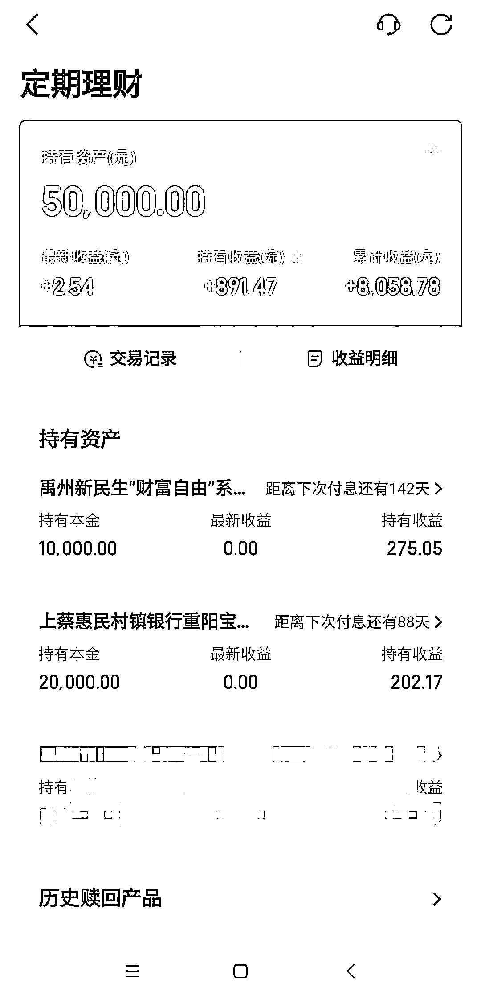

# 河南省纪委回应“红码”

> 原文：[`mp.weixin.qq.com/s?__biz=MzIyMDYwMTk0Mw==&mid=2247538017&idx=6&sn=6ad235e566ef78f557e394f89228b4d9&chksm=97cb9e59a0bc174fef894ed6ad5417a2ce9906857930a6413882fe2b7c4186b5b833720bf176&scene=27#wechat_redirect`](http://mp.weixin.qq.com/s?__biz=MzIyMDYwMTk0Mw==&mid=2247538017&idx=6&sn=6ad235e566ef78f557e394f89228b4d9&chksm=97cb9e59a0bc174fef894ed6ad5417a2ce9906857930a6413882fe2b7c4186b5b833720bf176&scene=27#wechat_redirect)

河南省纪委监委工作人员表示，近日接到大量关于健康码“非疫情原因赋红码”的举报、投诉，已将相关线索转交河南省卫健委调查，河南省纪委监委暂未就此事单独启动调查。

6 月 13 日以来，多家媒体报道了部分河南村镇银行储户、烂尾楼业主健康码被“赋红码”的情况。

[`v.qq.com/iframe/preview.html?width=500&height=375&auto=0&vid=q3343h64f1w`](https://v.qq.com/iframe/preview.html?width=500&height=375&auto=0&vid=q3343h64f1w)

公众疑惑，是谁在“调红”健康码，什么情况下才能满足“赋红码”条件？6 月 16 日，封面新闻记者致电河南省多个相关职能部门，得到回复为“不知情”或电话无法接通。

河南省纪委监委工作人员表示，近日接到大量关于健康码“赋红码”的举报、投诉，已将相关线索转交河南省卫生健康委员会（后文简称：“河南省卫健委”）调查。

**储户未离开山东却被“赋红码”，****文字提示“异常信息由河南省推送”**

6 月 16 日，山东临沂的姚先生介绍，他是禹州新民生村镇银行、上蔡惠民村镇银行的储户。2020 年以来，他陆续在两家银行存入约 8 万元，2022 年 4 月中旬以来，出现无法取款情况，他也加入了客户维权群。

他告诉封面新闻记者，14 日早上，他给孩子学校报备健康码等信息时，发现自己的山东健康码变红，健康码页面文字提示“异常信息由河南省推送，来自高风险地区未满 14 天，或未检测到第 14 天后核酸阴性结果”。

**姚先生的健康码被“赋红码”**

“页面上显示是河南给的（红码），但我没去过河南。”姚先生表示，他近期未离开过山东。

姚先生提供的 6 月 16 日行程卡截图显示，他 14 天内仅达到或途径山东临沂一地。

**姚先生的 6 月 16 日的行程卡，没有中高风险地区旅居史**

姚先生称，6 月 12 日，他所在的村镇银行客户维权群里，部分去郑州现场维权的人表示扫描了郑州车站的场所码后被赋红码，他们便将这个郑州车站场所码发到了群里，不少没去现场的人也试着扫了该场所码，包括姚先生本人，姚先生说“当时扫出来的场所码是红的”。

姚先生表示，据他了解，不少健康码变红的储户也都扫过这个场所码，但目前尚不清楚，是否与媒体报道的健康码变红有关联。

“我联系我们当地的 12345，他们说没有权限给我改回来。”姚先生称，他又联系了郑州 12345，“也说不知道情况，不能转码，让我联系社区报备。”

姚先生的遭遇并非个案。小涛（化名）也是河南两家村镇银行的储户，他告诉封面新闻记者，5 月他曾去郑州维权，但 6 月以来未离开过四川，他的豫康码也在 6 月 13 日变成红码，“看到别人说红了，我看了一下，发现自己也红码了。”

他也表示，他的天府健康码、行程卡未出现异常，一直都是绿色，“但支付宝里面的健康码也提示河南给我标记了高风险”。 

**多名储户称已转绿码，****“还是会去河南维权”**

姚先生表示，14 日中午，大量储户被赋红码情况在网络引发关注，随后他的健康码自动转绿，“只红了一上午，上午 10 点多左右就变绿了。”小涛也表示，他的豫康码已自动转为绿码。

姚先生表示，目前他仍计划去河南维权。“我打算等孩子放暑假再去，怕影响孩子上学。”姚先生介绍。 

“红码之后在家里待了一上午，就早上出去买菜。这边小区的人都很通情达理，我给他看行程卡，没有去过外地，就没有为难我。”姚先生表示。

据媒体报道，近期有大量储户反映，他们存在河南、安徽多家村镇银行的钱取不出来了。其中包括位于河南许昌的禹州新民生村镇银行、驻马店市的上蔡惠民村镇银行、商丘市的柘城黄淮村镇银行、开封市的新东方村镇银行等。许昌禹州警方也已介入村镇银行的相关案件，正全面侦办。

**多部门电话无法接通或回复“不知情”，****河南省纪委监委：已接到大量举报**

据《河南日报》6 月 14 日报道，“升级版”的河南健康码系统已在河南全省上线，该系统是在河南省行政审批和政务信息管理局指导下，由正数网络技术有限公司提供专业技术支撑建设而成。

河南省行政审批和政务信息管理局值班室工作人员接受第一财经记者采访时表示，对本次河南健康码被“赋红码”事件并不清楚，该局主要是负责数据的汇聚、储存和加工，健康码赋码的具体政策是怎么定，该局无权决定。

6 月 16 日下午，封面新闻记者致电该单位的公开电话，试图了解河南省健康码的管理、使用规则，但暂未获接听。

6 月 16 日，记者又多次拨打正数网络的电话，也暂无人接听。

封面新闻记者在采访中了解到，多位健康码被“赋红码”的维权人士，在健康码变红后，曾接到疫情防控指挥部的电话通知。郑州市 12345 政务服务便民热线的工作人员接受媒体采访时，居民健康码处于何种标准的最终决定权，在疫情防控指挥部。

6 月 16 日，封面新闻记者多次致电河南省政府公开的省级疫情防控指挥部电话和疫情防控监督电话试图了解情况，但电话未获接听。

河南省纪委监委工作人员在电话中向封面新闻记者表示，近日接到大量关于健康码“非疫情原因赋红码”的举报、投诉，**已将相关线索转交河南省卫健委调查，河南省纪委监委暂未就此事单独启动调查。**

封面新闻记者致电河南省卫健委咨询相关情况，接电话的工作人员表示，对于健康码“赋红码”一事的具体情况“暂不了解”。

来源：封面新闻，观察者网

](https://mp.weixin.qq.com/s?__biz=Mzg5ODAwNzA5Ng==&mid=2247487973&idx=1&sn=1b62da6f2018402862a5c375e10c355e&chksm=c06878b2f71ff1a4fbe7df4dec626aa7e696154751693bf16f6c6a302ceaa4d1959040c70518&scene=21#wechat_redirect)

← 向右滑动与灰产圈互动交流 →

