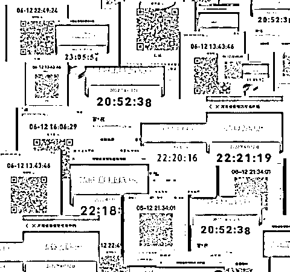
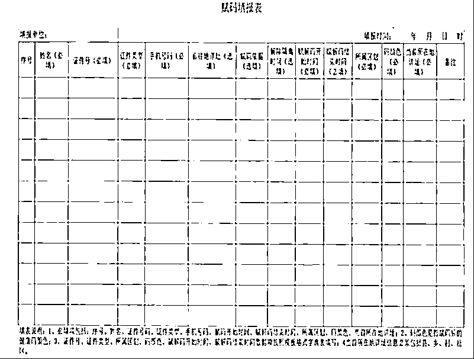

# 谁能让健康码“变色”？主要负责人签字，审核后报省级部门赋码

> 原文：[`mp.weixin.qq.com/s?__biz=MzIyMDYwMTk0Mw==&mid=2247538079&idx=1&sn=6f39f295a8d27322d46d1b7e1755a9e6&chksm=97cb9ea7a0bc17b17b6a7d9688c943a6a7ae2ef59bbd0a8188b2af0ae94df20d23926f30e365&scene=27#wechat_redirect`](http://mp.weixin.qq.com/s?__biz=MzIyMDYwMTk0Mw==&mid=2247538079&idx=1&sn=6f39f295a8d27322d46d1b7e1755a9e6&chksm=97cb9ea7a0bc17b17b6a7d9688c943a6a7ae2ef59bbd0a8188b2af0ae94df20d23926f30e365&scene=27#wechat_redirect)

**舆论关注多日，公众仍然疑惑，谁该为此负责？哪个部门有权力为公众赋红码？本文自南方都市报 APP。**

本周以来，多家媒体报道了部分河南村镇银行储户健康码被“赋红码”的情况。在健康码广泛使用的今天，公众普遍担忧健康码被滥用，使用范围扩大至非防疫场景。

然而舆论关注多日，公众仍然疑惑，谁该为此负责？哪个部门有权力为公众赋红码？南都记者致电河南省多个相关职能部门，得到回复均没有确切的结果。

新冠疫情已进入第三个年头，虽然健康码的第一行代码已被国家博物馆收藏，但这一数据系统的运转方式仍鲜为人知。对于具备警示色彩和社会限制功能的健康码，公众高度关注其赋码标准和程序。在公开情况不一的情况下，南都记者尝试综合多地发布的相关文件呈现系统一角。

部分河南村镇银行储户被赋红码。

****

**工作流程：**

**赋码表需由主要负责人签字**

根据国务院联防联控机制综合组发布的《新冠肺炎疫情防控健康码管理与服务暂行办法》，红码表示处于高风险状态，有下列情形之一的赋红码：确诊病例、疑似病例、无症状感染者、正在实施集中或居家隔离医学观察的密切接触者、不明原因发热病人、有高风险地区旅居史隔离未满 14 天的人员，正在实施集中或居家隔离医学观察的入境人员。

目前看，各地发布的配套文件大体延续了前述规定。但对赋码和转码的管理权限并不相同，有的地区将权限收归至省一级，有的地区则分散在各层级。

例如，山西兴县防控办发布的文件显示，县疾控中心负责收集梳理确诊病例、疑似病例、无症状感染者、复阳病例（无症状感染者）、密切接触者及次密切接触者等需赋码人员信息，上报县防控办。县防控办结合县疾控中心、各乡镇各单位和排查管控情况，梳理需要纳入红码（黄码）管理的人员信息，填写赋码表，由主要负责人签字确认后，实时报送市卫生健康委审核，由市卫健委上报省卫生健康委予以赋码。

此外，21 世纪经济报道采访的一位地方疫情防控指挥部官员称，其所在省的赋码转码的权限在省大数据管理部门，下辖市县区只有审核上报的权限。“比如某地要对拒不参与全员核酸检测的居民赋黄码，要以属地疫情防控指挥部的名义向省大数据管理部门提交情况说明，称该类人员存在潜在感染风险并提供证据，省级部门才会对这类人员赋码。”该官员说。

而广西则将转码权限分布在各个层级。当地今年 1 月发布的《广西健康码管理与服务暂行办法的通知》显示，广西健康码分设 5 级区划管理员及网格管理员、采集员。区划管理员负责下一级区划管理员及本级网格管理员的账号管理工作，执行账号的审核、开通、删除等操作。其中 1 至 4 级区划管理员具备健康码转码权限，负责依照《广西健康码定码和转码规则》对辖区内符合转码条件的人员进行转码。

1 级区划管理员为区级管理员；2 级区划管理员为市级管理员，由自治区统一为各设区市新冠肺炎疫情防控指挥部分配；3 级区划管理员为县（区）级管理员，由各市自行为下辖县（区）开通账号；4 级区划管理员账号为街道、乡镇和重点场所管理员，由各地根据疫情防控工作实际情况，为街道、乡镇以及机场、车站、隔离点等有转码工作需要的单位开通；5 级区划管理员为行政村、社区级管理员。全区各级各单位和公共场所向本级区划管理员申请本单位（小区、场所）的网格管理员账号，并根据实际需求为工作人员开通采集员账号。

总体上看，两种模式都设定了较为明确的赋码流程和层级，“签字”“审核”等字眼也表明赋码所需承担的责任。

****

****部门分工：****

****赋转码权限在行政部门****

**综合媒体报道及公开资料，赋码工作大多与各级疫情防控指挥部相挂钩。作为特殊时期的组织协调机构，其成员单位包括公安、卫健、交通、大数据等各个政府部门。各部门在赋码一事上是如何分工的？**

**一名参与中部某省份健康码开发的技术人员告诉南都记者，当地省疫情防控指挥部大数据专班通过后台系统将需赋码人员推送至健康码运营机构，由系统自动赋码，运营机构并不直接参与赋码工作。第一财经的一篇报道也提到，健康码系统开发和执行人员没有转码权限，转码工作归行政部门。**

**前述开发人员介绍，卫健部门掌握的医疗数据、通信管理部门掌握的行程数据等均经大数据专班汇总至公安部门在其内部系统比对分析，最终由公安部门输出结果至健康码平台。“都是在大数据专班的机制下做事，具体执行是公安这边推数据过来。”**

**也有省份采取不同的分工模式。2020 年发布的《河南省“健康码”使用管理办法》显示，各级卫生健康、公安、交通运输、人力资源社会保障、教育等部门负责分别统计本系统掌握的涉疫重点人员信息，推送至本级大数据管理部门，市级大数据局于每日 18：00 前向省大数据局报送相关信息。**

**另据财新网报道，因健康码涉及多方信息的归集，例如确诊病例、疑似病例、密接、次密接人员信息由卫健委和疾控部门负责，由大数据排查出的同时空风险人员信息由公安部门掌握，因此健康码管理普遍由市级或省级疫情防控指挥部统筹。**

**海南在 5 月发布的数份文件进一步明确了批量赋红码所需的流程。文件称，对于 100 个以上批量赋红、黄码的需求，海南大数据管理局集中响应，各市县指挥部安排本市县负责健康码转码的同事扫描下发二维码加入海政通沟通群，并在海政通内传递相关数据，避免个人隐私数据外泄。100 个以下赋红、黄码的需求请各市县指挥部自行操作进行赋码。**

**值得一提的是，宁夏在今年专门就“红码”的规范处置下达了文件。文件将赋红码分为了多种情形，包括确诊病例密接、确诊病例次密接、大数据赋码风险人员，以及核酸检测阳性人员。当红码人员为非涉疫人员时，由市级应对新冠肺炎疫情工组领导机构协调解除赋码。**

**类似的救济措施也出现在其他省份的文件中。海南 12345 工作人员称，如果发现健康码被不规范应用在防疫以外的情况，可以及时致电反映。“我们会如实地反映上去，让相关部门调查斟酌处理。”**

**（感谢“UV”为采访提供的帮助。）**

**采写：南都记者 宋承翰 陈秋圆 发自北京 编辑 ： 梁建忠**

******](https://mp.weixin.qq.com/s?__biz=Mzg5ODAwNzA5Ng==&mid=2247487973&idx=1&sn=1b62da6f2018402862a5c375e10c355e&chksm=c06878b2f71ff1a4fbe7df4dec626aa7e696154751693bf16f6c6a302ceaa4d1959040c70518&scene=21#wechat_redirect)**

**← 向右滑动与灰产圈互动交流 →**

****