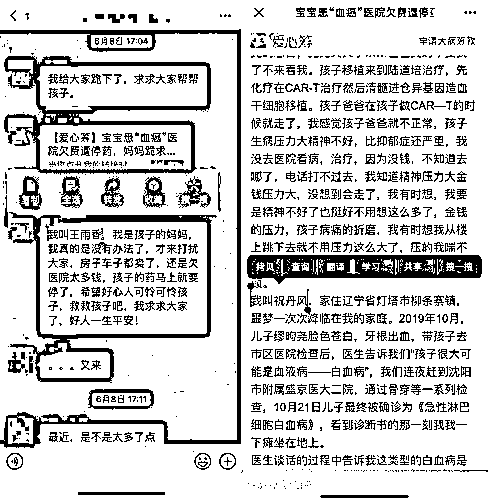
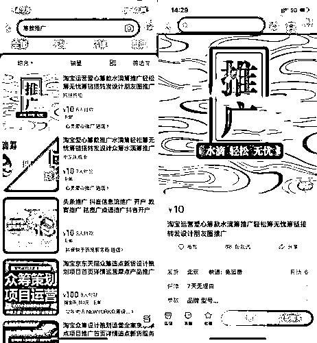
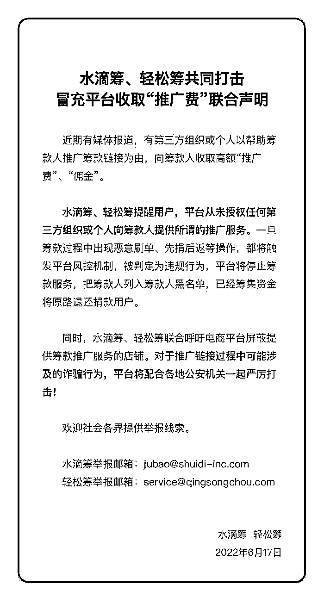

# 大病筹款也有诈骗？轻松筹、水滴筹就“推广费”发布联合声明

> 原文：[`mp.weixin.qq.com/s?__biz=MzIyMDYwMTk0Mw==&mid=2247538079&idx=2&sn=1466adb4bc64e25122bb74949f33eb97&chksm=97cb9ea7a0bc17b19d6d8f307db8ad9cb7ab435470360613ee1a8cc7cfddab1b060331a29739&scene=27#wechat_redirect`](http://mp.weixin.qq.com/s?__biz=MzIyMDYwMTk0Mw==&mid=2247538079&idx=2&sn=1466adb4bc64e25122bb74949f33eb97&chksm=97cb9ea7a0bc17b19d6d8f307db8ad9cb7ab435470360613ee1a8cc7cfddab1b060331a29739&scene=27#wechat_redirect)

图片来源：unsplash  记者 | 伍洋宇

6 月 17 日消息，针对不法分子冒充平台收取“推广费”的行为，轻松筹、水滴筹先后发布联合声明称，警惕第三方组织或个人以帮助筹款人推广筹款链接为由，向筹款人收取“推广费”、“佣金”。 

据界面新闻记者观察，这些筹款推广链接常常出现在具有社群性质的微信群及 QQ 群里，每次转发均使用大致雷同的话术，不少转发语还出现求助者与筹款者姓名不符的低级漏洞。

记者截图

对此，前述声明表示，平台未授权任何第三方组织或个人向筹款人提供所谓的推广服务。一旦筹款过程中出现恶意刷单、先捐后返等操作，都将触发平台风控机制，被判定为违规行为，平台将停止筹款服务，把筹款人列入筹款黑名单，已经筹集资金将原路退还捐款用户。

同时，轻松筹、水滴筹还联合呼吁电商平台屏蔽提供筹款推广服务的店铺。界面新闻记者经搜索发现，目前在淘宝平台上，仍有名为“心灵爱心推广”的店铺，挂出了各大筹款平台链接转发及推广的服务。

记者截图

在网络众筹领域，已有相关诈骗案件被警方破获。 

据报道，近日，广西壮族自治区贵港市平南县公安局侦破了全国首例利用网络众筹平台诈骗重病老人特大系列案件，抓获该诈骗团伙成员 22 人，捣毁“空壳公司”12 个、诈骗网站 9 个，冻结涉案资金 30 余万元。

诈骗人员通常是冒充住院部病人家属或陪护人员潜入医院内部，并通过伪装成“水滴筹”、“轻松筹”等公益平台的推广人员接近患者，提出无偿为患者发起众筹，并最终骗取患者 30%以上众筹款。部分案件中，诈骗分子甚至切断一切与患者的联系方式，并拉黑病人家属电话及微信，非法占有病人的全部捐款。

据悉，除了伪装成“水滴筹”、“轻松筹”等大众知名度较高的平台，诈骗分子还通过注册空壳公司，搭建多个非法众筹平台以行骗，平台包括“爱心筹款”、“爱心捐助”、“爱心筹助”、“大病救助”等，相关 12 个空壳公司和 9 个诈骗网站已被捣毁。

此次案件涉及爱心捐赠者 50 多万人，被骗困难患者 3 千多人，其中老人 900 多人，骗取 400 多万元；涉及区内外医院 800 多个，扣押公司电脑、公司印章、工作证、手腕带等工作工具一批，冻结涉案资金 30 多万元。

### 以下为前述声明全文：

来源：界面新闻

](https://mp.weixin.qq.com/s?__biz=Mzg5ODAwNzA5Ng==&mid=2247487973&idx=1&sn=1b62da6f2018402862a5c375e10c355e&chksm=c06878b2f71ff1a4fbe7df4dec626aa7e696154751693bf16f6c6a302ceaa4d1959040c70518&scene=21#wechat_redirect)

← 向右滑动与灰产圈互动交流 →

