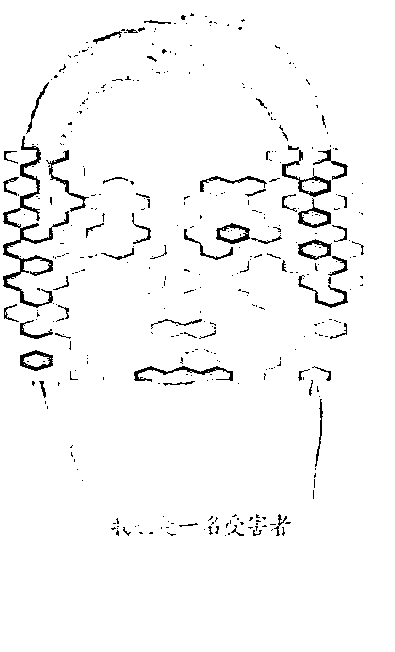
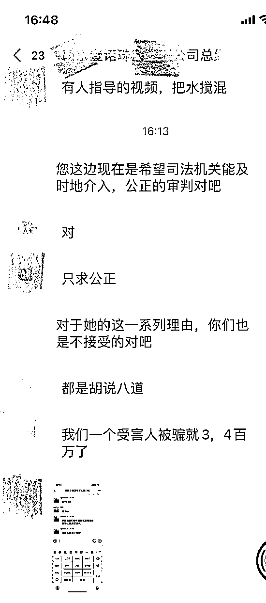
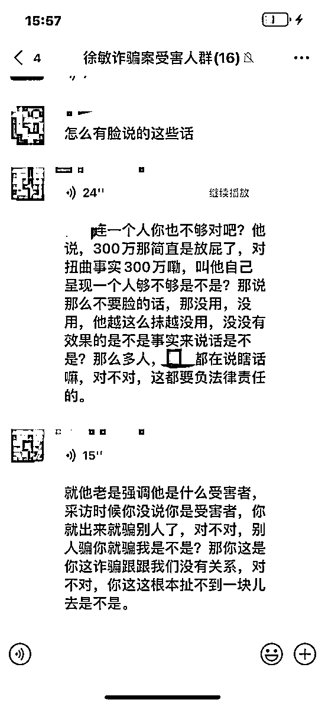

# 诈骗玉石翡翠超 3000 万元？遭多人举报的唐山徐某归案

> 原文：[`mp.weixin.qq.com/s?__biz=MzIyMDYwMTk0Mw==&mid=2247538079&idx=3&sn=4095d0c35ef83be996d99e403344a681&chksm=97cb9ea7a0bc17b1d5a796203f858af69f250fb1469fcfa6891e06af62f632aa51941d4eaa7b&scene=27#wechat_redirect`](http://mp.weixin.qq.com/s?__biz=MzIyMDYwMTk0Mw==&mid=2247538079&idx=3&sn=4095d0c35ef83be996d99e403344a681&chksm=97cb9ea7a0bc17b1d5a796203f858af69f250fb1469fcfa6891e06af62f632aa51941d4eaa7b&scene=27#wechat_redirect)

6 月 11 日，河北唐山，多人实名举报被唐山女子徐某（徐敏）诈骗玉器翡翠，总金额超 3000 万元。

据受害者罗女士表示，徐某联系受害者以新店开张为由请求帮忙调配货物，收货后将货物抵押，无法向受害人支付费用或归还货物。受害者多达十余人，总金额 3000 余万元。

13 日，徐某回应称，货品受疫情影响供销停滞，为缓解资金压力，自己将货品抵押贷款后被人设局。随后徐某再次发布澄清视频，并实名举报数人向路北区公安分局邢某行贿事件。

15 日，据开平公安民警称，**目前徐某已归案，并已向受害者进行通知**。

[`mp.weixin.qq.com/mp/readtemplate?t=pages/video_player_tmpl&action=mpvideo&auto=0&vid=wxv_2444137197982580740`](https://mp.weixin.qq.com/mp/readtemplate?t=pages/video_player_tmpl&action=mpvideo&auto=0&vid=wxv_2444137197982580740)

**此前报道**

6 月 12 日，一条#唐山徐敏#的话题登上微博热搜榜第一名，称唐山市路北区女子徐敏在 2021 年 1 月到 3 月，以位于唐山市某地的珠宝玉器店开业为由，向行业内 10 余玉器商家借走总价值高达 3000 万元的和田玉及翡翠商品，至今未归还。

“我们真的是绝望了，生意瘫痪，妻离子散，失去生活来源。”6 月 12 日中午，其中一位自称系受害者的罗女士这样说。

据多位商家介绍，唐山警方已立案一年，但目前案件尚无眉目。

13 日清晨，徐敏在网络上发布视频称，是因为受疫情影响其货品供销停滞，为缓解资金压力，才将货品于红柏典当行抵押贷款，后因“杀猪盘”导致她的资金缺口不断扩大，“我也是一名受害者，相信法律是公正的，会给我一个公道。”

13 日下午，对于徐敏的回应，被骗商家的发声代表陈静告诉封面新闻记者，“都是胡说八道，她的视频是有人指导的，希望把水搅浑，现在我们就求一个公正。”

徐敏发视频回应称自己也是受害者

**徐敏回应：**

**自己是“杀猪盘”受害者，被设计陷害导致资金链断裂**

视频中，徐敏称她自 2011 年开始从事珠宝玉器销售，常年与谢某君、李某动等货商维持着良好的商业往来，自己的货也会让他们去代销。“每年都给他们销售几百万，其他货商每年也有几十万销售额，几年来他们在我这里已经得到丰厚利润。”

徐敏在视频中介绍，货品抵押贷款源于 2020 年前后受疫情影响，珠宝行业供销停滞，导致她资金紧张，“后又因为红柏典当行违规操作，设局要求我提前还款，并和玉商刘某设下‘杀猪盘’，将货品相当于抵押价的 30%赎回，再转押给刘某，将 70%交给红柏典当行。”徐敏说，这就导致她的资金缺口不断扩大，她只能继续典当，或借高利贷回笼资金。

“视频中的供货商都是我合作了多年互相信任的合作伙伴。”徐敏称，在她看来，他们这纯属于民事纠纷，而且供货商手中也有她的货品，“算下来我总共只欠 300 多万元。”

被骗商家表示不接受徐敏的回应

**供货商质疑：**

**“不接受她所说的，当初为什么谎称货卖出去了”**

6 月 13 日下午，记者致电徐敏视频中提及的合作商李某天。李某天告诉记者，徐敏所说的理由他都不接受。“我和徐敏只有两年的交易，总共只有 200 万左右，银行流水可以看，她视频所说的每年销售几百万纯属胡扯。”

“现在我就希望能把货追回来。”李某天告诉记者，在他看来，徐敏这种行为涉嫌诈骗。“徐敏的资金链出现了断裂，就借我们的货给红柏典当行和高利贷，并谎称货卖出去了。最初我们不知道，但徐敏一直拖着没给钱，多次追问才发现货都在典当行。”

“网络平台不是法院，现在我们就希望能得到公正的审理。”代表供货商们发声的陈静说。

被骗商家表示不接受徐敏的回应

据资料显示，唐山红柏典当有限公司成立于 2005 年，法定代表人为刘某杰。该公司经营范围包含：动产质押典当业务；财产权利质押典当业务；鉴定评估及咨询服务；商务部依法批准的其他典当业务等。

来源：极目新闻 封面新闻 点时新闻、法治日报，利箭在行动

](https://mp.weixin.qq.com/s?__biz=Mzg5ODAwNzA5Ng==&mid=2247487973&idx=1&sn=1b62da6f2018402862a5c375e10c355e&chksm=c06878b2f71ff1a4fbe7df4dec626aa7e696154751693bf16f6c6a302ceaa4d1959040c70518&scene=21#wechat_redirect)

← 向右滑动与灰产圈互动交流 →

