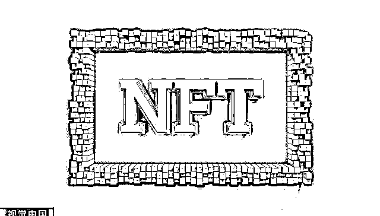
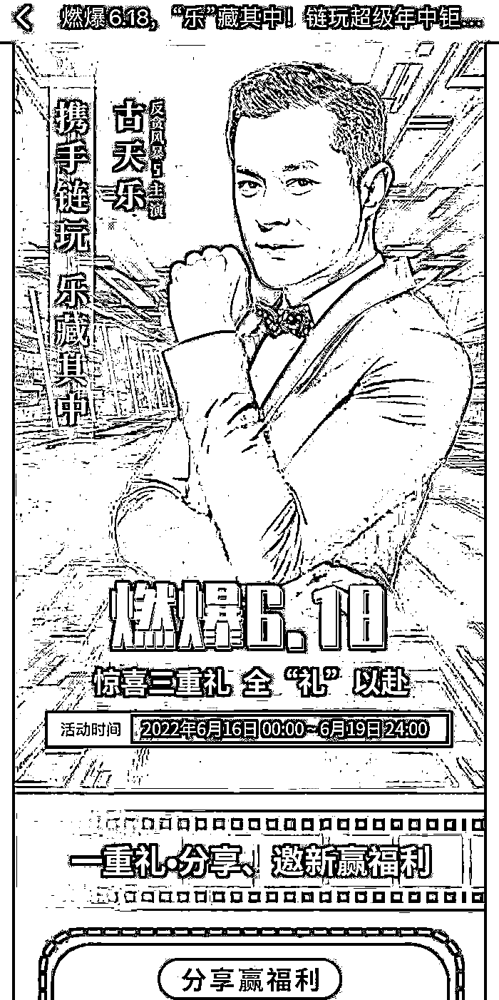
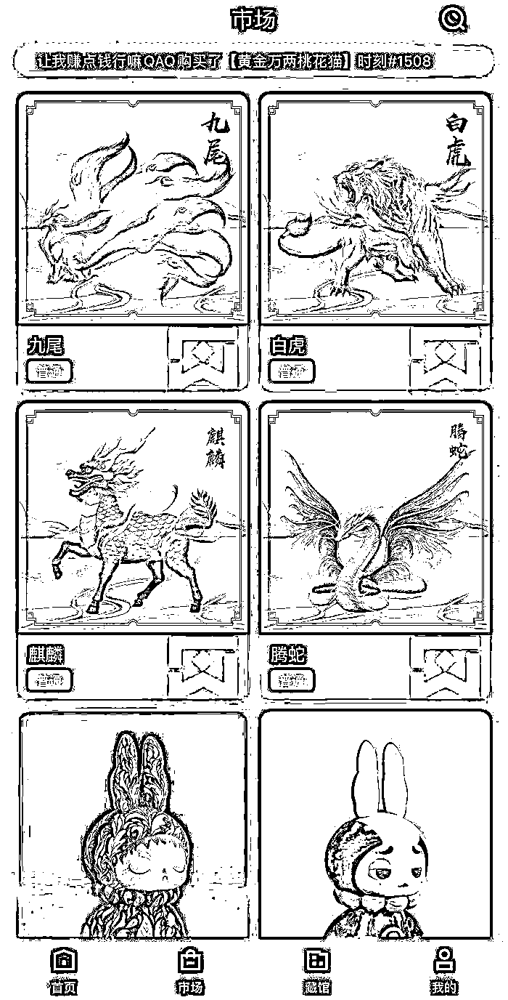
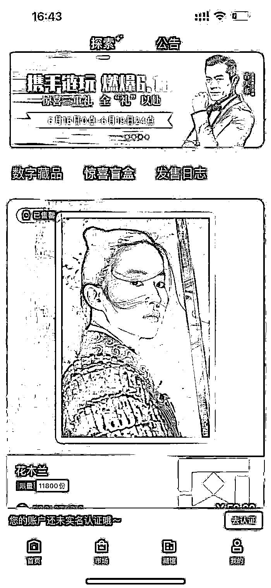

# 数字藏品乱象丛生，链玩 APP 虚假宣传遭古天乐方辟谣

> 原文：[`mp.weixin.qq.com/s?__biz=MzIyMDYwMTk0Mw==&mid=2247538079&idx=4&sn=e298df2d60801202ceb0cb7254cfe193&chksm=97cb9ea7a0bc17b1b1d4f0c6bbe88b61570870b24ab6e91ea97dc1484b875a12cdfab63cc2f0&scene=27#wechat_redirect`](http://mp.weixin.qq.com/s?__biz=MzIyMDYwMTk0Mw==&mid=2247538079&idx=4&sn=e298df2d60801202ceb0cb7254cfe193&chksm=97cb9ea7a0bc17b1b1d4f0c6bbe88b61570870b24ab6e91ea97dc1484b875a12cdfab63cc2f0&scene=27#wechat_redirect)

图片来源：视觉中国

> 记者 ｜ 司林威

6 月 17 日，演员古天乐的微博突然发表了一则声明，对其涉及某数字藏品的消息进行了辟谣。

公告内容称，近日发现网上流传以古天乐不同造型照片加以“反贪风暴 5 主演 古天乐”的描述，推广”链玩数字藏品“活动和一款名为“链玩 APP”的应用程序，并在宣传文中表示“成功牵手影帝”，“与著名影帝的强强联合”和“与著名影帝的合作”等字句，令公众误以为影帝是指古天乐或以为古天乐与链玩业务有任何关联。

古天乐的经纪公司兆盟有限公司在声明中称从末与该 App 合作，亦没有参与任何链玩活动、产品或服务推广，从末授权其使用古天乐肖像或名字。

“任何人士盗用古天乐先生名义或肖像作虚假陈述、误导宣传或诈骗行为，本公司会进行调查和采取法律行动追究责任。”兆盟有限公司在公告中强调。

而事件中的另一主角是一家数字藏品平台，名为“链玩”，该平台自称“链玩 app 是国内领先的数字藏品综合服务平台，为数字藏品、数字艺术品、数字版权等数字资产提供创作、铸造、收藏、交易、经纪等服务。”

自数字藏品概念在国内火爆起来，不断有各种平台跑步入场，企图踩中下一个风口，而链玩是其中一个数字藏品发售方。

界面新闻获悉，6 月 15 日，一个名为“链玩”的微博账号发布了一篇以古天乐形象为头图的推广文章，宣称“链玩与著名影帝的强强联合，是链玩平台的重要布局之一。”

据其自述，链玩平台于 2021 年上线，主要用户都是“Z 世代玩家”。但界面新闻记者发现，作为一个数字藏品发售平台，无法找到其平台官网及官方公众号，连发布信息的微博账号都没有进行官方认证。

而网上流传出的各类推广文章都指向了其大力宣传的“链玩 App”

根据链玩 App 推广链接显示，其自称已经有 20 万+的下载量，界面新闻记者下载了其官方 App，进入 App 首页，就能看到刚上线的古天乐形象的活动推送，活动采取各种文案吸引用户邀请好友注册 App，并辅以“消费满 xxx 元即可参与回购活动”等刺激用户消费的营销方案。

涉嫌利用古天乐形象虚假宣传

而在其 APP 的第二页，就是一个数字藏品二级交易市场，里面各类数字藏品都可以进行二级交易，在页面头部，还滚动播报着交易记录，例如“xxx（账号名称）购买了 xx（藏品编号）藏品。”

链玩 App 的数字藏品二级市场

而根据 4 月 14 日，中国互联网金融协会、中国银行业协会、中国证券业协会共同发布的《关于防范 NFT（非同质化通证）相关金融风险的倡议》第三条的倡议恰恰就是“不为 NFT 交易提供集中交易（集中竞价、电子撮合、匿名交易、做市商等）、持续挂牌交易、标准化合约交易等服务，变相违规设立交易场所。”

除了古天乐，还平台上还有刘亦菲饰演的花木兰形象的数字藏品售卖，价格为 59.9 元人民币，数量 11800 份，显示已经售罄。但目前并不清楚是否获得刘亦菲方及《花木兰》电影版权方迪士尼公司方面的授权。

而在黑猫投诉平台上，与链玩有关的投诉反馈达到了 145 条。

自 5 月开始，就有大量玩家投诉链玩平台出现提现不到账及虚假宣传等现象。而网上流传的一份链玩平台名义的“红头文件”显示，5 月 19 日，该平台发布公告称“支付宝提现额度已经不能完全满足平台需求，建议用户使用银行卡提现。”

据悉，链玩 APP 平台背后的主体公司名为杭州链街科技有限公司。天眼查数据显示，该公司注册与 2018 年，法定代表人经过数次更换，目前的法定代表人为石高涛，注册资本 200 万元，石高涛股权占比为 60%，另一股东周屹昕占比 40%。资料显示，石高涛同时也是浙江天搜科技的实际控制人。

据天眼查显示，5 月 27 日，杭州链街科技有限公司因登记的地址无法联系而被列为企业经营异常名录。

而链玩平台被古天乐公司辟谣的背后是近期已经逐渐泛滥的数字藏品炒作行为，在利益诱惑下，不止链玩 App，许多数字藏品平台都深陷争议之中，而涉嫌包括虚假宣传、天价炒作、甚至非法集资等违法行为的乱象也逐渐一一出现。

长期关注数字藏品领域的分布科技 CEO 达鸿飞表示：“数藏行业入局门槛低，从业者素养参差不齐，行业自律、监管法规未及时跟上，行业与监管机构的沟通仍需加强。如果数字藏品的从业者能形成行业自律标准，与监管保持沟通，同时监管机构出台相应法律法规，及时查处违法行为，这些问题都会逐步得到解决，大众对于数字藏品的理解也将进一步加强。”

来源：界面新闻

](https://mp.weixin.qq.com/s?__biz=Mzg5ODAwNzA5Ng==&mid=2247487973&idx=1&sn=1b62da6f2018402862a5c375e10c355e&chksm=c06878b2f71ff1a4fbe7df4dec626aa7e696154751693bf16f6c6a302ceaa4d1959040c70518&scene=21#wechat_redirect)

← 向右滑动与灰产圈互动交流 →

