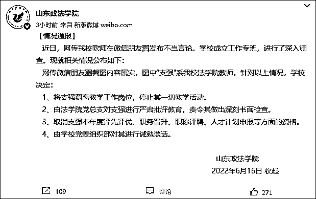
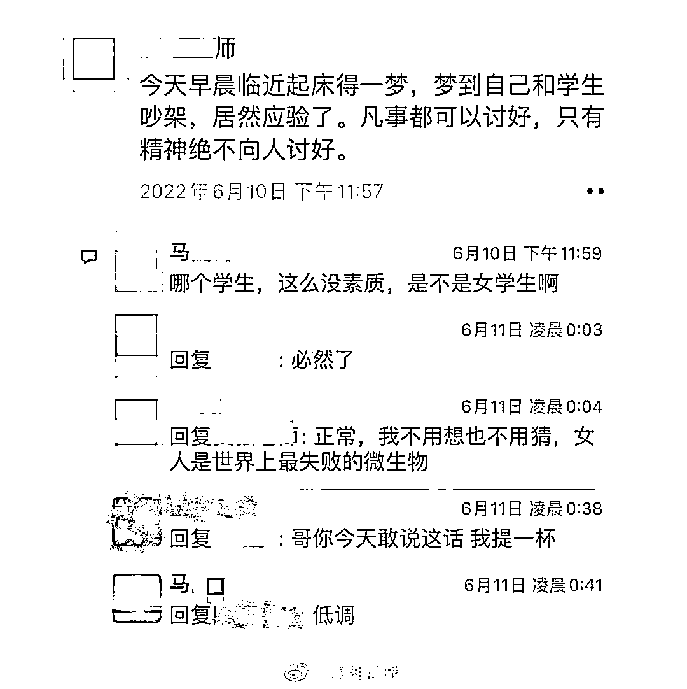
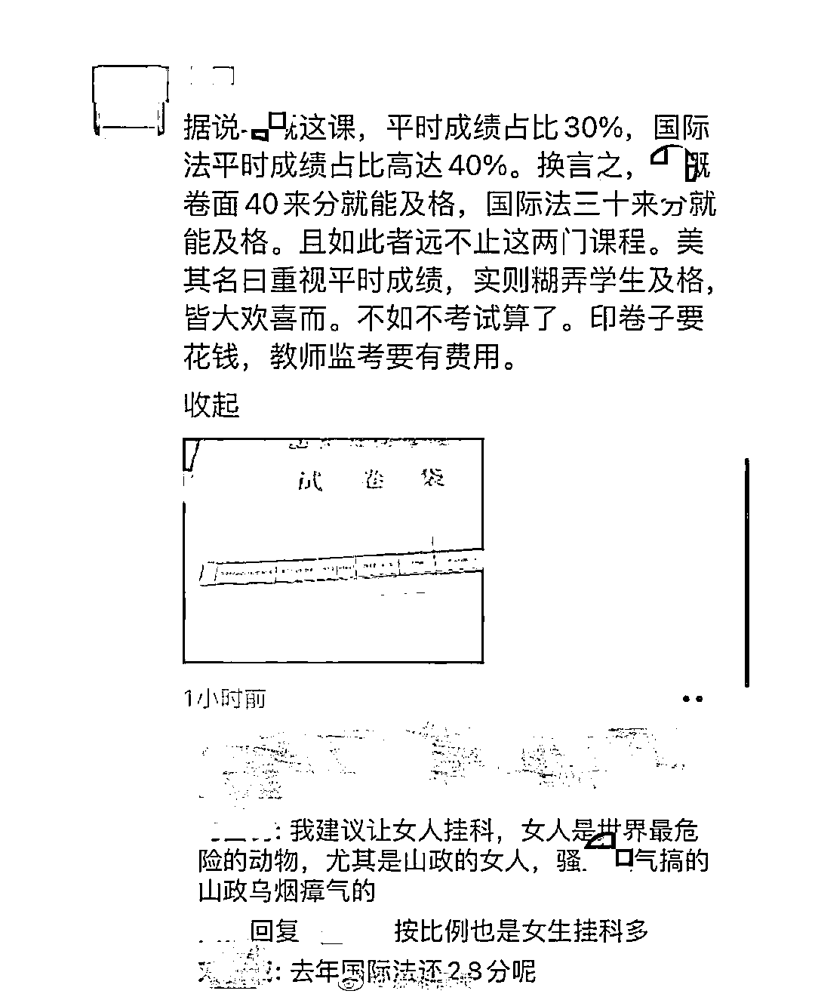
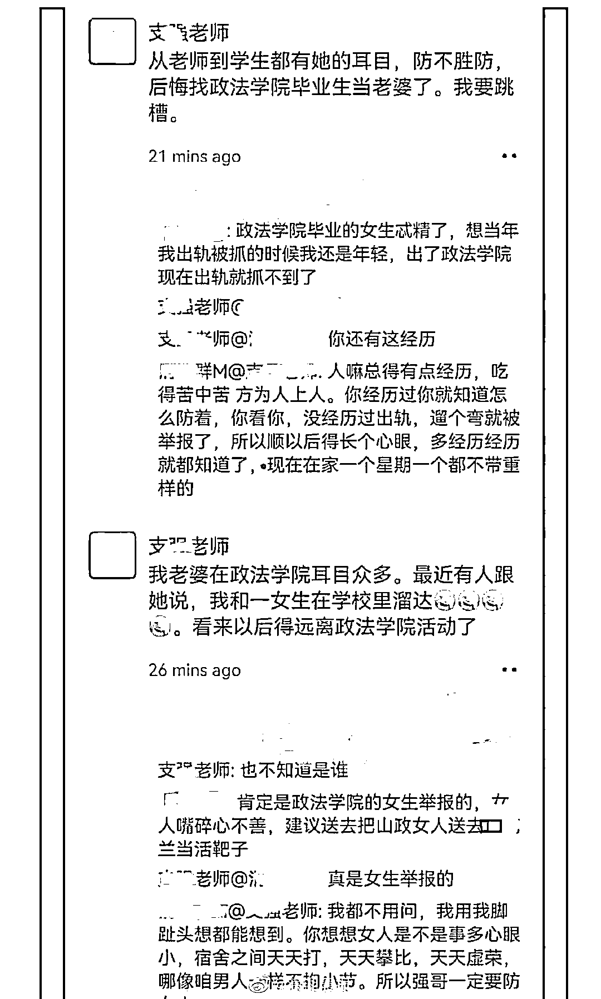
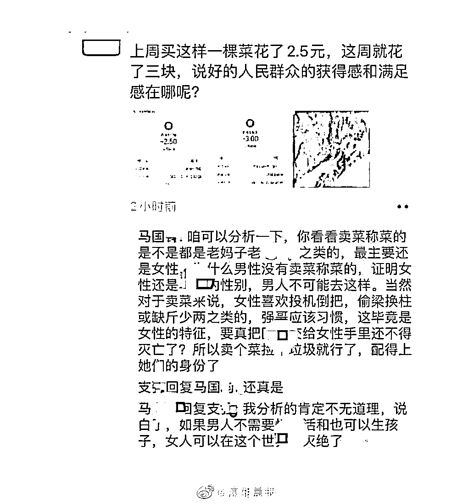

# 教师发表侮辱女性言论，山东政法学院回应

> 原文：[`mp.weixin.qq.com/s?__biz=MzIyMDYwMTk0Mw==&mid=2247538079&idx=5&sn=64b8280f1003a78a7c3ca298ea887a1d&chksm=97cb9ea7a0bc17b12c2d502d68af68b523c5f02db0ab5f3dfbd507cfe6af7fa393b0084e86a2&scene=27#wechat_redirect`](http://mp.weixin.qq.com/s?__biz=MzIyMDYwMTk0Mw==&mid=2247538079&idx=5&sn=64b8280f1003a78a7c3ca298ea887a1d&chksm=97cb9ea7a0bc17b12c2d502d68af68b523c5f02db0ab5f3dfbd507cfe6af7fa393b0084e86a2&scene=27#wechat_redirect)

6 月 16 日，@山东政法学院 发布情况通报：

近日，网传我校教师在微信朋友圈发布不当言论。学校成立工作专班，进行了深入调查。现就相关情况公布如下：

网传微信朋友圈截图内容属实，图中“支强”系我校法学院教师。针对以上情况，学校决定：

1、将支强调离教学工作岗位，停止其一切教学活动。

2、由法学院党总支对支强进行严肃批评教育，责令其做出深刻书面检查。

3、取消支强本年度评先评优、职务晋升、职称评聘、人才计划申报等方面的资格。

4、由学校党委组织部对其进行诫勉谈话。

另据@潇湘晨报 消息，今日早些时候，山东政法学院一教师与一名马姓男子被曝在朋友圈对话时发表侮辱女性等言论。

来源：观察者网综合

](https://mp.weixin.qq.com/s?__biz=Mzg5ODAwNzA5Ng==&mid=2247487973&idx=1&sn=1b62da6f2018402862a5c375e10c355e&chksm=c06878b2f71ff1a4fbe7df4dec626aa7e696154751693bf16f6c6a302ceaa4d1959040c70518&scene=21#wechat_redirect)

← 向右滑动与灰产圈互动交流 →

