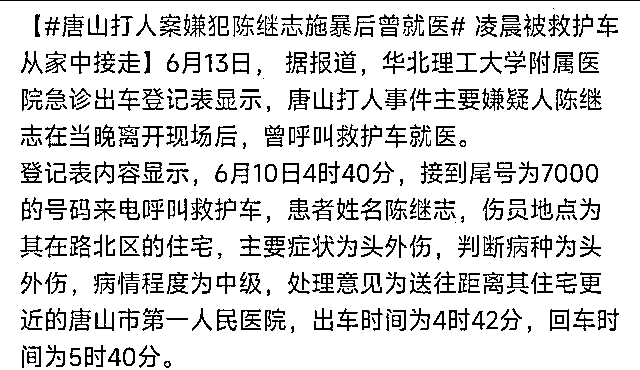
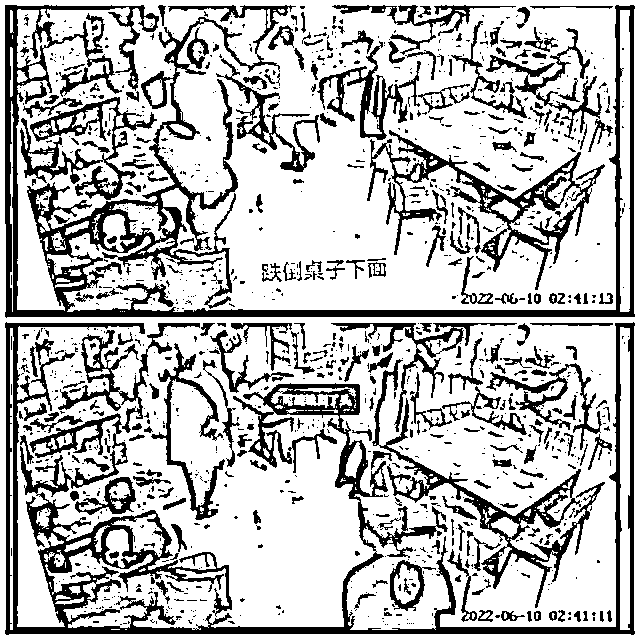
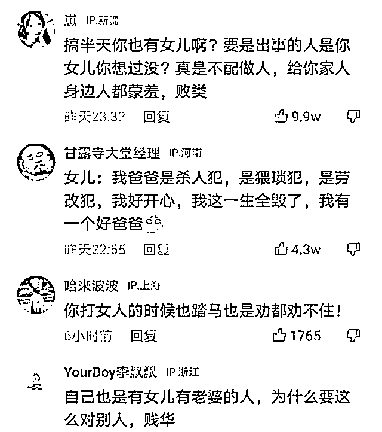
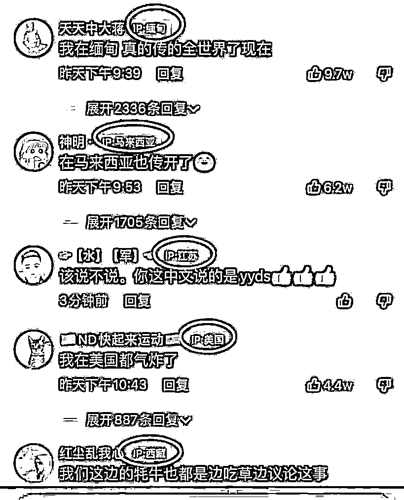
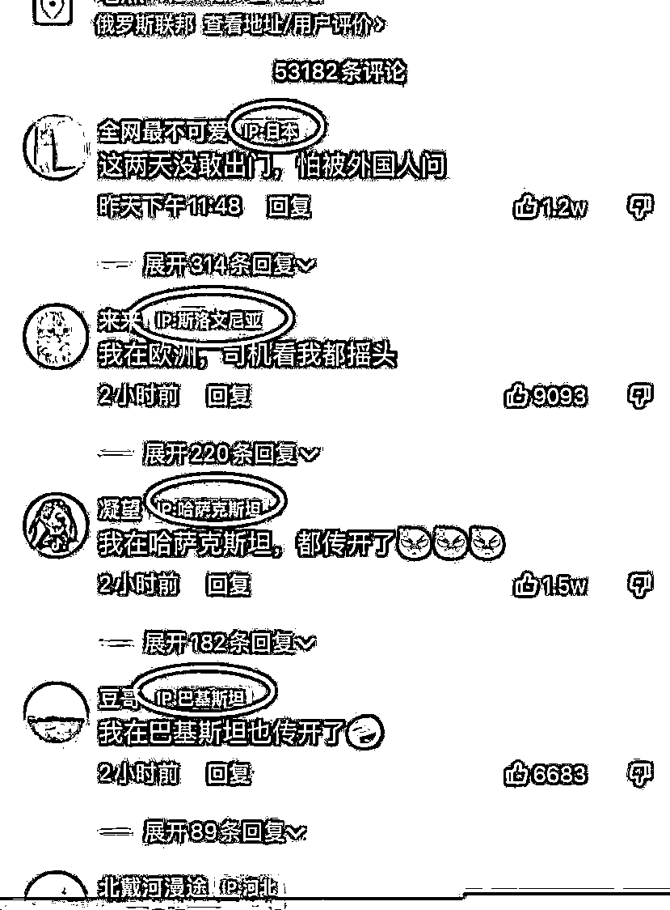
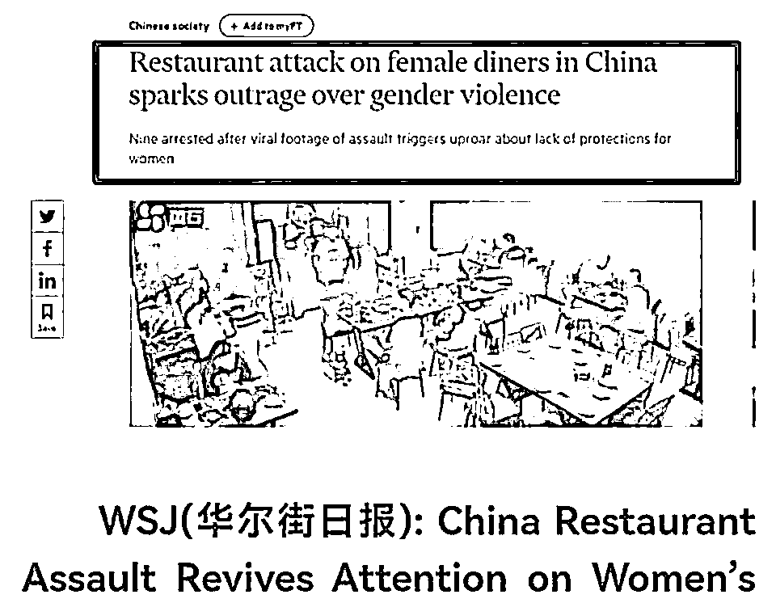
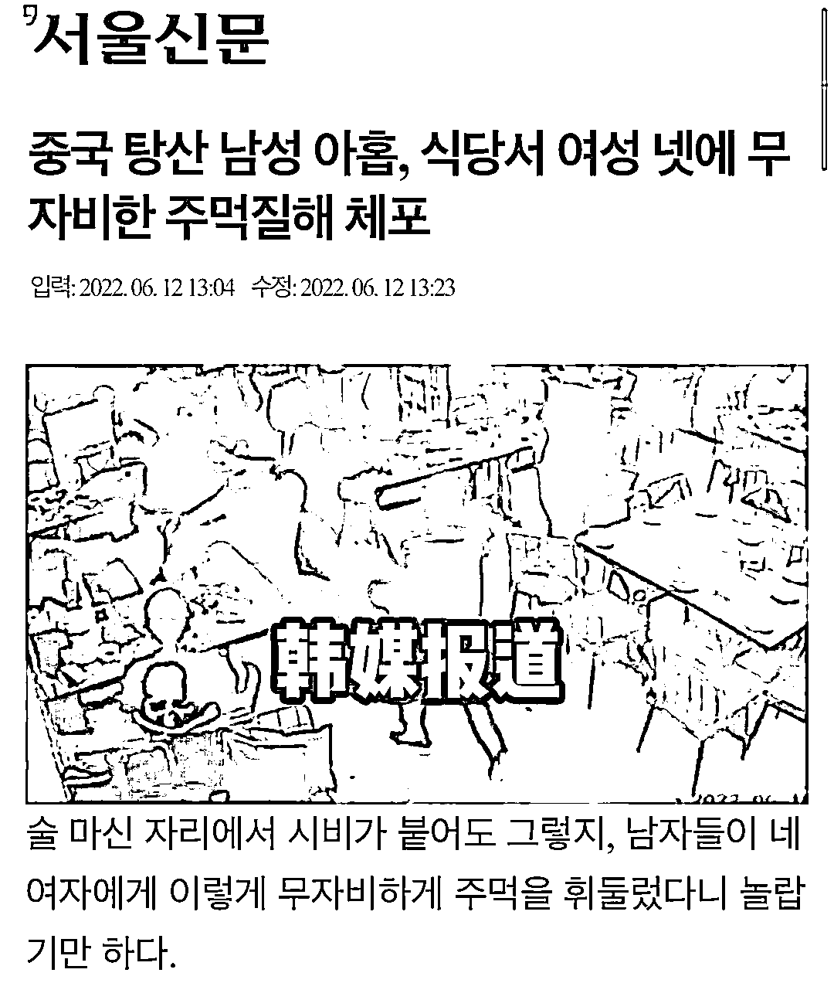
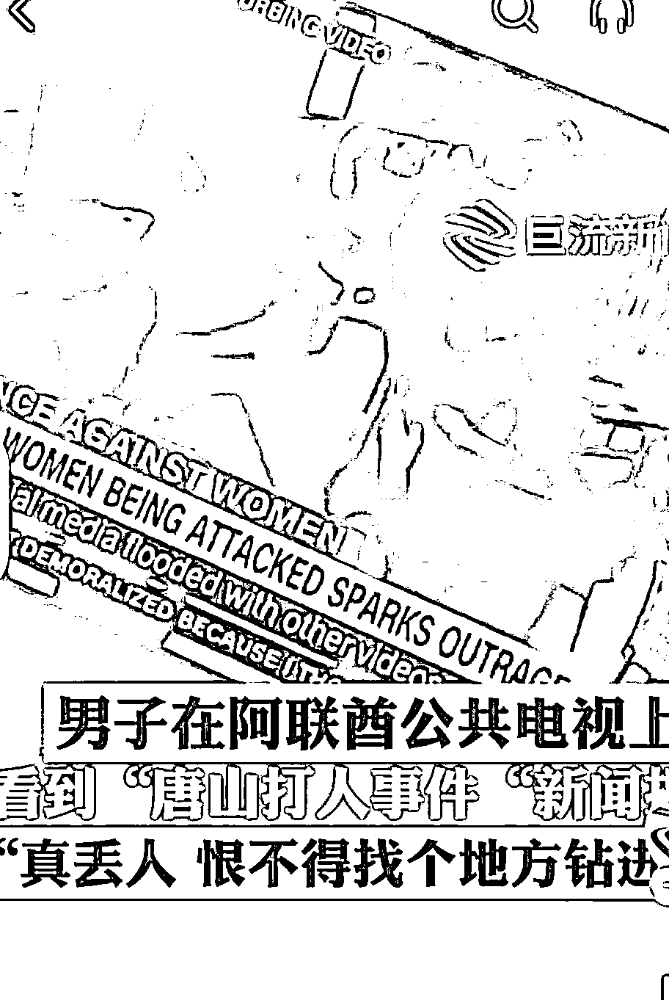

# 唐山打人者被诊断为中级头外伤，女儿被网暴不敢上学，网友：现世报！

> 原文：[`mp.weixin.qq.com/s?__biz=MzIyMDYwMTk0Mw==&mid=2247538148&idx=1&sn=ba351a33a73243aca29a961b01906480&chksm=97cb9edca0bc17ca2453c22f53402882ec6523e27dc35c7df91a99a83fb1f6ba20dc83f8c292&scene=27#wechat_redirect`](http://mp.weixin.qq.com/s?__biz=MzIyMDYwMTk0Mw==&mid=2247538148&idx=1&sn=ba351a33a73243aca29a961b01906480&chksm=97cb9edca0bc17ca2453c22f53402882ec6523e27dc35c7df91a99a83fb1f6ba20dc83f8c292&scene=27#wechat_redirect)

“唐山烧烤店打人事件”发生后，引起了轩然大波，几乎所有人都站了出来，一起声讨打人的男子。 

随着事件的发酵，有很多打人者在事后的踪迹也被媒体曝光，特别是对于下手特别狠重的那几名男子，更是成为了网友和媒体紧追不放的焦点。

**而事件的挑起者兼嫌疑犯陈某志，打完人回到家，休息近 2 小时后，竟被救护车拉走了，难道他也受伤了吗？还是另有目的？**

**据悉，6 月 13 日，华北理工大学附属医院的 120 出车登记表上显示，案件的首要嫌犯陈某志于 6 月 10 日清晨由 120 救护车带走。**

****

**让人难以置信的是，经过唐山市第一人民医院给出的诊断结果来看，**他的头部有外伤，病情竟为中级程度。****

****脑外伤可大可小，轻则睡一觉就好了，重了就真的不好说了，可是他这么严重的伤是怎么来的？他的头到底严不严重？****

****从他打人的视频中，丝毫看不出有严重脑伤的痕迹。整个过程中，可以看到混乱打人的过程中，脚下一滑无意中摔倒，但起来后也没有用手捂头的痕迹，甚至摇头的动作也没有。****

****这摔一下，就成中级脑外伤了？****

****重放一遍又一遍视频，才发现他疑似受伤的猫腻。****

****视频中可以发现，他头部受伤有三种可能：****

****第一，白衣女孩被打时的反击，她疑似拿了酒瓶。但视频中可以看到，女孩个头够不着陈某志的头部，即使是酒瓶脱手，也不至于出血致中级头外伤。****

****第二，黑衣女孩也用酒瓶击打了陈某志的头部，但在被打后顺手推开女孩之余，也没看到用手摸后脑勺的动作。****

****第三，在猛烈拖拽白衣女子时，脚下一滑摔倒了。****

****但视频中可以看到，摔倒时侧身倒地并没有摔到头，然后当他想起身时地面湿滑再一次倒下。****

****隐约可以看到，在桌子底下隐约像被碰了一下，但在那么低的位置，会摔得很重？以上种种可能致陈某志受伤的情况，我们还可以得知他当时应该没有出血，不然不可能整个过程中没有摸头的动作。****

********

****既然受伤了，就应该立即去医院吧？为何要到 4 点 40 分才打电话给 120？中间间隔了接近 2 个小时，要是真的受伤严重，这个时间可是会要命的。****

****还有一点值得怀疑的，是来自陈某志老婆的说法：****

******“他回家后没说打人的事，被抓走时我也不知道怎么了。”******

******众所周知，救护车救人时是会拉警报的，即使真的没拉警报，就这样到家里接走陈某志，他老婆居然说不知情，这听起来完全不符合逻辑。******

******不仅是这样，他老婆后来还表示：自己的丈夫是个好人，这些事情与他无关。******

******果真，不是一家人，不入一家门！******

******陈某志被判断为伤情中级，很多网友都表示无法接受。的确，这样的诊断结果太荒唐，甚至有网友怀疑，陈某志是不是在打人后得到了“高人”的指点，希望用中级的伤情减轻自己的罪过？******

******像这种情况，他会不会反咬一口，让被打女子为其医药费买单？又会不会真的可以减轻对他的判决？******

******但陈某志真的觉得自己有罪吗？想必不会吧！头部都伤成中级了，还能把人家女孩打成那样，还打了这么久。******

******有网友猜测：估计是他回家后担心事情比较严重，立即找关系给自己也做了一个伤情鉴定，如果两方都受伤，定性为互殴，会让双方先各医各的，医好后再处理。而现在陈某志受伤程度为中级，那么他也许就会少赔或者不赔女孩的医药费。******

********事件已经过去 6 天，影响量刑的至关重要的伤情鉴定结果却没有第一时间进行官方的公布。********

********伤情鉴定大致可以分为两个阶段：********

********第一阶段，是事发后就可以立刻对伤者的原发性损伤以及并发症进行伤情鉴定了，比如面部受伤情况如何，伤口长短大小如何，牙齿脱落了几颗等等，不然再多过一些日子，我想都够整个容了。********

********第二阶段，是对于伤者容貌毁损和组织器官功能障碍方面的伤情，可以在损伤之日起 90 天后进行伤情鉴定。网友也强烈呼吁要异地权威部门来介入，总而言之，这个事情已经不是一个地方的事情，也不是几个当事人的事情了。********

********不知道被打女子这边会诊断为几级伤情，如果这种诊断结果真的被人为操纵，打人者成了中级，被打者却成了轻级，那最后的处理结果是不堪设想的......********

********从一开始的报道来看，两名被打女孩进了重症监控室，可想而知当时被打后就已经有了生命危险。********

**********但是，事到如今也只是模糊地说出从 ICU 转到普通病房，没有公布具体情况。**********

********很多人都想知道，体征平稳是不是代表着他们心情平稳，更多人想知道有没有人去慰问过他们，又有没有人去威胁过他们。为了保护隐私不采访当事人我们可以理解，但是为什么连他们的家人也没有出来发声过？********

********或许是怕伤情太严重？会激起更大的民愤吗？但事件的后续处理得不到大众的认可，想必会造成更坏的影响。********

********目前，受害人家属也已发声：“事发后，打人者家属没有一个人，来医院看望我的女儿。”********

********还有网传消息称：陈某志家人已和受害人达成协议，赔偿 60 万让对方谅解。********

********不得不说，主动挑事，把人打成这个样子，不说是不是没有脸面去看伤者，在这样的情况看来，更像是只想拿钱了事，对生命的藐视，对法律的践踏！********

********可能打人者自己也没想到，这次的事情会引发这么高的关注度。********

********不仅仅是这样，他的女儿也因为他的恶劣行为带来了很大的影响！********

**********近日，施暴者的女儿被网暴导致休学，现在已经不敢去学校了。班里的同学刻意疏远和孤立她，老师也戴着有色眼镜来看她。**********

********而网上的风评是这样的：********

****************

********很多网友嘲讽谩骂她，说她是猥琐犯、败类的女儿。这样一来，女孩的前途算是毁了，恐怕以后走到哪里都摆脱不了父亲的标签了，就连正常的人际交往也会受到影响。********

********不得不说，种瓜得瓜种果得果，他的父亲都不管自己的孩子会不会受到影响，要真是会担心自己的孩子，为什么要把别人的孩子毁了？想必做这些事情的时候已经把孩子抛之脑后了吧！********

********被施暴的女孩也是别人家的女儿，有一句话说得好：“犯罪者的家人被鄙视和排挤，本来就是犯罪的成本”。********

********不然，公务员为什么要查三代呢？********

********不仅仅是这样，好事不出门，坏事传千里......**唐山打人事件除了在我国引发了高度关注外，也都传到了国外去**，这是把脸都丢到国外去了。********

************************************************************

******不但在国内迅速发酵，还火速传到国外，可见互联网之神速。******

******有人说，不要过分报道，过度渲染，传到外国，对我们国家在国际上的形象是有损坏的，这是抹黑中国。******

******但是有没有想过，根本不用抹黑，自己人就在给祖国泼脏水了。******

******显然，这一纸中级伤情诊断证明对他也是起不了任何作用的，监控录像清晰地记录了打人的过程，全国网民都看得一清二楚。******

******虽然女孩已经转入病房，身体上的伤可以恢复，但精神上的伤害，可能会伴随她们一辈子。希望能够严惩施暴者，还她们一个公道！这样严重的事件，如果能够蒙混过关，恐怕以后会人人自危，都没人敢上街了。******

******这件事已经严重污染了我们社会纯洁的空气了，哪怕他们长出一对翅膀，也难逃法律的制裁。******

******<mpvideosnap class="js_uneditable custom_select_card channels_iframe videosnap_video_iframe" data-pluginname="videosnap" data-id="export/UzFfAgtgekIEAQAAAAAAGiMzsZlLlQAAAAstQy6ubaLX4KHWvLEZgBPEzaMIElIVC7yDzNPgMIthR49gLF5eREOPUBibJ4FC" data-url="https://findermp.video.qq.com/251/20304/stodownload?encfilekey=rjD5jyTuFrIpZ2ibE8T7YmwgiahniaXswqz4ExzrCjJecCWRTvK2XiaZaSP2VDt3vZ8aibnicJJsicYmI35iaDBsjvMZvmLd8LLgkQAk7ichU1xXicqBmwFJPP00TIaw&amp;adaptivelytrans=0&amp;bizid=1023&amp;dotrans=0&amp;hy=SH&amp;idx=1&amp;m=&amp;scene=0&amp;token=AxricY7RBHdX7dMXQgFuPIgZTmNibLibYrTibkaoXd7wiaU4IgyibRDHiaRwWVH9cfaup696KSamoVb6yM" data-headimgurl="http://wx.qlogo.cn/finderhead/ibq4aVwOt6HNqrr8OD3sCviaytF3B8TqCwHicxsuIanAJo/0" data-username="v2_060000231003b20faec8c6e48a1acbd3ce04ef33b077a1e41d0d3794ed88ea537878dbe65910@finder" data-nickname="灰产圈+" data-desc="唐山网上实名举报已超过 30 起
今天公安局门口反映问题排长队#唐山举报#唐山烧烤#唐山打人@灰产圈+ " data-nonceid="7815319710197258165" data-type="video" data-width="1080" data-height="1920"></mpvideosnap>******

********资料来源********

********[1]唐山打人事件陈继志曾深夜就医，伤情为诊断为中级，网友：太荒唐 . 热门社会趣闻录********

********[2]现世报——唐山打人者被诊断为中级头外伤，女儿被网暴不敢上学  . 娱来神********

********来源：医学之声，实测********

************************](https://mp.weixin.qq.com/s?__biz=Mzg5ODAwNzA5Ng==&mid=2247487973&idx=1&sn=1b62da6f2018402862a5c375e10c355e&chksm=c06878b2f71ff1a4fbe7df4dec626aa7e696154751693bf16f6c6a302ceaa4d1959040c70518&scene=21#wechat_redirect)********

********← 向右滑动与灰产圈互动交流 →********

****************