# 唐山被打女子，到底死了没有？

> 原文：[`mp.weixin.qq.com/s?__biz=MzIyMDYwMTk0Mw==&mid=2247538148&idx=2&sn=2f911f03cbd1f1f186e074631829b4e5&chksm=97cb9edca0bc17cac71a07276a7c4adec3f413ba8c775a9bd6e760f730d40b1602bc6773295c&scene=27#wechat_redirect`](http://mp.weixin.qq.com/s?__biz=MzIyMDYwMTk0Mw==&mid=2247538148&idx=2&sn=2f911f03cbd1f1f186e074631829b4e5&chksm=97cb9edca0bc17cac71a07276a7c4adec3f413ba8c775a9bd6e760f730d40b1602bc6773295c&scene=27#wechat_redirect)

**壹** 

唐山烧烤摊打人事件已经过去了 8 天了！

外界普遍关心，那几个被殴打的女生现在究竟是个什么样的情况？！

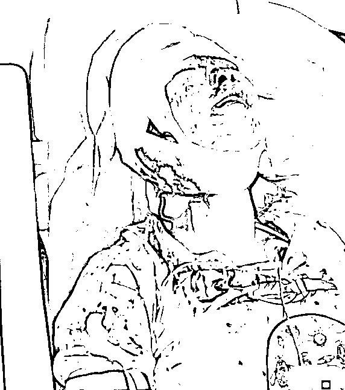

**但真相就好像被谁放进了铁桶里一样。**

目前我们居然没有听到被打女生发出来的只言片语。

是不便说话？还是不能说话？

在真相缺位的时候，谣言就会满天飞！

甚至网上有人放出来一段女生被拖进巷子里的“神秘”视频，说女生被汽车碾压，已经身亡！

一时间群情激奋，众人呼吁公布真相！

但 8 天来，真相却像小女孩儿一样，任人打扮！

他们说，生命特征平稳； 

他们说，已经从 ICU 转到了普通病房；

他们说，目前患者的住院情况，属于患者个人隐私，不方便向外界透露；

现在，他们又说：

> “这个（被打女子去世）‘应该’肯定是没有。”

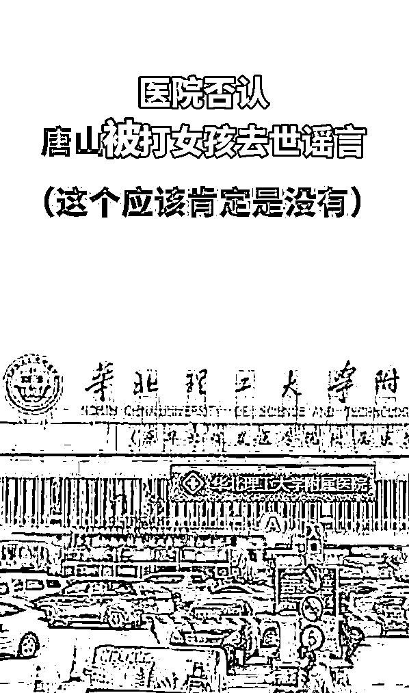

有就是有，没有就是没有，什么叫“应该肯定没有”？

**什么时候，众目睽睽之下，弄清一个人的生死，都已经这么难了吗？**

**贰**

**唐山这事儿，绝对不能是一个普通的“打人”事件。**

行凶打人的人渣，那种熟练和凶狠，绝不是一个初犯能做出来的。 

他们越是残暴，越是嚣张狂妄，只能证明他们所仪仗的势力越是强大。

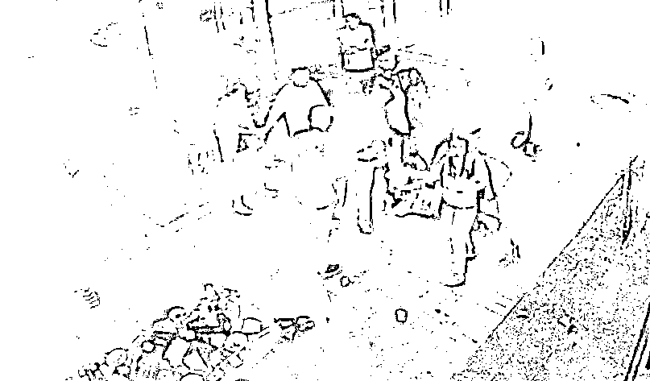

随着网友接力对相关人渣的深挖，他们炸弹号的车牌，好几百万的迈巴赫，各自名下大大小小的资产。 

甚至这些人居然能“背负累累案件”，多年来在唐山做一个“逍遥又自在”的“逃犯”！

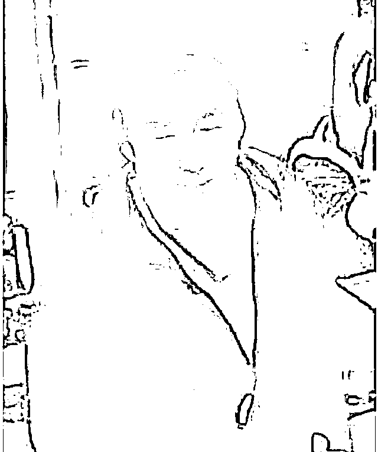

这些被挖出来的信息，无一不暗示着人们： 

**这些人的罪，绝不是表面上看起来那么简单！**

而案发至今，一个并不疑难复杂的案件，不但几乎没有听到受害一方的陈言。却屡屡看到行凶者到医院被鉴定为“外伤中度”；

行凶者妻子怒怼网友“一无所知”；

行凶者哥哥扬言要“50 万和解！不行就 100 万！”

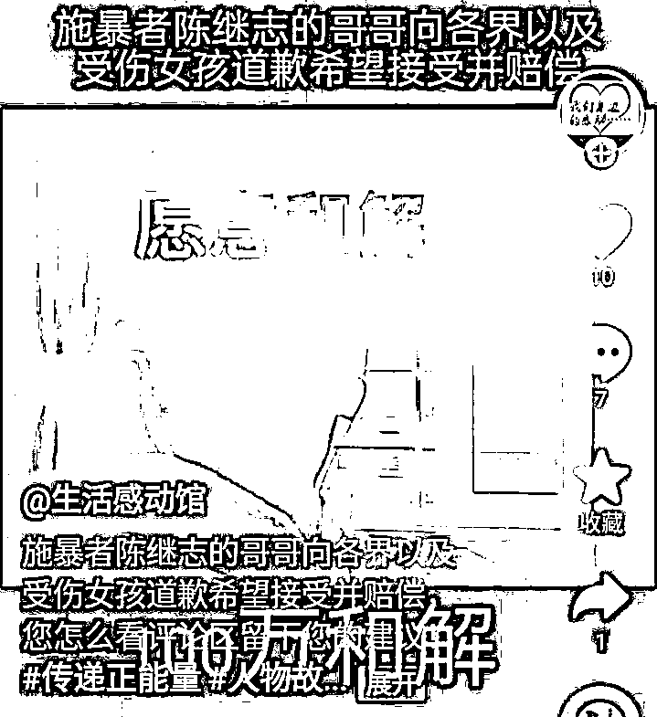

…… 

**这正常吗？**

不正常的还有。 

唐山烧烤店打人”事件持续引发关注之后，各家媒体纷纷派出“精兵强将“奔赴唐山采访调查。

但匪夷所思的是，在这么敏感的时候，网传中央电视台的采访车在唐山街头居然被砸了；

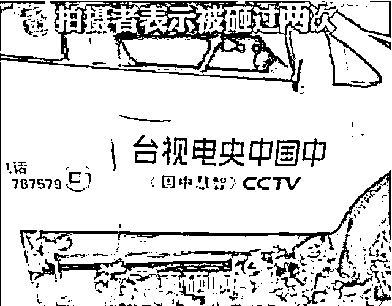

而同为媒体从业者的贵州某电视台记者，也在网上实名控诉，在他去唐山采访“烧烤摊打人事件”时，遭到无端扣押和暴力执法！

**发生了什么？**

**又是为什么？**

然而，可怕的是这些还并不是问题的全部！

在唐山，令人惊愕的事情犹如深海暗流，一波接着一波！ 

就这两天，网传唐山又开始拦截到唐山的外地人了。

方法和理由都很粗暴简单！

有媒体爆料：

> 6 月 15 日，唐山站规定，当地返唐人员与外地来唐人员，都要向所在社区报备登记。
> 
> 来唐人员被统一安排车辆进行转运，上车前需人车合影，到达后司机也要进行拍照，不拍不能离站，出租车正常打表，车上所有乘客平摊车费。

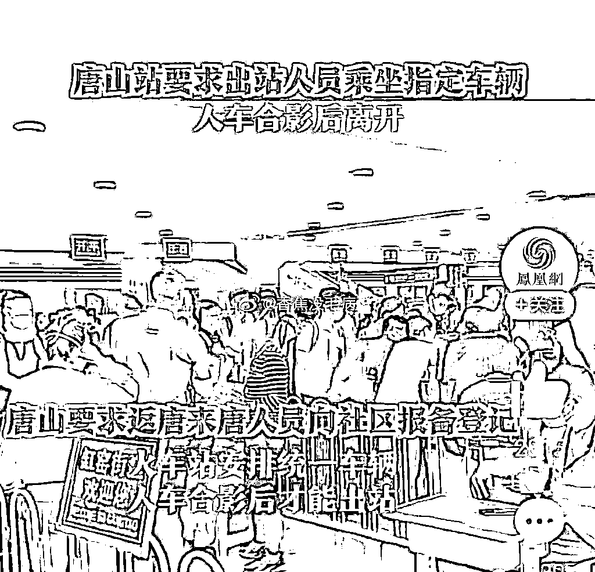

相关方面对此给出的解释是：

> 这是唐山市疫情管控严格所采取的防疫措施，并称“如果不是当地人，又不住酒店，可能只有打道回府。”

暂且不说疫情防控禁止“各地层层加码”，就说这么敏感时期这么做，难道不担心社会舆论“瓜田李下”的猜疑吗？

已经有网友忍不住猜测，此举难道是在严防严控调查人员进入唐山？

**但我更愿意希望，唐山这么努力，是在防止黑恶势力外逃，是在准备围剿各色蛇鼠罪犯！**

**毕竟，唐山公安局举报大厅里，现在依旧人满为患！**

**叁**

唐山公安局里，那么多的的群众，送去了那么多的举报材料，真希望最后能够挖出一些保护伞！ 

如果没有保护伞，那些“乍富小人”不至于敢如此嚣张残忍！

如果没有保护伞，那些“负罪之人”决不能光天化日之下在唐山逍遥这么多年。

这不仅辱没了唐山“全国文明城市”的名头儿！也践踏了唐山办案机关的尊严！

如果没有保护伞，十年、二十年来，那些拿着身份证实名举报的白发老者，不会至今都没得到一个心安的答案！

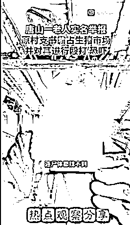

“唐山打人案”之后，我时常会想起 1996 年，时任山西省省委书记胡富国在“打黑除恶”会议上的一段讲话： 

*像这一伙儿人！*

*你不拿起我们这个硬硬的拳头，用这个拳头把他们干掉！*

*老百姓们能平安吗？同志！*

*老百姓能好活吗？！*

*老百姓把权给了你们，叫你们做主呢！*

*老百姓不心凉了吗？！*

*……*

*政法战线的同志们，你们辛苦点！劳累点！*

*和老百姓的感情再深点！*

*党给你的这个权力！*

*你把你这个武器抓得紧一点！硬一点！*

*打坏人的时候狠一点！再给他痛一点！*

*老百姓忘记不了你！*

[`mp.weixin.qq.com/mp/readtemplate?t=pages/video_player_tmpl&action=mpvideo&auto=0&vid=wxv_2448396714081632260`](https://mp.weixin.qq.com/mp/readtemplate?t=pages/video_player_tmpl&action=mpvideo&auto=0&vid=wxv_2448396714081632260)

言犹在耳！振聋发聩！ 

却心有戚然！ 

**肆**

已经 8 天了！ 

**或许，正义总是需要耐心等待才能张开羽翼，拥抱人间！**

那我们就等待，等待正义之光普照在大地之上！ 

**或许，这个世界，黑暗总是与光明共存！**

那我们就学着在光明中，去发现灰尘；在黑暗中，学着去寻找晨光。

因为，在这个并不是处处都光明的世界里，我们心中得总有那么一束光： 

**哪怕时暗时亮！但终究不能熄灭！**

**因为那是希望！那是信仰！**

只要唐山还有希望！只要有些人还有信仰！

我就坚信那句响亮的台词，终会在唐山某个办公室里响起：

***“他们背后有人！我背后还有国家呢！”*** 

***“你怕什么！”***

***“明天开始立案侦查！”*** 

***“我不管你们用什么手段！”***

***“我不管背后是谁！”***

***“通通给我揪出来！”***

***“统统的！”*** 

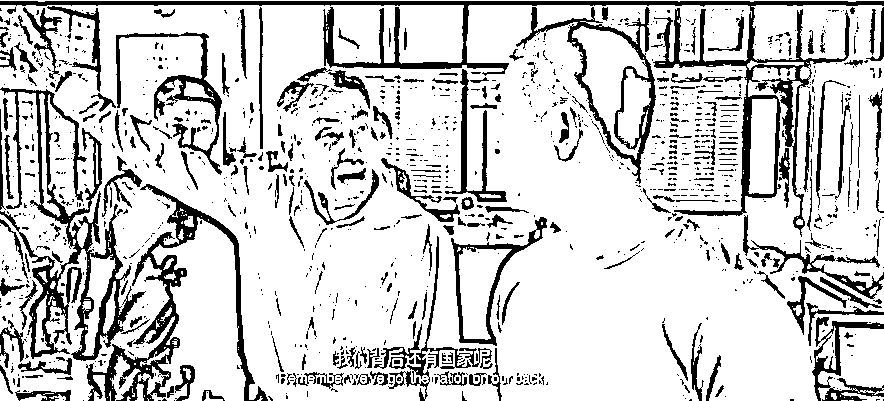

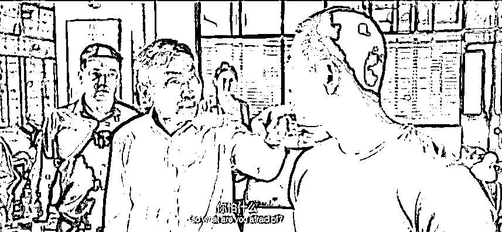

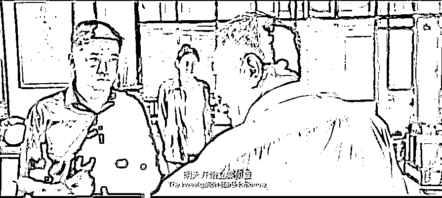

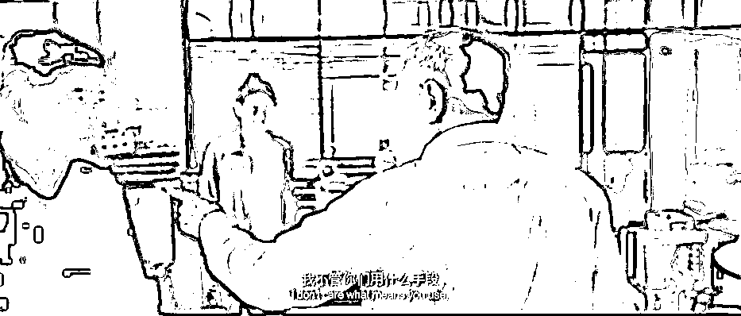

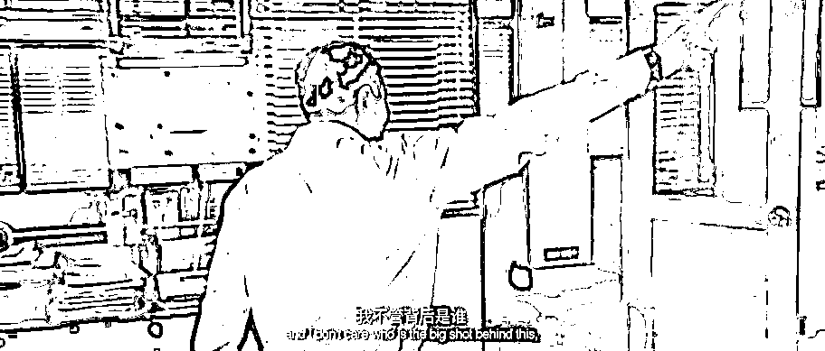

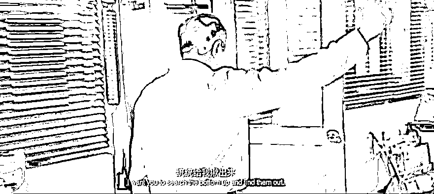

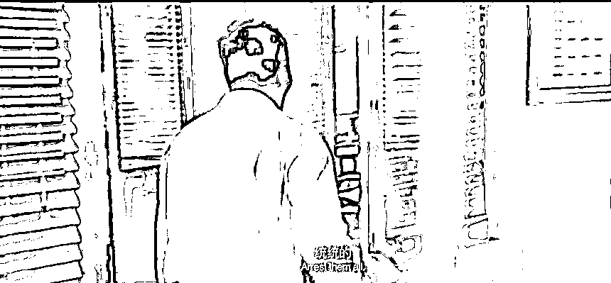

**唐山，应不缺这束光！**

<mpvideosnap class="js_uneditable custom_select_card channels_iframe videosnap_video_iframe" data-pluginname="videosnap" data-id="export/UzFfAgtgekIEAQAAAAAAFXIQVoD5RQAAAAstQy6ubaLX4KHWvLEZgBPE8qMgcmw4CLyDzNPgMIvC9bpgh6Pxzt_sRjTNQyEC" data-url="https://findermp.video.qq.com/251/20304/stodownload?encfilekey=rjD5jyTuFrIpZ2ibE8T7YmwgiahniaXswqzXdJ8yyxkic3liapvT19yWCR2LwOicR8180XU4yps9ySZaDSv1KOtV9xBkhHibIQKtnHg1u2O8eribTKF325OicHicMia2w&amp;adaptivelytrans=0&amp;bizid=1023&amp;dotrans=0&amp;hy=SH&amp;idx=1&amp;m=&amp;scene=0&amp;token=AxricY7RBHdX7dMXQgFuPIjhX7FGOGPKkWkjBOhtQ1iaxYlNlhxLwocicEiceV5E35zflnJm3Lbz6tA" data-headimgurl="http://wx.qlogo.cn/finderhead/ibq4aVwOt6HNqrr8OD3sCviaytF3B8TqCwHicxsuIanAJo/0" data-username="v2_060000231003b20faec8c6e48a1acbd3ce04ef33b077a1e41d0d3794ed88ea537878dbe65910@finder" data-nickname="灰产圈+" data-desc="【#第一现场##唐山公安局门口近百人排队等待#反映问题】6 月 12 日起，唐山市集中开展夏季社会治安整治“雷霆风暴”专项行动，要重点整治打架斗殴、寻衅滋事、故意伤害、侮辱妇女等违法犯罪行为，敲诈勒索、欺行霸市、强揽工程、强迫交易等违法犯罪行为，聚众赌博、组织容留卖淫、吸毒贩毒、盗窃、抢劫、诈骗、网络犯罪等违法犯罪行为，对违法犯罪进行包庇纵容、失职失责的违纪违法行为。
6 月 14 日下午 2 点，天目新闻记者来到唐山市公安局门口，看到有近百人在等待反映问题。
现场，有些市民坐在唐山市公安局的门牌下，有的人坐在马路台阶上，也有不少警察在维持秩序。
市民贾先生告诉天目新闻记者，自己是上午 10 点不到就来排队了，一直排到现在都没有轮上，“里面的接待室就那么大，站不下那么多人，如果今天下班排不到，就得明天早上重新过来排队。”" data-nonceid="4766787807457253366" data-type="video" data-width="1080" data-height="1920"></mpvideosnap>

来源： 新洞察 作者：猫二侠

](https://mp.weixin.qq.com/s?__biz=Mzg5ODAwNzA5Ng==&mid=2247487973&idx=1&sn=1b62da6f2018402862a5c375e10c355e&chksm=c06878b2f71ff1a4fbe7df4dec626aa7e696154751693bf16f6c6a302ceaa4d1959040c70518&scene=21#wechat_redirect)

← 向右滑动与灰产圈互动交流 →

