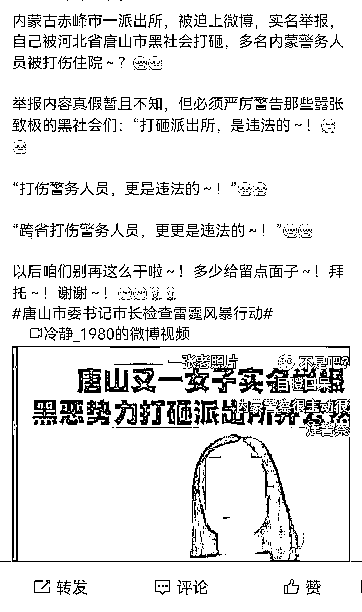

# 11 年前，内蒙古派出所被一伙唐山人打砸？属实！

> 原文：[`mp.weixin.qq.com/s?__biz=MzIyMDYwMTk0Mw==&mid=2247538148&idx=4&sn=d5b1891a7c30a6c31273f7fc96d00c23&chksm=97cb9edca0bc17cac9502a5472f096d62cd2750972cfd358ee443ea9a670e93559a6f2327623&scene=27#wechat_redirect`](http://mp.weixin.qq.com/s?__biz=MzIyMDYwMTk0Mw==&mid=2247538148&idx=4&sn=d5b1891a7c30a6c31273f7fc96d00c23&chksm=97cb9edca0bc17cac9502a5472f096d62cd2750972cfd358ee443ea9a670e93559a6f2327623&scene=27#wechat_redirect)

6 月 15 日，网络上一段视频广泛传播。内容显示，一名女子手持身份证，举报唐山某钢铁集团有限责任公司董事长冯某某等人，于 2011 年带人打砸内蒙古赤峰市宁城县大明镇派出所，导致该派出所办公用品损毁，3 名警务人员受伤。

<mpvideosnap class="js_uneditable custom_select_card channels_iframe videosnap_video_iframe" data-pluginname="videosnap" data-id="export/UzFfAgtgekIEAQAAAAAAZQsxtLPIqgAAAAstQy6ubaLX4KHWvLEZgBPEw6MoeT9EMbiDzNPgMIv4cqDRfwFMu_kfDpUBglPW" data-url="https://findermp.video.qq.com/251/20304/stodownload?encfilekey=rjD5jyTuFrIpZ2ibE8T7YmwgiahniaXswqzXCp1QReXldaBwPZbgciaPCFtXfh5Pjwql6v4LMsxfquI6dibYrZ6ek00zOjbZmcSsL3U02e629awNn5hsrh56m8w&amp;adaptivelytrans=0&amp;bizid=1023&amp;dotrans=0&amp;hy=SH&amp;idx=1&amp;m=&amp;scene=0&amp;token=x5Y29zUxcibCJa9RaKPZOgW583qDRCNTOhSVdB9fRIUW8oQUPdSdFkaefuZvdd6jeXicS8PwBBBJ8" data-headimgurl="http://wx.qlogo.cn/finderhead/ibq4aVwOt6HNqrr8OD3sCviaytF3B8TqCwHicxsuIanAJo/0" data-username="v2_060000231003b20faec8c6e48a1acbd3ce04ef33b077a1e41d0d3794ed88ea537878dbe65910@finder" data-nickname="灰产圈+" data-desc="【女子举报“内蒙古赤峰一派出所被唐山人打砸”，警方回应：不存在此事，正调查网传信息】6 月 15 日，网络上出现一段视频，内容显示，一名女子手持身份证，举报唐山某钢铁集团董事长带人，于 2011 年打砸赤峰市宁城县某派出所，导致办公用品损毁，3 名民警受伤。举报信息引发广泛关注。（原文链接 O 内蒙古赤峰警方回应女子举报“派出所被打砸”：不存在此事，正调查网传信息）

6 月 16 日、17 日，记者连续两天，多次联系赤峰市、唐山市多个相关部门核实。宁城县警方明确表示，“不存在打砸这个事，正在调查网传信息。”
在举报视频中，自称董某的女子称，唐山市丰南区某钢铁公司董事长，在 2011 年 10 月 24 日，打砸赤峰市霓虹县某镇派出所。
录音中，有疑似民警的人回应她称，会将举报中涉及该钢铁公司的情况移交唐山市公安局。
公开资料显示，举报信息中提及的“霓虹县某镇派出所”，在赤峰市行政区划中并不存在。该市行政辖区内只有宁城县和林西县两个县。
有网友在视频下评论分析，视频字幕是软件自动生成、自动匹配的文字，出现了选字错误。
记者发现，该举报信息在不同社交平台上有两个版本被传播，内容相同但字幕略有区别。
6 月 16 日，大明镇政府工作人员告诉封面新闻记者，事件已由宁城县公安局介入调查，具体情况可联系宁城县公安局或县委宣传部。
17 日上午 11 点，宁城县公安局接警中心工作人员回复称，“领导早知道这个（网上举报的）事，正在调查。但我可以告诉你，这个事不存在。”
当日下午，宁城县公安局工作人员再次联系记者，核实举报信息内容及传播平台，再次表示“不存在打砸的事，派出所还好好的在那。目前上级正在调查举报的相关情况”。
此外，公开平台显示，“被举报”涉及的钢铁公司，曾超过 92 次成为失信被执行人、被限制高消费。2020 年曾被合作方起诉申请破产，但法院认定，钢铁公司出具的第三方评估显示公司资产超过负债，未受理这一申请。@灰产圈+ " data-nonceid="12623424398878761476" data-type="video" data-width="1080" data-height="2384"></mpvideosnap>

6 月 17 日，宁城县公安局工作人员曾表示，举报不属实，警方已在调查网传信息。

**6 月 17 日晚，宁城县委宣传部工作人员在电话中告诉封面新闻记者，“打砸事件属实”，公安局回复不属实的同志对案件不了解。**事发后，赤峰市公安局曾指定案件由异地警方——敖汉旗警方侦办，之后转交给赤峰市打黑办，部分案件也同步移交给了唐山警方。

网传举报内容

**官方回应：**

**派出所遭打砸属实，已转交打黑办**

在举报视频中，自称董某的女子晒出一段疑似与民警的对话录音。录音中，对方告诉她，会将举报中涉及的唐山某钢铁集团公司董事长冯某某的情况移交唐山市公安局。

视频中，女子并未表明自己的身份。

网络公开信息显示，视频中提及的事发地，为赤峰市宁城县大明镇派出所。

6 月 16 日，封面新闻记者通过电话联系大明镇派出所，电话未能接通。联系镇政府办公室，工作人员表示，事件已由宁城县公安局介入调查，具体情况可联系宁城县公安局或县委宣传部。

当日，封面新闻记者多次联系宁城县公安局办公室或宣传部门，试图了解情况，但电话未获接听。

17 日，记者拨打宁城县公安局接警中心电话，工作人员表示，“打砸事件不属实，警方已针对网上举报情况进行调查”。

封面新闻记者又尝试电话联系宁城县公安局的上级部门——赤峰市公安局，该局政治处工作人员表示，会转达给对应的同事予以回复。

不过，截至 17 日晚上 9 点，赤峰市公安局宣传部门暂未回应。

17 日晚 11 时，宁城县委宣传部工作人员联系记者表示，此前县公安局接警中心工作人员回复有误。**他表示，该工作人员不了解情况，2011 年时，大明镇派出所确实被一伙唐山人打砸过，之后赤峰市公安局指定案件异地侦办，由赤峰市敖汉旗警方办理。**

该工作人员介绍，在之后的扫黑除恶专项行动中，案件被转交给赤峰市扫黑办，**目前案件正在办理中。**“因为涉及跨省异地问题，案件情况也同步移交给唐山警方了。”

18 日凌晨，封面新闻记者再次尝试联系唐山市公安局了解此案件详情，以及目前调查处理进展，但电话未能接通。

**被举报者：**

**公司曾被起诉 10 余次，董事长被限制消费 12 次**

视频显示，被举报的公司系唐山某钢铁集团有限责任公司，被举报人为该公司董事长冯某某。

公开信息显示，该公司诉讼缠身。

天眼查信息显示，2014 年至 2021 年，该集团公司被列为失信公司 28 次，公司高管被限制消费 64 次，股权被冻结 5 次；因未履行法律义务被强制执行 4 次，公司及高管成为被执行人 7 次，涉及执行金额 1.396 亿元，其中强制执行金额 3772 万元。

该集团公司官网显示，公司建于 1999 年 9 月 9 日，位于唐山市丰南区，有员工 4200 人。下辖轧钢、炼钢、炼铁、发电、养猪、养牛等 15 个分厂和一个篮球俱乐部，是集炼铁、炼钢、轧钢、煤气发电、畜牧养殖、燃油服务、联合运输为一体的综合性民营企业。该公司年产生铁 150 万吨，炼钢 150 万吨，轧钢 60 万吨，生猪出栏 1 万头，鲜奶 6000 吨，发电 6000 万度，轧钢 60 万吨，年经营收入 40 亿元。

裁判文书网显示，被举报的这家钢铁集团公司，曾因合同纠纷、民间借贷、不当得利等原因，被起诉 10 余次。

其中，2018 年 11 月，董事长冯某某因有履行能力而拒不履行生效法律文书确定义务，被列为失信被执行人；并且，在 2017 年至 2019 年，冯某某曾 12 次被山西和河北的不同法院限制消费。

据全国企业破产重整案件信息网显示，2020 年 7 月，清泉钢铁集团被合作方起诉至唐山市丰南区法院，因清泉钢铁不能偿还债务，申请对其破产清算。同年 9 月，丰南区人民法院裁定不受理该申请，查明清泉钢铁债务总额 8.7 亿元，“依据该公司提供的 2019 年河北某评估公司出具的评估报告，其公司 120 万吨炼钢产能、132 万吨炼铁产能指标价值可达近 20 亿元，资产总额大于债务总额。”

封面新闻记者尝试通过电话联系该集团公司相关负责人，了解该公司对视频中的举报内容持何种态度，但电话暂未接通。（封面新闻记者 石伟）

来源：封面新闻

](https://mp.weixin.qq.com/s?__biz=Mzg5ODAwNzA5Ng==&mid=2247487973&idx=1&sn=1b62da6f2018402862a5c375e10c355e&chksm=c06878b2f71ff1a4fbe7df4dec626aa7e696154751693bf16f6c6a302ceaa4d1959040c70518&scene=21#wechat_redirect)

← 向右滑动与灰产圈互动交流 →

