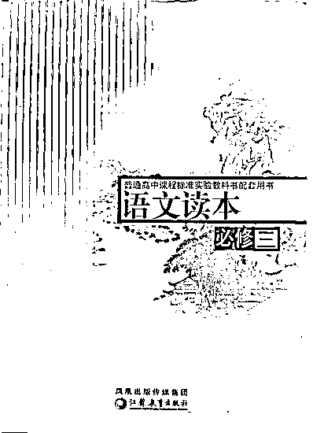
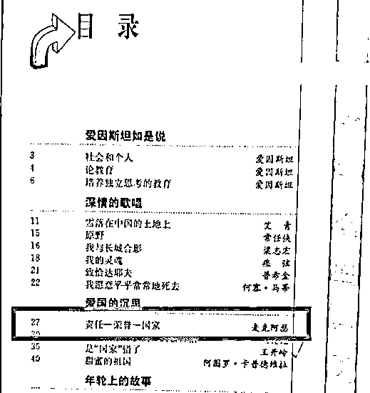
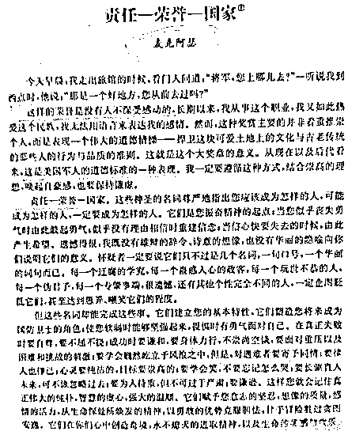

# "中国人民志愿军头号敌人"被"请进"中学读本，苏教社道歉

> 原文：[`mp.weixin.qq.com/s?__biz=MzIyMDYwMTk0Mw==&mid=2247538148&idx=6&sn=094f724c14af71c60bfaaf4bee8b5d1f&chksm=97cb9edca0bc17ca659f14e0a0ce10a1fe9a1ace45164501445cd6c2134693aa68c73c35b3a8&scene=27#wechat_redirect`](http://mp.weixin.qq.com/s?__biz=MzIyMDYwMTk0Mw==&mid=2247538148&idx=6&sn=094f724c14af71c60bfaaf4bee8b5d1f&chksm=97cb9edca0bc17ca659f14e0a0ce10a1fe9a1ace45164501445cd6c2134693aa68c73c35b3a8&scene=27#wechat_redirect)

近日，江苏教育出版社出版的中学读本选文中出现麦克阿瑟的文章引发舆论争议。对此，江苏教育出版社回应称，该书不是语文教材，且已于 2020 年停止使用，全面退出市场，该出版社充分认识到问题的严重性，将深刻反省，严肃追责问责。

引发争议的中学语文读本

网友发布的照片显示，引发争议的读本为《普通高中课程标准实验教科书配套用书 语文读本 必修三》，出版方为凤凰出版传媒集团江苏教育出版社。该书“爱国的沉思”章节中的选文《责任—荣誉—国家》为曾任联合国军总司令的美国五星上将道格拉斯·麦克阿瑟。

引发争议的中学语文读本中的选文

记者搜索该文章全文，发现这篇 3000 余字（中译版本）的演讲稿中对“美国军人的道德标准”大加赞赏，称美国士兵“是世界上最崇高的人物”“国际矛盾怒潮中的救生员”。对此有网友认为，“在霸权主义还在欺负我们的时候，在美国无所不用其极打压中国的时候……把麦克阿瑟这样的中国人民志愿军的头号敌人‘请进’我们的课本，你们是想什么呢？”

引发争议的中学语文读本中的麦克阿瑟的文章

6 月 15 日下午，江苏凤凰教育出版社在“苏教服务”微信公众号上发布《关于苏教版读本选文的情况说明》。《说明》中提到，该书不是国家审定的语文教材，也不是经过省教育厅审查列入评议推荐目录的教辅材料，是该出版社自行编写的市场化的学生读物；该书已于 2020 年停止使用，全面退出市场。

上述《说明》中称，该出版社“充分认识到问题的严重性，对选文问题表示诚挚的歉意！我们将深刻反省，吸取教训，举一反三，全面自查自纠，严肃追责问责，严防此类问题再次发生。”

<mpvideosnap class="js_uneditable custom_select_card channels_iframe videosnap_video_iframe" data-pluginname="videosnap" data-id="export/UzFfAgtgekIEAQAAAAAAOOEz5UZMVwAAAAstQy6ubaLX4KHWvLEZgBPEuqNwRx9rT7mDzNPgMIvtCmlzSyaKnhm_zUUmJE4Q" data-url="https://findermp.video.qq.com/251/20304/stodownload?encfilekey=rjD5jyTuFrIpZ2ibE8T7YmwgiahniaXswqzKJxPPRAVLV4xFvNXN7f2LGJvXwyXiaYVGCILhfR7MTJzMcWVY5ROgVrpoW6thwbm6fMaN0ibem3TsKmSic0Yia0zNw&amp;adaptivelytrans=0&amp;bizid=1023&amp;dotrans=0&amp;hy=SH&amp;idx=1&amp;m=&amp;scene=0&amp;token=AxricY7RBHdX7dMXQgFuPIlbdichMvmgPVVpxjn0kKVIqLxbk1F7vEPbZEciblGr2YKK4fkLpqerw0" data-headimgurl="http://wx.qlogo.cn/finderhead/ibq4aVwOt6HNqrr8OD3sCviaytF3B8TqCwHicxsuIanAJo/0" data-username="v2_060000231003b20faec8c6e48a1acbd3ce04ef33b077a1e41d0d3794ed88ea537878dbe65910@finder" data-nickname="灰产圈+" data-desc="#教育部回应教材插图事件##意识形态要闻# 【愤怒至极！麦克阿瑟的文章公然入选语文教材】
把自己的英雄删除，把敌人的英雄编入教材！[怒]
(注:先前视频删除并非内容有误，而是因原视频作者提出我剪辑中存在不妥，所以重新修改后再发出。标题及动态文系我本人加入，特此说明)#毒教材#人教插画#小学课本@灰产圈+ " data-nonceid="12779391012325194514" data-type="video" data-width="1080" data-height="1920"></mpvideosnap>

来源：海报新闻

](https://mp.weixin.qq.com/s?__biz=Mzg5ODAwNzA5Ng==&mid=2247487973&idx=1&sn=1b62da6f2018402862a5c375e10c355e&chksm=c06878b2f71ff1a4fbe7df4dec626aa7e696154751693bf16f6c6a302ceaa4d1959040c70518&scene=21#wechat_redirect)

← 向右滑动与灰产圈互动交流 →

