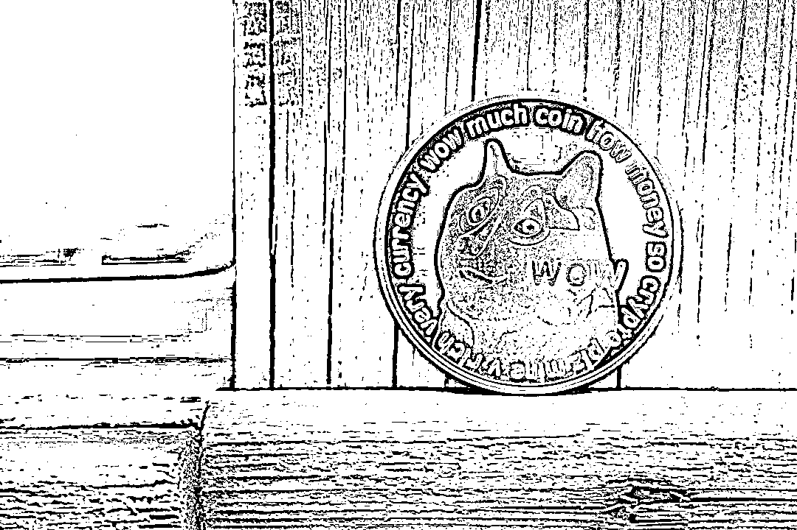

# 狗狗币跌到“狗带”，炒家状告马斯克索赔 1.7 万亿元，特斯拉、space X 也成被告

> 原文：[`mp.weixin.qq.com/s?__biz=MzIyMDYwMTk0Mw==&mid=2247538148&idx=7&sn=e7c2caa2f895f117d684b50961fbdeb1&chksm=97cb9edca0bc17ca4637d4218f5d626f1d190e4ef04ad6b67e4b5516270c60c3b09b9d7c5ded&scene=27#wechat_redirect`](http://mp.weixin.qq.com/s?__biz=MzIyMDYwMTk0Mw==&mid=2247538148&idx=7&sn=e7c2caa2f895f117d684b50961fbdeb1&chksm=97cb9edca0bc17ca4637d4218f5d626f1d190e4ef04ad6b67e4b5516270c60c3b09b9d7c5ded&scene=27#wechat_redirect)

据界面新闻、中国经济周刊等援引路透社 6 月 16 日消息，一名狗狗币投资者当地时间周四将特斯拉 CEO 马斯克告上法庭，指控后者为支持狗狗币而实施金字塔计划（俗称传销），向其索赔 2580 亿美元（约合人民币 1.7 万亿元）。

**狗狗币投资者状告马斯克及其公司**

据报道，在一份提交给曼哈顿联邦法院的诉状中，原告基思·约翰逊（Keith Johnson）指控马斯克、特斯拉和 SpaceX 公司“敲诈勒索，吹捧狗狗币并推高其价格，但随后却让其价格暴跌”。 诉状称：“被告人自 2019 年起就知道狗狗币没有价值，但却大肆宣传以从其交易中获利。马斯克利用他作为世界首富的地位，经营和操纵狗狗币金字塔计划，以获取利润和曝光，并以此为乐。” 

狗狗币。图片来源：视觉中国 

约翰逊还寻求阻止马斯克及其公司推广狗狗币，并希望法官宣布“根据联邦和纽约法律，交易狗狗币是赌博行为”。 约翰逊正寻求 860 亿美元的损害赔偿，这代表着狗狗币市值自 2021 年 5 月以来的跌量，并希望将这一赔偿提高两倍至 2580 亿美元。

特斯拉、SpaceX 以及马斯克的律师尚未置评。 特斯拉美国官网显示，特斯拉美国在线商店部分商品接受狗狗币作为付款选项，包括有 S3XY 字样的马克杯，售价为 445 狗狗币。

**一句话就让狗狗币价格“上蹿下跳”**

**据中国经济周刊报道，今年 1 月，马斯克发声，狗狗币 24 小时内上涨 800%，达到 0.07 美元/枚。2 月，马斯克一条推特，让狗狗币继续攀至 0.08 美元/枚。4 月 16 日，马斯克发布“狗狗对月狂吠”图，狗狗币日内涨幅超过 200%，其后 5 天竟飙涨 5 倍。截至北京时间 5 月 4 日下午，狗狗币已站上 0.5 美元/枚高位。短短一年竟上涨 200 倍！5 月 8 日，马斯克参加《周六晚间秀》节目，在主持人追问之下，他竟冲口而出：“狗狗币是个骗局”。此言一出，狗狗币大跌 34%，比特币、以太坊等“近亲”也受累下跌。

随着狗狗币价格不断走高，马斯克也在持续透支个人信用。狗狗币的火爆，显然依赖马斯克等少数名人背书，它早已不是“去中心化”的小众支付货币，而是充满偶像崇拜色彩、缺乏实际价值依托的“空气币”。

对此，有网友称，狗狗币确实毫无价值。有的网友称，此案一旦胜诉，或许会成为压垮比特币的一棵稻草。 还有网友称，他确实一直在吹嘘狗狗币，以一己之力左右狗狗币的走向。截至发稿，狗狗币目前价格为约 0.056 美元一枚，最近七个交易日累计下跌约 30%。 此外，比特币最新价格为 20,648.9 美元一枚，而据特斯拉财报显示，截至 2020 年 3 月 31 日，特斯拉持有比特币的公允市场价值为 24.8 亿美元。此前有媒体分析称，特斯拉于 2021 年年初买入 15 亿美元比特币，价格约为 3.5 万美元/枚。如按照此成本计算，马斯克和特斯拉目前也被深度套牢了。**

****整个加密货币市场都在“雪崩”****

**据证券时报报道，本周二(6 月 14 日)，微软创始人比尔·盖茨在出席一场气候会议的时候抨击了诸如 NFT 等加密货币项目，是基于“博傻理论”(greater fool theory)的骗局。他表示，他既不会做多也不会做空这类资产。

盖茨之前就批评过加密货币，去年他曾与特斯拉 CEO 埃隆・马斯克就比特币对散户投资者是否风险太大以及开采比特币对环境的危害展开过争论。

实际上，自上个月稳定币 TerraUSD 与 Luna 代币突然崩盘，加上目前宏观经济情况如通胀、加息和经济展望的打击，加密货币的“雪崩”似乎正在袭来。币圈大佬们的损失惨重一方面是由于持有的加密货币价值暴跌，另一方面则是因为他们旗下加密货币相关上市公司市值也出现暴跌。

名单上打头的、损失最惨重的就是去年底以近 960 亿美元(当时约 6100 亿元人民币)身家超越农夫山泉创始人钟睒睒的 4244 亿元人民币，登顶华人首富的世界最大加密货币交易所币安(Biance)创办人赵长鹏。数据显示，其身家已经仅剩 102 亿美元，财富蒸发了将近 89%。有网友戏称，这是“一夜返贫”。 而该行业中的公司在市场大跌背景下越来越多地采取裁员措施。加密货币经营机构**BlockFi**的首席执行官 Zac Prince 发表声明称，将裁减约 850 名员工中的 20%。Prince 在 Twitter 上写道："与科技界的许多其他公司一样，我们受到了宏观经济状况巨大转变的影响，这对我们的增长速度产生了负面影响。”**

**来源：每日经济新闻综合自界面新闻、中国经济周刊、证券时报、公开信息**

******](https://mp.weixin.qq.com/s?__biz=Mzg5ODAwNzA5Ng==&mid=2247487973&idx=1&sn=1b62da6f2018402862a5c375e10c355e&chksm=c06878b2f71ff1a4fbe7df4dec626aa7e696154751693bf16f6c6a302ceaa4d1959040c70518&scene=21#wechat_redirect)**

**← 向右滑动与灰产圈互动交流 →**

****