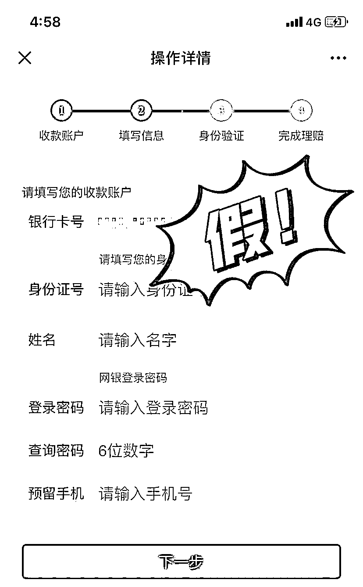
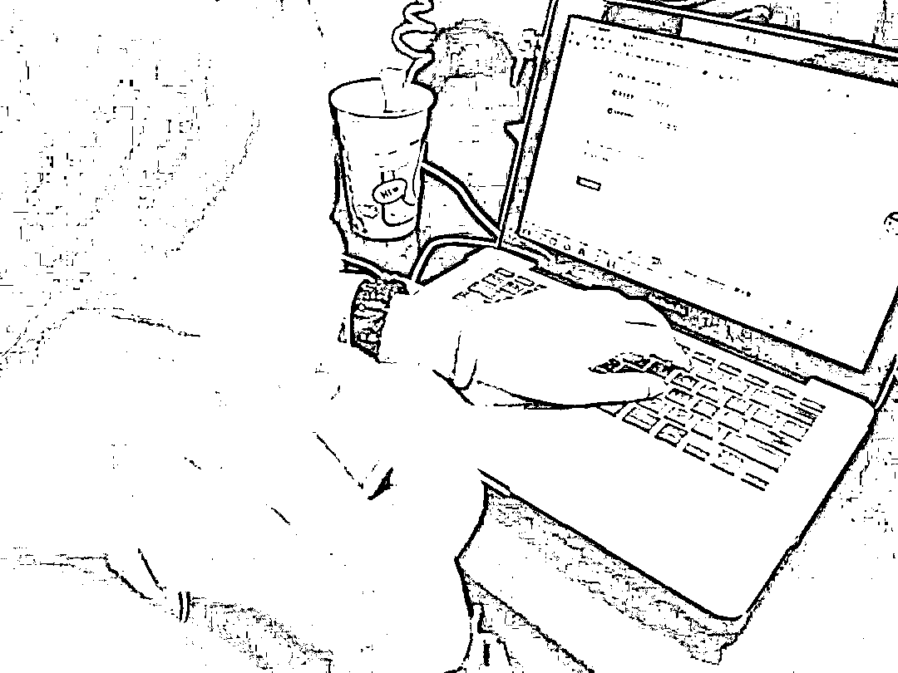

# 小心！骗子盯上“618”年中大促！珠海有人已经损失 16 万！

> 原文：[`mp.weixin.qq.com/s?__biz=MzIyMDYwMTk0Mw==&mid=2247538148&idx=8&sn=e5ba27464ee783d37ab70181f6043b1b&chksm=97cb9edca0bc17cac5deaf0ece57d018cb6eab449114e3b71eea3ae21f55334b4dfc70d1fea8&scene=27#wechat_redirect`](http://mp.weixin.qq.com/s?__biz=MzIyMDYwMTk0Mw==&mid=2247538148&idx=8&sn=e5ba27464ee783d37ab70181f6043b1b&chksm=97cb9edca0bc17cac5deaf0ece57d018cb6eab449114e3b71eea3ae21f55334b4dfc70d1fea8&scene=27#wechat_redirect)

一年一度的“618”年中大促已经到了，各大电商平台推出一系列促销让利活动。

每逢购物节前后，一波冒充电商客服的骗子也已经做好准备，在大家享受购物狂欢盛宴的同时，他们带着骗术疯狂来袭，大家一定要小心！

**冒充电商物流客服的骗子，**

****到底有多疯狂？****

****今年的“618”年中大促比以往来得都要早一些，5 月 31 日晚就已经可以开始支付尾款。****

****于是，6 月刚开始，很多朋友就已经收到快递并且用上了。与此同时，冒充电商物流客服的骗子也火力全开，想趁着这场网购狂欢节“大赚一笔”：****

********

****6 月 13 日，金湾高女士被**冒充电商客服**的骗子以**“误录入为代理商”为由转账**，损失 164200 元；****

****6 月 11 日，香洲贾先生被**冒充快递客服**的骗子以**“快递丢失进行理赔”**为由诈骗 110433 元；****

****6 月 10 日，斗门吴女士被**冒充电商客服**的骗子以**“商品有质量问题进行退款”**为由诈骗 127831 元……****

****购物节还没结束，近半个月就已经有近 40 位珠海市民上当被骗。****

****家人们，如果你还不学习骗子的套路，下一个接到诈骗电话的你有可能也会掉进骗子的圈套！****

******骗子是怎么把钱骗走的？******

******一般来说，冒充电商物流客服的骗子针对购物节最常使出的骗术有以下两种：******

********一、快递丢失或商品有质量问题********

******①**骗子冒充网购平台客服或物流快递客服给你打电话，说出他们通过非法渠道获取你的个人网购信息，谎称你购买的产品有质量问题或快递丢失，需要给你退款赔偿。****

******②**诱导你在虚假的退款理赔网页输入自己的银行卡号、手机号、验证码等信息，从而将你银行卡内的钱款转走。****

****或者利用你对第三方支付软件中借款功能（如备用金、借呗）的不熟悉，诱导你从中借款，然后转给骗子指定账号。****

********

****这个骗术之所以屡屡有人上当，往往是因为骗子掌握了消费者精准的网购记录，在一开始就获取受害者的信任，然后谎称退款要经过第三方平台机构，其实都是一些网贷平台。****

****紧接着，骗子利用其对这些平台的不熟悉，混淆概念，让受害者把贷款额度误以为是已经退还的赔偿金，诱导受害者操作贷款并提现转账。****

******二、误操作为代理商或升级会员******

******①**骗子通过非法渠道获取用户网购信息，冒充网购客服，以“误操作将信息录入为代理商”或“升级为店铺会员”为由，抛出“不取消就扣高昂年费”的说辞，唬住受害者。****

********

******②**受害者听到要交年费或代理费，一般都不愿意，然后骗子顺其自然提出可以帮助解绑，并把电话转接到所谓的“银行工作人员”，骗取受害者银行卡的账号信息。****

******③**获取受害者账号信息后，骗子谎称“账号异常存在风险，需要立即进行资金转移到安全账户”，让受害者在惊吓中把钱骗走。****

********

****这个骗局最厉害的地方，就在于骗子一上来就恐吓受害者，“不办理取消就要交更多的钱”，很多受害者因为听说要缴纳高昂的会员费，内心第一反应就是要取消升级，本着“不交冤枉钱”的心理，受害者反而掉进了骗子的圈套，被骗了更多钱。****

******面对骗局我们应该如何防范******

******无论是退款理赔骗局，还是注销代理商或会员骗局，接到类似可疑的电话，只要做一个动作，就可以将骗局扼杀在开始，那就是**第一时间在购物平台联系官方客服，或通过拨打官方物流电话进行确认求证。********

******脱离原路退回的退款都是诈骗。只要对方提到“多汇款需要退回”或“通过网络平台退款”等非正常渠道退款时，基本可以判定是骗局。******

************

******取消代理商或会员需要转账的都是诈骗。只要对方提到“误操作为代理商”或“误升级为会员”时，大家一定要提高警惕，如果商家无缘无故扣代理费/会员费，消费者可以通过法律途径捍卫自己的合法权益。******

******各位朋友疯狂买买买的同时，请一定保持一分冷静和理智，大家能花更少的钱买到心仪的商品固然是好，但可别把费了半天劲儿省下来的钱给骗走呀。******

******来源：珠海刑侦 作者：刑小侦 ******

******************](https://mp.weixin.qq.com/s?__biz=Mzg5ODAwNzA5Ng==&mid=2247487973&idx=1&sn=1b62da6f2018402862a5c375e10c355e&chksm=c06878b2f71ff1a4fbe7df4dec626aa7e696154751693bf16f6c6a302ceaa4d1959040c70518&scene=21#wechat_redirect)******

******← 向右滑动与灰产圈互动交流 →******

************