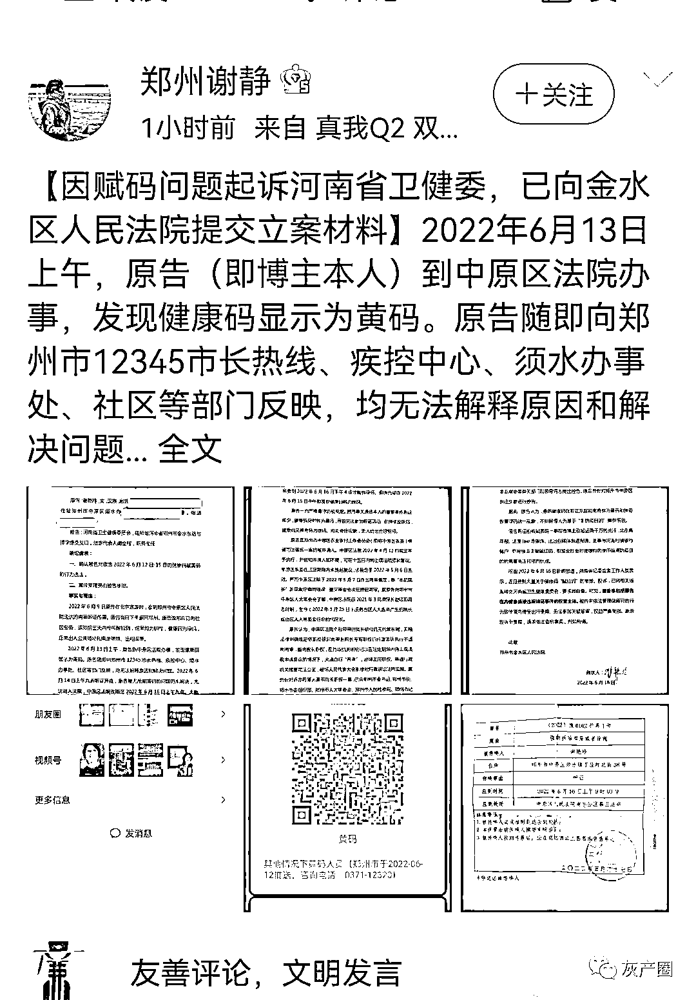
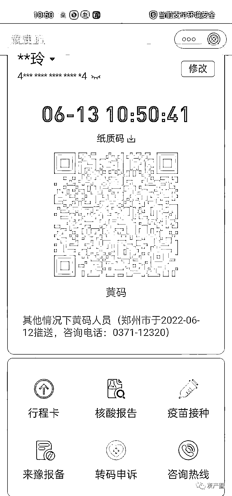
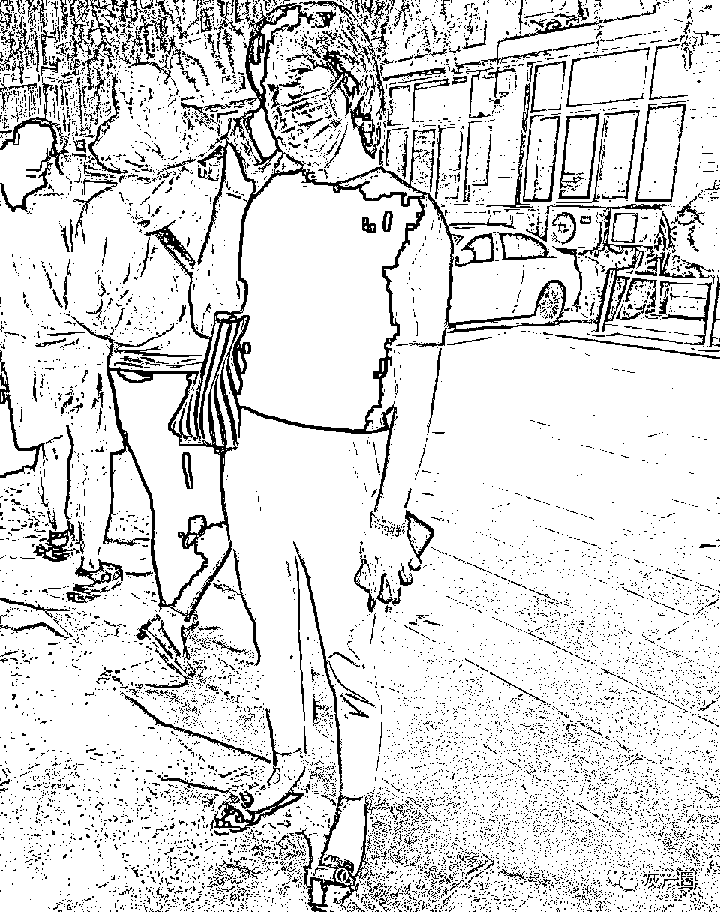
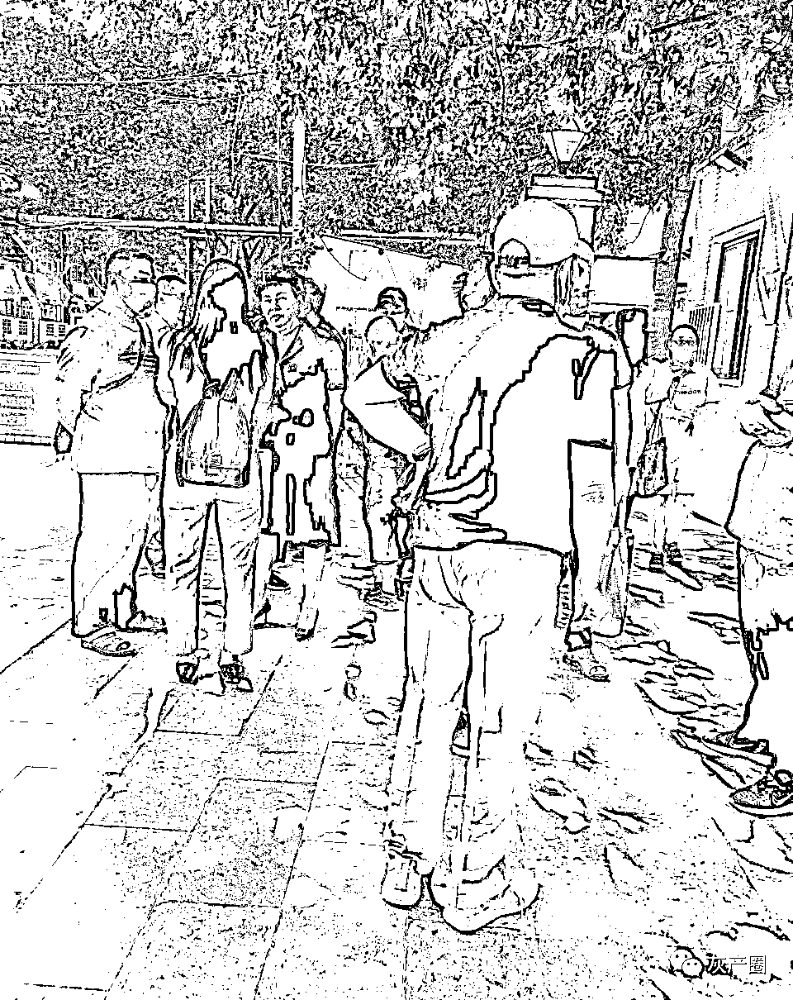
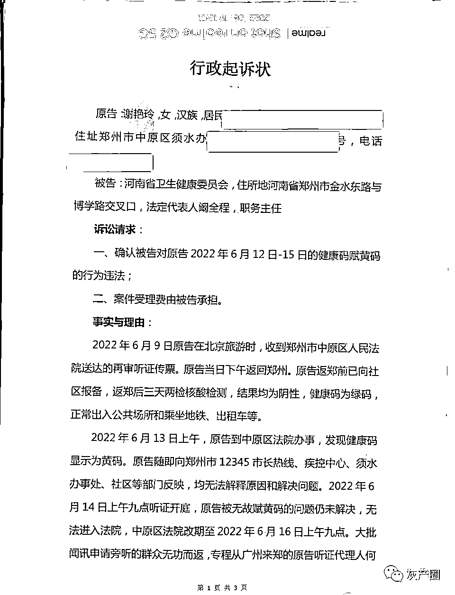
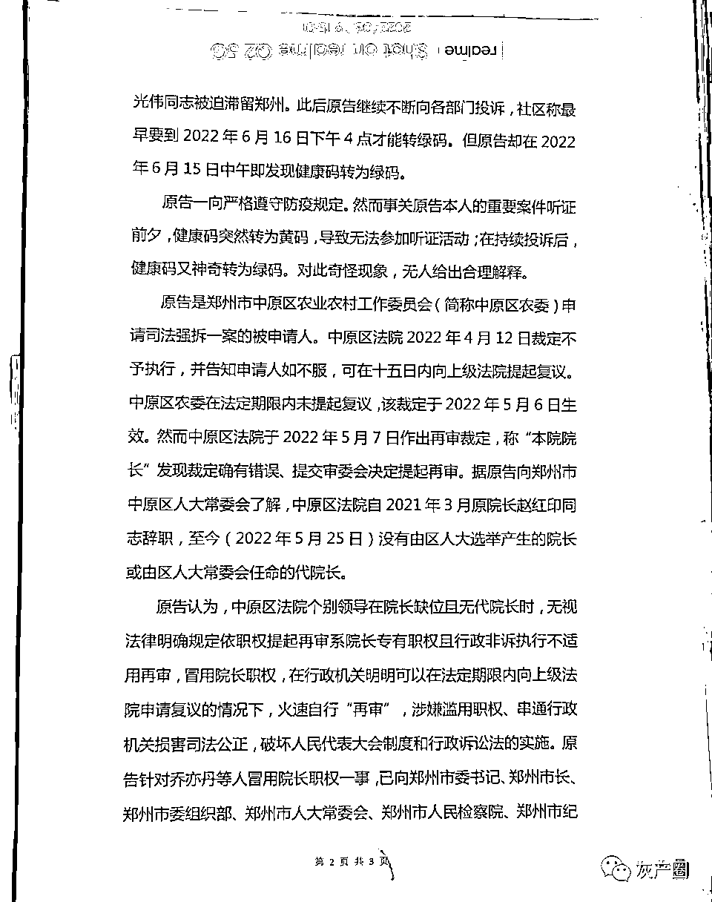
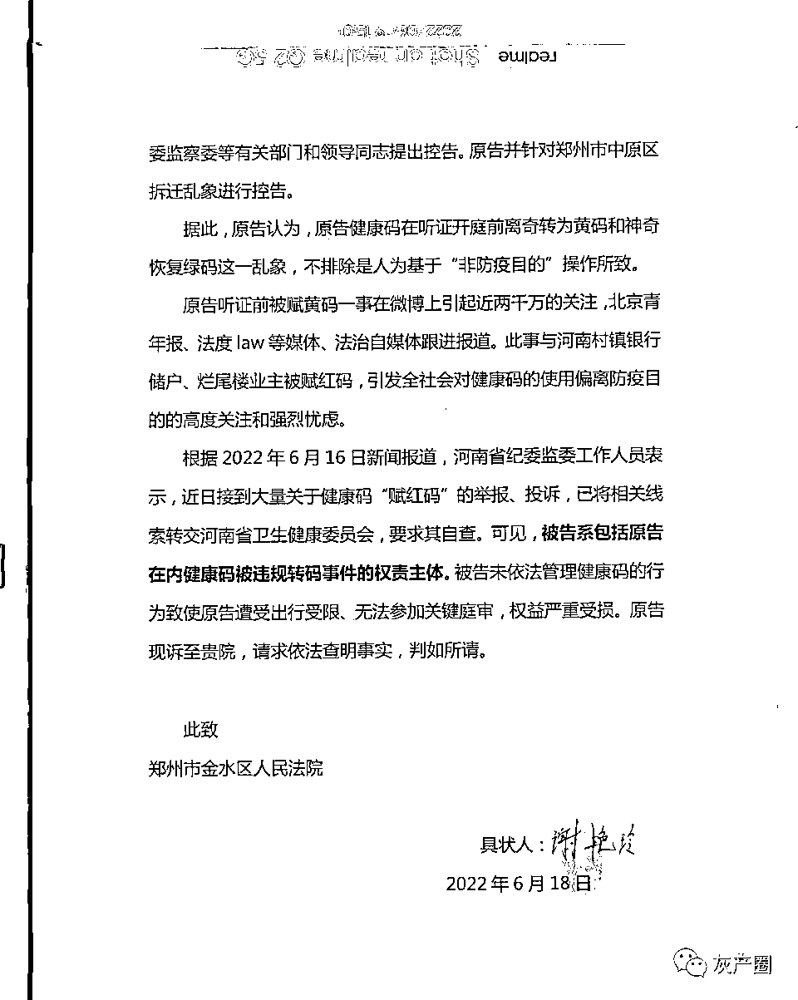

# 突发！郑州居民因无辜被赋黄码，起诉河南卫健委行为违法！

> 原文：[`mp.weixin.qq.com/s?__biz=MzIyMDYwMTk0Mw==&mid=2247538210&idx=1&sn=8c6d5cbfbc9535cf7a3a852bf38dd1d4&chksm=97cb9d1aa0bc140c64e3da58160ae8a0932b997104348be9aa5141e3cbe266f2b61a2eb5047b&scene=27#wechat_redirect`](http://mp.weixin.qq.com/s?__biz=MzIyMDYwMTk0Mw==&mid=2247538210&idx=1&sn=8c6d5cbfbc9535cf7a3a852bf38dd1d4&chksm=97cb9d1aa0bc140c64e3da58160ae8a0932b997104348be9aa5141e3cbe266f2b61a2eb5047b&scene=27#wechat_redirect)

刚刚，6 月 19 日下午，“郑州谢静”发微博称，因赋码问题起诉河南省卫健委，已经向金水区法院递交立案材料。

谢女士在诉状中称，2022 年 6 月 9 日，原告在北京旅游时，收到郑州市中原区人民法院送达的再审听证传票。原告当日下午返回郑州，返郑前已向社区报备，返郑三天两检核酸检测，结果均为阴性，健康码为绿码，正常出入公共场所和乘坐地铁、出租车等。

6 月 13 日早上八点谢女士到中原区法院递交材料扫码时，显示黄码，于是立即打 12345 市长热线、疾控中心、须水办事处、社区等部门反映，均无法解释原因和解决问题。

6 月 14 日上午九点听证会开庭，谢女士被无辜赋黄码的问题仍未解决，无法进入法院，法院不得不改期至 6 月 16 日上午九点。大批闻讯申请旁听的群众被“放鸽子”，专程从广州来郑的原告听证代理人被迫滞留郑州。

此后原告继续不断向各部门投诉，社区称最早要到 2022 年 6 月 16 日下午 4 点才能转绿码。但原告却在 2022 年 6 月 15 日中午即发现健康码转为绿码。

谢女士认为，原告健康码在听证开庭前离奇转为黄码和神奇恢复绿码这一乱象，不排除是人为基于“非防疫目的”操作所致。

原告听证前被赋黄码一事在微博上引起近两千万的关注，北京青年报、法度 law 等媒体、自媒体跟进报道。此事与河南村镇银行储户、烂尾楼业主被赋红码，引发全社会对健康码的使用偏离防疫目的的高度关注和强烈忧患。

故请求：一、确认被告对原告 2022 年 6 月 12 日-15 日的健康码赋黄码的行为违法；二、案件受理费由被告承担。

疫情两三年来，健康码，捆绑了个人太多的信息，一旦离开这个“码”，一旦这个“码”被变成红色，轻则集中隔离，重则寸步难行，回不了家，住不了店，坐不上车，吃不上饭，哪里都去不了，啥事都干不成，说句不好听的，饿死都有可能。

融观天下作者爱咖啡的叔叔指出，人们最害怕，这个健康码的后台，一旦别有用心的人掌握，让你好好的码变成他们想要的颜色，立马能让你生不如死。

河南省这波随意“绿码变红码”的“神操作”，由于过于离奇，瞬间上了热搜第一，引起全社会的广泛质疑，目前，包括法学界与众多媒体一直在不断呼吁河南省立即回应此事。

网友们议论纷纷。

有的说：健康码的公信力不容随意践踏，它也绝不可随便用作限制特定人员流动，否则，不仅会损害健康码的威信，影响公众对防疫措施的支持，更直接违反了防疫的相关法规。

有的说：如果将健康码的防疫目的拓展到其他方面，甚至演变成‘社会维稳码’，首先违背了健康码本身目的的正当性，也违反法律规定。其次，在赋码过程中人为干预系统添加一些无关因素，属于简单粗暴的滥用权力行为。

人民日报旗下新媒体《侠客岛》发表评论说：

给维护正当权益的储户赋红码，不知是哪个“天才”想出来的主意，更不知这种明显有违常识、法治、公理的操作，怎么就能堂而皇之地施行！

连胡锡进同志都看不下去了，对其老家有关部门这种做法，他在微博上说：

“作为一名老媒体人，我想提醒，各地的健康码只应用于纯粹的防疫目的，在任何情况下都不应被地方政府用于与防疫无关的其他社会治理目标，这一规则各地务需坚守。如果有哪个地方为了其他目的通过调控健康码阻止特定人员流动，这显然违反相关防疫法规，也会损害健康码的威信，损害公众对防疫的支持。这对我们的整体社会治理是得不偿失的。”

**就在刚刚，郑州市纪委监委回应称：**

****针对近日部分村镇银行储户健康码被赋红码的问题，河南省郑州市纪委监委启动了调查问责程序，对发现违反《河南省新冠肺炎疫情防控健康码管理办法》的乱作为，将依规依纪依法严肃处理。****

****来源：宾曰语云（ID：Lzkj328）综合自郑州谢静微博、融观天下  作者：爱咖啡的叔叔、法度 Law  作者：京睿****

************](https://mp.weixin.qq.com/s?__biz=Mzg5ODAwNzA5Ng==&mid=2247487973&idx=1&sn=1b62da6f2018402862a5c375e10c355e&chksm=c06878b2f71ff1a4fbe7df4dec626aa7e696154751693bf16f6c6a302ceaa4d1959040c70518&scene=21#wechat_redirect)****

****← 向右滑动与灰产圈互动交流 →****

********