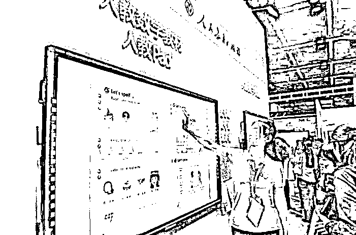
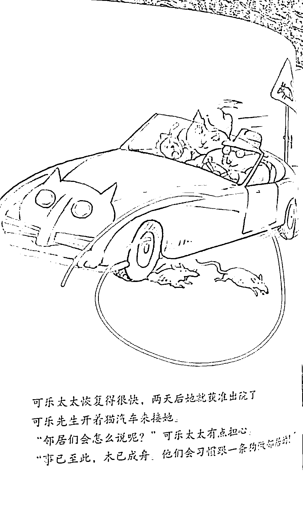
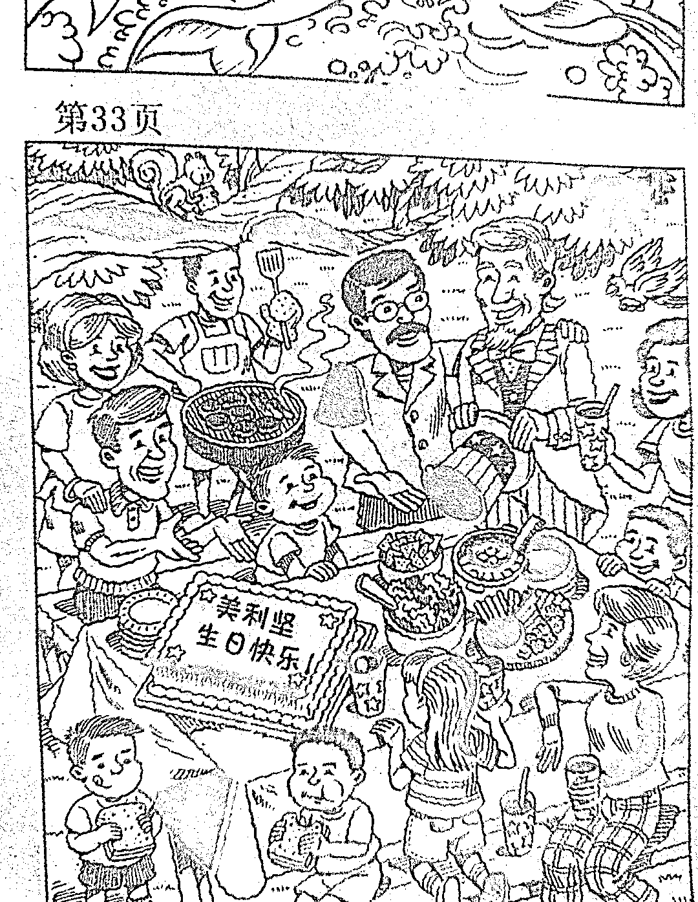

# “毒教材”，主谋获死刑！

> 原文：[`mp.weixin.qq.com/s?__biz=MzIyMDYwMTk0Mw==&mid=2247538210&idx=2&sn=78719d9a25d633b1cf47c23f91dc853b&chksm=97cb9d1aa0bc140c50c86776acf9acd4f2598f9fbcea4d324cc2e2ccbeb3c712573ef6985af5&scene=27#wechat_redirect`](http://mp.weixin.qq.com/s?__biz=MzIyMDYwMTk0Mw==&mid=2247538210&idx=2&sn=78719d9a25d633b1cf47c23f91dc853b&chksm=97cb9d1aa0bc140c50c86776acf9acd4f2598f9fbcea4d324cc2e2ccbeb3c712573ef6985af5&scene=27#wechat_redirect)

**新疆“问题教材”主谋获死刑！**

新疆维吾尔自治区教育工委副书记、自治区教育厅党组副书记、厅长沙塔尔·沙吾提，自 2002 年起，利用其兼任自治区基础教育课程改革领导小组组长身份，以**分裂国家为目的，多次采取单独授意和召集会议等方式，**组织**阿力木江·买买提明**（时任自治区教育厅副厅长，已判刑）、**阿布都热扎克·沙依木**（时任新疆教育出版社社长、副总编，已判刑）、**塔依尔·那斯尔**（时任新疆教育出版社社长、副总编，已判刑），专门挑选具有民族分裂思想的**牙里坤·肉孜**（时任新疆教育出版社维吾尔文教材编辑部编辑，已判刑）、**瓦依提江·吾斯曼**（时任新疆教育出版社维吾尔文教材编辑部编辑，已判刑）等人进入教材编写组，**以突出所谓的“地方特色、本民族特色、体现本民族历史文化”为幌子，极力要求在教材中编入宣扬民族分裂、暴力恐怖、宗教极端等思想的内容，以达到“去中国化”的分裂国家目的。**

经审查，该教材中具有民族分裂、暴力恐怖、宗教极端等内容的问题课文共计 84 篇，在全区印发 2500 余万册，**时间长达 13 年之久，232 万名维吾尔族在校学生及数万名教育工作者使用该教材，造成极其严重的危害后果。**

法院审理认为，被告人沙塔尔·沙吾提**以分裂国家为目的**，利用组织、编写教材的职务便利，直接任用、安排与其同样具有分裂国家思想的阿力木江·买买提明、塔依尔·那斯尔、牙里坤·肉孜、瓦依提江·吾斯曼等人员在编写“问题教材”中分工负责，**形成以沙塔尔·沙吾提为首的分裂国家犯罪集团。**

**其行为已构成分裂国家罪。**

其系该犯罪集团的组织者、领导者，系首要分子，应依法严惩。

**依照《中华人民共和国刑法》《中华人民共和国刑事诉讼法》的相****关规定，决定判处被告人沙塔尔·沙吾提死刑，缓期二年执行，剥夺政治权利终身，并处没收个人全部财产。**

**教育部成立调查组，全面彻查教材插图问题**

这几天，人教版小学数学教材因为插画出现诸多问题，连续上了好几个热搜。

**最新通报是：**

针对近日社会反映的人教版小学数学教材插图问题，教育部已成立调查组进行全面彻查，对查出的问题将立行立改，对存在违纪违规问题的责任人将严肃追责问责，依法依规严肃处理，绝不姑息。调查处理结果将及时向社会公布。

同时，教育部已部署开展全国大中小学教材全面排查工作，发现问题立即整改，对存在违纪违规问题的责任人按有关规定严肃处理。

**随后，“人民教育出版社”亦发出整改声明，这条消息一经公布，瞬间刷爆了网络舆论。**

近期，我社小学数学教材插图在网上受到批评和质疑，引起了社会各界对教材质量的担心。

我们进行了认真反思，深感自责和内疚，在此表示深深的歉意。对于大家对我社中小学教材的关心表示真诚的感谢。

**我社已成立工作专班，全面负责小学数学教材插图整改工作：**

一、启动相关工作，到今年 9 月 1 日前全面整改到位，确保 2022 年秋季学期开始按时使用新教材。

二、按照有关规定和流程，在全国范围内重新遴选优秀设计团队，对小学数学全套教材所有插图进行绘制更换。

三、在重新绘制过程中，我们将专门听取社会各界尤其是一线师生及家长的意见和建议。

四、深刻吸取教训，举一反三，完善机制，对我社其他教材进行深入排查，发现问题立即整改。我们真诚接受社会各界的监督，欢迎大家对教材工作提出意见建议（反馈邮箱：jcfk@pep.com.cn）。

人民教育出版社就插图事件道歉并发布整改说明，教育部要求全面排查全国中小学教材。

**然而，一句道歉、一个整改承诺就够了吗！？**

**《法制日报》看不下去了，措辞激烈的指出：一个道歉、一个整改承诺就想了事，全国人民都不会答应！“毒教材”整改不能避开追责问责！**

单从法律角度来讲，我国出版管理条例明确规定：

以未成年人为对象的出版物不得含有诱发未成年人模仿违反社会公德的行为和违法犯罪的行为的内容，**不得含有恐怖、残酷等妨害未成年人身心健康的内容。**

**出版、进口含有禁止内容的出版物，触犯刑律的，依照刑法有关规定，依法追究刑事责任。**

百年大计教育为本，如果只是大张旗鼓地道歉整改，而没有深挖根源、没有人因此担责，以后“毒教材”“毒绘本”事件恐怕还会发生！

警惕不良价值导向披上看似“美好”的伪装向孩子下“毒手”，问题教材整改不能止于道歉！

**严查各环节失守责任人，严肃追责问责，才能发挥更大警示作用！**

**终于有官媒，喊出了亿万国人的心声。**

****惨痛的历史历历在目，****

******为什么他们熟视无睹？******

******2016 年，有群众举报反映新疆教育出版社 2003、2009 版中小学维吾尔语教材存在严重问题。******

************

******这些包含了大量血腥、暴力恐怖、分裂思想等罪恶内容的问题教材，居然已经用了 13 年之久都没有被有关教育部门发现。******

********看看这些“毒教材”有多恶毒：********

******最重要的语文教材，书中将中国国旗、国歌、国徽的内容一概清空，人物佩戴的徽章，竟然是所谓的“东突厥斯坦”的“国徽”。******

************

******凭空捏造并添加所谓“突厥英雄”的内容到教材里。******

************

******虚构了一个“7 名维吾尔族英雄姑娘”故事，刻意制造民族仇恨。******

************

******类似的插画在新疆教材中，被查到了近 100 张，直让人后背发凉。******

******无法想象，13 年间，有多少纯真孩子的身心被这些有毒的教材侵蚀，其严重程度远远超过这一次人教版“毒教材”事件。******

********为何“毒教材”长达 13 年都没有被曝光揭露？********

********因为从新疆教育厅到出版社的所有机要职位，全部都被“两面人”所把控。********

******新疆教育厅原厅长沙塔尔·沙吾提，担任新疆基础教育课程改革领导小组组长，其利用主持编写、出版中小学民族文字教材工作之机，以分裂国家为目的筹划“毒教材”。******

************

******新疆教育厅原副厅长阿力木江·买买提明、新疆教育出版社社长塔依尔·那斯尔和阿布都热扎克·沙依木，负责具体实施，**他们妄图通过改变历史、歪曲历史，给学生们灌输分裂思想，增加民族仇恨，达到分裂祖国的目的。********

************

******这些民族罪人的目的，他们在央视的采访中直言：**就是为了让更多的维族人看到，从小影响他们，从思想上控制他们……********

************

********哪怕这些罪魁祸首们，被判处了死刑到无期徒刑，新疆成百上千万的孩子们的身心，却很难被扭转过来。********

******更遗憾的是，当时有关部门只是调查了新疆的教材问题，未曾意识到这次爆发的人教版“毒教材”，同样已存在了 10 年之久。******

********如此惨痛的教材事故就发生在眼前，我们岂能容许同样的悲剧再次重演！********

************教材“集采”不同药品集采，************

**************苦了人民，肥了谁的钱包？**************

********作为教材的出版和发行机构，人民教育出版社发挥了举足轻重的作用，没有人教社的审核和同意，这样的教材不可能同孩子们见面。********

********人教社一开始显然并没有意识到问题的严重性，面对汹涌的民愤，人教社回应称会认真研究整改，重新绘制部分插画，改进“画法画风”。********

****************

********公众都不太在意这些教材是不是“丑陋”，而是在意其用心险恶、意识形态等恶劣问题的时候，人教社还在转移注意力。********

********人教社自身也有不少问题被曝光，典型代表就是在教育领域搞“教材集采”，类似于国家多省市联合起来搞的“药品集采”，目的是同药厂谈判，大幅降低药价，两种“集采”的结果却截然不同。********

********药品集采，全国老百姓买药的成本降了 80%以上。********

**********教材“集采”的结果，是市价不到 1000 块的平板电脑，人教社指定的要价 4000 块**。********

**********没有商量的余地！**********

********即便家长们随时可以买到价格和配置足以吊打的华为、小米产品，也只能乖乖闭嘴掏钱。********

****************

****************

********我们真正担心的是，**目前暴露出来的，还只是冰山一角**，真正的幕后黑手，还藏在背后逍遥法外。********

********而且很显然，已经有人坐不住了，**网络上开始大量出现了一些意图浑水摸鱼、扰乱公众视野的声音传出来。**********

**********有“前科”的大学教授，开始厉声喝退网友。**********

****************

**********一个名为“教育装备采购网”的平台，怒斥网友在搞“网络暴力”，呼吁“还青少年一个正能量的网络环境”……**********

****************

**********这一切的背后，无不折射出一个现象，有人在掩饰什么，又有人在害怕什么。**********

********结合吴勇自己在论文中所说的，和他自己说过的话，可以大胆断定，我们距离真相可能并不遥远！********

**********十年树木，百年树人！**********

********中国亿万中小学生用的教材，都必须经历“三审三校”的严苛流程，这样的流程都能形同虚设，背后暴露的问题也绝不简单。********

****************

**********还有每年数以万计被送到国外，进行所谓“免费交流学习”的孩子们，究竟是去学习了什么东西？**********

****************

****************

**********根据网友反馈，正有越来越多的儿童读物，被发现有问题。**********

****************

****************

****************

****************

**********中国儿童出版物，需要来一次大排查、大消毒。**********

****************

********很多人都听说过这样一句话：********

********教育是最廉价的国防，一个国家的强盛是在小学教室的讲台上完成的。********

********诚如斯言。********

********教材出了问题，无异于教室里被埋下了“定时炸弹”。********

**********不可不察，不可不当心。**********

**********亡羊补牢，为时未晚！**********

********我们相信，不管是毒教材还是有毒绘本，或是有问题的出版机构，国家都不会放过，更不能放过，历史的耻辱柱上，会永远给这些历史罪人留下位置！********

********教育无小事，孩子们是祖国的未来和希望，对他们下手，就是 14 亿国人的敌人！********

*********注：本文内容及图片来自网络，如有侵权请联系。********

********来源：清晨阅读********

************************](https://mp.weixin.qq.com/s?__biz=Mzg5ODAwNzA5Ng==&mid=2247487973&idx=1&sn=1b62da6f2018402862a5c375e10c355e&chksm=c06878b2f71ff1a4fbe7df4dec626aa7e696154751693bf16f6c6a302ceaa4d1959040c70518&scene=21#wechat_redirect)********

********← 向右滑动与灰产圈互动交流 →********

****************