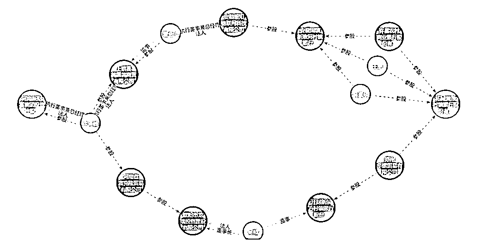

# “河南村镇银行取款难”嫌犯被抓，幕后公司涉嫌相关犯罪已 11 年

> 原文：[`mp.weixin.qq.com/s?__biz=MzIyMDYwMTk0Mw==&mid=2247538210&idx=3&sn=92d7da385b8bf1265ffca86b628d7ec7&chksm=97cb9d1aa0bc140c2768de520c724fdcdafed7c290c2dea500497939838a5817c8a571a2d8c3&scene=27#wechat_redirect`](http://mp.weixin.qq.com/s?__biz=MzIyMDYwMTk0Mw==&mid=2247538210&idx=3&sn=92d7da385b8bf1265ffca86b628d7ec7&chksm=97cb9d1aa0bc140c2768de520c724fdcdafed7c290c2dea500497939838a5817c8a571a2d8c3&scene=27#wechat_redirect)

红星资本局注意到，近日备受关注的河南村镇银行系列事件，有了新进展。

6 月 18 日，许昌市公安局发布通告证实，涉事村镇银行的大股东——河南新财富集团投资控股有限公司（以下简称“河南新财富集团”）涉嫌严重犯罪，警方已抓获一批嫌疑人，查封冻结一批涉案资产。

当日，河南银保监局河南省地方金融监管局也作出回应称，各级金融管理部门密切配合公安机关开展调查，禹州新民生等村镇银行线上交易系统被河南新财富集团操控和利用的犯罪事实已初步查明，相关资金情况正在排查。

**涉嫌利用村镇银行犯罪 11 年**

**警方：已抓获一批犯罪嫌疑人**

2022 年 4 月，河南禹州新民生村镇银行、上蔡惠民村镇银行、柘城黄淮村镇银行、开封新东方村镇银行，4 家河南村镇银行接连公告“系统升级”，银行存款无法取现。此外安徽的蚌埠市固镇新淮河村镇银行，黄山市黟县新淮河村镇银行也出现了类似情况。

据证券时报消息，5 月 20 日，银保监会有关负责人在通气会上表示，河南村镇银行风险事件不简单是社会公众和村镇银行间的交易，还涉及其他主体，有很复杂的交易结构。

**这几家村镇银行的大股东——河南新财富集团，利用第三方平台或通过“资金掮客”吸收公众资金，涉嫌违法犯罪，目前公安机关正在侦查。**目前 4 家村镇银行营业网点存取款业务正常开展，凡依法合规办理的业务均受到国家法律保护。

6 月 18 日，**许昌市公安局通过官方微信公众号“平安许昌”发布警情通报称：**

***2022 年 4 月 19 日，许昌市公安机关依法对河南新财富集团投资控股有限公司涉嫌重大犯罪立案侦查。**现初步查明，2011 年以来，以该公司实际控制人吕某为首的犯罪团伙涉嫌利用村镇银行实施系列严重犯罪。*****

***目前，案件侦办取得积极进展，**公安机关已抓获一批犯罪嫌疑人，依法查封、扣押、冻结一批涉案资金、资产。*****

*****该案涉嫌犯罪行为持续时间长、参与人员多、案情十分复杂。****公安机关将进一步加大案件侦办力度，不让犯罪分子逍遥法外、逃避惩罚，进一步加大追赃挽损力度，维护人民群众合法权益并适时发布案件侦办阶段性进展情况。***

****

**当天，针对该事件，**河南银保监局、河南省地方金融监管局有关负责人也表示，各级金融管理部门密切配合公安机关开展调查，禹州新民生等村镇银行线上交易系统被河南新财富集团操控和利用的犯罪事实已初步查明，相关资金情况正在排查。****

****河南银保监局、河南省地方金融监管局责成相关村镇银行紧紧依靠当地党委政府，积极配合公安机关侦办案件，做好资金信息登记和后续处置工作，依法保护金融消费者的合法权益。同时，提醒相关群众配合做好信息登记工作。****

******涉事银行互联网存款规模上百亿******

******河南新财富集团累计参股银行或达 13 家******

****据澎湃新闻报道，受访的多名涉事银行储户称，他们在一两年前，通过互联网金融平台购买了相关村镇银行的存款产品，获得的利息收益比一般银行要高。****

****4 月 19 日，作为互联网智慧银行科技服务商，君正智达（深圳）科技发展有限公司向相关部门递交书面报告，题为《**关于禹州新民生银行、柘城黄淮村镇银行、上蔡惠民村镇银行、固镇新淮河村镇银行四家村行关闭一切线上渠道资金支付业务导致互联网平台出现大面积投诉及发生严重挤兑情况的问题反映**》。****

****君正智达公司在报告中称，**“上述四家村行在各大互联网平台的存续互联网存款规模上百亿，涉及客户近百万人。”******

******而涉事银行幕后股东的金融布局，却远不止 4 家银行。******

******公开资料显示，被许昌公安局通报的河南新财富集团投资控股有限公司，成立于 2011 年 7 月，注册资本 1.6 亿元。2022 年 2 月，该公司已注销。******

************

******天眼查显示，河南新财富集团共有成员公司 7 家，其中 4 家已注销。目前仍然存续的 3 家公司分别为上蔡县美廉美商贸有限公司、许昌市望海商贸有限公司、怀来本发农业科技有限公司。******

******另据北京青年报报道，此次涉事的村镇银行，多数都由许昌农商行控股。河南新财富集团虽没有直接出现在涉事银行的股东名单中，但经过层层股权渗透后，该集团通过代持的方式持股许昌农商行，是这些银行的“隐形股东”。******

**********河南**新财富集团还参股了其他一些地方银行，累计数量可能达到 13 家，该集团背后的实际控制人吕某，还多次出现在贪腐案中。********

************************************

********操控健康码？********

******郑州市纪委监委：启动调查问责程序******

****除了“取款难”，相关银行“储户被赋红码”一事同样引发广泛关注。****

****据第一财经报道，在储户自发组建的村镇银行储户沟通群中，一些储户表示**因为扫了一个显示地址为“郑州车站西南出口”的场所码，结果健康码突然变红。******

******家住石家庄的邓先生也扫了这个场所码，结果自己的健康码也变红了，但他拿出家人的手机扫描这个场所码后，却发现家人的健康码仍为绿色，并未变红。“同在一所房子，行程码也一模一样，结果，健康码却一个是红色，一个是绿色。”******

******另据南方都市报，多位接采访的储户称，**在扫码填报个人信息后，其场所码或豫康码显示为“红码”**，原因为，“正在实施集中或居家医学隔离观察的入境人员”等；但同行赴郑州的非储户人员健康码则未受影响。此外，还有多位未前往郑州的储户在填报信息后被赋为“红码”。******

****针对“红码”一事，6 月 13 日，郑州市 12345 热线回应称，目前没有接到“外地来郑州一律赋红码”通知，如果被赋“红码”，建议先联系信息排查专班了解赋码原因。目前低风险地区来郑州只需要 48 小时核酸检测阴性证明，出示行程码和健康码。****

****6 月 17 日，郑州市纪委监委发布消息：**针对近日部分村镇银行储户健康码被赋红码的问题，郑州市纪委监委启动了调查问责程序，对发现违反《河南省新冠肺炎疫情防控健康码管理办法》的乱作为，将依规依纪依法严肃处理。******

************

******同日，河南省疫情防控指挥部表示，各市县要强化健康码管理，对因健康码管理使用不当造成严重后果的，依法依规严肃处理。健康码仅用于疫情防控，服务人民身体健康，绝不允许在国家、省疫情防控指挥部规定的情况以外应用，绝不允许在与疫情防控无关的场景使用，绝不允许超规则增加或删减健康码风险人员数据库。******

******来源：红星资本局综合自证券时报、澎湃新闻、第一财经、北京青年报、南方都市报等 编辑 陶玥阳******

******************](https://mp.weixin.qq.com/s?__biz=Mzg5ODAwNzA5Ng==&mid=2247487973&idx=1&sn=1b62da6f2018402862a5c375e10c355e&chksm=c06878b2f71ff1a4fbe7df4dec626aa7e696154751693bf16f6c6a302ceaa4d1959040c70518&scene=21#wechat_redirect)******

******← 向右滑动与灰产圈互动交流 →******

************