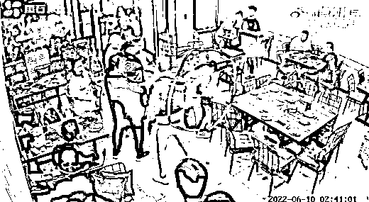

# 刚刚！唐山被打女孩母亲首次发声，事情没那么简单！

> 原文：[`mp.weixin.qq.com/s?__biz=MzIyMDYwMTk0Mw==&mid=2247538210&idx=4&sn=cb9380af359646d131765d4f43af0a19&chksm=97cb9d1aa0bc140cb6a14ae43ed6c3884661b982dd5f361898ca2afc8fa825fda43524264c5c&scene=27#wechat_redirect`](http://mp.weixin.qq.com/s?__biz=MzIyMDYwMTk0Mw==&mid=2247538210&idx=4&sn=cb9380af359646d131765d4f43af0a19&chksm=97cb9d1aa0bc140cb6a14ae43ed6c3884661b982dd5f361898ca2afc8fa825fda43524264c5c&scene=27#wechat_redirect)

******01******

**受害者家人发声**

唐山打人事件，风波仍在发酵。

回溯整起暴力事件，之所以激起全社会的愤怒。

是因为这样猖狂的施暴，打的是我们每一个人。

我们在关注，在发声，在等一个公道和正义。

那两位女孩，能否挺过这一关？

那几个暴徒，能否得到法律的严惩？

终于，有好消息传来了。

受伤严重的两位女孩都已经转入普通病房，不在 ICU。

但据说出行仍然要依靠轮椅。

这么多天过去了出行仍要靠轮椅，不难想象两位女孩受伤有多严重。

之前，网络上就流传着一张白衣女孩被送去医院的照片。

她浑身都是血迹，面部被打肿。

陈继志等暴徒，对两位女孩下这样的重手，当真是令人既愤怒又后怕。

**好在经过治疗，受害者已经没有生命危险。**

随后，受害者家属也出来发声了。

内容信息总结下来，主要说的有两点：

> 一是没有跟暴徒做出任何交易和私了；
> 
> 二是对方父母至今没有道歉。

除此之外，被打女孩母亲解释了这几天没有出现的原因，是因为警方承诺会给她一个满意的答复。

尽管 5 天过去了，但唐山女孩被暴力围殴，仍是所有人的噩梦。

**这些暴徒，必须被严惩！**

**不严惩不足以抚伤痕，不严惩不足以树法威。**

******02******

**永远不要低估人性的恶**

这几天，网上陆陆续续出现了这样一种声音：

“如果当时女孩没有反抗，结局是否会改变？”

有人说，女生反应过激，应该认怂。

还有人说，面对歹徒的性骚扰，女生就不该反抗。

可是，不反抗就能保护自己吗？

**答案是：不一定。**

在媒体放出的视频中，我们可以清楚地听到人渣说：

“把那女的怼路边给 cao 了。”

他把自己的想法付之行动，于是伸手摸上女孩后背后，又对女孩说：“cao 你啊。”

这说明他的动机，并不仅仅是“调戏”和“骚扰”。

**他是抱着性侵的目的去的。**

不难想象，如果白衣女孩当时没有反抗，等待她的将是什么。

很可能发生的结果是：

**「因为没有当众反抗，女孩很有可能被暴徒们拖到偏僻无人的地方，遭到比当众暴打更为严重的伤害和侮辱。」**

还记得电视剧《扫黑风暴》中的徐英子吗？

她为了救惹是生非的弟弟，被黑势力孙兴盯上。

孙兴将她骗到夜总会，趁机给徐英子下药，逼她用嘴咬着桌角。

当着包间众人的面，徐英子被五六个人轮奸。

最后报警时却被诬陷为卖淫。

生无可恋的她选择了跳楼自杀，结束了年轻的生命。

回到唐山这起打人事件中，如果当时女孩不反抗，是不是会成为现实版《扫黑风暴》中的徐英子？

歹徒的凶残和胆大妄为，是突破人类底线的。

**人心，没有最坏，只有更坏。**

**在走投无路的时候，反抗就是唯一的出路。**

******03******

**唐山打人事件中真正的勇士**

罗翔老师在接受采访时曾说过这样一番话：

“其实在我的词汇中，我觉得勇敢是一个最高级的词汇，因为我自己不够勇敢。

**在人类所有的美德中，勇敢是最稀缺的。**

就当命运之神把你推向勇敢的时刻，希望你能够像你想象的那么勇敢。”

深以为然。

在人类所有的美好品德中，勇敢是最稀缺的。

因为大多数人的内心，都有懦弱的一面。

遇到这种事的时候，圆滑隐忍或是快速躲开。

这或许可以让自己免受伤害。

但同时，勇敢也是人类最珍贵的品质。

它意味着即使感到害怕，仍坚持去做该做的事。

没有因为害怕、恐惧而认怂。

是啊，凭什么要认怂？

凭什么女孩遭遇不公对待，还要赔笑讨好？

凭什么女孩遭遇性骚扰时，就不能勇敢反抗？

女孩的反抗，完全是对暴行的正当防卫。

在我看来，她们是真正的勇士。

面对欺侮，没有怯懦，而是刚烈、勇敢、不畏惧。

当自己被侵害时敢于出手，敢于亮剑。

她们的奋起，虽然没能让暴徒颤抖，却高扬了人性。

**哪里有压迫，哪里就有反抗。**

**她们的行为与精神，绝对让人敬佩。**

******04******

**见义勇为需要法律的保护**

在这次恶性事件中，还有两个女孩让人敬佩。

一个女孩看见朋友被打，第一反应不是躲开。

而是好几次趴在被打的朋友身上，用身体帮忙挡着砸过来的椅子和啤酒瓶。

还有那个被男友抱在怀里的女孩。

一开始她很害怕，可看到被打女孩被拖行后，她几次挣脱男友的怀抱。

她打算冲上前去帮忙。

勇敢是美德，是自发行为。

在法治社会，不是想鼓励女孩们去勇敢。

毕竟，保护自己才是最主要的。

但忍不住为勇敢的她们感动。

在她们身上，看到了人类最大的闪光点。

这是很多人都做不到的。

自从唐山打人事件发生后，大家都在苛责在场的人没有出来见义勇为。

**但如果是你，你会站出来挺身止暴吗？**

相信很多人都听过这个段子：**“见义勇为，打赢要坐牢，打输火葬场。”**

这句看似调侃的言语背后，却让我们感受到了一种深深的无力感。

赵宇案代理律师谈唐山打人事件时，他说：

**“见义勇为不只需要勇气，还需要制度加以支持，如果没有制度保护作为后盾，绝大多数人首选考虑的都会是自保。”**

**见义勇为，需要法律的保护。**

只有对“好人有好报”能多一些法律的支撑，才能让更多的人有底气抵抗暴行。

**这个社会，才会涌现更多勇敢的人。**

**这个世界，才会变得越来越美好。**

一样。克莱因瓶的瓶颈是穿过了第四维空间再和瓶底圈连起来的，并不穿过瓶壁。用扭结来打比方，如果把它看作平面上的曲线的话，那么它似乎自身相交，再一看似乎又断成了三截。但其实很容易明白，这个图形其实是三维空间中的曲线。它并不和自己相交，而是连续不断的一条曲线。在平面上一条曲线自然做不到这样，但是如果有第三维的话，它就可以穿过第三维来避开和自己相交。只是因为我们要把它画在二维平面上时，只好将就一点，把它画成相交或者断裂了的样子。克莱因瓶也一样，我们可以把它理解成处于四维空间中的曲面。在我们这个三维空间中，即使是最高明的能工巧匠，也不得不把它做成自身相交的模样；就好像最高明的画家，在纸上画扭结的时候也不得不把它们画成自身相交的模样。有趣的是，如果把克莱因瓶沿着它的对称线切下去，竟会得到两个莫比乌斯环。在二维看似穿过自身的绳子 在二维看似穿过自身的绳子 如果莫比乌斯带能够完美的展现一个“二维空间中一维可无限扩展之空间模型”的话，克莱因瓶只能作为展现一个“三维空间中二维可无限扩展之空间模型”的参考。因为在制作莫比乌斯带的过程中，我们要对纸带进行 180°翻转再首尾相连，这就是一个三维空间下的操作。理想的“三维空间中二维可无限扩展之空间模型”应该是在二维面中，朝任意方向前进都可以回到原点的模型，而克莱因瓶虽然在二维面上可以向任意方向无限前进。但是只有在两个特定的方向上才会回到原点，并且只有在其中一个方向上，回到原点之前会经过一个“逆向原点”，真正理想的“三维空间中二维可无限扩展之空间模型”也应该是在二维面上朝任何方向前进，都会先经过一次“逆向原点”，再回到原点。而制作这个模型，则需要在四维空间上对三维模型进行扭曲。数学中有一个重要分支叫“拓扑学”，主要是研究几何图形连续改变形状时的一些特征和规律的，克莱因瓶和莫比乌斯带变成了拓扑学中最有趣的问题之一。莫比乌斯带的概念被广泛地应用到了建筑，艺术，工业生产中。三维空间里的克莱因瓶 拓扑学的定义编辑 克莱因瓶定义为正方形区域 [0,1]×[0,1] 模掉等价关系(0,y)~(1,y), 0≤y≤1 和 (x,0)~(1-x,1), 0≤x≤1。类似于 Mobius Band, 克莱因瓶不可定向。但 Mobius 带可嵌入 ，而克莱因瓶只能嵌入四维（或更高维）空间。莫比乌斯带编辑 把一条纸带的一段扭 180°，再和另一端粘起来就得到一条莫比乌斯带的模型。这也是一个只有莫比乌斯带、一个面的曲面，但是和球面、轮胎面和克莱因瓶不同的是，它有边（注意，它只有一条边）。如果我们把两条莫比乌斯带沿着它们唯一的边粘合起来，你就得到了一个克莱因瓶 莫比乌斯带 莫比乌斯带 （当然不要忘了，我们必须在四维空间中才能真正有可能完成这个粘合，否则的话就不得不把纸撕破一点）。同样地，如果把一个克莱因瓶适当地剪开来，我们就能得到两条莫比乌斯带。除了我们上面看到的克莱因瓶的模样，还有一种不太为人所知的“8 字形”克莱因瓶。它看起来和上面的曲面完全不同，但是在四维空间中它们其实就是同一个曲面－－克莱因瓶。实际上，可以说克莱因瓶是一个 3°的莫比乌斯带。我们知道，在平面上画一个圆，再在圆内放一样东西，假如在二度空间中将它拿出来，就不得不越过圆周。但在三度空间中，很容易不越过圆周就将其拿出来，放到圆外。将物体的轨迹连同原来的圆投影到二度空间中，就是一个“二维克莱因瓶”，即莫比乌斯带（这里的莫比乌斯带是指拓扑意义上的莫比乌斯带）。再设想一下，在我们的 3°空间中，不可能在不打破蛋壳的前提下从鸡蛋中取出蛋黄，但在四度空间里却可以。将蛋黄的轨迹连同蛋壳投影在三度空间中，必然可以看到一个克莱因瓶。制造经历编辑 过去，德国数学家克莱因就曾提出了“不可能”设想，即拓扑学的大怪物－－克莱因瓶。这种瓶子根本没有内、外之分，无论从什么地方穿透曲面，到达之处依然在瓶的外面，所以，它本质上就是一个“有外无内”的古怪东西。尽管现代玻璃工业已经发展得非常先进，但是，所谓的“克莱因瓶”却始终是大数学家克莱因先生脑子里头的“虚构物”，根本制造不出来。许多国家的数学家老是想造它一个出来，作为献给国际数学家大会的礼物。然而，等待他们的是一个失败接着一个失败。也有人认为，即使造不出玻璃制品，能造出一个纸模型也不错。如果真的解决了这个问题，那可是个大收获！直径和年龄 最新的研究认为宇宙的直径可 920 亿光年，甚至更大。[28] 目前可观测的宇宙年龄大约为 138.2 亿年。[29] 形状 宇宙微波背景的温度一端高，暗示呈弯曲状 宇宙微波背景的温度一端高，暗示呈弯曲状 [30] 目前的宇宙理论认为宇宙可能是类似马鞍状的负弯曲形状，该理论源于宇宙大爆炸理论，整个宇宙的外形如同一个吹起的气球，我们则生活在宇宙的“表面”。[31] 同时，科学家也认为宇宙是平坦的，根据美国宇航局的调查，宇宙可能是平坦的，2013 年的调查发现如果宇宙是平坦的，那么误差只有 0.4%。[32] 斯蒂芬·霍金表示，我们宇宙的形状可能是一种难以置信的几何图形，更接近于超现实主义的艺术，如同荷兰艺术家摩里茨·科奈里斯·埃舍尔创 银河系 银河系 [33] 作的图形一样。霍金的想法以弦理论为依据，而该理论目前仍然还处于假设之中，并未被验证。如果用语言来形容宇宙的形状，应该是整体呈现多重镶嵌模式，具有无限重复出现的扭曲面，曲面间环环相扣，如同科奈里斯·埃舍尔创作的“圆形极限 IV”图案，也与美国工程师 P.H. Smith 创作的“史密斯圆图”类似，体现出双曲空间的概念，是一种非欧几何的空间形态。[34] 层次结构 当代天文学研究成果表明，宇宙是有层次结构的、 即将发生碰撞的两个星系 NGC 470 和 NGC 474 即将发生碰撞的两个星系 NGC 470 和 NGC 474 [35] 不断膨胀、物质形态多样的、不断运动发展的天体系统。行星、小行星、彗星和流星体都围绕中心天体太阳运转，构成太阳系。太阳系外也存在其他行星系统。约 2500 亿颗类似太阳的恒星和星际物质构成更巨大的天体系统——银河系。银河系的直径约 10 万光年，太阳位于银河系的一个旋臂中，距银心约 2.6 万光年。银河系外还有许多类似的天体系统，称为河外星系，常简称星系。目前观测到 1000 亿个星系，科学家估计宇宙中至少有 2 万亿个星系。星系聚集成大大小小的集团，叫星系团。平均而言，每个星系团约有百余个星系，直径达上千万光年。现已发现上万个星系团。包括银河系在内约 40 个星系构成的一个小星系团叫本星系群。椭圆星系 Hercules A 中心超大黑洞引发的喷流 椭圆星系 Hercules A 中心超大黑洞引发的喷流 [36] 若干星系团集聚在一起构成的更高一层次的天体系统叫超星系团。超星系团往往具有扁长的外形，其长径可达数亿光年。通常超星系团内只含有几个星系团，只有少数超星系团拥有几十个星系团。本星系群和其附近的约 50 个星系团构成的超星系团叫做本超星系团。星系分类 根据可反映星系发展状态的序列号对星系进行了分类，可以粗略地将星系划分出椭圆星系、透镜星系、漩涡星系、棒旋星系和不规则星系等五种。[37] 太阳系天体 太阳质量占太阳系总质量的 99.86%，它以自己强大的引力将 NASA 公布的太阳风暴的照片 NASA 公布的太阳风暴的照片 [38] 太阳系里的所有天体牢牢地吸引在它的周围，使它们不离不散、井然有序地绕自己旋转。同时，太阳又作为一颗普通恒星，带领它的成员，万古不息地绕银河系的中心运动。[39] 太阳的半径为 696000 千米，质量为 1.989×10³⁰kg，中心温度约 15000000 ℃，。[40] 如果一个人站在太阳表面，那么他的体重将会是在地球上的 20 倍。[41] 现代星云假说根据观测资料和理论计算，提出：太阳系原始星云是巨大的星际云瓦解的一个小云，一开始就在自转，并在自身引力作用下收缩，中心部分形成太阳，外部演化成星云盘，星云盘以后形成行星。目前，现代星云说又存在不同学派，这些学派之间还存在着许多差别，有待进一步研究和证实。[42] 金星是离太阳的第二颗行星，夜空中亮度仅次于月球。[43] 金星上没有水，大气中严重缺氧，二氧化碳占 97%以上，空气中有一层厚达 20 千米至 30 千米的浓硫酸云，地面温度从不低于 400℃，是个名副其实的“炼狱”般世界。金星地面的大气压强为地球的 90 倍，相当于地球海洋中 900 米深度时的压强。金星大气主要由二氧化碳等温室气体组成，失控的温室效应，是导致金星极端气候的主要原因。由于金星没有内禀磁层保护，诱发磁层中磁场重联释放的巨大能量，使得金星大气被加热后加速逃逸。科学界认为，金星上大气的逃逸，是造成金星上缺水而被富含二氧化碳的稠密大气所笼罩，从而导致严重的温室效应的原因。[44] 木星是离太阳第五颗行星，而且是最大的一颗，比所有其他的行星 木星及其卫星欧罗巴（木卫二） 木星及其卫星欧罗巴（木卫二） [45] 的合质量大 2 倍（地球的 318 倍），直径 142987km。它是气态行星没有实体表面，由 90%的氢和 10%的氦（原子数之比, 75/25%的质量比）及微量的甲烷、水、氨水和“石头”组成。这与形成整个太阳系的原始的太阳系星云的组成十分相似。木星可能有一个石质的内核，相当于 10－15 个地球的质量。内核上则是大部分的行星物质集结地，以液态氢的形式存在。液态金属氢由离子化的质子与电子组成（类似于太阳的内部，不过温度低多了）。木星共有 67 颗木卫。按距离木星中心由近及远的次序为：木卫十六、木卫十四、木卫五、木卫十五、木卫一、木卫二、木卫三、木卫四、木卫十三、木卫六、木卫十、木卫七、木卫十二、木卫十一、木卫八和木卫九。[46] 水星是最接近太阳的行星。水星的半径约为 2440 公里，在八大行星中是最小的。水星昼夜温差极大，白天摄氏 430 度，晚上约可达零下 170 度，是太阳系八大行星中温差最大的一个行星。[47] 水星的外大气层非常稀薄，是由水星表面和太阳风中的原子和离子构成。[48] 科学家确认水星表面含有丰富的碳，认为碳是水星表面呈黑色的原因，水星表面的岩石是由低重量百分比的石墨碳构成。[49] “好奇号”火星探测器在火星表面采集样本 “好奇号”火星探测器在火星表面采集样本 [50] 火星是地球的近邻，是太阳系由内往外数第四颗行星。直径 6794km，体积为地球的 15%，质量为地球的 11%。火星表面是一个荒凉的世界，空气中二氧化碳占了 95%。火星大气十分稀薄，密度还不到地球大气的 1%，因而根本无法保存热量。这导致火星表面温度极低，很少超过 0℃，在夜晚，最低温度则可达到-123℃。火星被称为红色的行星，这是因为它表面布满了氧化物，因而呈现出铁锈红色。其表面的大部分地区都是含有大量的红色氧化物的大沙漠，还有赭色的砾石地和凝固的熔岩流。火星上常常有猛烈的大风，大风扬起沙尘能形成可以覆盖火星全球的特大型沙尘暴。每次沙尘暴可持续数个星期。火星两极的冰冠和火星大气中含有水份。从火星表面获得的探测数据证明，在远古时期，火星曾经有过液态的水，而且水量特别大。[51] 土星是离太阳第六颗行星，直径 120536㎞，体积仅次于木星。主要由氢组成，还有少量的氦与微量元素，内部的核心包括岩石和冰，外围由数层金属氢和气体包裹着。地球距离土星 13 亿公里。土星的引力比地球强 2.5 倍，能够牵引太阳系内其它行星，使地球处于一个椭圆轨道中运行，并且与太阳保持适当距离，适宜生命繁衍。当土星轨道倾斜 20 度将使地球轨道比金星轨道更接近太阳，同时，这将导致火星完全离开太阳系。[52] 土星是已知唯一密度小于水的行星，假如能够将土星放入一个巨大的浴池之中，它将可以漂浮起来。土星有一个巨大的磁气圈和一个狂风肆虐的大气层，赤道附近的风速可达 1800 千米/时。在环绕土星运行的 31 颗卫星中间，土卫六是最大的一颗，比水星和月球还大，也是太阳系中唯一拥有浓厚大气层的卫星。[53] 天王星是离太阳第七颗行星，51118km。体积约为地球的 65 倍，在九大行星中仅次于木星和土星。天王星的大气层中 83%是氢，15%为氦，2%为甲烷以及少量的乙炔和碳氢化合物。上层大气层的甲烷吸收红光，使天王星呈现蓝绿色。大气在固定纬度集结成云层，类似于木星和土星在纬线上鲜艳的条状色带。天王星云层的平均温度为零下 193 摄氏度。质量为 8.6810±13×10²⁵kg，相当于地球质量的 14.63 倍。密度较小，只有 1.24 克/立方厘米，为海王星密度值的 74.7%。[54] 恒星 恒星 海王星是离太阳的第八颗行星，直径 49532 千米。海王星绕太阳运转的轨道半径为 45 亿千米，公转一周需要 165 年。海王星的直径和天王星类似，质量比天王星略大一些。海王星和天王星的主要大气成分都是氢和氦，内部结构也极为相近，所以说海王星与天王星是一对孪生兄弟。[55] 海王星有太阳系最强烈的风，测量到的时速高达 2100 公里。海王星云顶的温度是－218 °C，是太阳系最冷的地区之一。海王星核心的温度约为 7000 °C，可以和太阳的表面比较。海王星在 1846 年 9 月 23 日被发现，是唯一利用数学预测而非有计划的观测发现的行星。[56] 冥王星，位于海王星以外的柯伊伯带内侧，是柯伊伯带中已知的最大天体。[57] 直径约为 2370±20km，是地球直径的 18.5%。[58] 2006 年 8 月 24 日，国际天文学联合会大会 24 日投票决定，不再将传统九大行星之一的冥王星视为行星，而将其列入“矮行星”。大会通过的决议规定，“行星”指的是围绕太阳运转、自身引力足以克服其刚体力而使天体呈圆球状、能够清除其轨道附近其他物体的天体。在太阳系传统的“九大行星”中，只有水星、金星、地球、火星、木星、土星、天王星和海王星符合这些要求。冥王星由于其轨道与海王星的轨道相交，不符合新的行星定义，因此被自动降级为“矮行星”。[59] 冥王星的表面温度大概在-238 到-228℃之间。冥王星的成份由 70%岩石和 30%冰水混合而成的。地表上光亮的部分可能覆盖着一些固体氮以及少量 卫星拍月球经过地球，可见清晰月球背面 卫星拍月球经过地球，可见清晰月球背面 [60] 的固体甲烷和一氧化碳，冥王星表面的黑暗部分可能是一些基本的有机物质或是由宇宙射线引发的光化学反应。冥王星的大气层主要由氮和少量的一氧化碳及甲烷组成。大气极其稀薄，地面压强只有少量微帕。[61] 地球是离太阳第三颗行星，是我们人类的家乡，尽管地球是太阳系中一颗普通的行星，但它在许多方面都是独一无二的。比如，它是太阳系中唯一一颗面积大部分被水覆盖的行星，也是目前所知唯一一颗有生命存在的星球。质量 M=5.9742 ×10²⁴ 公斤，表面温度：t = - 30 ～ +45。[62] 英国科研人员在《天体生物学》杂志上报告说，如果没有小行星撞击等可能剧烈改变环境的事件发生，地球适宜人类居住的时间还剩约 17.5 亿年，不过人为造成的气候变化可能缩短这一时间。[63] 彗星是由灰尘和冰块组成的太阳系中的一类小天体，绕日运动。[64] 科学家使用探测器对彗星的化学遗留物进行分析，发现其主要成份为氨、甲烷、硫化氢、氰化氢和甲醛。科学家得出结论称，彗星的气味闻起来像是臭鸡蛋、马尿、酒精和苦杏仁的气味综合。[65-66] “67P/楚留莫夫-格拉希门克”彗星 “67P/楚留莫夫-格拉希门克”彗星 [67] 在太阳系的周围还包裹着一个庞大的“奥尔特云”。星云内分布着不计其数的冰块、雪团和碎石。其中的某些会受太阳引力影响飞入内太阳系，这就是彗星。这些冰块、雪团和碎石进入太阳系内部，其表面因受太阳风的吹拂而开始挥发。所以彗星都拖着一条长长的尾巴，而且越靠近太阳尾巴越长、越明显。太阳系内的星际空间并不是真空的，而是充满了各种粒子、射线、气体和尘埃。[68] 柯伊伯带，是一种理论推测认为短周期彗星是来自离太阳 50—500 天文单位的一个环带，位于太阳系的尽头。柯伊伯带是冰质残片组成的巨环，位于海王星轨道之外，环绕着太阳系的外边缘。[69] 物质多样性 红巨星，当一颗恒星度过它漫长的青壮年期——主序星阶段，步入老年期时，它将首先变为一颗红巨星。称它为“巨星”，是突出它的体积巨大。在巨星阶段，恒星的体积将膨胀到十亿倍之多。称它为“红”巨星，是因为在这恒星迅速膨胀的同时，它的外表面离中心越来越远，所以温度将随之而降低，发出的光也就越来越偏红。不过，虽然温度降低了一些，可红巨星的体积是如此之大，它的光度也变得很大，极为明亮。红巨星一旦形成，就朝恒星的下一阶段白矮星进发。[70] 白矮星，是一种低光度、高密度、高温度的恒星。因为颜色呈白色、体积比较矮小，因此被命名为白矮星。哈勃望远镜观测到白矮星死亡过程 哈勃望远镜观测到白矮星死亡过程 [71] 白矮星是一种很特殊的天体，它的体积小、亮度低，但质量大、密度极高。白矮星是中低质量的恒星的演化路线的终点。在红巨星阶段的末期，恒星的中心会因为温度、压力不足或者核聚变达到铁阶段而停止产生能量。恒星外壳的重力会压缩恒星产生一个高密度的天体。一个典型的稳定独立白矮星具有大约半个太阳质量，比地球略大。这种密度仅次于中子星和夸克星。如果白矮星的质量超过 1.4 倍太阳质量，那么原子核之间的电荷斥力不足以对抗重力，电子会被压入原子核而形成中子星。原子是由原子核和电子组成的，原子的质量绝大部分集中在原子核上，在巨大的压力之下，电子将脱离原子核，成自由电子。这种自由电子气体将尽可能地占据原子核之间的空隙，从而使单位空间内包含的物质也将大大增多，密度大大提高了。形象地说，这时原子核是“沉浸于”电子中，常称之为“简并态”。[72] 大多数的恒星内核通过氢核聚变进行燃烧，将质量转变为能量，并产生光和热量，当恒星内部氢燃料完成消耗完后就开始进行氦融合反应，并形成更重的碳和氧，这一过程对于类似太阳这样的恒星而言，就显得较为短暂，并形成碳氧组成的白矮星，如果其质量大于 1.4 倍太阳质量，就会发生 Ia 型超新星爆发。[73] 类星体,20 世纪 60 年代以来，天文学家还找到一种在银河系以外像恒星一样表现为一个光点的天体，但实际上它的光度和质量又和星系一样，我们叫它类星体，现在已发现了数千个这种天体。[74] 超新星，是恒星演化过程中的一个阶段。超新星爆发是某些恒星在演化接近末期时经历的一种剧烈爆炸。一般认为质量小于 9 倍太阳质量左右的恒星，在经历引力坍缩的过程后是无法形成超新星的。[75] 在大质量恒星演化到晚期，内部不能产生新的能量，巨大的引力将整个星体迅速向中心坍缩，将中心物质都压成中子状态，形成中子星，而外层下坍的物质遇到这坚硬的“中子核”反弹引起爆炸。这就成为超新星爆发，质量更大时，中心更可形成黑洞。[76] 在超新星爆发的过程中所释放的能量，需要我们的太阳燃烧 900 亿年才能与之相当。[77] 超新星研究有着关乎人类自身命运的深层意义。如果一颗超新星爆发的位置非常接近地球，目前国际天文学界普遍认为此距离在 100 光年以内，它就能够对地球的生物圈产生明显的影响，这样的超新星被称为近地超新星。有研究认为，在地球历史上的奥陶纪大灭绝，就是一颗近地超新星引起的，这次灭绝导致当时地球近 60%的海洋生物消失。[78]通常认为完整的日心说宇宙模型是由波兰天文学家哥白尼在 1543 年发表的《天体运行论》中提出的，实际上在西方公元前 300 多年的阿里斯塔克和赫拉克里特就已经提到过太阳是宇宙的中心，地球围绕太阳运动。坚实的大地是运动的这一点在古代是令人非常难以接受的，古代人缺乏足够的宇宙观测数据，以及怀着以人为本的观念，使他们误认为地球就是宇宙的中心。并且托勒密的地心说体系可以很好的和当时的观测数据相吻合，因此地心说被大众广泛接受并被当时的教廷认为是神圣不可侵犯的真理的一部分。所以在《天体运行论》出版以后的半个多世纪里，日心说仍然很少受到人们的关注，支持者更是非常稀少。这其中最为著名的支持者就是乔尔丹诺·布鲁诺了。布鲁诺一生始终与“异端”联系在一起，并为此颠沛流离，最终还被宗教裁判所烧死在鲜花广场上。他支持哥白尼日心说，发展了“宇宙无限说”，这些在他所处的时代中，都使其成为了风口浪尖上的人物，因而，他常常被人们看作是近代科学兴起的先驱者、是捍卫科学真理并为此献身的殉道士。有另一种说法认为，近代以来关于罗马梵蒂冈的地心说和哥白尼的日心说的斗争是被严重夸大的。布鲁诺 1600 年遭受火刑的原因，并非因为他支持日心说，而是因为他的泛神论、多神论等令宗教恼火的宗教思想。然而不论如何，布鲁诺确实对日心说的传播发展起到了推动作用。事实上，直到 1609 年伽利略使用天文望远镜发现了一些不利于旧有的亚里士多德宇宙论和托勒密体系从而反过来可以支持日心说的新的天文现象后，日心说才开始引起人们的关注。这些天文现象主要是指：月球坑坑洼洼并非像古希腊人想象的那般完美，太阳存在黑子（从而天界或 “月上界”并非不变），木卫体系的发现直接说明了地球不是唯一中心，金星完整相变的发现也暴露了托勒密体系的错误。然而，由于哥白尼的日心说所得的数据和托勒密体系的数据都不能与第谷的观测相吻合，因此日心说此时仍不具优势。直至开普勒以椭圆轨道取代圆形轨道修正了日心说之后，日心说在于地心说的竞争中才取得了真正的胜利。观点 哥白尼为阐述自己关于天体运动学说的基本思想撰写题为《短论》的论文。他规定地球有三种运动：一种是绕地轴的周日自转运动 ；一种是环绕太阳的周年运动；一种是用以使得被认为镶嵌在天球上的地球在绕日公转过程中能够保持地轴的指向不变的地轴回转运动。哥白尼在他的《天体运行论》一书中认为天体运动必须满足以下七点：不存在一个所有天体轨道或天体的共同的中心；地球只是月球轨道的中心，并不是宇宙的中心；所有天体都绕太阳运转，宇宙的中心在太阳附近；地球到太阳的距离同天穹高度之比是微不足道的；在天空中看到的任何运动，都是地球运动引起的；日心说 日心说 人们看到的行星向前和向后运动，是由于地球运动引起的。地球的运动足以解释人们在空中见到的各种现象；哥白尼用以支持他的学说的论据，主要属于数学性质。他认为一个科学学说是从某些假说引申出来的一组观念。他认为真正的假说或者定理必须能够做到下面两件事情：它们必须能够说明天体所观测到的运动。它们必须不能违背毕达哥拉斯关于天体运动是圆周的和均匀的论断。当时有许多反对的观点，但是哥白尼用当时的知识进行了反驳。反对理由：如果地球在转动，空气就会落在后面，而形成一股持久的东风。哥白尼答复：空气含有土微粒，和土地是同一性质，因此逼得空气要跟着地球转动。空气转动时没有阻力是因为空气和不断转动的地球是连接着的。反对理由：一块石子向上抛去，就会被地球的转动抛在后面，而落在抛掷点的西面。哥白尼答复：由于受到本身重量压力的物体主要属于泥土性质，所以各个部分毫无疑问和它们的整体保持同样的性质。反对理由：如果地球转动，它就会因离心力的作用变得土崩瓦解。如果地球不转动，那么像恒星那些更庞大的星球就必须以极大的速度转动，这一来恒星就很容易被离心力拉得粉碎。哥白尼答复：离心力只在非天然的人为运动中找得到，而在天然的运动中，如地球和天体的运动中，则是找不到的。[2] 地心说 地心说 地心说 地心说是长期盛行于古代欧洲的宇宙学说。它最初由古希腊学者欧多克斯（提出“同心球”模型）提出，后经亚里士多德、托勒密进一步发展而逐渐建立和完善起来。托勒密认为，地球处于宇宙中心静止不动。从地球向外，依次有月球、水星、金星、太阳、火星、木星和土星，在各自的圆轨道上绕地球运转。其中，行星的运动要比太阳、月球复杂些：行星在本轮上运动，而本轮又沿均轮绕地运行。在太阳、月球行星之外，是镶嵌着所有恒星的天球——恒星天。再外面，是推动天体运动的原动天。地心说是世界上第一个行星体系模型。尽管它把地球当作宇宙中心是错误的，然而它的历史功绩不应抹杀。地心说承认地球是“球形”的，并把行星从恒星中区别出来，着眼于探索和揭示行星的运动规律，这标志着人类对宇宙认识的一大进步。地心说最重要的成就是运用数学计算行星的运行，托勒密还第一次提出“运行轨道”的概念，设计出了一个本轮均轮模型。按照这个模型，人们能够对行星的运动进行定量计算，推测行星所在的位置，这是一个了不起的创造。在一定时期里，依据这个模型可以在一定程度上正确地预测天象，因而在生产实践中也起过一定的作用。地心说中的本轮均轮模型，毕竟是托勒密根据有限的观察资料拼凑出来的，他是通过人为地规定本轮、均轮的大小及行星运行速度，才使这个模型和实测结果取得一致。但是，到了中世纪后期，随着观察仪器的不断改进，行星位置和运动的测量越来越精确，观测到的行星实际位置同这个模型的计算结果的偏差，就逐渐显露出来了。但是，信奉地心说的人们并没有认识到这是由于地心说本身的错误造成的，却用增加本轮的办法来补救地心说。当初这种办法还能勉强应付，后来小本轮增加到 80 多个，但仍不能满意地计算出行星的准确位置。这不能不使人怀疑地心说的正确性了。到了 16 世纪，哥白尼在持日心地动观的古希腊先辈和同时代学者的基础上，终于创立了“日心说”。从此，地心说便逐渐被淘汰了。简单的说,“地心说”就是以地球为宇宙的中心,“日心说”是以太阳为宇宙的中心。创立编辑 哥白尼提出 1499 年，哥白尼毕业于意大利的博洛尼亚大学，任天主教教士。他回到波兰跟叔父一起工作。其叔父，瓦茨 日心说 日心说 恩罗德，是费琅堡天主教大教堂的主教。哥白尼当时住在教堂的顶楼，因此可以长期进行天文观测。那个时候，人们相信的是 1500 多年前希腊科学家托勒密创立的宇宙模式。托勒密认为地球是宇宙的中心且静止不动，日、月、行星和恒星均围绕地球运动，而恒星远离地球，位于太空这个巨型球体之外。然而，经仔细观测，科学家们发现行星运行规律与托勒密的宇宙模式不吻合。一些科学家修正了托勒密的宇宙轨道学说，在原有的轨道（或称小天体轨道）上又增加了更多的天体运行轨道。这一模式称每颗行星都沿着一个小轨道作圆周运行，而小轨道又沿着该行星的大轨道绕地球作圆周运动。几百年之后，这一模式的漏洞越来越明显。科学家们又在这个模式上增加了许多轨道，行星就这样沿着一道又一道的轨道作圆周运动。哥白尼想用“现代”（16 世纪的）技术来改进托勒密的测量结果，以期取消一些小轨道。在长达近 20 年的时间里，哥白尼不辞辛劳日夜测量行星的位置，但其测量获得的结果仍然与托勒密的天体运行模式没有多少差别。哥白尼想知道在另一个运行着的行星上观察这些行星的运行情况会是什么样的。基于这种设想，哥白尼萌发了一个念头：假如地球在运行中，那么这些行星的运行看上去会是什么情况呢？这一设想在他脑海里变得清晰起来了。一年里，哥白尼在不同的时间、不同的距离从地球上观察行星，每一个行星的情况都不相同，这是他意识到地球不可能位于星星轨道的中心。经过 20 年的观测，哥白尼发现唯独太阳的周年变化不明显。这意味着地球和太阳的距离始终没有改变。如果地球不是宇宙的中心，那么宇宙的中心就是太阳。他立刻想到如果把太阳放在宇宙的中心位置，那么地球就该绕着太阳运行。这样他就可以取消所有的小圆轨道模式，直接让所有的已知行星围绕太阳作圆周运动。然而，人们是否能接受哥白尼提出的新的宇宙模式呢？全世界的人——尤其是权力极大的天主教会是否相信太阳是宇宙中心这一说法呢？由于害怕教会的惩罚，哥白尼在世时不敢公开他的发现。1543 年，这一发现才公诸天下。即使在那个时候，哥白尼的发现还不断受到教会、大学等机构与天文学家的蔑视和嘲笑。终于，在 60 年后，约翰尼斯·开普勒和伽利略·伽利雷证明了哥白尼是正确的。[3] 阿里斯塔克斯提倡 阿里斯塔克斯（Aristarchus, 约公元前 310 年- 约公元前 230 年），是人类历史上有记载的首位提倡日心说的天文学者，是古希腊时期、也是人类历史上有记载的最伟大的天文学家，数学家。他生于古希腊萨摩斯岛。他将太阳而不是地球放置在整个已知宇宙的中心，他是人类歴史上有记载的最早期的日心说的提倡者之一。但是在当时的古希腊、他的宇宙观和杰出的智慧并未能被当时的人们所理解，并被亚里士多德和托勒密的才华之光芒所掩盖，直到 16 世纪（约 1760 年以后），哥白尼才很好地发展和完善了阿里斯塔克斯的宇宙观和理论。古希腊天文学晚期最著名的是亚历山大学派，阿里斯塔克斯是这一学派早期的代表人物。他的大部分著作至今已失传，流传至今的唯一著作，就是关于太阳和月球的体积以及到地球的距离的论著，但是，通过其他人的引证，可以知道他还写了另一本书，在书中他发展了一个变通的日心说的模型。在该文中，他叙述了从日食、月食中月球和地球的阴影比例大小，推测出太阳实际上比地球大得多、月球比地球小。又由月球在上弦和下弦间的夹角，推测出太阳距离地球是月球距离地球的十倍。阿里斯塔克斯认为太阳，月球和地球在每个月的首个或最后的四分之一时期内，构成了一个近似的直角三角形。他估计最大角约为 87°。尽管他应用的几何理论没有错，但由于观测数据有偏差，他得出了日地距离是月地距离的 20 倍的结论。事实上，前者是后者的 390 倍。阿里斯塔克斯指出，月球和太阳有几乎相同的视角，因此他们的直径与他们到地球的距离是成正比的。这符合逻辑。阿里斯塔克斯指出了太阳明显大于地球，恰恰可以用来证明日心说模型。阿里斯塔克斯观察到月球穿过地球的阴影需要一个恒星月的时间。因此他估计到地球的直径是月球的三倍。根据埃拉托色尼所计算的 42000 公里的地球周长，他认为月球的周长应为 14000 公里。事实上，月球的周长约为 10916 公里。阿里斯塔克斯还认为一个大的东西不应该绕小的东西转动，于是他提出了“日心地动说”（可惜未被当代人接受）。他认为地球一方面每天自西向东转一周，导致天体的东升西落景象。另一方面它又在一年中绕太阳公转一周，水、金、火、木、土等行星也是一样绕着太阳公转。他还认为与地球绕日公转的轨道直径相比，恒星几乎在无限远处。因此无法看到由于地球公转而造成的恒星视差现象。关于阿里斯塔克斯的日心说 阿里斯塔克斯提出日心论的论文已经遗失。我们之所以知道它的存在，是因为一些后代学者曾经提起，其中最著名的是阿基米德与普鲁塔克（Plutarch）。阿基米德指出阿里斯塔克斯日心宇宙模型的重点为：* 太阳与固定的恒星不会运动。* 地球绕太阳运行。* 地球的轨道为圆形。* 太阳位于该圆的中心。* 固定的恒星距离太阳与地球极为遥远。罗马历史学家普鲁塔克在两个世纪之后，于论述中提供了更多的细节。他告诉我们，阿里斯塔克斯认为是由于地球每日一周地旋转，给予我们天空绕地球转动的印象。因此，阿里斯塔克显然了解地球是球体，而天空看起来像在旋转，其实是地球每日的旋转所造成的。这或许可以解释为什么一般会认为他是新型天文仪器 skaphe 的发明者，skaphe 是一种碗状日晷，与源自巴比伦人的平面日晷（gnomons）不同，skaphe 可正确地追踪太阳在天空中移动的路径。普鲁塔克也告诉我们，阿里斯塔克教导地球沿着“太阳圆周”运行的观念，此即为太阳黄道（ecliptic）的观念。大多数学者认为，阿里斯塔克斯在把地球视为行星后，也将其他行星放到环绕太阳运行的轨道上。阿里斯塔克斯知道他的模型将大幅增加宇宙的大小。若地球并未移动，那恒星就可能落在太阳、月球与行星之外。但若地球沿巨大的圆周绕太阳移动，它有时会比较靠近某些恒星，有时又会离它们较远。除非恒星距离地球极远，否则在地球靠近或远离恒星群时，它们看起来应该会扩大或缩小。但是由于并未发生这种现象，因此地球必然是在极大的宇宙中不断运动。不幸的是，阿里斯塔克斯的宇宙观和理论，当时远远走在时代的前面，因而得不到一般公众的承认，克雷安德斯竟要求希腊人控告阿里斯塔克斯的渎神之罪。之后阿里斯塔克斯的思想学说就像珍贵的戒指被扔入大海般消失无踪。直到哥白尼的出现。伽利略的论证 伽利略是通过数学逻辑相信哥白尼。这一点与布鲁诺没有区别。同时，伽利略发明了天文望远镜，一定程度证明了哥白尼的正确。但是，在罗马宗教事务所组织的学术讨论中，伽利略没有战胜自己的对手，导致了最后的悲剧：当时“地球绕太阳”和“太阳绕地球”都有科学证据，而伽利略学说的破绽之一，是科学家探测不到“斗转星移”（Stellar Parallax）的现象。什么是斗转星移呢？这名堂十分吓人，其实意思很简单。如图一显示，假设星星 A 和星星 B 悬浮在太空中，我在地球表面之观察点 1 仰望星星 A 和星星 B 时，它们的距离好像十分接近，如果地球自转，即使我站在原地不动，我将会随着地球移动而去了观察点 2 ，由观察点 2 看同样两颗星星，它们的相对位置便会改变，由角度 Y 比角度 X 大就可以知道。换言之，如果发现有斗转星移的现象，那么地球转动就可以成立；假若没有斗转星移，地球应该是在固定地方。十六世纪时天文学家泰高．巴希（Tycho Brahe）以当时最精密的仪器，去探测是否有“斗转星移”，可是看来群星的相对位置和距离好像没有改变，因此地球转动之说不被接纳。但是，伽利略指导数学原则的价值。他始终相信日心说。意义编辑 地心说的错误 哥白尼的“日心说”发表之前，“地心说”在中世纪的欧洲一直居于统治地位。自古以来，人类就对宇宙的结构不断地进行着思考，早在古希腊时代就有哲学家提出了地球在运动的主张，只是当时缺乏依据，因此没有得到人们的认可。在古代欧洲，亚里士多德和托勒密主张“地心说”，认为地球是静止不动的，其他的星体都围着地球这一宇宙中心旋转。这个学说的提出与基督教《圣经》中关于天堂、人间、地狱的说法刚好互相吻合，处于统治地位的教廷便竭力支持地心学说，把“地心说”和上帝创造世界融为一体，用来愚弄人们，维护自己的统治。因而“地心学”说被教会奉为和《圣经》一样的经典，长期居于统治地位。随着事物的不断发展，天文观测的精确度渐渐提高，人们逐渐发现了地心学说的破绽。到文艺复兴运动时期，人们发现托勒密所提出的均轮和本轮的数目竟多达八十个左右，这显然是不合理、不科学的。人们期待着能有一种科学的天体系统取代地心说。在这种历史背景下，哥白尼的地动学说应运而生了。约在 1515 年前，哥白尼为阐述自己关于天体运动学说的基本思想撰写了篇题为《浅说》的论文，他认为天体运动必须满足以下七点：不存在一个所有天体轨道或天体的共同的中心；地球只是引力中心和月球轨道的中心，并不是宇宙的中心；所有天体都绕太阳运转，宇宙的中心在太阳附近；地球到太阳的距离同天穹高度之比是微不足道的；在天空中看到的任何运动，都是地球运动引起的，在空中看到的太阳运动的一切现象，都不是它本身运动产生的，而是地球运动引起的，地球同时进行着几种运动；人们看到的行星向前和向后运动， 日心说 日心说 是由于地球运动引起的。地球的运动足以解释人们在空中见到的各种现象了。此外，哥白尼还描述了太阳、月球、三颗外行星(土星、木星和火星)和两颗内行星(金星、水星)的视运动。书中，哥白尼批判了托勒密的理论，科学地阐明了天体运行的现象，推翻了长期以来居于统治地位的地心说，并从根本上否定了基督教关于上帝创造一切的谬论，从而实现了天文学中的根本变革。他正确地论述了地球绕其轴心运转、月亮绕地球运转、地球和其他所有行星都绕太阳运转的事实。但是他也和前人一样严重低估了太阳系的规模。他认为星体运行的轨道是一系列的同心圆，这当然是错误的。他的学说里的数学运算很复杂也很不准确。但是他的书立即引起了极大的关注，驱使一些其他天文学家对行星运动作更为准确的观察，其中最著名的是丹麦伟大的天文学家泰寿·勃莱荷，开普勒就是根据泰寿积累的观察资料，最终推导出了星体运行的正确规律。这是一个前所未闻的开创新纪元的学说，对于千百年来学界奉为定论的托勒密地球中心说无疑是当头一棒。虽然阿里斯塔克斯比哥白尼提出日心学说早 1700 多年，但是事实上哥白尼得到了这一盛誉。阿里斯塔克斯只是凭借灵感做了一个猜想，并没有加以详细的讨论，因而他的学说在科学上毫无用处。哥白尼逐个解决了猜想中的数学问题后，就把它变成了有用的科学学说──一种可以用来做预测的学说，通过对天体观察结果的检验并与地球是宇宙中心的旧学说的比较，你就会发现它的重大意义。显然哥白尼的学说是人类对宇宙认识的革命，它使人们的整个世界观都发生了重大变化。但是在估价哥白尼的影响时，我们还应该注意到，天文学的应用范围不如物理学、化学和生物学那样广泛。从理论上来讲，人们即使对哥白尼学说的知识和应用一窍不通，也会造出电视机、汽车和现代化学厂之类的东西。但是不应用法拉第、麦克斯韦、拉瓦锡和牛顿的学说则是不可想象的。仅仅考虑哥白尼学说对技术的影响就会完全忽略它的真正意义。哥白尼的书对伽利略和开普勒的工作是一个不可缺少的序幕。他俩又成了牛顿的主要前辈。是这两者的发现才使牛顿有能力确定运动定律和万有引力定律。哥白尼的日心宇宙体系既然是时代的产物，它就不能不受到时代的限制。反对神学的不彻底性，同时表现在哥白尼的某些观点上，他的体系是存在缺陷的。哥白尼所指的宇宙是局限在一个小的范围内的，具体来说，他的宇宙结构就是今天我们所熟知的太阳系，即以太阳为中心的天体系统。宇宙既然有它的中心，就必须有它的边界，哥白尼虽然否定了托勒玫的“九重天”，但他却保留了一层恒星天，尽管他回避了宇宙是否有限这个问题，但实际上他是相信恒星天球是宇宙的“外壳”，他仍然相信天体只能按照所谓完美的圆形轨道运动，所以哥白尼的宇宙体系，仍然包含着不动的中心天体。但是作为近代自然科学的奠基人，哥白尼的历史功绩是伟大的。确认地球不是宇宙的中心，而是行星之一，从而掀起了一场天文学上根本性的革命，是人类探求客观真理道路上的里程碑。哥白尼的伟大成就，不仅铺平了通向近代天文学的道路，而且开创了整个自然界科学向前迈进的新时代。从哥白尼时代起，脱离教会束缚的自然科学和哲学开始获得飞跃的发展。哥白尼的科学成就，是他所处时代的产物，又转过来推动了时代的发展。顺应时代变化 十五、六世纪的欧洲，正是从封建社会向资本主义社会转变的关键时期，在这一二百年间，社会发生了巨大的变化。14 世纪以前的欧洲，到处是四分五裂的小城邦。后来，随着城市工商业的兴起，特别是采矿和冶金业的发展，涌现了许多新兴的大城市，小城邦有了联合起来组成国家的趋势。到 15 世纪末叶，在许多国家里都出现了基本上是中央集权的君主政体。当时的波兰不仅有像克拉科夫、波兹南这样的大城市，也有许多手工业兴盛的城市。1526 年归并于波兰的华沙已成为一个重要的商业、政治、文化和地理的中心，在 16 世纪末成了波兰国家的首都。与这种政治经济变革相适应，文化、科学上也开始有所反映。当时，欧洲是“政教合一”，罗马教廷控制了许多国家，圣经被宣布为至高无上的真理，凡是违背圣经的学说，都被斥为“异端邪说”，凡是反对神权统治的人，都被处以火刑。新兴的资产阶级为自己的生存和发展，掀起了一场反对封建制度和教会迷信思想的斗争，出现了人文主义的思潮。他们使用的战斗武器，就是未被神学染污的古希腊的哲学、科学和文艺。这就是震撼欧洲的文艺复兴运动。文艺复兴首先发生于意大利，很快就扩大到波兰及欧洲其他国家。与此同时，商业的活跃也促进了对外贸易的发展。在“黄金”这个符咒的驱使下，许多欧洲冒险者远航非洲、印度及整个远东地区。远洋航行需要丰富的天文和地理知识，从实际中积累起来的观测资料，使人们感到当时流行的“地静天动”的宇宙学说值得怀疑，这就要求人们进一步去探索宇宙的秘密，从而推进了天文学和地理学的发展。1492 年，意大利著名的航海家哥伦布发现新大陆，麦哲伦和他的同伴绕地球一周，证明地球是圆形的，使人们开始真正认识地球。[4] 对他国的影响 在教会严密控制下的中世纪，也发生过轰轰烈烈的宗教革命。因为天主教的很多教义不符合圣经的教诲，而加入了太多教皇的个人意志以及各类神学家的自身成果，所以很多信徒开始质疑天主教的教义和组织，发起回归圣经的行动来。捷克的爱国主义者、布拉格大学校长扬·胡斯（1369～1415 年）在君士坦丁堡的宗教会议上公开谴责德意志封建主与天主教会对捷克的压迫和剥削。他虽然被反动教会处以火刑，但他的革命活动在社会上引起了强烈的反应。捷克农民在胡斯党人的旗帜下举行起义，这次运动也波及波兰。1517 年，在德国，马丁·路德（1483～1546 年）反对教会贩卖赎罪符，与罗马教皇公开决裂。1521 年，路德又在沃尔姆国会上揭露罗马教廷的罪恶，并提出建立基督教新教的主张。新教的教义得到许多国家的支持，波兰也深受影响。

北岳父蔡京举行了一系列重大文化项目须贡献突出一次一次一次一次一次一次一次移风易俗

作者 ：教师君 来源 ：教师营（ID：jiaoshiying365），商机黑马

](https://mp.weixin.qq.com/s?__biz=Mzg5ODAwNzA5Ng==&mid=2247487973&idx=1&sn=1b62da6f2018402862a5c375e10c355e&chksm=c06878b2f71ff1a4fbe7df4dec626aa7e696154751693bf16f6c6a302ceaa4d1959040c70518&scene=21#wechat_redirect)

← 向右滑动与灰产圈互动交流 →

