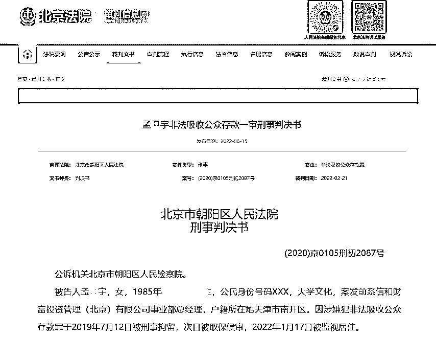
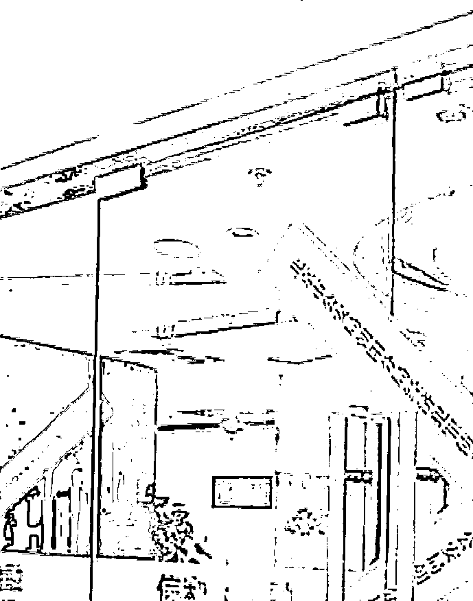
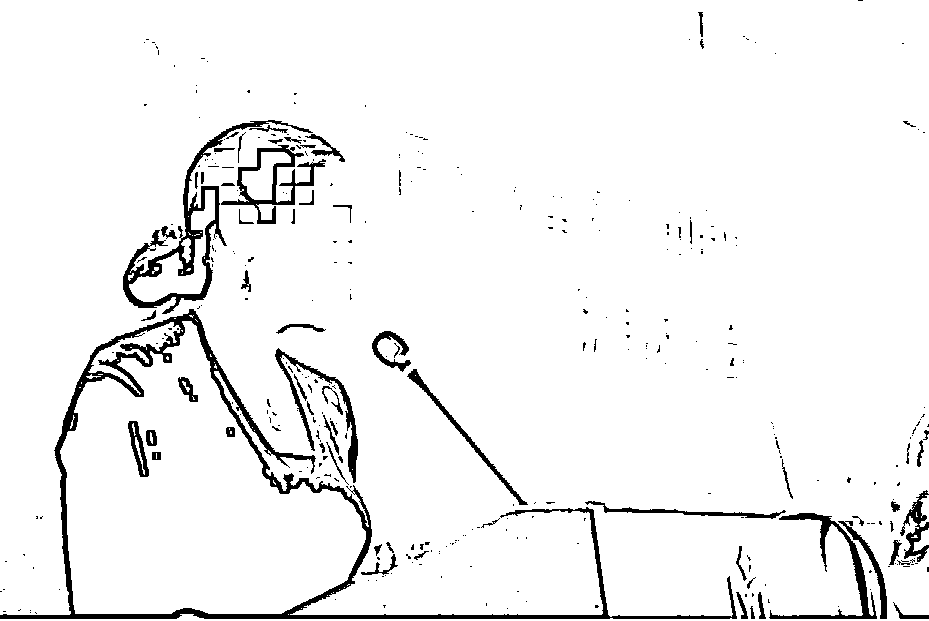

# 涉及 1200 亿“爆雷”大案！85 后美女“总经理”，判了

> 原文：[`mp.weixin.qq.com/s?__biz=MzIyMDYwMTk0Mw==&mid=2247538210&idx=5&sn=34d599a7baf9e5e64089ea52febd4f33&chksm=97cb9d1aa0bc140cc5011103294d42fd631c3981480ab32b4a7b4cdf18848d832c23401dcf99&scene=27#wechat_redirect`](http://mp.weixin.qq.com/s?__biz=MzIyMDYwMTk0Mw==&mid=2247538210&idx=5&sn=34d599a7baf9e5e64089ea52febd4f33&chksm=97cb9d1aa0bc140cc5011103294d42fd631c3981480ab32b4a7b4cdf18848d832c23401dcf99&scene=27#wechat_redirect)

曾经的线下理财“四巨头”之一信和财富，于 2019 年 5 月被警方立案侦查。时隔两年，“信和系”后事如何？

近日，朝阳区法院公布的一份刑事判决书显示，时任信和财富事业部总经理孟某宇违反国家规定，变相吸收公众存款，扰乱金融秩序，犯非法吸收公众存款罪，一审被判有期徒刑四年，罚金 20 万元。

据判决书透露，“信和系”实控人等多人在全国多地设立分公司，利用多个 P2P 平台吸引不特定公众投资。经初步统计，吸收资金共计 1200 余亿元。这个数额，“e 租宝”和“唐小僧”等亦难望其项背。

来看详情——

**“信和系”吸金 1200 余亿**

“眼看他起高楼，眼看他宴宾客，眼看他楼塌了”，在短暂兴盛后，P2P 行业曾经的佼佼者接连暴雷，“信和系”平台正是其中一例。

因涉嫌非法吸收公众存款等，“信和系”实控人及高管均被刑拘。近期，朝阳区法院公布了信和财富投资管理（北京）有限公司事业部总经理孟某宇的刑事判决书，透露了“信和系”的疯狂。

据朝阳区人民检察院指控——

人员：孟某宇，伙同夏某（另案处理）、夏某兵（另案处理）等人；

时间：2014 年至 2019 年 5 月间；

地点：位于北京市朝阳区东三环北路甲 19 号楼嘉盛中心、丰台区汉威国际广场 3 区 3 号楼等地的信和财富投资管理（北京）有限公司、信和上融网络科技（北京）有限公司、信和惠民投资管理（北京）有限公司等关联公司内；

形式：通过门店业务人员“地推”、媒体广告等形式进行公开宣传，利用“信和大金融”“金信网”“资产家”等 P2P 平台，以债权转让的方式与集资参与人签订《定向委托认购协议》《魔投系列服务协议》等协议，承诺高额回报，吸引不特定公众投资。

据悉，夏某等人在全国多地设立分公司、开设线下门店从事上述吸收资金业务。经初步统计，夏某等人吸收资金共计 1200 余亿元。这个数额，“e 租宝”和“唐小僧”均难望其项背。

**线上+线下疯狂展业**

公开资料显示，信和财富成立于 2012 年 5 月，以做线下理财起家。2014 年 9 月，其曾在打出“信和财富，说话算数”的广告语，借着 P2P 行业的东风，快速开启扩张序幕。

天眼查 APP 信息显示，信和财富曾在全国范围内曾开设过 402 家分公司，线下理财业务布局非常广泛。此外，信和财富还关联三家 P2P 平台，即信和大金融、金信网、资产家。

其中，信和大金融 2014 年上线，上线后推出了“魔投”、“资产家”、“借么”等产品。由金葵花资本管理公司持股 90%，夏某持股 10%共同控股，其中金葵花资本由刘某芳持股 90%，夏某兵持股 10%控股。截至 2018 年底，三家 P2P 平台累计规模超百亿。

2015 年 7 月，大连市处置非法集资相关部门指出，包括信和财富大连分公司在内的 9 家企业，“在我市各公园、超市、早晚市场和商场向不特定对象发布各类投资理财宣传材料，承诺年化收益 8%到 15%不等，上述企业属于普通类工商企业，不能从事与投融资理财业务相关的金融业务，更不得以任何名义、任何形式向社会不特定对象吸收资金。”

2016 年，信和财富部分产品开始出现逾期，至 2017 年大面积被投资者控告产品逾期未兑付。2019 年 5 月底，信和大金融和金信网被北京朝阳经侦查封，办公室大门被直接贴上了封条。

据北京公安局朝阳分局官方微信发布情况通报称，2019 年 5 月 30 日，朝阳公安分局依法对信和上融网络科技（北京）有限公司涉嫌非法吸收公众存款案立案侦查，并于当日对公司实际控制人夏某（男，49 岁）等 100 余名涉案人员采取刑事拘留强制措施。

警方表示，已向全国公安机关发布协查通报，协助做好投资人举报受理工作。投资人接报案、调查取证、人员审查、资产追缴等侦办工作已同步推进。

此后，各地公安机关陆续发布案情通报，要求集资参与人前往公安机关报案。由于信和财富涉及线上线下业务，且门店遍及全国，调查难度相当大。

**非吸 7 亿被判四年**

回到此次案件中来，对于热衷于广泛宣传的信和财富来说，实控人夏某等人长期藏匿于背后，前台宣传职能大多由本案中的信和财富事业部总经理孟某宇进行。

例如，在被大连市处置非法集资相关部门点名后，2015 年 9 月，信和财富即在大连举办了“信和财富杯”中国环渤海帆船拉力赛。

彼时孟某宇表示，信和财富冠名 2015 中国环渤海帆船拉力赛，希望传递信和财富“普惠金融，惠及大众，信用中国，和谐共富”的愿景，力争成为中国互网联金融服务创新发展的引领者。

另外，在“信和系”产品出现逾期而被质疑之际，孟某宇曾对媒体表示，严格风控管理一直以来都是信和财富发展的重中之重，公司拥有千余人的实地考察团队，针对每一笔借款业务、针对每一个借款人，均做到 100%实地考察；再通过近千人的信审专家团队进一步审查，做到对投资风险的全方位把控，保障投资人资金的安全无虞。

在“信和系”崩塌后，2019 年 7 月，孟某宇被北京市公安局朝阳分局垡头派出所民警抓获。经查，孟某宇本人参与吸收资金高达 7 亿余元。案发后及法院审理期间，孟某宇家属代为退缴 220 万元。

对于检察院指控的主要事实和罪名，孟某宇均不持异议。其辩护人提出，孟某宇如实供述犯罪事实，认罪认罚，在共同犯罪中所起作用较小，积极退赔集资参与人经济损失，且系初犯、偶犯，建议法庭对孟某宇减轻处罚。

对此，法院认为孟某宇违反国家金融管理规定，伙同他人面向社会公众公开宣传，承诺返本付息，非法吸收资金，数额巨大，其行为触犯了刑律，已构成非法吸收公众存款罪，依法应予惩处。

针对其适用缓刑的辩解，法院指出，孟某宇后期作为信和财富投资管理（北京）有限公司事业部总经理，负责对该公司融资事宜的管理，参与犯罪时间较长，且仅退缴部分违法所得，不属于犯罪情节较轻可以适用缓刑的情形。

最终一审法院判决：孟某宇犯非法吸收公众存款罪，判处有期徒刑四年，罚金 20 万元。继续追缴其违法所得，用于退赔集资参与人经济损失。

来源：中国基金报，利箭在出击

](https://mp.weixin.qq.com/s?__biz=Mzg5ODAwNzA5Ng==&mid=2247487973&idx=1&sn=1b62da6f2018402862a5c375e10c355e&chksm=c06878b2f71ff1a4fbe7df4dec626aa7e696154751693bf16f6c6a302ceaa4d1959040c70518&scene=21#wechat_redirect)

← 向右滑动与灰产圈互动交流 →

