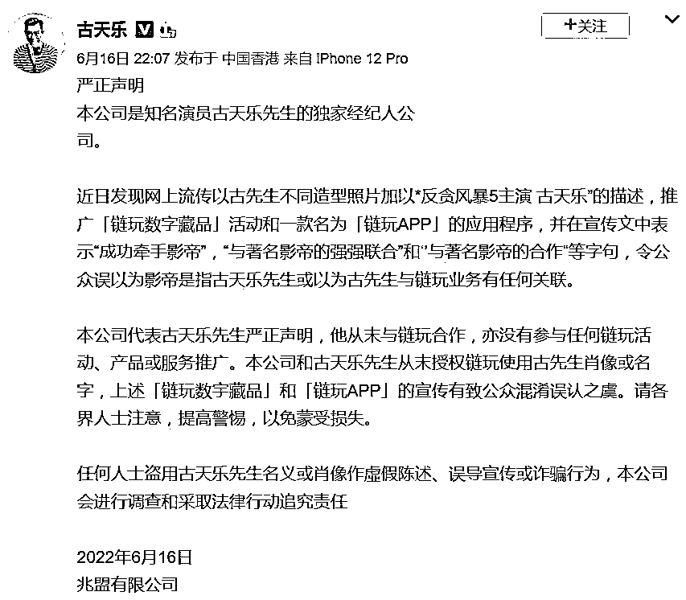
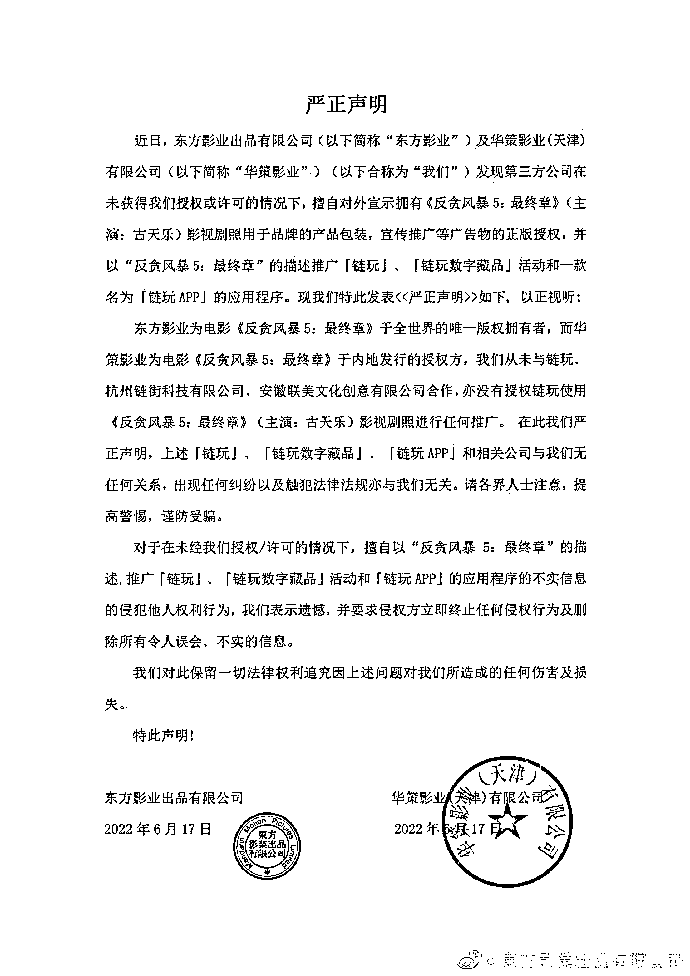
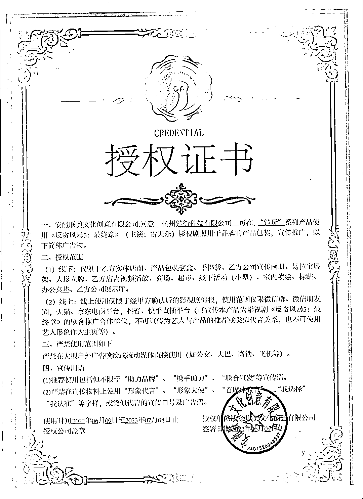

# 古天乐再发声明

> 原文：[`mp.weixin.qq.com/s?__biz=MzIyMDYwMTk0Mw==&mid=2247538210&idx=7&sn=fb288adc91872db36b79be097c1c4496&chksm=97cb9d1aa0bc140cfa5aa6e7f3116f0f95f2f22261711f8ab85fe8525e03641adefae34a733d&scene=27#wechat_redirect`](http://mp.weixin.qq.com/s?__biz=MzIyMDYwMTk0Mw==&mid=2247538210&idx=7&sn=fb288adc91872db36b79be097c1c4496&chksm=97cb9d1aa0bc140cfa5aa6e7f3116f0f95f2f22261711f8ab85fe8525e03641adefae34a733d&scene=27#wechat_redirect)

本文转载自每日经济新闻 

影帝维权，到底怎么回事？ 

6 月 16 日晚，古天乐经纪公司在社交媒体通过古天乐的账号发布严正声明，表示古天乐与“链玩”业务没有任何关联，并提醒各界人士提高警惕，以免蒙受损失。

6 月 18 日，电影《反贪风暴 5》在官方微博发布声称，东方影业出品有限公司及华策影业有限公司发现第三方公司在未获得授权或许可的情况下，擅自对外宣示拥有《反贪风暴 5:最终章》影视剧照的产品包装，宣传推广等广告物的正版授权，并以“反贪风暴 5:最终章”的描述推广“链玩”“链玩数字藏品”。东方影业出品有限公司官方微博也发布了此声明。

当晚，古天乐微博账号转发了该声明。

6 月 15 日，一个名为“链玩”的微博账号发布了一篇以古天乐形象为头图的推广文章，宣称“链玩与著名影帝的强强联合，是链玩平台的重要布局之一”。

6 月 17 日，古天乐第一次发声明后，据中新经纬，“链玩”曾回应称，公司拥有《反贪风暴 5：最终章》(主演：古天乐)影视剧照正版授权；此次活动一切权益均获得合法授权，平台也将积极配合古天乐方做出一切必要声明。

但 6 月 18 日晚间，“链玩”再次发布声明回应称，在取得安徵联美文化创意有限公司授权下，使用了《反贪风暴 5：最终章》影视剧照，并且已与投权方签订合同并支付授权使用费。

来源：毕萌商城官方微信号

在注意到相关與情之后，紧急联系授权方进行核实，但授权方至今尚未有明确回应。为避免事态进一步扩大，公司开展的 6.18 活动立即终止，相关宣传物料及宣传文章等进行下架处理，并继续向授权方核实相关投权事实，将结果在第一时间对外公布。

**“链玩”什么来历？**

**涉嫌侵权的“链玩”是一家数字藏品平台。**

**该平台自称“链玩 app 是国内领先的数字藏品综合服务平台，为数字藏品、数字艺术品、数字版权等数字资产提供创作、铸造、收藏、交易、经纪等服务。”**

**据其自述，“链玩”平台于 2021 年上线，主要用户都是“Z 世代玩家”。但记者发现，作为一个数字藏品发售平台，无法找到其平台官网及官方公众号，连发布信息的微博账号都没有进行官方认证。**

********

**而网上流传出的各类推广文章都指向了其大力宣传的“链玩 App”。**

**据界面新闻，根据“链玩 App”推广链接显示，其自称已经有 20 万+的下载量，记者下载了其官方 App，进入 App 首页，就能看到刚上线的古天乐形象的活动推送，活动采取各种文案吸引用户邀请好友注册 App，并辅以“消费满 xxx 元即可参与回购活动”等刺激用户消费的营销方案。**

**而在其 APP 的第二页，就是一个数字藏品二级交易市场，里面各类数字藏品都可以进行二级交易，在页面头部，还滚动播报着交易记录，例如“xxx（账号名称）购买了 xx（藏品编号）藏品。”**

**根据 4 月 14 日，中国互联网金融协会、中国银行业协会、中国证券业协会共同发布的《关于防范 NFT（非同质化通证）相关金融风险的倡议》第三条的倡议恰恰就是“不为 NFT 交易提供集中交易（集中竞价、电子撮合、匿名交易、做市商等）、持续挂牌交易、标准化合约交易等服务，变相违规设立交易场所。”**

**除了古天乐，该平台上还有刘亦菲饰演的花木兰形象的数字藏品售卖，价格为 59.9 元人民币，数量 11800 份，显示已经售罄。但目前并不清楚是否获得刘亦菲方及《花木兰》电影版权方迪士尼公司方面的授权。**

**在黑猫投诉平台上，与“链玩”有关的投诉反馈达到了 145 条。**

**自 5 月开始，就有大量玩家投诉“链玩”平台出现提现不到账及虚假宣传等现象。而网上流传的一份链玩平台名义的“红头文件”显示，5 月 19 日，该平台发布公告称“支付宝提现额度已经不能完全满足平台需求，建议用户使用银行卡提现。”**

**据中新经纬，“链玩 APP”平台背后的主体公司名为杭州链街科技有限公司。启信宝 app 数据显示，该公司注册与 2018 年，法定代表人经过数次更换，目前的法定代表人为石高涛，注册资本 200 万元，石高涛股权占比为 60%，另一股东周屹昕占比 40%。资料显示，石高涛同时也是浙江天搜科技的实际控制人。**

**5 月 27 日，杭州链街科技有限公司因登记的地址无法联系而被列为企业经营异常名录。**

********

****律师解读****

****据中新经纬报道，北京云嘉律师事务所律师、中国政法大学知识产权研究中心特约研究员赵占领接受中新经纬采访时分析，“链玩从影视剧版权人处获得授权，可使用《反贪风暴 5：最终章》影视剧照用于宣传推广，剧照中包含古天乐的肖像。所以，链玩不仅应获得影视剧的版权授权，也应获得肖像授权。”****

****“这里还涉及另外一个问题，即这部影视剧的版权人是否享有古天乐肖像权，或者转授权。”赵占领指出，如果影视剧的权利人没有获得肖像权的授权以及转授权，那么链玩使用剧照，即使不构成版权侵权，但可能构成肖像权的侵权。****

****赵占领还提到，影视剧的权利人在对“链玩”进行授权时强调，推荐使用“助力品牌”“联合宣发”等宣传语，禁止使用“形象代言”等字样。****

****赵占领指出，按照古天乐一方的说法，他并没有和“链玩”合作，同时影视剧的权利人也没有在这方面进行授权，甚至影视剧的权利人可能也没有权利转授。所以链玩在宣传推广中使用“与影帝强强联合”等表述是有问题的，应该涉及虚假宣传。****

****北京市京师律师事务所律师孟博也指出，“根据《广告法》的规定，广告不得含有虚假或者引人误解的内容，不得欺骗、误导消费者，广告主应当对广告内容的真实性负责。”****

****最后，“链玩”平台被古天乐公司辟谣的背后是近期已经逐渐泛滥的数字藏品炒作行为，在利益诱惑下，不止链玩 App，许多数字藏品平台都深陷争议之中，而涉嫌包括虚假宣传、天价炒作、甚至非法集资等违法行为的乱象也逐渐一一出现。****

****据界面新闻，长期关注数字藏品领域的分布科技 CEO 达鸿飞表示：“数藏行业入局门槛低，从业者素养参差不齐，行业自律、监管法规未及时跟上，行业与监管机构的沟通仍需加强。如果数字藏品的从业者能形成行业自律标准，与监管保持沟通，同时监管机构出台相应法律法规，及时查处违法行为，这些问题都会逐步得到解决，大众对于数字藏品的理解也将进一步加强。”****

****来源： 南风窗  值班编辑：陆茗 排版：八斤****

************](https://mp.weixin.qq.com/s?__biz=Mzg5ODAwNzA5Ng==&mid=2247487973&idx=1&sn=1b62da6f2018402862a5c375e10c355e&chksm=c06878b2f71ff1a4fbe7df4dec626aa7e696154751693bf16f6c6a302ceaa4d1959040c70518&scene=21#wechat_redirect)****

****← 向右滑动与灰产圈互动交流 →****

********