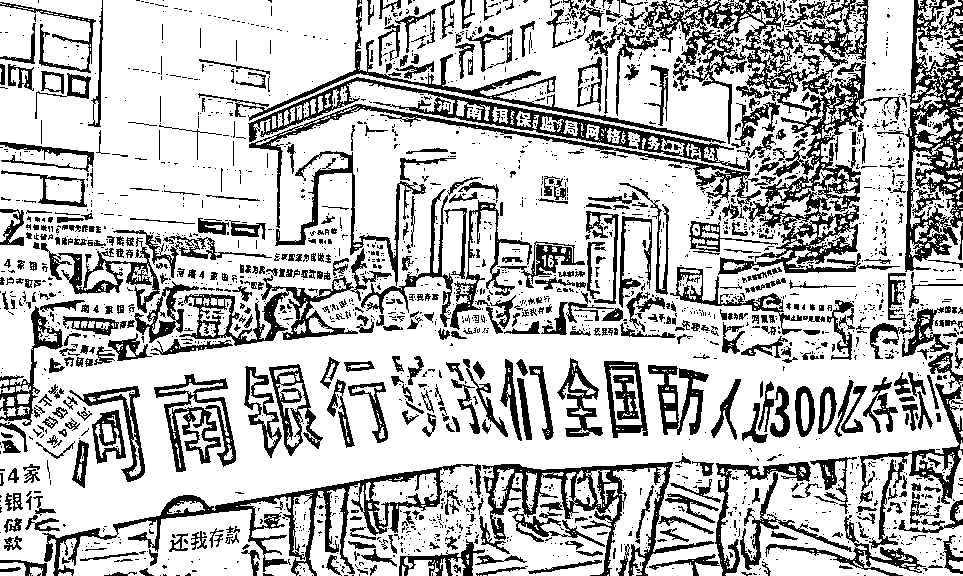
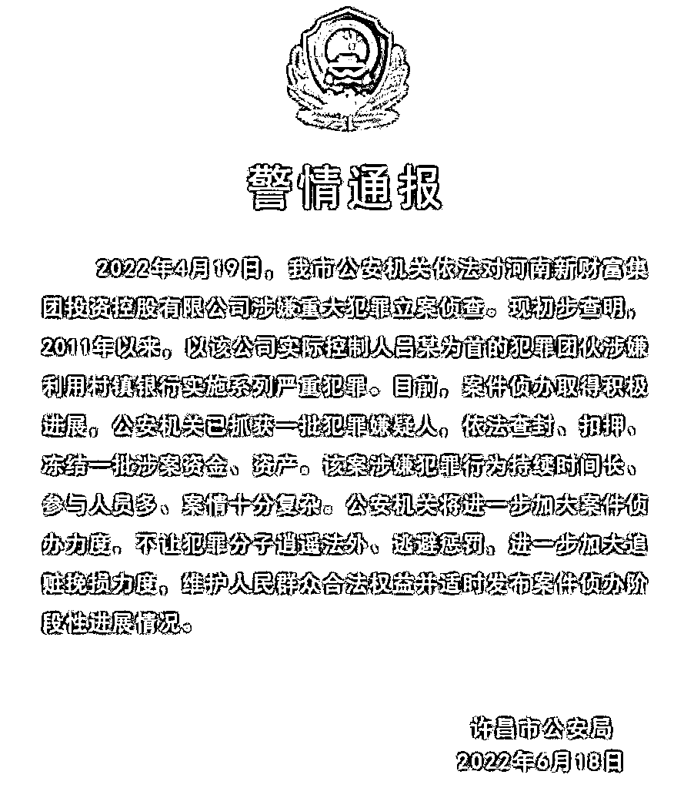
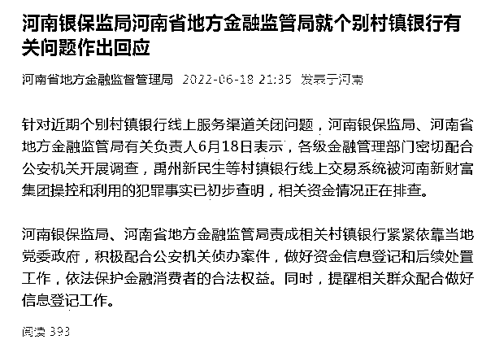
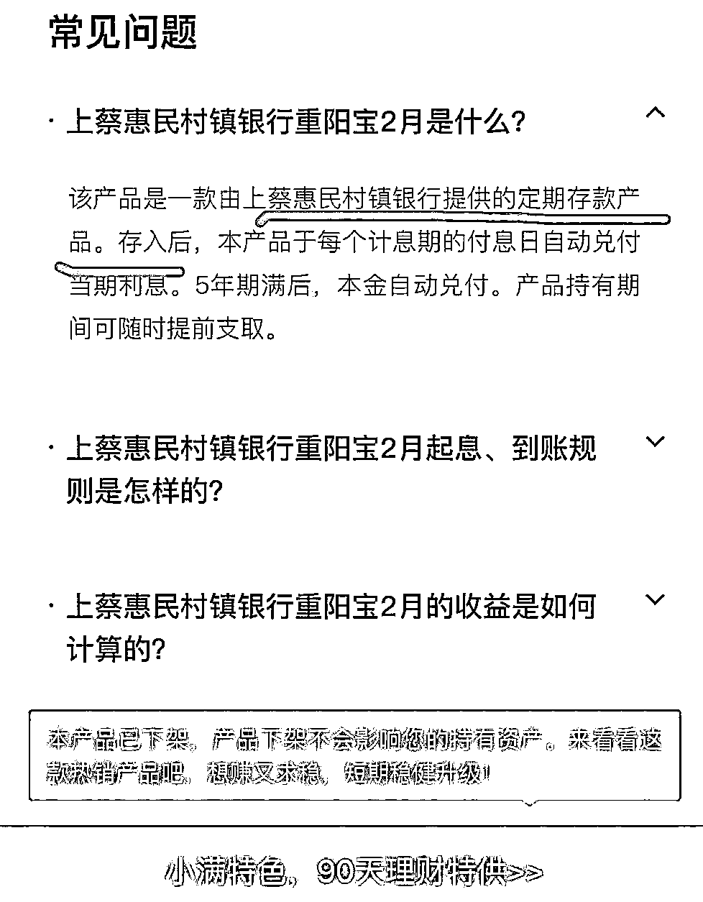
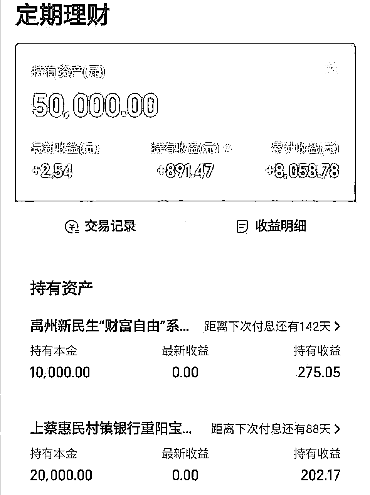
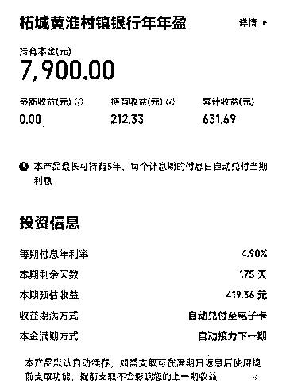
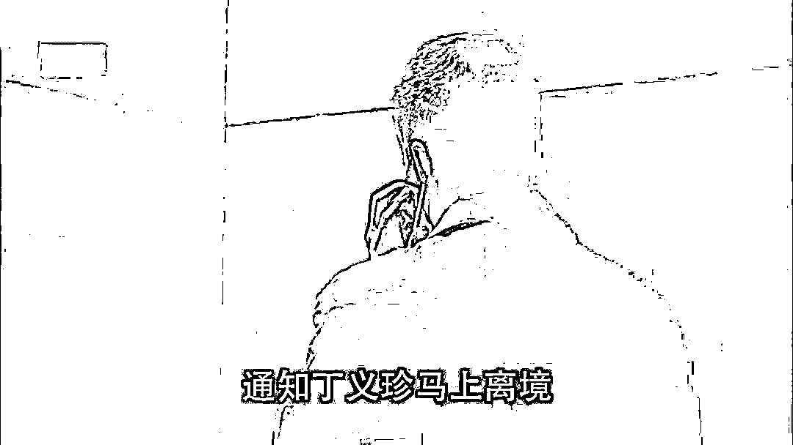

# 近 400 亿银行存款消失案件的侦办公告，陆续出来了

> 原文：[`mp.weixin.qq.com/s?__biz=MzIyMDYwMTk0Mw==&mid=2247538269&idx=1&sn=fe7270e62d04d8f1c055ed97f72ac16a&chksm=97cb9d65a0bc14734a77aa68017f6fa581384e9c69d71c49400413b421c3431a9726c19fd83d&scene=27#wechat_redirect`](http://mp.weixin.qq.com/s?__biz=MzIyMDYwMTk0Mw==&mid=2247538269&idx=1&sn=fe7270e62d04d8f1c055ed97f72ac16a&chksm=97cb9d65a0bc14734a77aa68017f6fa581384e9c69d71c49400413b421c3431a9726c19fd83d&scene=27#wechat_redirect)

**************1**************

**作为自媒体行业的一员，明哥首先关注到了《[**40 万储户的 400 亿存款，怎么就不翼而飞了呢？**](http://mp.weixin.qq.com/s?__biz=MzIyMDYwMTk0Mw==&mid=2247523693&idx=5&sn=f45ff38533d2a24e68eb30ee5e969a0d&chksm=97cb5655a0bcdf4311205787137c2fdb70bee2b6f72dbc6817926dc43a0f6e6c0ab088a40c26&scene=21#wechat_redirect)》。** 

**随着河南省、安徽省 7 家银行大约 30 万储户的个人健康码，突然变成红色了，这起离奇的资金失踪案， 才终于被大众所熟知，冲击到了民众的心理底线。** 

********

**因为，从 2015 年兴起的 P2P 网贷、炒房、创业、炒股、基金的潮起潮落，老百姓对风险的认知已经到了一个前所未有的高度。** 

**但是，有一条红色底线：**银行代表着安全，却是在老百姓心底深处，颠扑不破的根本真理。****

**无论外面如何风高浪急，银行里的存款，至少应该是安全无虞的。**

**如今，近 30 万储户，放进银行的钱，无法提取，又给全社会每一个成年人，上了生动而又血淋淋的一堂风险教育课。** 

**近 400 亿元的涉案资金，是怎么在毫无征兆的情况下，被瞒天过海、移花接木地消失了？** 

**我们之前的猜测一点都没错。** 

**但是，随着案件的侦办公告陆续出炉，我们看到公权力部门在紧锣密鼓地行动的同时，也终于意识到了，30 万储户的近 400 亿资金，再也无法原样足额地回来了。**

******2******

****2022 年 6 月 18 日，河南省许昌市公安局，发布了警情通报。**** 

********

*******依法对河南新财富集团投资控股有限公司涉嫌重大犯罪立案侦查……******* 

*******以吕某为首的犯罪团伙涉嫌利用村镇银行实施系列严重犯罪……******* 

*******公安机关将进一步加大案件侦办力度，进一步加大追赃挽损力度……*******

****我们相信，警方必然和河南省银保监局、河南省地方金融监督管理局，交换过案件基本资料，并且对案件的本质定性，通过气了。****

****警方和其他监管方的公布，措辞是非常严谨的，既要考虑到当前实际定性，更要考虑到以后的善后措施。****

****所以，从公告中的措辞，我们基本能够猜测到案件的最终走向，以及近 30 万储户是否能够一分不少地要回他们的存款了。****

****结果可能要让他们失望了。**** 

****答案就藏在公告里。**** 

****警方的公告说针对的犯罪主体是：**河南新财富集团投资控股有限公司、以吕某为首的犯罪团伙，**而不是 7 家**村镇银行**。****

****「犯罪团伙涉嫌利用村镇银行实施系列严重犯罪」的表态，直接认定，**村镇银行不是实施犯罪的主体，并且，银行也成为了受害者，受害者的身份和储户是一样的。******

****如果案件最终定性为：河南新财富集团，非法吸收公众存款，或者是集资诈骗，那么银行只是临时存款的通道而已，钱很快被转移出去了，银行就极有可能无责，储户们也无法享受国家存款保险制度下，50 万以下额度刚性兑付的保护了。****

****5 月 20 日，银保监会有关部门负责人在新闻通气会上表示，这几家村镇银行的大股东河南新财富集团**利用第三方平台或通过资金掮客吸收公众资金**，涉嫌违法犯罪……****

****你品，你仔细品。****

******这措辞，是否和前几年层出不穷的 P2P 网贷平台爆雷后，警方的措辞几乎是一致的？******

****吸收公众资金，就基本上能够否定银行吸收了存款，而是犯罪集团利用了互联网金融平台、村镇银行，作为通道，非法吸收了公众资金，实施了集资诈骗。****

********

****同样地，我们查阅了下河南省地方金融监督管理局面向公众的通告，其中有一句话：依法保护**金融消费者**的合法权益……****

******为什么是：****金融消费者，****而不是：****储户？******

******如果是金融消费者，消费的是金融产品，产品的收益率自然有波动，甚至可能血本无归，那么就：买定离手、盈亏自负。****** 

******如果是储户，那就无条件享受国家制定的银行存款保险制度，50 万元以下必须得到兑付。******

**********3**********

****近 30 万储户，在互联网金融平台（度小满、京东金融……）上，一直以为，并且深信自己是在储蓄、存款。****

****因为，无论是村镇银行，还是销售该类产品的互联网金融平台，一直在明显的地方提及二字：存款。****

****比如，度小满平台上的：上蔡惠民村镇银行重阳宝 2 月，是一款定期存款产品。****

****我们一听这名字，明显是理财产品的命名。****

****但是，**不是专业从事金融工作的老百姓**，哪里会知道，**存款产品**，重点词是：**产品**，而不是：存款？**** 

********

****如果换了个界面，推介同样一款的产品，就会明确说明，这是：定期理财，而不再是银行存款了。****

********

****另一家银行的一款产品，明确列出了一栏：**投资信息**。**** 

****言下之意，这是在投资，而不是在存款：****

********

****所以，我们大致能够勾勒出近 400 亿资金无法兑付案件背后的来龙去脉。****

******1、以吕奕为首的河南新财富集团，通过层层持股、安插白手套的形式，实际控制了至少 7 家村镇银行；****** 

******2、村镇银行，在主动或者被动的情况，找来度小满、京东金融等平台合作；****** 

******3、为了拉拢尽量多的投资者，前来购买银行发行的理财产品，互联网销售界面上，多处暗示****存款****字样，甚至欺骗投资者****享受存款保险制度的保护****；******

******4、资金进入银行后，只是临时性进入了专用的存款账户，很快被以投资的名义转走；****** 

******5、以吕奕为首的实际控制人集体，隐遁海外，并且转走资金到境外……******

********

****我们相信警方，一定会在最大范围内，追赃挽损，将还留在境内金融体系内的残存资金冻结，并且作为补偿投资者的资金池来源。**** 

****但是，**对 30 万「储户」而言，从法理的角度，要想动用国家银行存款保险制度，来作为刚性兑付的理由，声索全部本金，难度已经大增，甚至已经没有可能性了。******

****难道这些无辜的老百姓，就只能打落牙齿和血吞、将一辈子的积蓄拱手送人吗？****

****还有两种办法。****

******第一，他们依然可以用村镇银行作为资金的存管行，对存款类理财产品的投向去处，没有尽到基本的存管责任为理由，要求银行刚性兑付。****** 

****然而，总共接近 400 亿资金消失，而每家村镇银行的储户存款额才 10-30 亿元，**哪怕把其他正常储户的钱全部拿出来赔，也不够的呀！******

****消息发酵之后，别说是河南、安徽当地的村镇银行、城市商业银行、农信社等，全国范围内的小银行、地方银行，都有可能会迎来挤兑潮，储户们纷纷把钱取出来，放到大银行里去。****

****这 7 家村镇银行账上，还有多少资产，都是个未知之数了。****

****第二，**如果没有互联网金融代销平台，为虎作伥，近 30 万的老百姓，这辈子都不可能把钱存到河南、安徽两省的村镇银行里；******

****更严重的是，**作为代销平台，在利益的驱使下，完全没有任何毫无责任心、不做审核地诱导客户以为自己是在存款，而不是投资、理财。******

****明哥根据在互联网行业的从业经验，可以百分之百地确定，无论是度小满、京东金融、小米金融、支付宝，凡是销售理财产品、公募基金、信托产品，几乎都是按照成交额，从销售方那里提取佣金，获得回报的。**** 

****互联网代销平台，基于利益动机，会尽一切可能，夸大、美化产品的安全性、潜在收益率，诱导互联网小白用户，将银行里的存款通过这些平台，流入村镇银行、公募基金、信托公司等。****

****至于这些产品最终的下场，互联网金融代销平台才不会管呢，因为它们早就把提成、佣金，收得手软了。****

******生前我当及时行乐，死后哪管他洪水滔天？！****** 

****所以我这几年，不遗余力地在一切可能的场合，都批判以蚂蚁金服（支付宝平台）为典型的互联网金融平台，刀尖狂舞，吃相难看。**** 

****6 年前，它们助推 P2P 网贷产品；**** 

****4 年前，它们上 100 倍高杠杆，推出借贷消费产品；****

****2 年前，它们宣传 A 股基金、把基金经理包装成股神；**** 

****1 年前，它们把理财产品包装成存款。****

****在对 P2P 平台追赃挽损的过程中，警方可以把为 P2P 网贷产品代言过的明星、做过广告的平台、P2P 公司的高管和员工，让他们乖乖地把代言费、广告费、工资和奖金，原路返回，作为部分资金，减少投资者的损失。**** 

****同样，7 家村镇银行近 400 亿元资金消失，**曾经为不是存款的理财产品做过营销的互联网金融平台，到底收取了多少广告费，也应该悉数吐出来！******

****明哥自从 2019 年开始写公众号，笔触谈及过房价、P2P 网贷、A 股基金、理财产品、虚拟货币、商业内幕。**** 

****在一轮又一轮的金融财富陷阱中，数不胜数的老百姓，怀抱着对未知领域的信仰，憧憬着用钱生钱的躺赚游戏，被一波又一波地收割干净了。**** 

****然而，明哥确实无法穷尽所有的金融骗局。只能在事后揭露幕后操盘手们的镰刀伎俩。****

****但是有一条铁律，你只要严格遵守，基本上就可以全身而退：**** 

******你的钱，流向了哪些底层资产？******

******如果可以增值，它的商业逻辑是怎样的？******

****无论是谁，无论是哪个平台，自带光环地诱导你参加，你只需要问自己：答案是什么，为什么这种好事会轮到我的头上？****

******看似很愚笨，实际上大智若愚，会炼就金身铁骨，百毒不侵。******

****来源：明哥在路上****

************](https://mp.weixin.qq.com/s?__biz=Mzg5ODAwNzA5Ng==&mid=2247487973&idx=1&sn=1b62da6f2018402862a5c375e10c355e&chksm=c06878b2f71ff1a4fbe7df4dec626aa7e696154751693bf16f6c6a302ceaa4d1959040c70518&scene=21#wechat_redirect)****

****← 向右滑动与灰产圈互动交流 →****

********