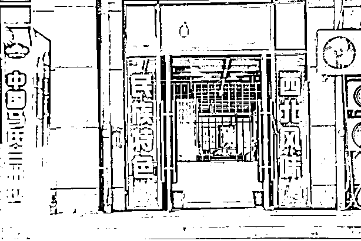
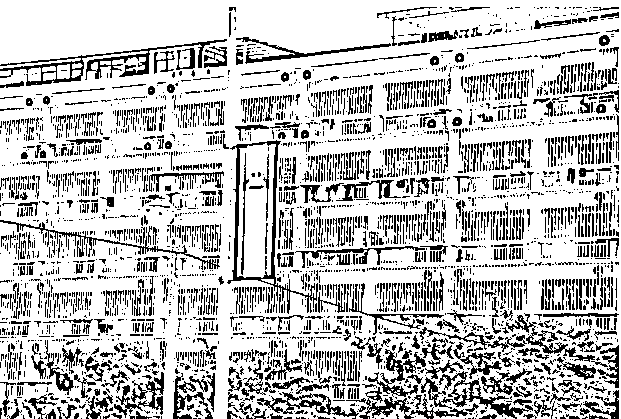
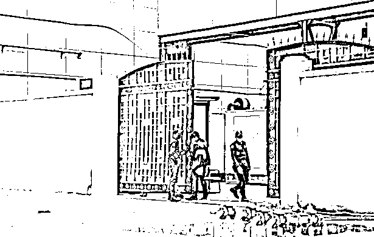
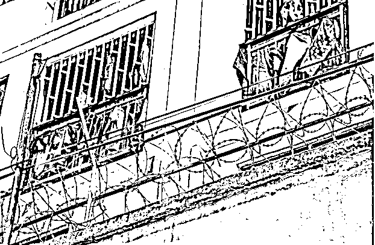
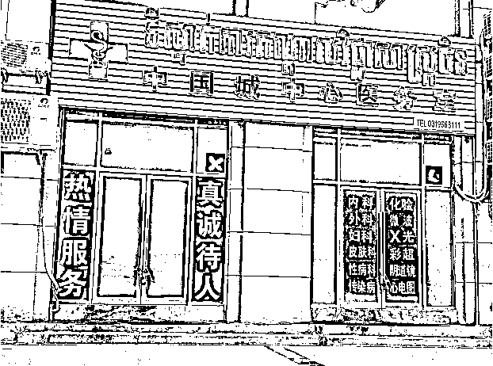
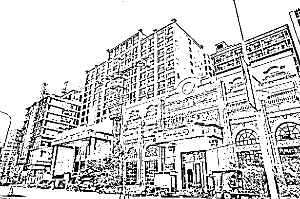
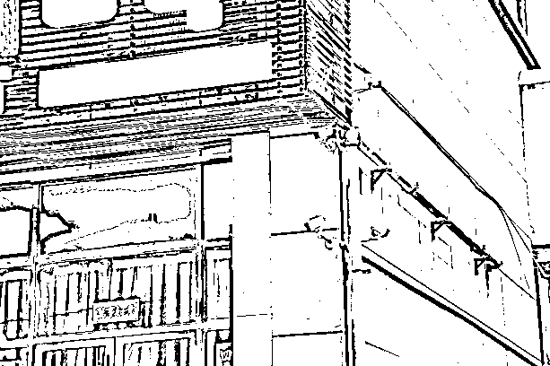

# 外媒直击柬埔寨网络诈骗窝点，西港“中国城”骗人来行骗

> 原文：[`mp.weixin.qq.com/s?__biz=MzIyMDYwMTk0Mw==&mid=2247538269&idx=3&sn=ce46abffa8509c4099760a73ea011dbb&chksm=97cb9d65a0bc1473f806c2fbb3b13a67b090fd6f252e17d60fdc4df47084678de98df44b5c57&scene=27#wechat_redirect`](http://mp.weixin.qq.com/s?__biz=MzIyMDYwMTk0Mw==&mid=2247538269&idx=3&sn=ce46abffa8509c4099760a73ea011dbb&chksm=97cb9d65a0bc1473f806c2fbb3b13a67b090fd6f252e17d60fdc4df47084678de98df44b5c57&scene=27#wechat_redirect)

据《联合早报》报道，近 20 年来经济迅速增长的东南亚国家柬埔寨，是本区域另一个具增长潜力的希望之地，但近年也成为华语电话诈骗集团的温床。**除了中国公民以外，近月还传出一些东南亚国家的国民也被高薪骗到柬埔寨西哈努克港打工**。

他们抵达后才赫然发现**招聘广告上的厨师、交易员、人事专员等职位都是幌子**，真正的工作是进行网络诈骗。《联合早报》记者今年 5 月实地走访西港，并联系上一名受骗打工者，为读者揭开诈骗集团的黑幕。

[`mp.weixin.qq.com/mp/readtemplate?t=pages/video_player_tmpl&action=mpvideo&auto=0&vid=wxv_2449763837085024257`](https://mp.weixin.qq.com/mp/readtemplate?t=pages/video_player_tmpl&action=mpvideo&auto=0&vid=wxv_2449763837085024257)

走在柬埔寨西哈努克港（简称西港）著名的奥特斯海滩上，海天一色的美景让人仿佛置身度假村，但一转身，美好意境瞬间消失。因为离沙滩不到 200 米，**就是西港臭名昭著的诈骗集团基地“中国城”。**

中国城是西港规模最大的园区之一，由 20 多栋约 10 层楼高的建筑组成，外观看似非常普通的商业楼。不过，园区被高高的围墙和带刺铁丝网围起，从外头看不到里面，里面的人也几乎与世隔绝。偌大的园区只有两个出入口，各有持枪守卫看守，闭路电视无处不在。

园区内有餐馆、诊所、理发店、KTV 等各种服务设施，但大部分只开放给园区职员。位于大楼底层的店铺，面向大街的门皆深锁，少有对外开放的商店以铁栅把店面一分为二，将园区内外的人隔开。

“中国城”园区对外开放的商店包括这家兰州拉面店，店铺以铁栅把店面一分为二，将园区内外的人隔开。（邝启聪摄）

一名熟悉园区运作的西港本地人告诉《联合早报》，**像中国城这样的园区在西港有 30 多个，打着“数字工业投资园”“经济贸易中心”等名义运营，****但实际上主要经营网络赌博和诈骗行当****。**这些园区规模各异，但都采取封闭式管理且守卫森严，这除了是为阻止外人擅闯，也为防工作人员逃跑。

**目标原本锁定中国大陆人 因疫情扩大至东南亚及中国台湾省**

**进驻园区的诈骗集团目标主要锁定中国人，所以职员也大多来自中国大陆**。不过，中国大陆为了防疫，这两年严控人员出境，诈骗集团面对“**人力资源困境**”，因此扩大招聘范围，开始把目光投向东南亚和台湾省能读写中文的华人。

单是过去三个月的见报新闻，已有至少 130 名来自马来西亚、泰国和印度尼西亚的受害者从园区被救出。有报道称，目前仍有数千人被困在园区内打工。

西港一家园区的阳台设有密密麻麻的铁栅，为防止园区职员爬出窗外逃离。（邝启聪摄影）

来自马来西亚的李伟鸿（化名，26 岁）是被骗到西港其中一个园区的打工者。他去年 12 月底抵达西港，受困四个月，今年 4 月获救后接受《联合早报》电访。

李伟鸿是经前同事介绍前往西港打工，以为自己加入的是网络博彩公司。他的前同事称，每月工资约 4000 美元（约 5560 新元），外加提成，还包吃包住，提供往返机票等。李伟鸿说：“我觉得工资和福利都很不错，所以决定试试。”

抵境后，公司以办理签证和入职手续为由没收了李伟鸿的护照。“他们让我签入职合同，但合同上面的条款和之前说好的完全不一样。薪水只有 1000 美元，每天的工作时间也从 8 小时加到 12 小时。”

最让他震惊的是，**他从事的不是网络博彩，而是当网络骗子。**

西港的诈骗产业五花八门，李伟鸿被安排到专骗中国人的网络投资诈骗团伙。他们一组 10 人，通过微信和 QQ 等通讯平台寻找“猎物”，然后诱惑对方使用公司的应用“投资”。

李伟鸿说，**公司会先让受害者尝到甜头，感受赚钱的快感，待受害者投入大笔资金，公司就会封锁账号，卷走全部的钱。**

为了提高可信度，李伟鸿和其他骗子还会自导自演，根据公司每日发出的“诈骗话术”剧本与受害者互动，一步步引他们入虎口。李伟鸿说：“**我们负责的手机有 50 到 100 台，每天的工作就是通过假账号‘炒群’，让群组看起来很活跃****。**”

短短三个月内，李伟鸿的小组骗了至少 30 人，所涉金额达 200 万人民币（约 41 万新元）。

李伟鸿说，**在园区与他共事的骗子有上百人，大多来自中国。**所有人都被限制在园区内活动，而**负责看守的守卫都配有枪、警棍和电棒。“如果被发现离开园区，会挨打挨电。”**

西港中国城园区的大门由多名保安人员看守。（邝启聪摄）

公司的主管也会体罚业绩不佳和工作态度差的职员，包括罚他们爬楼梯、跑操场、抄写诈骗话术等。骗术高明，有可观“营业额”的职员则会获重金奖赏。

不甘沦为骗财的工具，李伟鸿今年 4 月初要求离职。**岂料公司要他支付 5 万 5000 美元（约 7 万 6400 新元）赔偿金才肯放人。**

李伟鸿于是通过脸熟暗中向家人求助。他的家人随后与全球反诈骗组织（Global Anti-Scam Organization，简称 GASO）联系，并向马国警方报案，才成功让他脱险。

在园区共事的骗子有上百人，大多来自中国。所有人都被限制在园区内活动，而负责看守的守卫都配有枪、警棍和电棒。如果被发现离开园区，会挨打挨电。

——4 月获救的马来西亚人李伟鸿

**志愿组织过去一年救出至少八人**

**全球反诈骗组织（GASO）**过去一年成功救出至少八名受困西港园区的打工者，包括三名马来西亚人和五名中国人。

**总部在新加坡的 GASO 是由全球 80 多名志愿者组成，旨在为网络诈骗受害者提供支援。GASO 的许多志愿者曾是网络诈骗的受害者。**

负责协调救援行动的 GASO 发言人受访时透露，他们接获李伟鸿家人的求助后，第一时间和李伟鸿联系，要求他发送定位信息和偷拍公司的照片，以便找出他所在的地点。为确保不被诈骗集团发现，GASO 和李伟鸿必须等到夜深人静时才能联系，并在每次对话后删除通话内容。

由于李伟鸿提供的资料很充分，所以 GASO 把资料提交给马来西亚驻柬埔寨大使馆后，柬执法单位很快便锁定地点。

**但诈骗集团在警方展开救援行动前收到风声，把李伟鸿关进了“小黑屋”逼供**。小黑屋指的是园区内的幽禁室，全天有守卫看守，被关者不准吃喝，也不准睡觉。

幸运的是，李伟鸿被关的第二天就被柬埔寨警方救出。尽管警方上门要人，但这并没有影响诈骗公司的运作，他的“同事”也完不知情，继续诈骗。

从家人报案到救出李伟鸿，前后花了约一周，可算是非常顺利。

**柬埔寨诈骗“乐园”西港 受骗当诈骗者如何逃脱？**

西港大多数园区都设有高高围墙，以及带刺铁丝网，防止人员在未经允许情况下进出。（邝启聪摄）

GASO 说，救援行动往往会出现变数，尤其是受害者家属如果不愿配合，将给救援行动增添难度。例如，一些国家规定家属必须亲自报案，驻柬使馆才会帮忙施救，但有些受害者与亲人疏远，不相往来。此外，疫情暴发后，柬埔寨与一些国家的航班骤减，就算被救后也买不到回国的机票。

GASO 发言人说：“他们被营救后要找地方住，或者是躲起来。当地绑架事件普遍，如果到处乱跑，被绑架再卖回园区的概率非常高。”

一名熟悉柬埔寨人口贩卖“行情”的消息人士透露，为诈骗集团绑架劳工的价码如今已涨至 2 万 5000 美金左右。

还有一些诈骗集团会在发现有人报警后，把报警者“卖”去其他园区，使他在原本的联系网络中消失，让营救他的人找不到。而这些被“转卖”过的受害者，他们脱身的赔付金也会随着上涨。

**诈骗集团转移至缅北迪拜等地**

据了解，随着中国和柬埔寨合作加强取缔，部分诈骗集团已将大本营转移至缅甸北部和迪拜。

西港“中国人骗中国人”的事件引起中国政府关注。中柬在 2019 年成立中柬执法合作协调办公室，提升两国执法打击跨国犯罪的合作效率。**同年 8 月，中国警方派遣两架客机将 150 名涉嫌电信网络诈骗的罪犯从柬埔寨押送到中国受审，其中 132 人在西港被捕。**全球反诈骗组织认为，中柬两国的执法行动已在一定程度上打击西港的诈骗活动，但有情报显示，**诈骗集团仍如火如荼地进行招聘，而他们已把基地扩大至东南亚和中东地区。**

西港中国城诈骗园区内一家诊所面向大街的门深锁，防止工作人员逃跑。（邝启聪摄）

这些犯罪集团拥有庞大的资源和网络。马国媒体上月报道，一名雪兰莪州男子被好友骗到迪拜进行网络诈骗，岂料业绩不佳，在迪拜工作一个月后被转卖到西港园区。

全球反诈骗组织近月也接到来自缅北的求救信息，受害者主要是马来西亚人和台湾人。但由于当地政局不稳定，解救工作极具挑战。发言人说：“**那里不像柬埔寨有媒体和志愿工作者帮忙，如果被骗到缅北，被救的概率非常非常低**。”

全球反诈骗组织提醒，打工骗局的招聘地点也可能设在泰国、老挝、菲律宾等其他东南亚国家。“不要以为目的地不是柬埔寨或缅甸就安全，这些人蛇能随时把你偷渡过去，只要上了他们的车，你的自由就被限制了。”

**其他中企受牵连被抹黑**

猖獗的诈骗和犯罪活动打击了西港的形象。在当地经商的中国商人深感无奈，呼吁外界不要一竹竿打翻一船人，并强调许多中国企业在柬埔寨经营的是正规生意。

从事旅游项目开发的中国商人杨总告诉《联合早报》，今年初闹得满城风雨的“血奴案”传出后，数以千计中国人因担心自身安危撤离西港，许多人也因西港的负面新闻避而远之。

不愿具名的杨总指出，在西港发生的许多暴力事件属孤立个案，并不反映西港的真实面貌，媒体在报道前没有充分了解当地情况。

他称，**西港大部分园区经营的是网络赌博，不是诈骗活动，而一些网络博彩公司的营运执照尚未过期，所以至今仍在运营，并不违法**。

大批中国人于 2016 年前后到西港发展博彩业，赌场在当地如雨后春笋般涌现。但是伴随博彩业的犯罪问题也使西港治安不靖，饱受争议。

**网络赌博 2019 年全面被禁 部分业者改做网络诈骗**

柬埔寨政府在 2019 年以保障国家安全和公共秩序为由，停止颁发网络赌博执照，并全面禁止网络赌博。西港博彩业因此走向凋敝，部分活动转入地下，有的业者则改做网络诈骗。

2019 年初，西港在博彩业最鼎盛时期有**超过 91 家合法赌场**。随着柬埔寨政府在 2019 年 8 月 18 日发布“网络禁赌令”后，当地博彩业走向凋敝，许多赌场倒闭。（邝启聪摄）

杨总不否认有部分中国人在西港进行诈骗等非法活动，但他说：“西港这里有那么多中国人经营各式各样的行业，难道我们都是骗子吗？”

西港省政府数据显示，西港有 90％的产业由中国人投资和管理，包括酒店、赌场、零售业和服务业等。其中，由中国和柬埔寨企业共同开发的西港经济特区的工业产值对当地的经济贡献率超过 50％。

**东南亚仍须提高反诈意识**

被骗到西港为诈骗集团打工者，不少是受过教育的年轻人。东南亚国家须加强宣导，提高人们的反诈意识，从源头解决问题。

提供法律援助的慈善机构国际正义使命团（International Justice Mission）柬埔寨项目主任西姆斯（Jacob Sims）受访时说，东南亚人在西港的强迫劳动案例近两年才出现，而这很大程度上是因冠病疫情所致。

疫情带来的高失业率和经济萧条使不少人陷入困境，而在面对金钱压力时，人们更容易受骗。

他指出，被骗到西港的不是低技能工人，而是受过教育，可以读写多种语言，以及能操作和执行复杂诈骗手段的年轻人。“疫情前，这类劳动人口不太可能被贩卖，也不太可能到柬埔寨求职或从事风险较高的工作。”

西港园区的每个出入口都有多架闭路电视进行监控。（邝启聪摄影）

今年 3 月，国际正义使命团与另外 34 个东南亚国家的人权组织联合发表声明，对柬埔寨园区的强迫劳动表示担忧。巴基斯坦、越南和印尼等国大使馆也发出警告，呼吁民众不要轻信网络招聘广告。

中国驻柬埔寨大使馆就提醒国人谨防高薪招聘陷阱，呼吁前往柬埔寨工作者在出发前签署正规劳务合同，否则“等待你的绝不是高薪，而是网赌窝点的非法监禁和绑架勒索”。

除了加强宣导工作，西姆斯希望柬埔寨政府能提升打击网络犯罪的能力，严惩诈骗集团幕后金主。

来源：联合早报，天下有诈

](https://mp.weixin.qq.com/s?__biz=Mzg5ODAwNzA5Ng==&mid=2247487973&idx=1&sn=1b62da6f2018402862a5c375e10c355e&chksm=c06878b2f71ff1a4fbe7df4dec626aa7e696154751693bf16f6c6a302ceaa4d1959040c70518&scene=21#wechat_redirect)

← 向右滑动与灰产圈互动交流 →

