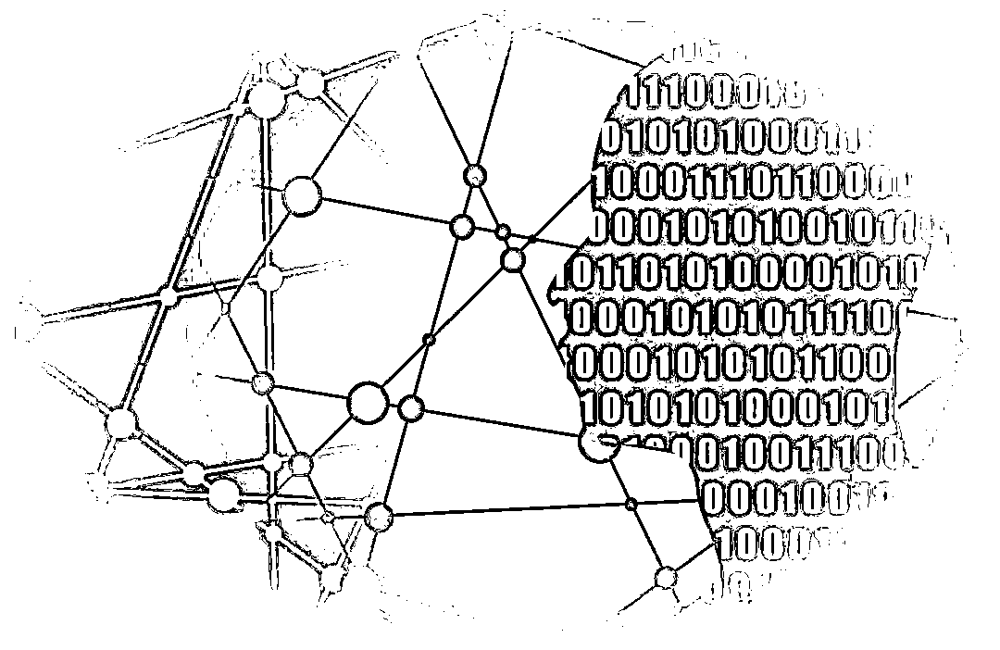

# 河南“取款难”村镇银行最新消息！新财富集团人去楼空，实控人疑已外逃

> 原文：[`mp.weixin.qq.com/s?__biz=MzIyMDYwMTk0Mw==&mid=2247538269&idx=4&sn=8db3acfe0048b95a0766fc6fc49fc382&chksm=97cb9d65a0bc147316b1e2c17f2e5fe16c943054536736a4eb849c91b2788ec100ccdd9580be&scene=27#wechat_redirect`](http://mp.weixin.qq.com/s?__biz=MzIyMDYwMTk0Mw==&mid=2247538269&idx=4&sn=8db3acfe0048b95a0766fc6fc49fc382&chksm=97cb9d65a0bc147316b1e2c17f2e5fe16c943054536736a4eb849c91b2788ec100ccdd9580be&scene=27#wechat_redirect)

**河南村镇银行“取现难”、储户“被赋红码”事件又有了新进展。多家银行开展线上客户资金信息登记。**

而背后的操控者河南新财富集团，总部早已人去楼空。

[`v.qq.com/iframe/preview.html?width=500&height=375&auto=0&vid=r3343pcphrj`](https://v.qq.com/iframe/preview.html?width=500&height=375&auto=0&vid=r3343pcphrj)

**开展线上客户资金信息登记工作**

6 月 20 日，柘城黄淮村镇银行、上蔡惠民村镇银行、禹州新民生村镇银行、开封新东方村镇银行发布公告称，按照金融管理部门要求，从即日起开展线上客户资金信息登记工作。**凡在该行线上交易系统关闭后不能正常办理业务的客户均需登记。**

客户信息登记表显示，用户需填写所在机构、身份证号、电子账户号、联系电话等基本信息。同时，针对所涉产品，也有交易时间、交易金额、产品名称、产品期限、产品年利率等诸多内容需要明确。

在交易渠道方面，客户信息登记表显示，除了自营渠道，还包括口袋银行、滨海国金所、小米金融、携程金融等多家渠道。

**河南新财富集团人去楼空**

此前的 6 月 18 日，河南银保监局、河南省地方金融监管局有关负责人表示，各级金融管理部门密切配合公安机关开展调查，**禹州新民生等村镇银行线上交易系统被河南新财富集团操控和利用的犯罪事实已初步查明**，相关资金情况正在排查。

河南银保监局、河南省地方金融监管局责成相关村镇银行紧紧依靠当地党委政府，积极配合公安机关侦办案件，做好资金信息登记和后续处置工作，依法保护金融消费者的合法权益。同时，提醒相关群众配合做好信息登记工作。

**河南新财富集团与近日引发广泛关注的河南村镇银行储户“被赋红码”事件紧密相关。**

许昌公安局称，现初步查明，**2011 年以来，以该公司实际控制人吕某为首的犯罪团伙涉嫌利用村镇银行实施系列严重犯罪。**

据第一财经报道，20 日上午，记者赶往总部位于郑州的河南新财富集团投资控股有限公司（下称“河南新财富集团”）时，发现这里早已人去楼空。一楼的大门处，张贴着禹州市公安局于 4 月 25 日张贴的封条。

**背后“影子老板”**吕某**疑已赴美**

据第一财经，许昌公安局警情通报中提及的“吕某”真名为吕奕。1974 年生人，**国籍是塞浦路斯，但他的老家是河南南阳。**

有意思的是，河南新财富集团股东信息中并未出现他的名字。

公开资料显示，河南新财富集团投资控股有限公司成立于 2011 年 7 月 19 日，注册资本为 11600 万人民币，法定代表人为余泽峰，目前经营状态为注销。该公司法人为余泽峰，股东有两人，分别是持股 80%的余泽峰、持股 20%的林恒森。

吕奕是新财富集团的实际控制人，**其通过旗下遍布全国的上百家公司**，先后参股、控股国内多家城商行、农商行及村镇银行。其中，就包括禹州新民生村镇银行、上蔡惠民村镇银行、柘城黄淮村镇银行、开封新东方村镇银行。

他跟银行打了半辈子交道，一直在搞贷款，2003 年，他把河南兰考到沈丘的兰尉高速收费权抵押给银行，空手套白狼借来 24 亿的修路钱，挣到了第一桶金。

2003 年 9 月 26 日，河南兰考到沈丘的兰尉高速正式奠基，建设方兰尉高速开发有限公司背后的实控人，正是吕奕。

为了融资，吕奕把高速公路收费权抵押给银行，借到了修路的资金，之后，又把其中部分资金用于参股金融机构，然后再把金融机构的股权抵押融资，就这样，**吕奕先后参股了国内很多城商行、农商行和村镇银行。**

**再后来，他成立河南新财富集团，专注入股河南的地方银行。天眼查显示，**新财富的对外投资都在河南。****

******吕奕特别低调，所以无论是新财富集团，还是这些银行的股东名单里，都没有他的名字。****** 

****2022 年 2 月，银监会副主席蔡鄂生因受贿被逮捕，吕奕曾协助调查，进去了几个月，出来后他就去了美国。不巧的是，公开资料显示，新财富集团于今年 2 月注销。****

****吕某的蛛丝马迹，出现在一份判决书中。据第一财经报道，郑州市中级人民法院曾在 2018 年 9 月 20 日作出的刑事判决书里，**吕奕的身份是新财富集团董事长。**也是在这份判决书中，河南新财富集团出具证明称，河南海菱实业发展有限公司、**郑州博奥森电器有限公司**等公司**均由吕奕实际控制。******

******根据河南省地方金融监督管理局所说，禹州新民生等村镇银行线上交易系统被河南新财富集团操控和利用的犯罪事实已初步查明。**而禹州新民生银行的股东列表里，就有吕奕实际控制的郑州博奥森电器有限公司。********

********新财富集团成立多家影子公司，一方面通过某一家影子公司同时参股多家金融机构，另一方面在同一家金融机构中，同时安插多家影子公司，最终形成股权的集中，从而达到控股或者大比例持股的目的。********

********这也就揭开了某些相关村镇银行实际控制权到底由谁控制的悬疑。********

********来源：华夏时报综合整理自华夏时报、第一财经、公开信息********

************************](https://mp.weixin.qq.com/s?__biz=Mzg5ODAwNzA5Ng==&mid=2247487973&idx=1&sn=1b62da6f2018402862a5c375e10c355e&chksm=c06878b2f71ff1a4fbe7df4dec626aa7e696154751693bf16f6c6a302ceaa4d1959040c70518&scene=21#wechat_redirect)********

********← 向右滑动与灰产圈互动交流 →********

****************