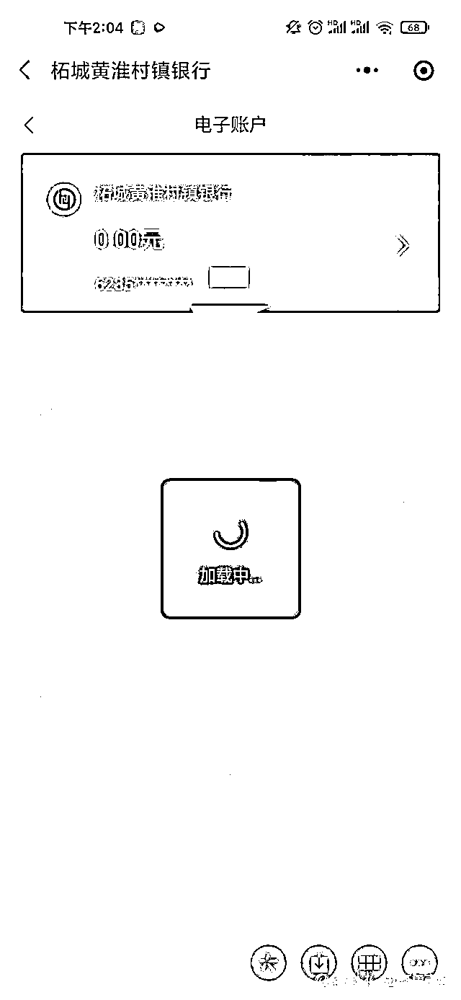

# 河南"暴雷"村镇银行储户：余额又清零了

> 原文：[`mp.weixin.qq.com/s?__biz=MzIyMDYwMTk0Mw==&mid=2247538269&idx=5&sn=59b8a85bc9109ff2d774f916b44242cd&chksm=97cb9d65a0bc147379942597dad69a45a378dc7d1ba33008ddd0c8193a765e901ce221524b2a&scene=27#wechat_redirect`](http://mp.weixin.qq.com/s?__biz=MzIyMDYwMTk0Mw==&mid=2247538269&idx=5&sn=59b8a85bc9109ff2d774f916b44242cd&chksm=97cb9d65a0bc147379942597dad69a45a378dc7d1ba33008ddd0c8193a765e901ce221524b2a&scene=27#wechat_redirect)

6 月 20 日，多名储户反映，他们无法在线上查询到账户余额，“余额又清零了。”

河南村镇银行取款难一事又有了新进展。6 月 20 日，河南 4 家村镇银行发布了相同公告，**内容为从即日起开展线上客户资金信息登记工作。**不过，也有储户提出了疑问，银行应该最了解储户的存款数据，同时他们担心登记后就成了涉及村镇银行金融诈骗案的受害人，担心银行和银保监局因此不再负责和监管。

此前在 4 月 18 日，河南多家村镇银行发布系统升级的公告，暂停了线上业务。多个村镇银行储户告诉记者，从 4 月 18 日起，他们无法取款。

在无法取款 2 个月后，6 月 18 日，许昌市公安局发布警情通报，表示 2022 年 4 月 19 日，许昌公安依法对河南新财富集团投资控股有限公司涉嫌重大犯罪立案侦查。现初步查明，2011 年以来，**以该公司实际控股人吕某为首的犯罪团伙涉嫌利用村镇银行实施系列严重犯罪**。目前公安机关已抓获一批犯罪嫌疑人，依法查封、扣押、冻结一批涉案资金、资产。

6 月 18 日晚间，河南省地方金融监督管理局也就此事做出回应，表示责成相关村镇银行做好资金信息登记和后续处置工作，同时提醒相关群众配合做好信息登记工作。

**一些储户仍有质疑和担心**

储户纪先生告诉记者，他也看到了村镇银行关于登记信息的公告，不过他有一些担心。

纪先生在禹州新民生等 3 家村镇银行共计存款 52 万元。他曾告诉记者，自己是本着对银行的信任，才将和家人精打细算攒下来的辛苦钱存进了这三家村镇银行，没想到至今已经有 2 个多月无法将钱取回。

纪先生说，他主要是担心登记后，他跟其他储户们就成了金融诈骗案的受害人，案子由公安等部门负责处理了，而银保监局是否会因此没有监管责任了？银行是否也脱身了？

“我们是在银行存款，不管银行拿我们的存款干了什么，都与储户无关。”此前多名储户曾如此表示。

此外，纪先生告诉记者，他认为公告及登记信息表的**用词“不准确”**，“登记页面写的是‘客户’不是‘储户’，用的是‘资金’不是‘存款’，‘收益’而不是‘利息’”。

**6 月 20 日，多名储户反映，他们无法在线上查询到账户余额，“余额又清零了。”**

纪先生表示，大部分储户都记不清自己账户内的详细金额和已获取的利息，“明明银行什么数据都有。”如果储户登记的数据不准，“到时候银行以此为借口重新登记，这个事情要拖到什么时候才能解决？”因此纪先生觉得，银行可以让储户确认一下自己账户内的金额，而不应让储户自行登记。

来源：齐鲁壹点，观察者网 记者：陈晨

](https://mp.weixin.qq.com/s?__biz=Mzg5ODAwNzA5Ng==&mid=2247487973&idx=1&sn=1b62da6f2018402862a5c375e10c355e&chksm=c06878b2f71ff1a4fbe7df4dec626aa7e696154751693bf16f6c6a302ceaa4d1959040c70518&scene=21#wechat_redirect)

← 向右滑动与灰产圈互动交流 →

