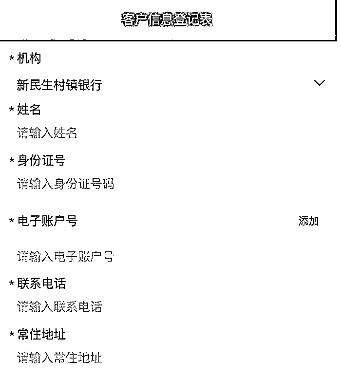
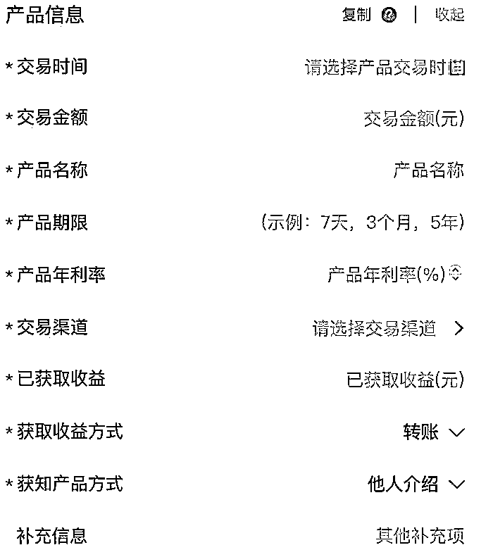
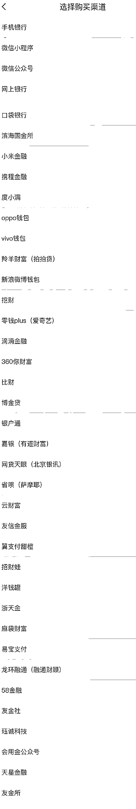

# 哪些第三方平台曾为河南村镇银行拉存款？

> 原文：[`mp.weixin.qq.com/s?__biz=MzIyMDYwMTk0Mw==&mid=2247538269&idx=6&sn=da268b887c61d63ab4d542749f8ccb4c&chksm=97cb9d65a0bc1473fbe4b5c78543fb1e858b6dfeed15577caa1874b9a89ec3b1d11478e7186a&scene=27#wechat_redirect`](http://mp.weixin.qq.com/s?__biz=MzIyMDYwMTk0Mw==&mid=2247538269&idx=6&sn=da268b887c61d63ab4d542749f8ccb4c&chksm=97cb9d65a0bc1473fbe4b5c78543fb1e858b6dfeed15577caa1874b9a89ec3b1d11478e7186a&scene=27#wechat_redirect)

图片来源：视觉中国

6 月 20 日， 河南禹州新民生村镇银行、开封新东方村镇银行、上蔡惠民村镇银行、柘城黄淮村镇银行分别发布公告表示，正按照金融管理部门要求，从即日起开展线上客户资金信息登记工作，凡在该行线上交易系统关闭后不能正常办理业务的客户均需登记。

用户登记信息项目

用户登记信息项目

界面新闻记者注意到，伴随着该登记系统的上线，为上述村镇银行上线互联网存款产品的平台公司也随之披露。梳理官方披露的 30 多家可供客户登记信息的第三方平台发现，多家知名互联网企业旗下金融平台均在此次登记之列。

具体来看，这些平台包括：小米集团旗下的两家平台小米金融和天星金融，百度旗下的两个渠道度小满平台和爱奇艺旗下的零钱 PLUS，知名上市公司拍拍贷（信也科技）旗下的羚羊财富，中国人寿旗下的滨海国金所，360 集团旗下的你财富平台，甜橙金融旗下翼支付，用友集团旗下三个渠道友信财富、友金社和友金所，以及携程金融、滴滴金融、新浪微博钱包、易宝支付、58 金融等多家知名金融平台。

第三方平台名单

此外，还有原本多家主营为 P2P 业务互联网金融平台：网贷天眼、洋钱罐、麻袋财富、挖财、比财、博金贷、银户通、嘉银（有道财富），以及萨摩耶旗下的省呗，云财富、招财蛙、浙天金、融通财顾旗下的龙环融通、珏诚科技、公众号会用金、口袋银行、OPPO 钱包、VIVO 钱包。

截至发稿，上述平台均未对村镇银行取款难事件进行回复。

界面新闻记者注意到，这类互联网存款产品早在一年多之前就被监管明令禁止，支付宝、京东金融等头部互联网平台公开表示将彻底清理银行存款业务，但少数平台仍在违规销售。

2021 年 1 月，中国银保监会、中国人民银行就联合印发了《关于规范商业银行通过互联网开展个人存款业务有关事项的通知》，明确指出，商业银行通过非自营网络平台开展存款业务规模增长较快，暴露出多项风险隐患，如涉嫌违反相关监管规定和市场利率定价自律机制相关要求，突破地方法人银行经营区域限制，并且非自营网络平台存款产品稳定性较差，对商业银行的流动性管理也带来挑战。

因此，为防范金融风险，依法对上述定期存款以及定活两便存款业务予以叫停。

该文件还要求，商业银行不得通过非自营网络平台开展定期存款和定活两便存款业务，包括但不限于由非自营网络平台提供营销宣传、产品展示、信息传输、购买入口、利息补贴等服务，同时明确，监管机构对于互联网存款业务的态度是“存量到期自然结清，不可发生增量”。

来源：界面新闻 记者：苗艺伟

](https://mp.weixin.qq.com/s?__biz=Mzg5ODAwNzA5Ng==&mid=2247487973&idx=1&sn=1b62da6f2018402862a5c375e10c355e&chksm=c06878b2f71ff1a4fbe7df4dec626aa7e696154751693bf16f6c6a302ceaa4d1959040c70518&scene=21#wechat_redirect)

← 向右滑动与灰产圈互动交流 →

