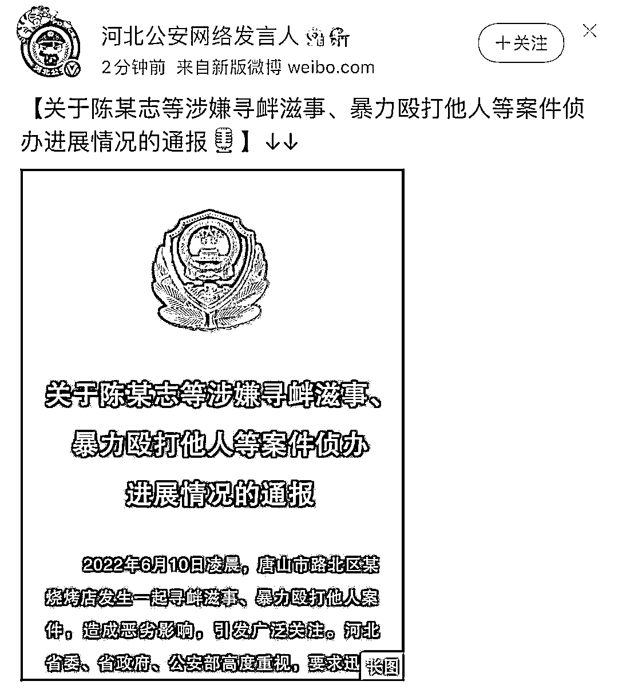
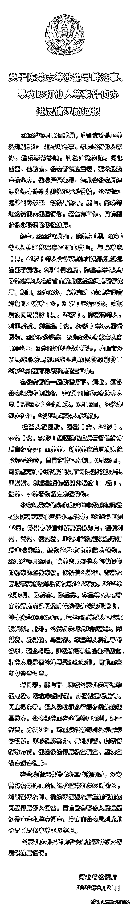

# 唐山女孩的“轻伤二级”有多重？

> 原文：[`mp.weixin.qq.com/s?__biz=MzIyMDYwMTk0Mw==&mid=2247538327&idx=1&sn=c8f5065dd5f9961d87dd60959347eadd&chksm=97cb9dafa0bc14b9387d69d74c693ed21e7e566de0379b4737f18b390232fd3023c195e9698d&scene=27#wechat_redirect`](http://mp.weixin.qq.com/s?__biz=MzIyMDYwMTk0Mw==&mid=2247538327&idx=1&sn=c8f5065dd5f9961d87dd60959347eadd&chksm=97cb9dafa0bc14b9387d69d74c693ed21e7e566de0379b4737f18b390232fd3023c195e9698d&scene=27#wechat_redirect)

6 月 21 日，河北省公安厅发布《关于陈某志等涉嫌寻衅滋事、暴力殴打他人等案件侦办进展情况的通报》。 

具体如下：

**通报一出，很多网友便在网上炸开了锅。**

**说“女孩都被打成那样了，听说眼珠都爆出来了，就一个轻伤？**”****

**这不怪有些网友，其实在今天之前，我也不太清楚伤情鉴定的级别。**

**所谓的轻伤，其实很严重！** 

**什么是轻伤？**

根据最高法、最高检、公安部、国家安全部、司法部等五部门发布的《人体损伤程度鉴定标准》，鉴定伤情的级别分为三级：重伤、轻伤和轻微伤。其中重伤和轻伤又分一级、二级。

“轻伤”是指，**使人肢体或者容貌损害，听觉、视觉或者其他器官功能部分障碍或者其他对于人身健康有中度伤害的损伤**，包括轻伤一级和轻伤二级。轻伤二级，是指各种致伤因素所致的原发性损伤或者由原发性损伤引起的并发症，**未危及生命；遗留组织器官结构、功能轻度损害或者影响容貌。**

**哪些情况属于轻伤二级？**

*   **颅脑、脊髓损伤**

向上滑动阅览

a)头皮创口或者瘢痕长度累计 8.0cm 以上。 b)头皮撕脱伤面积累计 20.0cm² 以上；头皮缺损面积累计 10.0cm²以上。 c)帽状腱膜下血肿范围 50.0cm²以上。 d)颅骨骨折。e)外伤性蛛网膜下腔出血。f)脑神经损伤引起相应神经功能障碍。

*   **面部、耳廓损伤** 

向上滑动阅览

a)面部单个创口或者瘢痕长度 4.5cm 以上；多个创口或者瘢痕长度累计 6.0cm 以上。 b)面颊穿透创，皮肤创口或者瘢痕长度 1.0cm 以上。c)口唇全层裂创，皮肤创口或者瘢痕长度 1.0cm 以上。 d)面部块状瘢痕，单块面积 3.0cm²以上或多块面积累计 5.0cm²以上。 e)面部片状细小瘢痕或者色素异常，面积累计 8.0cm²以上。f)眶壁骨折（单纯眶内壁骨折除外）。 g)眼睑缺损。h)一侧眼睑轻度外翻。 i)一侧上眼睑下垂覆盖瞳孔。j)一侧眼睑闭合不全。k)一侧泪器损伤伴溢泪。l)耳廓创口或者瘢痕长度累计 6.0cm 以上。m)耳廓离断、缺损或者挛缩畸形累计相当于一侧耳廓面积 15%以上。 n)鼻尖或者一侧鼻翼缺损。 o)鼻骨粉碎性骨折；双侧鼻骨骨折；鼻骨骨折合并上颌骨额突骨折；鼻骨骨折合并鼻中隔骨折；双侧上颌骨额突骨折。 p)舌缺损。 q)牙齿脱落或者牙折 2 枚以上。 r)腮腺、颌下腺或者舌下腺实质性损伤。s)损伤致张口困难Ⅰ度。 t)颌骨骨折（牙槽突骨折及一侧上颌骨额突骨折除外）。u)颧骨骨折。

*   **听器听力损伤** 

向上滑动阅览

a)外伤性鼓膜穿孔 6 周不能自行愈合。 b)听骨骨折或者脱位；听骨链固定。 c)一耳听力障碍(≥41dB HL)。 d)一侧前庭平衡功能障碍，伴同侧听力减退。e)一耳外耳道横截面 1/2 以上狭窄。

*   **视器视力损伤** 

向上滑动阅览

a)眼球穿通伤或者眼球破裂伤；前房出血须手术治疗；房角后退；虹膜根部离断或者虹膜缺损超 过 1 个象限；睫状体脱离；晶状体脱位；玻璃体积血；外伤性视网膜脱离；外伤性视网膜出血；外伤性黄斑裂孔；外伤性脉络膜脱离。b)角膜斑翳或者血管翳；外伤性白内障；外伤性低眼压；外伤性青光眼。 c)瞳孔括约肌损伤致瞳孔显著变形或者瞳孔散大(直径 0.6cm 以上)。 d)斜视；复视。 e)睑球粘连。f)一眼矫正视力减退至 0.5 以下（或者较伤前视力下降 0.3 以上）；双眼矫正视力减退至 0.7 以 下（或者较伤前视力下降 0.2 以上）；原单眼中度以上视力损害者，伤后视力降低一个级别。 g)一眼视野半径 50 o 以下（视野有效值 80%以下）。 

*   **颈部损伤** 

向上滑动阅览

a)颈前部单个创口或者瘢痕长度 5.0cm 以上；多个创口或者瘢痕长度累计 8.0cm 以上。 b)颈前部瘢痕，单块面积 4.0cm²以上，或者两块以上面积累计 6.0cm²以上。c)甲状腺挫裂伤。d)咽喉软骨骨折。e)喉或者气管损伤。 f)舌骨骨折。 g)膈神经损伤。 h)颈部损伤出现窒息征象。 

*   **胸部损伤**

向上滑动阅览

a)女性一侧乳房部分缺失或者乳腺导管损伤。b)肋骨骨折 2 处以上。c)胸骨骨折；锁骨骨折；肩胛骨骨折。d)胸锁关节脱位；肩锁关节脱位。e)胸部损伤，致皮下气肿 1 周不能自行吸收。f)胸腔积血；胸腔积气。g)胸壁穿透创。h)胸部挤压出现窒息征象。

*   **腹部损伤**

向上滑动阅览

a)胃、肠、胆囊或者胆道挫伤。b)肝包膜下或者实质内出血。c)脾包膜下或者实质内出血。d)胰腺挫伤。e)肾包膜下或者实质内出血。 f)肝功能损害（轻度）。 g)急性肾功能障碍（可恢复）。 h)腹腔积血或者腹膜后血肿。 i)腹壁穿透创。

*   **盆部及会阴损伤**

向上滑动阅览

a)骨盆骨折。 b)直肠或者肛管挫裂伤。 c)一侧输尿管挫裂伤；膀胱挫裂伤；尿道挫裂伤。 d)子宫挫裂伤；一侧卵巢或者输卵管挫裂伤。 e)阴道撕裂伤。 f)女性外阴皮肤创口或者瘢痕长度累计 4.0cm 以上。 g)龟头部分缺损。 h)阴茎撕脱伤；阴茎皮肤创口或者瘢痕长度 2.0cm 以上；阴茎海绵体出血并形成硬结。i)阴囊壁贯通创；阴囊皮肤创口或者瘢痕长度累计 4.0cm 以上；阴囊内积血，2 周内未完全吸收。 j)一侧睾丸破裂、血肿、脱位或者扭转。 k)一侧输精管破裂。 l)轻度肛门失禁或者轻度肛门狭窄。 m)轻度排尿障碍。 n)外伤性难免流产；外伤性胎盘早剥。

*   **脊柱四肢损伤**

向上滑动阅览

a)四肢任一大关节功能丧失 10％以上。 b)四肢重要神经损伤。 c)四肢重要血管破裂。 d)椎骨骨折或者脊椎脱位（尾椎脱位不影响功能的除外）；外伤性椎间盘突出。 e)肢体大关节韧带断裂；半月板破裂。 f)四肢长骨骨折；髌骨骨折。 g)骨骺分离。 h)损伤致肢体大关节脱位。 i)第一趾缺失超过趾间关节；除第一趾外，任何二趾缺失超过趾间关节；一趾缺失。 j)两节趾骨骨折；一节趾骨骨折合并一跖骨骨折。 k)两跖骨骨折或者一跖骨完全骨折；距骨、跟骨、骰骨、楔骨或者足舟骨骨折；跖跗关节脱位。 l)肢体皮肤一处创口或者瘢痕长度 10.0cm 以上；两处以上创口或者瘢痕长度累计 15.0cm 以上。

*   **手损伤** 

向上滑动阅览

a)手功能丧失累计达一手功能 4％。 b)除拇指外的一个指节离断或者缺失。 c)两节指骨线性骨折或者一节指骨粉碎性骨折（不含第 2 至 5 指末节）。 d)舟骨骨折、月骨脱位或者掌骨完全性骨折。

*   **体表损伤** 

向上滑动阅览

a)挫伤面积达体表面积 6％。b)单个创口或者瘢痕长度 10.0cm 以上；多个创口或者瘢痕长度累计 15.0cm 以上。 c)撕脱伤面积 50.0cm²以上。 d)皮肤缺损 6.0cm²以上

*   **其他损伤** 

向上滑动阅览

a)IIo 以上烧烫伤面积达体表面积 5％或者 IIIo 面积达 0.5％。 b)呼吸道烧伤。 c)挤压综合征（I 级）。 d)电击伤（Ⅰo）。 e)溺水（轻度）。 f)各种损伤引起休克（轻度）。 g)呼吸功能障碍，出现窒息征象。 h)面部异物存留；眶内异物存留；鼻窦异物存留。 i)胸腔内异物存留；腹腔内异物存留；盆腔内异物存留。 j)深部组织内异物存留。 k)骨折内固定物损坏需要手术更换或者修复。l)各种置入式假体装置损坏需要手术更换或者修复。 m)器质性阴茎勃起障碍（轻度）。

**律师：唐山打人案嫌犯**

**大概率会被数罪并罚**

本案嫌犯会以什么罪名被起诉、会被判刑多久备受关注。

北京某律师事务所主任安翔表示，仔细关注通报当中所涉及的内容，会发现对这几个人后续起诉的时候，会有其他的罪名被一并追究，

**可能涉及洗钱罪，掩饰、隐瞒犯罪所得收益罪，开设赌场罪，聚众斗殴罪等，数罪并罚，这是大概率事件。**

对他们最后的定罪量刑，很有可能并不以这次伤人事件为限度，还要追究他们在过去这些年应当承担的罪责，最终的惩处很有可能会非常严厉。

<mpvideosnap class="js_uneditable custom_select_card channels_iframe videosnap_video_iframe" data-pluginname="videosnap" data-id="export/UzFfAgtgekIEAQAAAAAAZaYamDsspAAAAAstQy6ubaLX4KHWvLEZgBPE9KMcPlQFcISDzNPgMIvXDxWGwNQb4ov04wsbICRf" data-url="https://findermp.video.qq.com/251/20304/stodownload?encfilekey=S7s6ianIic0ia4PicKJSfB8EjyjpQibPUAXolvzlJTMPbPaKGNNS0ictYbkdFVCFJoBJxJ2HN0rxlAZQ7ibTsADooXiaITvMM7MlvfKAk3w2N0rqUV01OG7eGsUWmg&amp;adaptivelytrans=0&amp;bizid=1023&amp;dotrans=0&amp;hy=SH&amp;idx=1&amp;m=&amp;scene=0&amp;token=x5Y29zUxcibAhZegbrULNPiaJqmeK6bU8O9kzib4icxYAJs9tMtsZP0AT9cPHUMjC9Yn4ZNVBceRbfY" data-headimgurl="http://wx.qlogo.cn/finderhead/ibq4aVwOt6HNqrr8OD3sCviaytF3B8TqCwHicxsuIanAJo/0" data-username="v2_060000231003b20faec8c6e48a1acbd3ce04ef33b077a1e41d0d3794ed88ea537878dbe65910@finder" data-nickname="灰产圈+" data-desc="有网友称：唐山涉事烧烤店旁小巷子原本有摄像头，事情曝光后摄像头不见了。

笔者查证大河报 6 月 12 日的实地采访，与网友反映的存在摄像头的图像基本一致。但是到了 6 月 16 日网友实拍视频清楚的显示：疑似存在摄像头的位置的确什么都没有了。

笔者不能确定该处就是摄像头，但的确少了东西。这是不该忽视的线索，希望异地办案人员能注意到。#唐山#唐山打人#唐山烧烤@灰产圈+ " data-nonceid="17562264724240105364" data-type="video" data-width="1080" data-height="1920"></mpvideosnap>

来源：不惑先生

](https://mp.weixin.qq.com/s?__biz=Mzg5ODAwNzA5Ng==&mid=2247487973&idx=1&sn=1b62da6f2018402862a5c375e10c355e&chksm=c06878b2f71ff1a4fbe7df4dec626aa7e696154751693bf16f6c6a302ceaa4d1959040c70518&scene=21#wechat_redirect)

← 向右滑动与灰产圈互动交流 →

