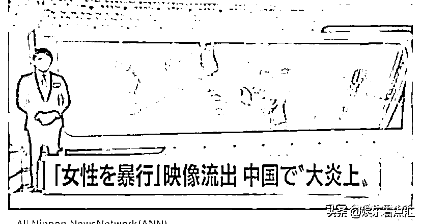
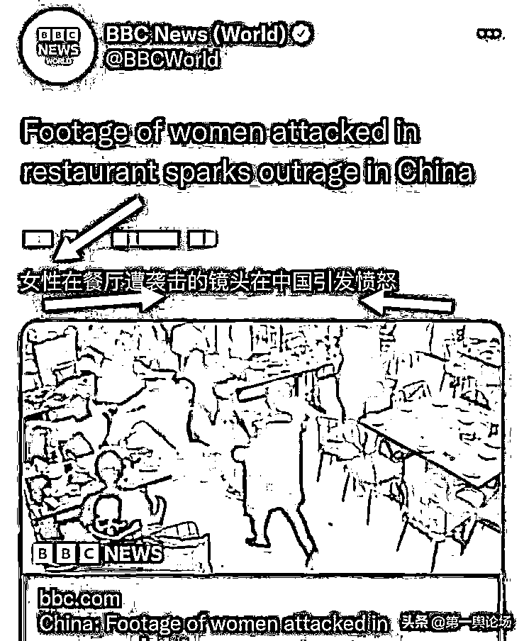
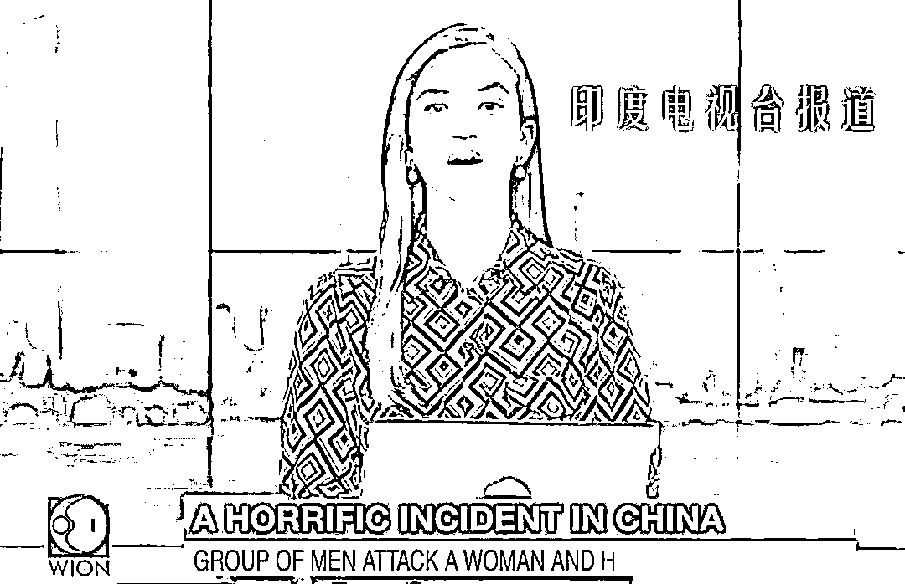
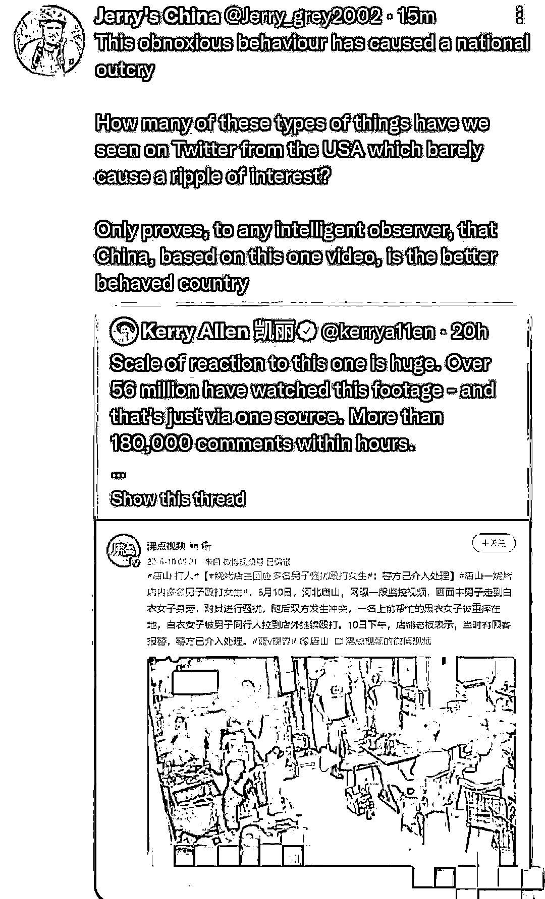
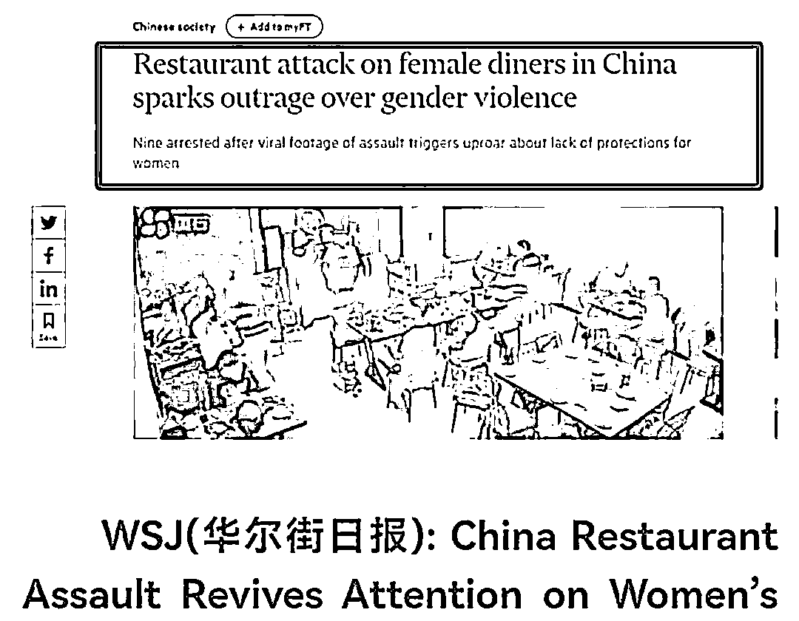
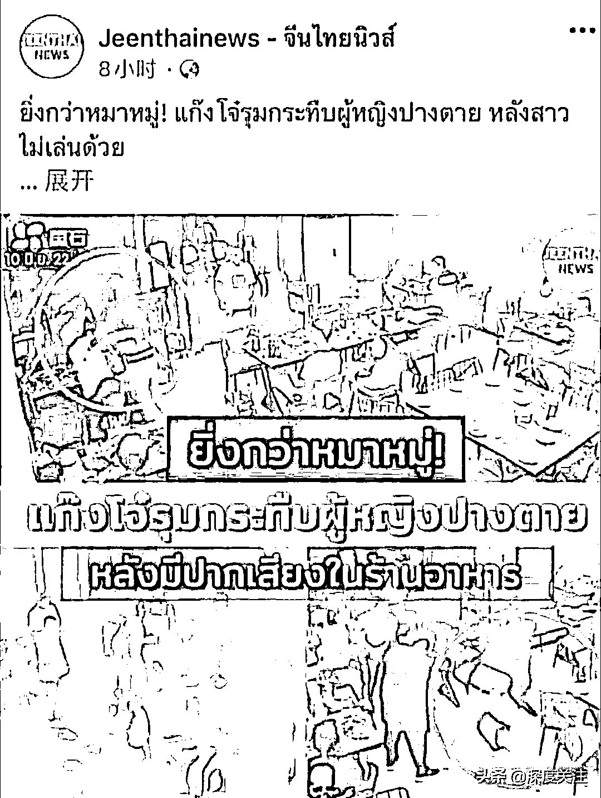
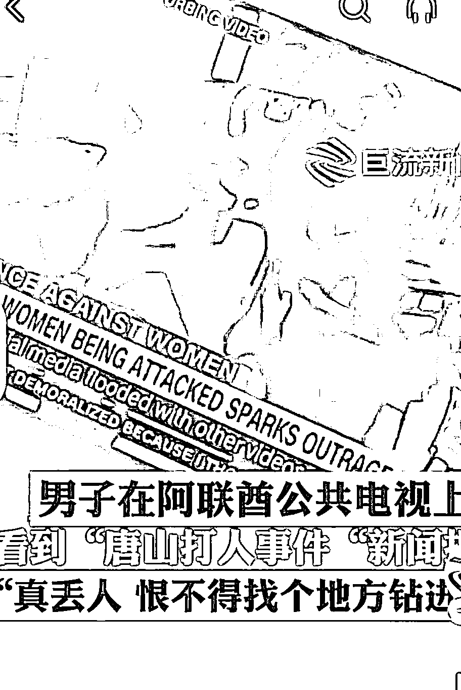
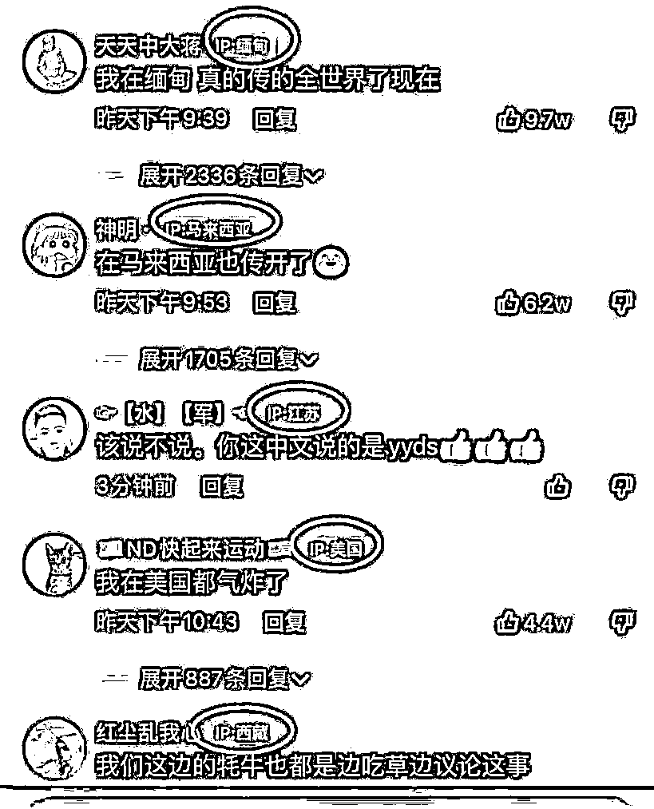
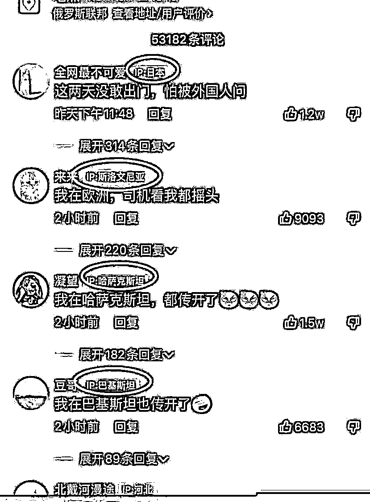

# 好事不出门，丑事传千里，且看外国媒体怎么报道唐山打人事件

> 原文：[`mp.weixin.qq.com/s?__biz=MzIyMDYwMTk0Mw==&mid=2247538327&idx=2&sn=66046c8849ecf12f06bc60a1e8e175ad&chksm=97cb9dafa0bc14b97a8e5e623b5049927bef1f989d5d44e16a761712d1554270aba71ad398e7&scene=27#wechat_redirect`](http://mp.weixin.qq.com/s?__biz=MzIyMDYwMTk0Mw==&mid=2247538327&idx=2&sn=66046c8849ecf12f06bc60a1e8e175ad&chksm=97cb9dafa0bc14b97a8e5e623b5049927bef1f989d5d44e16a761712d1554270aba71ad398e7&scene=27#wechat_redirect)

唐山烧烤店事件已经不是国内皆知的事件了，随着媒体的无孔不入和自媒体的快速传播，早就传遍了世界各地。

让我们看看世界各国是怎么报道这件事的。

# 日本

日本新闻媒体用了“女性暴行”来形容唐山群殴女性事件。

# 英国

英国 BBC 广播公司报道:“女性在餐厅遭袭击的镜头在中国引发愤怒。”

# 印度

印度新闻中形容这件事是:“一件可怕的事发生在中国。”

# 美国

美国的作者称:“这种令人厌恶的事情引起了全国的抗议，我们在美国的推特上看到过多少这样的事情，几乎没引起多少兴趣，对于聪明的旁观者来说，只不过证明了，基于这条视频，证明了中国是个更好的国家。”

这位外国友人的意思是在中国发生这种事件能引起这么大的反响，同样的事情在美国太多了，几乎不会引起观众的兴趣，大家都司空见惯了，这个视频反而证明了，中国是比美国治安更好的国家。

《华尔兹日报》的标题是:中国餐馆的性侵案唤起了对女性的关注。

# 泰国

泰国人的标题是:“一群狗一样的一群强盗把一个女人杀掉了。”

# 阿联酋

一位同胞在阿联酋看到唐山的新闻，感叹:“很羞愧，恨不得找个地方钻进去。”

可见，阿联酋的新闻肯定不是很好听的用词形容这件事。

全世界各地网友都表示看到了唐山的新闻，很震惊。

可见这一次，唐山五虎凭借 4 分钟的拳打脚踢，就把唐山送上了全世界闻名的高度。

好事不出门，坏事传千里，我们能看到的这些外国新闻截图都只是片面的，谁也不知道他们是怎么形容唐山的事件，是怎么对自己国家的百姓讲述中国是什么样的一个国家。

事件确实是发生了，人家的报道也没问题，也不能避免有人会拿这件事大做文章，企图达到一些见不得人的目的。

只希望带来这些恶劣影响的人能受到应有的惩罚，给受害者一个公道，顺便用结果来让某些抹黑中国形象的人闭嘴。

大家怎么看待这件事呢？

<mpvideosnap class="js_uneditable custom_select_card channels_iframe videosnap_video_iframe" data-pluginname="videosnap" data-id="export/UzFfAgtgekIEAQAAAAAABqo0uJkPSQAAAAstQy6ubaLX4KHWvLEZgBPEpKMAECNDcoSDzNPgMIvyhleuA9OZfq_HDcgDyAOo" data-url="https://findermp.video.qq.com/251/20304/stodownload?encfilekey=rjD5jyTuFrIpZ2ibE8T7YmwgiahniaXswqzJulbibdkLKyeV9rxNHVEOicfYopDpQMsvvVm7RibhW2SpN6ef8xpEbhWJtk5iaxLSslvfDich2bjF7JribVIFFBw7btw&amp;adaptivelytrans=0&amp;bizid=1023&amp;dotrans=0&amp;hy=SH&amp;idx=1&amp;m=&amp;scene=0&amp;token=x5Y29zUxcibAhZegbrULNPqElWMuIJZJlvIoQjhX5rwlIGHNUmyyrO6kB5kANDAoGOJiacwmktZss" data-headimgurl="http://wx.qlogo.cn/finderhead/ibq4aVwOt6HNqrr8OD3sCviaytF3B8TqCwHicxsuIanAJo/0" data-username="v2_060000231003b20faec8c6e48a1acbd3ce04ef33b077a1e41d0d3794ed88ea537878dbe65910@finder" data-nickname="灰产圈+" data-desc="#凭啥要她公开道歉# 某平台 UP 主因唐山烧烤店打人事件发了七条视频，她在视频中这样说道：“当我们发现一只老鼠的时候，就应当端掉它们的老窝！”

未料，这一言论被判定为“不当言论”，于是上演了视频中“公开道歉”的闹剧……

若此事属实，正义的人们，你们又怎么看这件事？#唐山打人#唐山烧烤@灰产圈+ " data-nonceid="8420228957863442532" data-type="video" data-width="1080" data-height="1288"></mpvideosnap>

来源：实测

](https://mp.weixin.qq.com/s?__biz=Mzg5ODAwNzA5Ng==&mid=2247487973&idx=1&sn=1b62da6f2018402862a5c375e10c355e&chksm=c06878b2f71ff1a4fbe7df4dec626aa7e696154751693bf16f6c6a302ceaa4d1959040c70518&scene=21#wechat_redirect)

← 向右滑动与灰产圈互动交流 →

