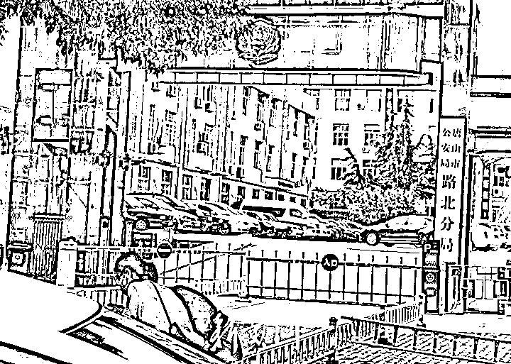

# 谎称"接警后 5 分钟赶到"的唐山民警，被查

> 原文：[`mp.weixin.qq.com/s?__biz=MzIyMDYwMTk0Mw==&mid=2247538327&idx=5&sn=b005b5f59f93e67e27d72ca9146dd8d2&chksm=97cb9dafa0bc14b9d3b95d08b9e120c29c4c731a42f6037ceb8c7dcc31684fd7328cc7258993&scene=27#wechat_redirect`](http://mp.weixin.qq.com/s?__biz=MzIyMDYwMTk0Mw==&mid=2247538327&idx=5&sn=b005b5f59f93e67e27d72ca9146dd8d2&chksm=97cb9dafa0bc14b9d3b95d08b9e120c29c4c731a42f6037ceb8c7dcc31684fd7328cc7258993&scene=27#wechat_redirect)

21 日，河北省纪检监察机关通报了唐山市某烧烤店寻衅滋事、暴力殴打他人案件及其他相关案件涉及的公职人员涉嫌严重违纪违法问题。其中，机场路派出所民警陈志伟正接受纪委监委纪律审查和监察调查。

陈志伟此前曾在接受媒体受访时表示，**警方到达案发现场距离接报时间为 5 分钟。**

6 月 12 日，中央广电总台中国之声发布《警方回应烧烤店打人案：接警后 5 分钟赶到，5 名嫌疑人有前科》一文。该报道中，唐山市公安局路北分局机场路派出所民警陈志伟介绍，受伤的四名女子其中两人伤情较重，在辖区某医院接受治疗，伤情稳定；另两名女子伤势较轻，未住院治疗。

陈志伟表示：“6 月 10 日凌晨 02:41，我单位接到 110 指挥中心派警，接到报警后，我单位 02:46 左右赶到现场，第一时间询问现场人员，了解案发经过。案发后，打人男子均逃离了现场。”

唐山市公安局路北分局，图源：新黄河客户端

中国之声同一篇报道中提到，一位目击者说，等他报完警回到烧烤店，肇事者已经跑掉，他们一行人等到 120 和警方到达现场才离开。目击者表示：“报警回来我们的人都在那儿，女生都吓得不行了。一共也就不到 4 分钟，肇事者已经都跑掉了，所有事情发生得非常快，现场的人都还在一个震惊中的状态。120 很快就到了，派出所民警也马上到了，他们就直接找店家看视频。”

陈志伟有关“警方接警后 5 分钟到达现场”的说法与河北警方最新的通报不相符。

[`v.qq.com/iframe/preview.html?width=500&height=375&auto=0&vid=e3344qksx3v`](https://v.qq.com/iframe/preview.html?width=500&height=375&auto=0&vid=e3344qksx3v)

@河北公安网络发言人 6 月 21 日就“唐山烧烤店打人事件”发布的最新情况通报显示，2022 年 6 月 7 日 2 时 40 分，陈某志对下班后在唐山市路北区某烧烤店聚餐饮酒就餐的王某某（女，31 岁）进行骚扰，遭拒后伙同马某齐（男，25 岁)、陈某亮等人，对王某某、刘某某（女，29 岁）等 4 人进行殴打，2 时 47 分逃离，2 时 55 分 4 名被害人由 120 送医。**警方 2 时 41 分接群众报警后，唐山市公安局路北分局机场路派出所民警率辅警于 3 时 09 分赶到现场开展处置工作。**

从通报中可看出，陈某志等人从骚扰到逃离共计 7 分钟，冲突发生 1 分钟后即有人报警，**警察在接到报警后 28 分钟赶到现场。**

河北省公安厅提到，公安警务督察部门会同纪检监察机关及时介入，对出警不及时、执法不规范及严重违纪违法问题开展深入调查，目前已有警务人员接受纪律审查和监察调查，唐山市公安局对路北分局副局长李某予以免职。

<mpvideosnap class="js_uneditable custom_select_card channels_iframe videosnap_video_iframe" data-pluginname="videosnap" data-id="export/UzFfAgtgekIEAQAAAAAAmLUKhFuynwAAAAstQy6ubaLX4KHWvLEZgBPEp6MsD2hvc4SDzNPgMItZPDlUKpFzypcW9jsomm88" data-url="https://findermp.video.qq.com/251/20304/stodownload?encfilekey=S7s6ianIic0ia4PicKJSfB8EjyjpQibPUAXol8NIUib6I296lS0Awv4rHEz2ZICsJ7znpV3NtUC9UTc9hvkF9Q9F65HLlh6LZ3Io4PicDOyictGjbvu7KoxibkamSuQ&amp;adaptivelytrans=0&amp;bizid=1023&amp;dotrans=0&amp;hy=SH&amp;idx=1&amp;m=&amp;scene=0&amp;token=AxricY7RBHdV17Ah7KQBEgib5Rh6M67k3WgjDvNiaf7qOpKTBUiappYrCdMjib3Zz1qfxQBJGbZP5icibo" data-headimgurl="http://wx.qlogo.cn/finderhead/ibq4aVwOt6HNqrr8OD3sCviaytF3B8TqCwHicxsuIanAJo/0" data-username="v2_060000231003b20faec8c6e48a1acbd3ce04ef33b077a1e41d0d3794ed88ea537878dbe65910@finder" data-nickname="灰产圈+" data-desc="唐山三名交警举报唐山检察院检察长#唐山#唐山打人#唐山烧烤@灰产圈+ " data-nonceid="18125621861257817395" data-type="video" data-width="720" data-height="1280"></mpvideosnap>

来源：观察者网综合

](https://mp.weixin.qq.com/s?__biz=Mzg5ODAwNzA5Ng==&mid=2247487973&idx=1&sn=1b62da6f2018402862a5c375e10c355e&chksm=c06878b2f71ff1a4fbe7df4dec626aa7e696154751693bf16f6c6a302ceaa4d1959040c70518&scene=21#wechat_redirect)

← 向右滑动与灰产圈互动交流 →

