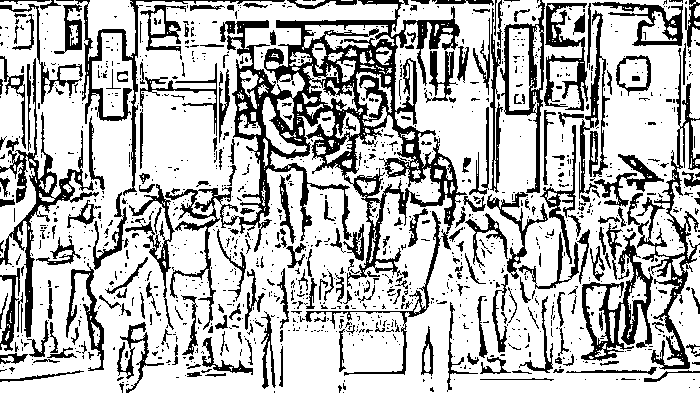
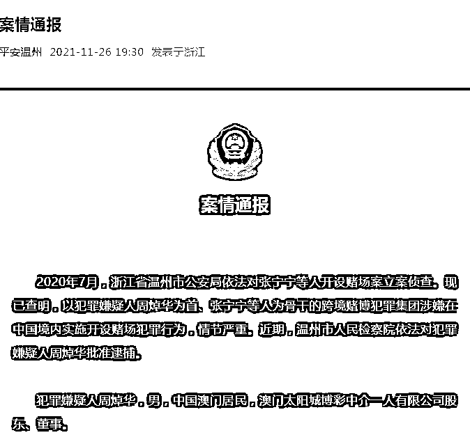
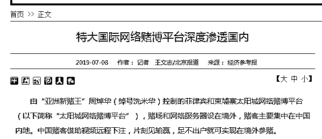

# 涉案金额 6800 亿！澳门大亨洗米华案 9 月开庭，最高判 33 年

> 原文：[`mp.weixin.qq.com/s?__biz=MzIyMDYwMTk0Mw==&mid=2247538327&idx=7&sn=4a420600f6504fabbcf24aa9351d7acb&chksm=97cb9dafa0bc14b9ba7927e23c70002293735683eda599cc76a700ba968ba2e30285bcb9eb98&scene=27#wechat_redirect`](http://mp.weixin.qq.com/s?__biz=MzIyMDYwMTk0Mw==&mid=2247538327&idx=7&sn=4a420600f6504fabbcf24aa9351d7acb&chksm=97cb9dafa0bc14b9ba7927e23c70002293735683eda599cc76a700ba968ba2e30285bcb9eb98&scene=27#wechat_redirect)

6 月 21 日消息，“洗米华案”将在 9 月 2 日正式开审，据澳门传媒报道，案件涉及非法博彩，金额高达 8000 亿港元，约 6800 亿元人民币。

**周焯华案 9 月开审**

据澳门日报微信公众号消息，根据澳门初级法院排期，太阳城创办人周焯华案将在 9 月 2 日下午开审，控方证人超过 90 人。周焯华被控告不法经营赌博、相当巨额诈骗、犯罪集团等罪名。

控罪指出，周焯华涉利用太阳城贵宾会经营“赌底面”的不法活动，令六大博企造成损失，亦令博监局少收博彩税，被控触犯 229 项“在许可地方内不法进行赌博罪”，以及 54 项相当巨额诈骗罪、3 项相当巨额诈骗罪未遂。

此外，他涉在没有取得政府经营批给下，在菲律宾、越南娱乐场经营电话投注、网上投注，因而触犯不法经营赌博罪。

澳门特区检察院还控告他“犯罪集团罪”及加重清洗黑钱罪。同案其他 19 名嫌犯，是太阳城的中高层员工。

**涉案金额高达 6800 亿，最高判 33 年**

据澳门传媒报道，案件涉及非法博彩，金额高达 8000 亿港元，约 6800 亿元人民币。

澳门检察院早前表示，经初步调查，认为有充分迹象显示，被捕人士分别涉嫌触犯参加犯罪集团罪、领导犯罪集团罪，两项罪名分别最高可判坐牢 10 年及 12 年，另外亦涉嫌触犯洗黑钱罪，以及不法经营赌博罪，分别最高可判坐牢 8 年及 3 年。数罪并罚下洗米华或将面临最高 33 年的牢狱处罚。

**洗米华是谁？**

周焯华，江湖人称洗米华。早年在赌场从事“扒仔”工作，也就是负责拉客的业务员。后来被据称是澳门黑帮“教父”尹国驹（花名“崩牙驹”）看中，收作手下，同样也赐了个花名，即洗米华。 

据悉，周焯华现年 48 岁，祖籍是广东肇庆。他在澳门长大，九十年代靠博彩业起家，后来涉足餐饮、酒店和电影投资行业，名下的太阳城娱乐曾签下多位知名艺人，曾投资拍摄《湄公河行动》、《红海行动》等多部影片。

在澳门，洗米华一开始只是小字辈，他没资格拿到赌牌和开办赌场，只是在几大赌场里包下了几个贵宾厅，即便能揽到贵客，抽到的水钱扣掉七七八八的费用，真正落到口袋里的也有限。

洗米华能崛起，是因为他懂得与时俱进，瞅准了互联网新机会，他拿下菲律宾和柬埔寨的网上赌博牌照，隆重上线了太阳城网络平台。这个号称“世界顶级、亚洲最大”的网络平台，有别于一般的平台，是用高清摄像机将赌桌画面实时传送过来，现场发牌情况一览无余，顾客看着网络直播同步下注，如身临其境。

**被捕始末** 

去年，据“平安温州”11 月 26 日消息，2020 年 7 月，浙江省温州市公安局依法对张宁宁等人开设赌场案立案侦查。现已查明，以犯罪嫌疑人周焯华为首、张宁宁等人为骨干的跨境赌博犯罪集团涉嫌在中国境内实施开设赌场犯罪行为，情节严重。近期，温州市人民检察院依法对犯罪嫌疑人周焯华批准逮捕。

经查明：2007 年以来，周焯华在澳门等地赌场承包赌厅，又于 2016 年在菲律宾等地开设网络赌博平台。为牟取非法利益，

周焯华发展境内人员为股东级代理和赌博代理，通过高额授信、推广赌博业务、提供车辆接送服务和技术支持等方式、手段，组织中国公民赴其承包的境外赌厅赌博、参与跨境网络赌博活动；在中国境内成立资产管理公司，为赌客用资产换取赌博筹码提供服务、帮助追讨赌债、协助客户进行跨境资金兑付；利用地下钱庄等非法渠道为赌客提供资金结算服务，逐步形成以周焯华为首，张宁宁等人为骨干，人员固定、层级明确、人数众多的跨境赌博犯罪集团。

截至 2020 年 7 月，以周焯华为首的跨境赌博犯罪集团共发展股东级代理 199 人，发展赌博代理 12000 余人，发展中国境内赌客会员 8 万余人，涉案金额特别巨大，严重妨害了我国社会管理秩序。

此外，以周焯华为首的跨境赌博犯罪集团骨干成员张宁宁等人因涉嫌开设赌场罪等罪名，已由温州市人民检察院依法提起公诉。

5 月 27 日消息，据《澳门日报》报道，去年 11 月被捕后一直羁押候审的太阳城集团创办人周焯华，澳门特区检察院前日已对其在内的 21 人提出控诉。若周焯华等人无提出预审，法院便会排期审讯。

周焯华自去年 11 月 29 日与另外 4 人被刑事起诉法庭法官采取羁押措施，还柙至今已约半年，当时共有 11 人涉案受查。

# 早在 2019 年，经济参考报就有报道，由“亚洲新赌王”周焯华（绰号洗米华）控制的菲律宾和柬埔寨太阳城网络赌博平台，赌场和网络服务器设在境外，赌客主要集中在中国内地。中国赌客借助视频远程下注，片刻见输赢，足不出户就可实现在境外参赌。

据介绍，太阳城网络赌博平台运营四年多，会员估算有数十万人之众，近期平均每月来自中国内地的投注金额高达 1000 亿元以上，一年的投注额在万亿元以上，这个数字相当于 2018 年中国彩票总收入 5114.7 亿元的近两倍。

**监管部门一直在行动**

对于网赌，洗钱等违法犯罪行为，央行等监管部门一直在行动。

2021 年，中国人民银行发布《金融机构反洗钱和反恐怖融资监督管理办法》，剑指洗钱等违法犯罪行为。

管理办法明确特定非金融机构在从事特定业务时，应当参照金融机构的相关要求履行反洗钱义务；明确金融机构、特定非金融机构以外的单位和个人应当配合客户尽职调查和反洗钱调查、依法履行巨额现金收付申报等反洗钱要求；增加反洗钱特别预防措施要求。

**此前报道：**

[澳门“赌厅之王”洗米华的瓜](http://mp.weixin.qq.com/s?__biz=MzIyMDYwMTk0Mw==&mid=2247524892&idx=2&sn=f752e9fc27f306fbf59da9ddebd4bb0e&chksm=97cba924a0bc2032cd4971b15ccb83777fff22cfd29b964841ebc235f366748974a9e90ea6c3&scene=21#wechat_redirect)

[安以轩丈夫陈荣炼被捕，涉洗米华案，揭秘起家史！](http://mp.weixin.qq.com/s?__biz=MzIyMDYwMTk0Mw==&mid=2247528820&idx=1&sn=d6c8b29580205b912819d4f1972cc67f&chksm=97cbba4ca0bc335a73ecf2d71f8a2339a5ec0dda804d1f3a33bf87a7f9b2713e1bc7661b3c14&scene=21#wechat_redirect)

来源：华夏时报、澳门日报、金融界、中国基金报

](https://mp.weixin.qq.com/s?__biz=Mzg5ODAwNzA5Ng==&mid=2247487973&idx=1&sn=1b62da6f2018402862a5c375e10c355e&chksm=c06878b2f71ff1a4fbe7df4dec626aa7e696154751693bf16f6c6a302ceaa4d1959040c70518&scene=21#wechat_redirect)

← 向右滑动与灰产圈互动交流 →

