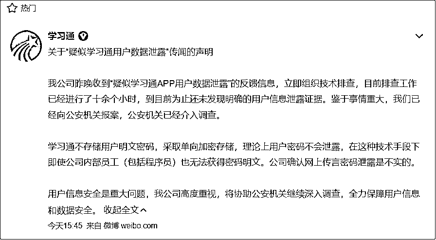
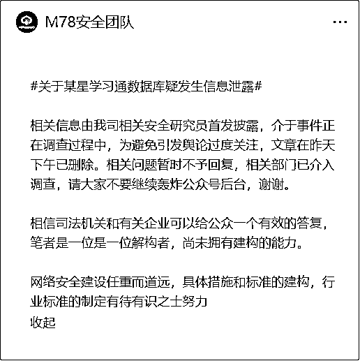
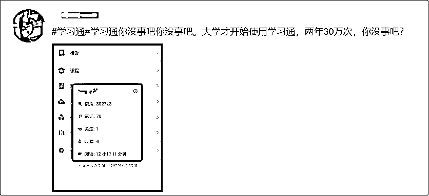
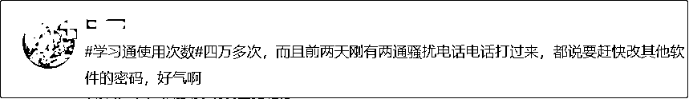
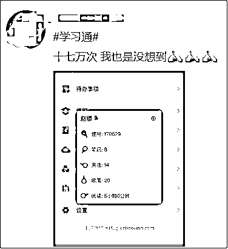
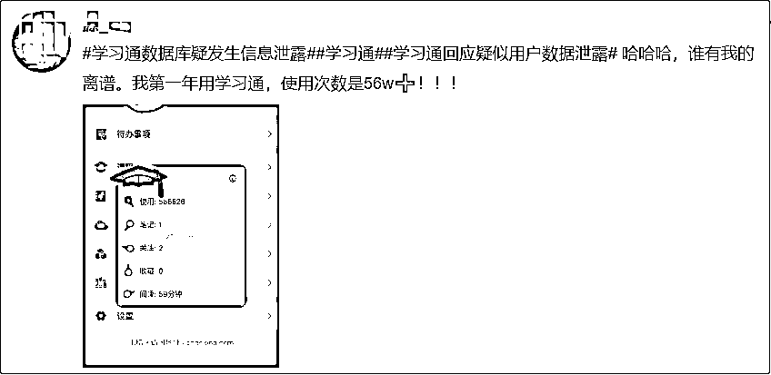

# 超 1.7 亿用户数据遭泄露？学习通回应

> 原文：[`mp.weixin.qq.com/s?__biz=MzIyMDYwMTk0Mw==&mid=2247538327&idx=8&sn=a9206609743aedc782a0309d26013638&chksm=97cb9dafa0bc14b918fd87a0aa247b2f1532f747543b1ae950b5733d0d59ff47e14184e9123c&scene=27#wechat_redirect`](http://mp.weixin.qq.com/s?__biz=MzIyMDYwMTk0Mw==&mid=2247538327&idx=8&sn=a9206609743aedc782a0309d26013638&chksm=97cb9dafa0bc14b918fd87a0aa247b2f1532f747543b1ae950b5733d0d59ff47e14184e9123c&scene=27#wechat_redirect)

6 月 21 日，有媒体报道，大学生学习软件“超星学习通”软件的数据库信息被公开售卖，超 1.7 亿条信息疑遭泄露。

21 日下午，表示经十余个小时排查，**到目前为止还未发现明确的用户信息泄露证据**。鉴于事情重大，我们已经向公安机关报案，公安机关已经介入调查。学习通不存储用户明文密码，采取单向加密存储，在这种技术手段下即使公司内部员工（包括程序员）也无法获得密码明文。公司确认网上传言密码泄露是不实的。

**此前报道**

据 M78 安全团队公众号昨日发文称，**大学生学习软件超星学习通的数据库信息正在被黑客在非法渠道售卖，兜售的数据包含姓名、手机号、性别、学校、学号、邮箱等信息 1 亿 7273 万条，**引发网友热议，目前 #学习通# 登上微博热搜第一。

值得一提的是，目前该公众号已经将该文章删除，并且发布了一条消息称，关于某星学习通数据库疑发生信息泄露相关信息由我司相关安全研究员首发披露，介于事件正在调查过程中，为避免引发舆论过度关注，文章在昨天下午已删除。相关问题暂时不予回复，相关部门已介入调查。

另据 AI 财经社报道，有大量超星学习通用户提到，近日有外地的手机号给自己发信息、打电话，甚至有用户反映，自己前几天就接到了境外诈骗电话，对方能报出自己的身份证号、知道自己有支付宝学生认证。

此外，一些超星学习通用户在微博平台晒出自己的学习通页面，并表示使用频率多达几十万次，明显与实际情况不符。

图片来源：微博截图，下同 

公开资料显示，超星学习通是在大学中普及率非常高的一款 App，其功能包括网络课打卡、考试监考等。《财经天下》周刊查询发现，iOS 版本的学习通目前共获得了 12 万个评分，其平均评分仅为 1.4（满分 5 分）。有多位给出一星评价的用户提到，**超星学习通涉嫌过度收集隐私信息，为实现考试监考功能，用户“必须开麦克风、必须开摄像头、必须实名制”。**

来源：观察者网综合@学习通、@IT 之家、微博截图

](https://mp.weixin.qq.com/s?__biz=Mzg5ODAwNzA5Ng==&mid=2247487973&idx=1&sn=1b62da6f2018402862a5c375e10c355e&chksm=c06878b2f71ff1a4fbe7df4dec626aa7e696154751693bf16f6c6a302ceaa4d1959040c70518&scene=21#wechat_redirect)

← 向右滑动与灰产圈互动交流 →

