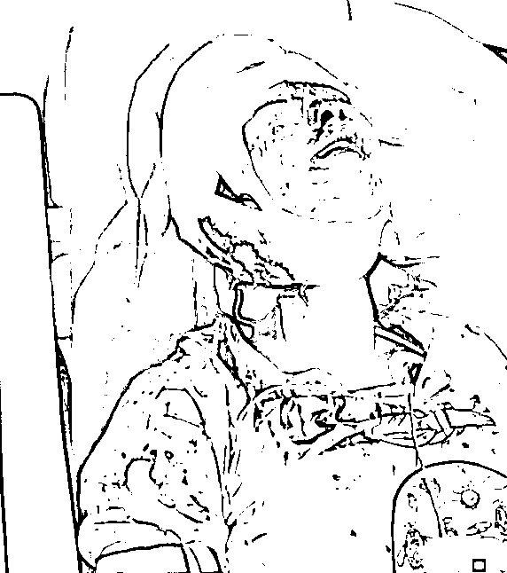

# 唐山案受害人的轻伤鉴定合理吗？

> 原文：[`mp.weixin.qq.com/s?__biz=MzIyMDYwMTk0Mw==&mid=2247538417&idx=1&sn=043b40caafd76d49e77f058704a45177&chksm=97cb9dc9a0bc14df3d504de780595e9a6e4ab6abb7d19e9580f2c9ef619a10f33266cb49b381&scene=27#wechat_redirect`](http://mp.weixin.qq.com/s?__biz=MzIyMDYwMTk0Mw==&mid=2247538417&idx=1&sn=043b40caafd76d49e77f058704a45177&chksm=97cb9dc9a0bc14df3d504de780595e9a6e4ab6abb7d19e9580f2c9ef619a10f33266cb49b381&scene=27#wechat_redirect)

**壹** 

第 11 天！

河北终于响应了舆论的呼吁，通报了唐山打人事件最新情况!

**根据通报，此次事件中被打女子王某某、刘某某损伤程度为轻伤（二级），远某、李某损伤程度为轻微伤。**

客观来说，公安部门对受害者伤情的通报，虽然略有遗憾，但真的很重要！ 

而且，如此重大案件，伤情问题交由中国最权威的刑事鉴定机构（司法鉴定科学研究院）鉴定，依旧历经十天才做出了上述伤情鉴定。

可想相关部门的态度是何其谨慎和认真！

但即便如此，关于受伤女子的伤势鉴定结果——“轻伤（二级）”和“轻微伤”，似乎依旧有很多网友并不能接受：

**都打成这样子了，还轻伤，轻微伤？**

是有什么问题吗？

**贰**

关于刑事司法鉴定有个说法： 

**“轻伤不轻，重伤很重”。**

简单地解释一下。

同一件事儿，在专业语境中和普通人的朴素情感认知是不同的概念。

这导致，在司法鉴定领域中的“伤情”，和普通人心中的“伤得很重”，“伤得很轻”可能是完全不同的两个概念。

刑事司法鉴定是一个严肃的事情，这事关当事人的刑罚裁量，所以，必须放在专业的语境中去说。 

那么，专业领域的“重伤”“轻伤”和“轻微伤”都是什么意思呢？

作为专业机构主体，江宁公安就及时进行了科普。

伤情鉴定分为三个级别，共五个等级。

**重伤（一级、二级）；**

**轻伤（一级、二级）；**

**轻微伤。**

每个等级都有非常严格和细致的规定。

**从法律层面来看，轻微伤和轻重伤是本质上的变化！**

换句话说，刑事责任参考的就是受害人伤情有没有达到“轻伤”。

轻微伤对应的是“违法”，但“轻伤”和“重伤”则妥妥构成了刑事犯罪！

引用“江宁公安在线”的说法是“轻伤不轻，重伤很重”

伤情鉴定本身是一个非常专业，也非常复杂的并且需要结合伤情实际情况才能准确判断的。

所以，在这里我们也不班门弄斧，就举几个“重伤不中，轻伤不轻”错觉的例子。 

根据《人体损伤鉴定标准一览表（2021 年）》标准：

上颌骨额突骨折，外伤后听力减退，肋骨骨折，足骨骨折，这些都是轻微伤；

面部条状瘢痕（50%以上位于中心区），单条长度 10.0cm 以上，或者两条以上长度累计 15.0cm 以上；而容貌毁损（轻度），这些都构成重伤。

目前从各种公开的资料来看，受伤女孩儿两个是轻微伤，两个是轻伤二级，这说明打人者的刑事责任已经绝对构成了犯罪，追责是必然的。 

**叁**

但也有人质疑，打人的人渣手段如此残忍，影响如此恶劣，但鉴定结果是“轻伤（二级）”和“轻微伤”。 

这几个人渣会不会得不到严惩？ 

网上不少人担心，按照轻伤二级计算法律责任，会不会判刑不超过 3 年？

毕竟，我国《刑法》第二百三十四条【故意伤害罪】明确规定：

故意伤害他人身体的，处三年以下有期徒刑、拘役或者管制。

致人重伤的，才能处三年以上十年以下有期徒刑。

如果最终结果是这样，确实让人觉得难以服气！

毕竟，当众在夜市摊儿殴打无辜女性，这事儿不仅给受害人带来了巨大的身心伤害，对社会的公序良俗和心理也都产生了重大伤害。 

而惩治坏人，不是也要考虑法律的社会学效益么？ 

**肆**

既然说到这里，我们就再往深处探讨一下： 

为什么现在很多犯罪分子对“坐牢”有恃无恐？！ 

很简单，因为相对于他们“犯罪获利”而言，“坐牢”的代价实在太低了。

不知道什么时候开始，监狱变得越来越“人性化”了。

暂且不说不少死缓最终变成了不死。

就说那些“坐牢”的犯罪分子，甚至也有人夸奖“里面个个都是人才，说话又好听……”。

不知道什么时候开始，要求监狱民警对犯罪分子温情脉脉、关怀备至……

动辄要保障“犯罪分子”的“人权，要让他们吃好睡好，还要保证他们的身体健康，享受“公费医疗”、确保文娱活动丰富。

也许并不错，但这些做法是不是，会让人觉得哪里有点儿怪怪的呢？

结果，是不是导致了刑法、刑罚和监狱失去了“惩戒”和“震慑”的作用？！

**当法律对犯罪的惩罚性不够时，对那些罪犯来说，“坐牢”反而变成了一种享受和获取尊重的砝码。**

对这些人来说，坐过牢、吃过牢饭，会成为一种另类的“荣耀”和“护身符”。

那么，这时候的“犯法”和“坐牢”吗，还有什么可怕的呢？

这对于遵纪守法的人们和我们制定的法律来说，难道不是一种赤裸裸的羞辱么？！ 

****

**伍**

有不少科研工作者在研究成果中都表明： 

> 近十年来，重新犯罪率已经飙升至近 30%；一些重大恶性刑事案件，70%以上有刑满释放人员主犯或参与。

这说明监狱、刑罚，对那些人渣并没有形成心理上的震慑作用。 

具体到这个案件之上，河北省公安厅在通报中也提到了： 

这几个打人的人渣，有些人本身就是有犯罪前科，甚至还有多次未受惩罚的犯罪活动。

而这次他们“汇流”唐山，本来就是臭味相投搞违法犯罪活动的。

如果这些人渣但凡对法律，对监狱，对警察，有一点点的敬畏之心，能发生这样让全国人民动怒的事情？ 

必须得对这几个人渣用重刑！

不重不能平民愤！

**陆**

在此，我们也希望通过此文再提醒一下那些容易上头的人： 

好好看一下《人体损伤鉴定标准一览表（2021 年）》【后台回复“鉴定”获取】。

一定要时时刻刻铭记那句话在心里：

**不要打架！**

**打输住院！打赢坐牢！**

**害人害己！**

来源： 新洞察 作者：猫二侠

](https://mp.weixin.qq.com/s?__biz=Mzg5ODAwNzA5Ng==&mid=2247487973&idx=1&sn=1b62da6f2018402862a5c375e10c355e&chksm=c06878b2f71ff1a4fbe7df4dec626aa7e696154751693bf16f6c6a302ceaa4d1959040c70518&scene=21#wechat_redirect)

← 向右滑动与灰产圈互动交流 →

