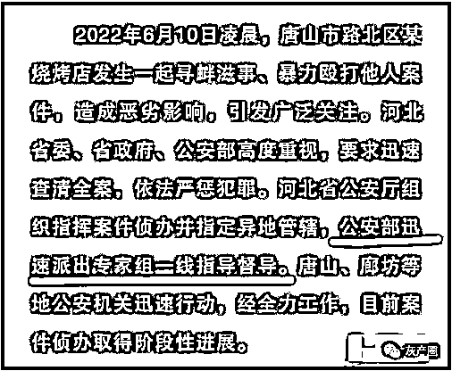

# 唐山事件已通天，微博有人趁机搞事，居心叵测，万人被禁言！

> 原文：[`mp.weixin.qq.com/s?__biz=MzIyMDYwMTk0Mw==&mid=2247538417&idx=3&sn=413bb75c6e48c7f7450b2eac9b8e092f&chksm=97cb9dc9a0bc14dfb829cbc5d5f61a60bbf575de2bba0ea5dfc2d7cd37963eab5ab5a38a99e5&scene=27#wechat_redirect`](http://mp.weixin.qq.com/s?__biz=MzIyMDYwMTk0Mw==&mid=2247538417&idx=3&sn=413bb75c6e48c7f7450b2eac9b8e092f&chksm=97cb9dc9a0bc14dfb829cbc5d5f61a60bbf575de2bba0ea5dfc2d7cd37963eab5ab5a38a99e5&scene=27#wechat_redirect)

“唐山烧烤店打人”事件备受社会关注。

批评监督是批评监督，造谣传谣是造谣传谣，两者之间有质的界限。
可笑的是，现在微博上很多伤害别人的行为全都打着为了正义的旗号。

像这种对受害人制造、传播如此恶毒谣言的，他们是真的关心受害人吗？

“你报警呗，没有造谣的压迫，官方会那么快发声吗？” 😅😅😅

唐山打人事件，一帮不明生物死命把陈继志一伙的恶行往“阳刚之气”上靠。
这种事，他们不是第一次干，自从教育部要求提高青少年的阳刚之气后，一有涉及男性的负面新闻，评论区必定一片阴阳怪气：“这就是中华阳刚男儿！”
你费尽唇舌，一个劲地解释阳刚的定义不是这样的，粗鲁暴力蛮不讲理不尊重女性不叫阳刚，叫野蛮没素质。然而效果有如对牛弹琴，他们照样我行我素，照样用他们自己定义的“阳刚”到处碰瓷。

期间还有一位“女主播”爆料“央视多台采访车（在唐山）居然先后被砸”，结果被网友揭穿记者证是过期的，新闻也是假的

搞性别对立的那就更多了，这次事件动静这么轰动，微博也展开了清理行动

据@微博管理员 ：唐山打人事件持续引发关注讨论，警方已于今日通报案件最新进展。与此同时，站方持续深入排查相关违规内容，并依据《微博社区公约》等相关规定予以处置。

最新进展警方通报唐山打人事件最新情况 通报中提及唐山打人案 2 人轻伤 2 人轻微伤 ，对此一些网友很疑惑，“为什么看起来很严重的样子却只是轻微伤或者轻伤？”。关于这一点，还是要多说多普法，法律上说的“轻伤”，“轻微伤”，可能和一般人的理解有很大差异，总结一句话就是：轻伤不轻重伤很重。---@江宁公安在线

另外，据网友@甜海胆观察分析：

这个通报里有一些细节，能看出案子早就通天了。
“公安部迅速派出专家组一线指导督导”这是公安部，在北京。  

“司法鉴定科学研究院出具了司法鉴定意见书”。司法鉴定科学研究院以前叫司法部司法鉴定科学技术研究所，2017 年更名为司法鉴定科学研究院，简称“司鉴院”。是司法部直属科研单位，在上海。
公安部有没有自己的鉴定机构呢？有，是公安部物证鉴定中心，在北京。但是，这次公安部委托鉴定的并非本身直属鉴定机构，或其他高校鉴定机构，或第三方鉴定机构，而是司法部的直属鉴定机构。
很权威，很客观，很公正。

* * *

白帽蓝衣*：全部是提级，而且，部里对这个案子是非常重视的*

*Orca777：唐山的破事儿还不够格让 zy 来帮他们遮遮掩掩。被带节奏的吃点什么才能把脑子补补好...*

***负责花钱的黑兔子:**盼着她们死的人的眼里只有自己，更别说权威机构*

*来源：微博那些事儿*

***](https://mp.weixin.qq.com/s?__biz=Mzg5ODAwNzA5Ng==&mid=2247487973&idx=1&sn=1b62da6f2018402862a5c375e10c355e&chksm=c06878b2f71ff1a4fbe7df4dec626aa7e696154751693bf16f6c6a302ceaa4d1959040c70518&scene=21#wechat_redirect)*

*← 向右滑动与灰产圈互动交流 →*

**