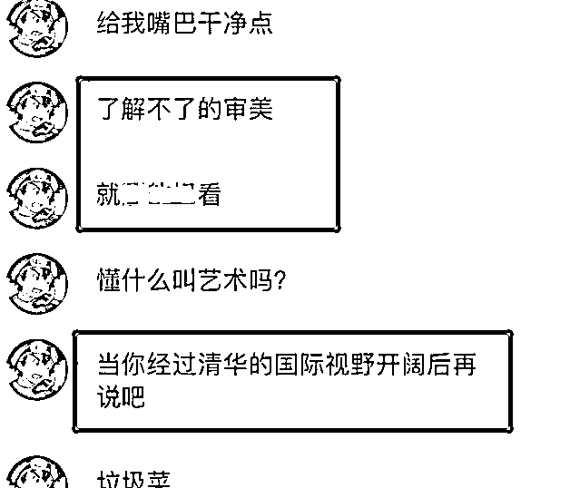

# “眯眯眼”重出江湖，清华美院毕业设计遭吐槽，却被回怼不懂审美

> 原文：[`mp.weixin.qq.com/s?__biz=MzIyMDYwMTk0Mw==&mid=2247538417&idx=4&sn=139ef12e6fc1805d8a3a31ae735da596&chksm=97cb9dc9a0bc14df9a5a0c5eecc27c8ddb08fc757cac065938c03a6f681561ffbcf01dd3d14b&scene=27#wechat_redirect`](http://mp.weixin.qq.com/s?__biz=MzIyMDYwMTk0Mw==&mid=2247538417&idx=4&sn=139ef12e6fc1805d8a3a31ae735da596&chksm=97cb9dc9a0bc14df9a5a0c5eecc27c8ddb08fc757cac065938c03a6f681561ffbcf01dd3d14b&scene=27#wechat_redirect)

清华大学在中国学子的心中是顶尖“学府”的存在，能够进入其中学习的学生都是有“两把刷子”的，非寻常学生能企及的。

但是随着吴勇“插图”事件的不断发酵，清华美院被推上了风口浪尖，学生的毕业设计也备受诟病，各种无法理解的“审美”作品层出不穷。

此前“眯眯眼”广告就引起了很多人的不适，而清华美院的学生却并未引以为戒，依然沿用这样的“另类”风格，还美其名曰“国际审美”，尤其是毕业设计中频繁出现更是遭人吐槽。

“眯眯眼”重出江湖，清华美院毕业设计遭吐槽，却被回怼不懂审美

一提到“眯眯眼”的造型想必大家都会有所反感，此前的三只松鼠以及清华美院的毕业设计也都因此备受诟病，再加上吴勇的“丑插画”事件后，理应给清华美院的学生一些警醒。

但是没想到这样“丑化”的妆容重出江湖，依然是出自清华美院的“高材生”之手，一时间让艺术生的审美问题再次冲上风口浪尖。

清华美院的学生是全国艺术生中的佼佼者，他们的天赋和能力都很强，所以每年的毕业设计都应该是一场“视觉盛宴”，但是却频频因为固化的妆容引发争议。

今年的毕业设计美其名曰“新中式”，却并不符合大众审美，虽然说在服装的设计上非常大胆且新颖，也有一定的观赏性，但是妆容依然沿用了“眯眯眼”的形象，这就让人心生不悦了。

于是有网友就指出了毕业生设计上的问题，结果不仅没有被虚心接受，反而被学生一顿回怼，直言“理解不了的审美就别看”，还大言不惭地说“等你经过清华的国际视野开阔后再说吧！”。

这样的一番言论激起了很多人的反感，本身艺术生的作品都不是完美的，存在问题是很正常的，那么学生就应该学会接受他人的建议，而不是恼羞成怒地去回怼。

不管是“东方审美”还是“国际审美”，都应该符合大众的观感，如果学生们的设计引起很多人的吐槽，那么就应该思考一下问题出在哪里，只有勇于接受并改正才能成长起来。

“国际审美”是兼容并包的，学生不应如此固化，要学会正视他人的质疑

清华美院的学生一直以“国际审美”来定义自己的作品，却恰恰忘记了本土化，虽然学生追求创新是很值得肯定的，但是所谓的“国际审美”理应是兼容并包的，并不是这样的固有印象。

如此“丑化”的形象很难让人理解，所以才会有众多网友的质疑与否定，其实艺术生的成长路上肯定会有各种声音，那么学生就不应该固执己见，他人的看法更能开阔自己的思维。

其实从吴勇插图事件之后，学生就应该心中有数，虽然东西方文化存在差异，审美自然也不同个，但是作为中国学生就应该有民族自信，将民族的美展现出来才能赢得更多人的认可。

既然质疑的声音那么多，那学生们就应该先从自身找原因，结合他人的建议和自己的想法进行调整，这样才能促进自身能力朝着更好的方向发展，不要总想用“艺术家的风骨”来掩人耳目，真正的“大家”是懂得吸取他人的建议的，而不是堂而皇之地闭门造车。

艺术生追求创新设计，但也要迎合大众审美，兼容并包才能呈现完美作品

我们说艺术生都是比较有想法的，尤其是创新思维更开阔，因此追求标新立异也很正常，有自己的风格更能凸显能力，但是追求创新也要有底线，虽不能迎合每个人的口味，也要符合大众的普遍审美。

**因此毕业生在设计毕业作品的时候要深入了解受众的体验感，不求多么惊艳但求稳扎稳打，可以加入自己的独特想法，但不能脱离现实生活，以免想法走偏而遭人诟病。**

另外学生要守好自己的底线，不要“崇洋媚外”，对于国际审美要抱着“取其精华，去其糟粕”的想法，以更加客观的角度去审视自己的作品，对于他人的建议要虚心听取，做到“有则改之无则加勉”，千万不要固执己见，那样只会让自己的路越走越窄。

【笔者寄语】

俗话说“各花入各眼”，人的审美确实存在差异，但是艺术生在设计自己的作品的时候要考虑到文化背景，不能一意孤行，清华美院的实力毋庸置疑，但是这种频繁出现的固化思想确实应该重视起来了，不要傻傻地当了别人的“挡箭牌”还不自知。

当然大学生从能力到思想都是慢慢形成的，犯错误是很正常的现象，不过大学生要学会正确理性地去看待他人的建议，勇于正视并改正错误也是一种成长，希望学生们能够引以为戒。

来源：实测

](https://mp.weixin.qq.com/s?__biz=Mzg5ODAwNzA5Ng==&mid=2247487973&idx=1&sn=1b62da6f2018402862a5c375e10c355e&chksm=c06878b2f71ff1a4fbe7df4dec626aa7e696154751693bf16f6c6a302ceaa4d1959040c70518&scene=21#wechat_redirect)

← 向右滑动与灰产圈互动交流 →

