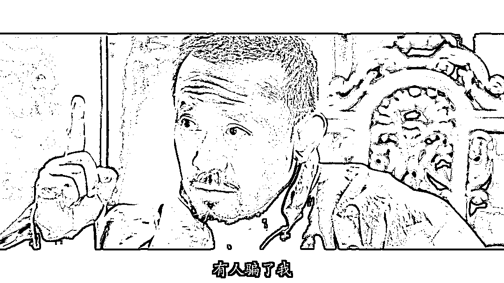
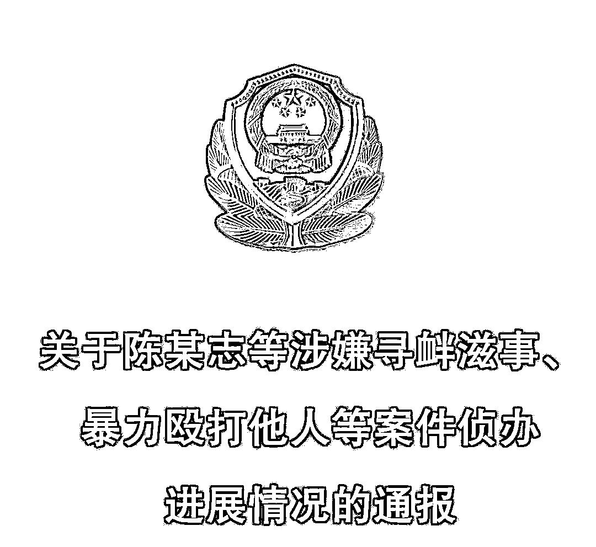
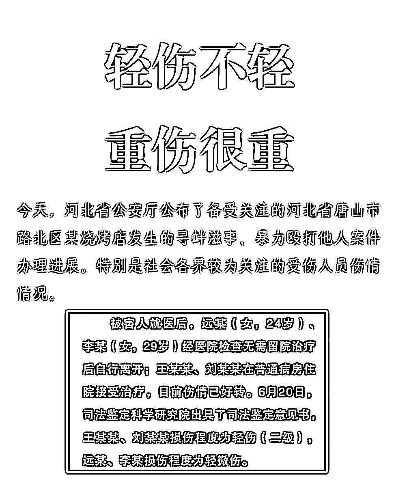
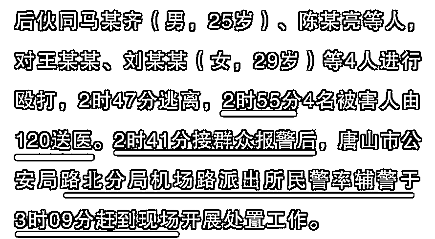
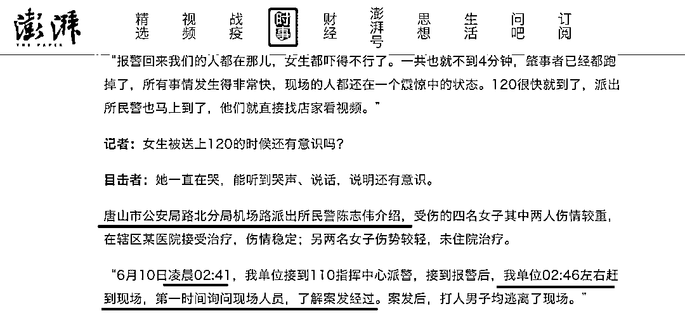
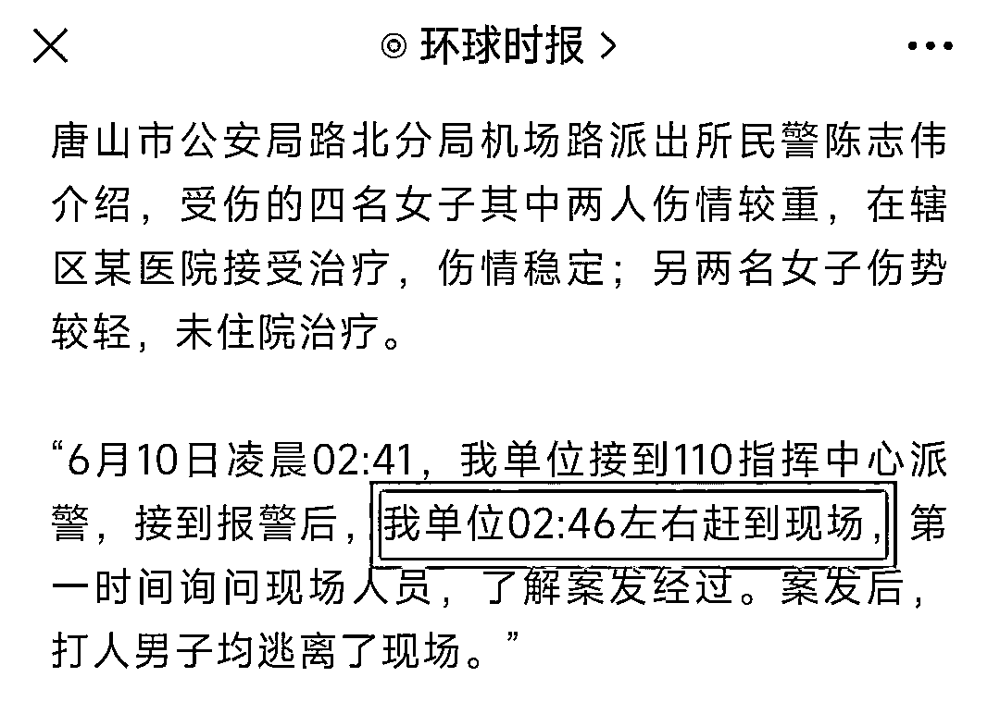
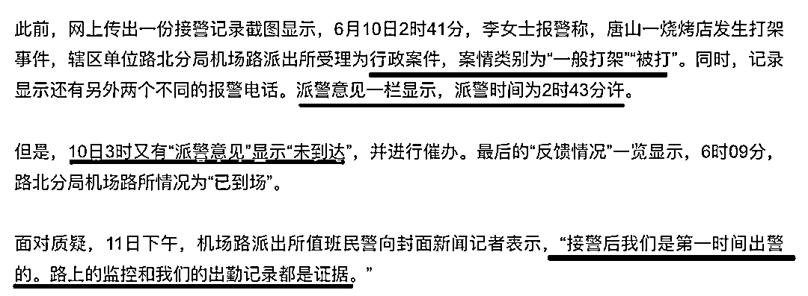
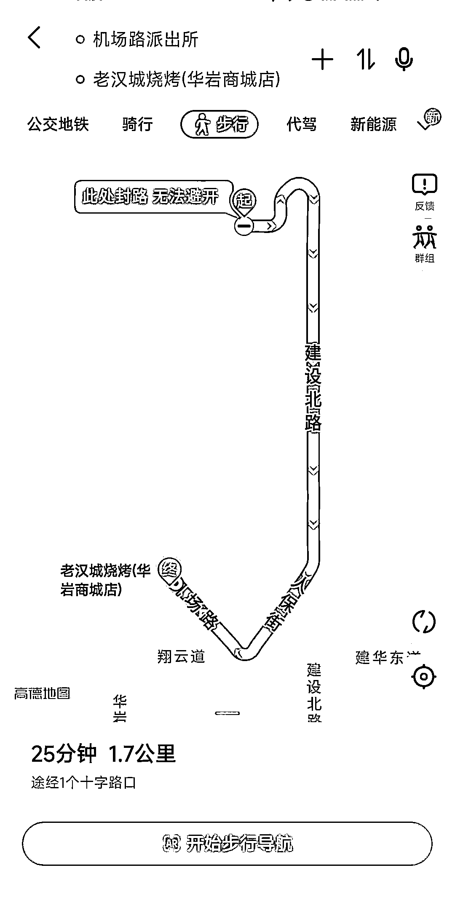
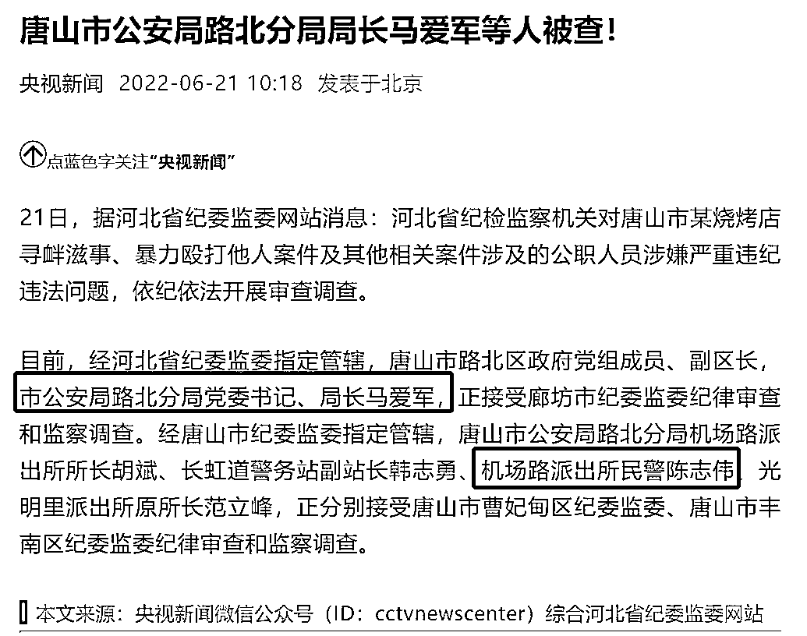

# 5 分钟出警？全国媒体都被唐山市路北分局耍了

> 原文：[`mp.weixin.qq.com/s?__biz=MzIyMDYwMTk0Mw==&mid=2247538417&idx=5&sn=d7464f0efba8bee242e679e84f7744b7&chksm=97cb9dc9a0bc14dfe722d543774943222b9f6385beb60abdd7c14f45bf7d767bc7e99ac112fd&scene=27#wechat_redirect`](http://mp.weixin.qq.com/s?__biz=MzIyMDYwMTk0Mw==&mid=2247538417&idx=5&sn=d7464f0efba8bee242e679e84f7744b7&chksm=97cb9dc9a0bc14dfe722d543774943222b9f6385beb60abdd7c14f45bf7d767bc7e99ac112fd&scene=27#wechat_redirect)

图源：电影《让子弹飞》

唐山市路北分局果然撒谎了。

唐山烧烤店打人事件，终于等来了通报，可以消停一会了。 

通报大家都看了，我就不再赘述，集中的质疑点在于四女的伤势判定为轻伤、轻微伤...... 

请大家明白，其实 4 人伤得很重，但不要觉得轻伤、轻微伤就不重。

网上有一篇科普解释的官方推文，大家在各大媒体的转载中也可以找来看看，没啥好说的。

**我从官方通报中，发现唐山市路北分局果然撒谎了。**

请注意官方通报中最关键的一条信息：时间线。

2：40，陈某志骚扰并殴打被害人。

**2：41，围观群众报警。**

2：47，陈某志等人逃离现场。

2：55，四名被害人由 120 送医。

3：09，路北分局民警、辅警到达现场。

澎拜新闻报道《警方回应烧烤店打人案：接警后 5 分钟赶到，5 名嫌疑人有前科》：

这与路北分局此前向多家媒体透露的“5 分钟到达现场”、“第一时间赶到现场”，对不上。 

全国媒体都在转这篇稿子，一度确信不疑。

出警都有记录仪，二者接到报警时间一致，但到达现场时间相差整整 23 分钟，我们该信哪一份？

有点脑子的人，这时候都应该相信由河北省公安厅发布的通报。

所以，路北分局为什么要对记者撒谎？

**明明接警后 28 分钟才到现场，为何要声称 5 分钟（2:46 分）就赶到了？**

请注意这个派出所民警，他叫陈志伟。

另据此前封面新闻报道《网传唐山警方接到报案后 3 个多小时才到现场，派出所和报警人回应》：

一份接警记录截图显示，派警意见一栏写着，派警时间为 2 时 43 分许。

但是，3 时又有“派警意见”显示“未到达”，并进行催办。

**也就是说，派警了，但没出警。**

面对质疑，机场路派出所值班民警理直气壮地向记者表示：

**“接警后我们是第一时间出警的。路上的监控和我们的出勤记录都是证据。”**

所以，现在的证据都是假的咯？ 

更离谱的是，距离事发地“老汉城烧烤”最近的路北分局机场路派出所直线距离只有 800 米，车程 1.6 公里仅需 4 分钟。

**1.6 公里，他们用时 28 分钟。**

**凌晨 2 点多应该不堵车吧，也就 4 个红绿灯，请问您是用走路的？** 

****

**1.6 公里走 28 分钟大约是路太黑走错路了，毕竟好几千步，万一哪步就走错了呢？**

有点脑子都知道，这种恶性事件，出警必配车。

3 点 09 分到达现场，施暴者跑了，受害人 120 拉走了，您是来跟朋友吃夜宵的吗？

明明 2 点 43 分已经派警，犯罪嫌疑人 2 点 47 分才逃离现场，如果路北分局尽到了自己的职责，嫌疑人可能当场就被逮捕。

**出警不力、加上面对媒体轮番撒谎，背后是渎职，是包庇！**

在河北公安厅发布案情通告的同时，河北纪委发布了更为重磅的调查进展，同本案相关及其他案件被查出问题的公职人员，开始浮出水面。

**路北区副区长、路北公安局局长马爱军，** 

**路北分局机场路派出所所长胡斌，**

**长虹道警务站副站长韩志勇，**

**光明里派出所原所长范立峰。**

**此外，还有谎报“5 分钟出警”的机场路派出所民警陈志伟，也一同被查。**

陈志伟是被查者中唯一不带职务的民警，估计是被领导推出来接受采访顶雷的，但绝不冤枉。

他将警察到达案发地点的时间往前说了 23 分钟，而这 23 分钟的差别对公众认识案件至关重要。

毫无悬念，这些人都被一撸到底，百姓也都纷纷拍手叫好。

**但目前查处的保护伞都是公安，顶天不过一个副局长（副处级），而背后是否有更大的保护伞？**

**请彻查！**

来源：昌南大队长

](https://mp.weixin.qq.com/s?__biz=Mzg5ODAwNzA5Ng==&mid=2247487973&idx=1&sn=1b62da6f2018402862a5c375e10c355e&chksm=c06878b2f71ff1a4fbe7df4dec626aa7e696154751693bf16f6c6a302ceaa4d1959040c70518&scene=21#wechat_redirect)

← 向右滑动与灰产圈互动交流 →

