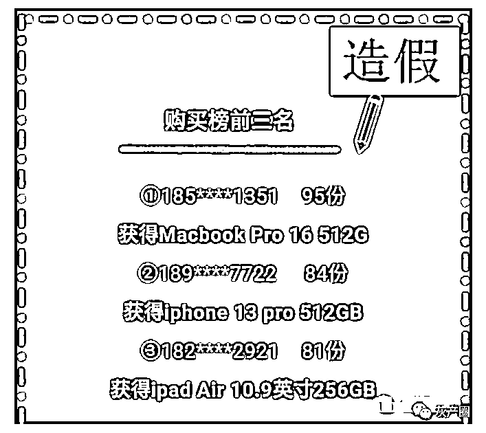

# 又一数藏平台暴雷！“顶艺 TopArt”涉嫌暗箱操作，数万人血本无归！

> 原文：[`mp.weixin.qq.com/s?__biz=MzIyMDYwMTk0Mw==&mid=2247538417&idx=7&sn=b8a8a36b12dc609c8eb008df45f7b9aa&chksm=97cb9dc9a0bc14dfa40a0a3ab14085f9dc7f1e0a9f8710d8090a213cd3118863e67e0818d4b4&scene=27#wechat_redirect`](http://mp.weixin.qq.com/s?__biz=MzIyMDYwMTk0Mw==&mid=2247538417&idx=7&sn=b8a8a36b12dc609c8eb008df45f7b9aa&chksm=97cb9dc9a0bc14dfa40a0a3ab14085f9dc7f1e0a9f8710d8090a213cd3118863e67e0818d4b4&scene=27#wechat_redirect)

今年上半年，国内数字藏品很火，平台密集涌现。但一个事物火热的时候，往往就是资本收割的时候。前前后后一系列的平台出了问题，比如 iBOX 数藏 、象寻数藏、TT 数藏、元海数藏、HOTDOG 数藏、天穹数藏等。 

据知情人反馈，这两天一个叫“顶艺 TopArt”的数藏平台也暴雷了，目前玩家正在维权中！ 

下面是部分被骗人员的名单统计： 

据不完全统计，这次坑了起码有上千万，之前一个创世一万多一个就有 400 多万，然后合成创世，简直不敢想象这个金额！

这次事件的导火索是官方随意更改 gm，随意下架 gm，严重地损害消费者权益。在此期间官方人员消失不见，平台也未给任何说明，另外官方监事干涉二级市场，建群让购买藏品，自己却暗自出货，事情败露后将微信群和 QQ 群全部解散。

据悉平台刚开始的时候用各种手段拉新，五月份提出发布名为“星萌宝了”的创始数藏，宣传其极具收藏价值，并为其提供多达 17 条赋能诱导消费，当时其数藏合成成本在二级市场最低要 2.5 万左右，在合成结束后官方为“星萌宝”的持有者建立了 VIP 群聊，并承诺为所有持有者每月不定期发新品前有专属现金抽奖，后来又改为了“京东 E 卡”，但从 5 月 12 日到 6 月 17 日仅履行过一次，更令人吃惊的是这期间平台发新次数高达 5 次之多！

最后大家发现官方所谓的“赋能”只是一句空话！

最后平台不声不响直接关闭了二级市场，相当于所有的藏品变成图片了！这样二级里的人进去，真金白银买的藏品现在都变成了图片，等于是血本无归！可见，“顶艺”平台一直在欺骗用户，该公司利用区块链数字藏品做掩护，涉嫌非法集资诈骗！ 

查询显示，“顶艺 TopArt”数字藏品交易平台背后的主体公司是武汉凌玮客科技有限公司，该公司成立于 2020 年 11 月，现在的法人是“陈爱勇”，监事为“姚学龙”。

通过上面我们可以看出，该公司虽然注册资本 1000 万，但实缴仅仅 10 万，也没有纳税人资质和参保人数，和一般的空壳公司没有什么区别。

另外发现该公司最近变更记录多达 12 条，这其中就包括投资人变更和市场主体类型变更，且是最近调整的，看来公司是在有意做一些变更来规避风险。

随着事件的曝光，曾经平台一些暗箱操作的内幕被玩家扒了出来。

首先是“购买榜”造假，看下面这张图：

如果这张图还不能说明什么，那下面这张中奖名单图就很直接了：

经过会员的调查，发现第二名的号码就是“姚学龙”，也就是平台的客服“超凡”。 

关于这个官方客服“超凡”，更是爆出其用小号在群里忽悠，组织人员给他出货。

据悉，这个客服超凡（姚学龙）一级卖不完的东西二级全卖了，99 块发售的，超凡却 22 块在抛货，一直砸价，最后被玩家发现了，他就解散了所有群，微信也改了！理由是：为更好的维护社群环境，创建良好的社群氛围，现已全面解散微信社群。

而给出的官方 QQ 群也是一个摆设，根本加不了！ 

“顶艺 TopArt”有两个 APP，一个是“TopArt”,另一个是 Gmall（二级平台）。现在 gmall 里面的购买记录，订单消息等都被删除，显然是想消除证据！

关于数字藏品，4 月 13 日，中国互联网金融协会、中国银行业协会、中国证券业协会联合发布了“关于防范 NFT 相关金融风险的倡议”。

《倡议》中明确要求：坚决遏制 NFT 金融化证券化倾向，不为 NFT 交易提供集中交易（集中竞价、电子撮合、匿名交易、做市商等）、持续挂牌交易、标准化合约交易等服务，变相违规设立交易场所。

很多数字藏品交易平台，大多缺乏权威背书、内容质量良莠不齐，但他们仍然不断发布新的藏品，提高价格。之前的还没有流通，新的藏品就又开始了，数量多，质量差，流动性低。就像圈子里所流传的一句话：卖得出去的是 NFT，卖不出去就是 PNG！

数字藏品既危险又迷人，既有一夜暴富的幸运者，也存在因数藏而写下万字遗书的玩家。所以，数藏市场的玩家们，还是要长点心，不要盲目跟风，远离那些山寨版的数字藏品平台。

来源：区块链评说，利箭在行动

](https://mp.weixin.qq.com/s?__biz=Mzg5ODAwNzA5Ng==&mid=2247487973&idx=1&sn=1b62da6f2018402862a5c375e10c355e&chksm=c06878b2f71ff1a4fbe7df4dec626aa7e696154751693bf16f6c6a302ceaa4d1959040c70518&scene=21#wechat_redirect)

← 向右滑动与灰产圈互动交流 →

