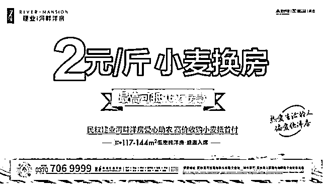
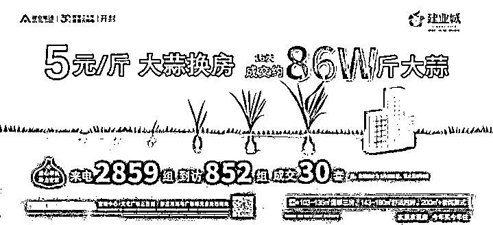
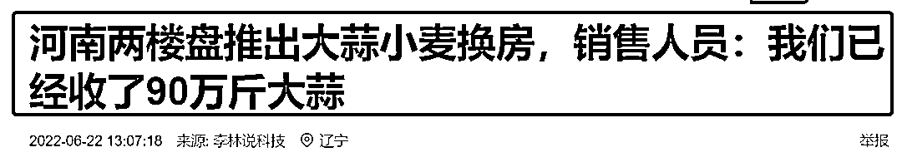
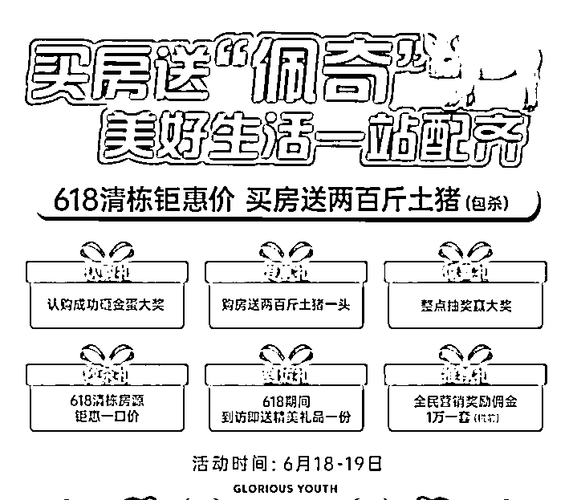
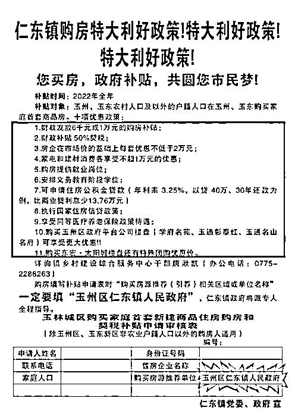
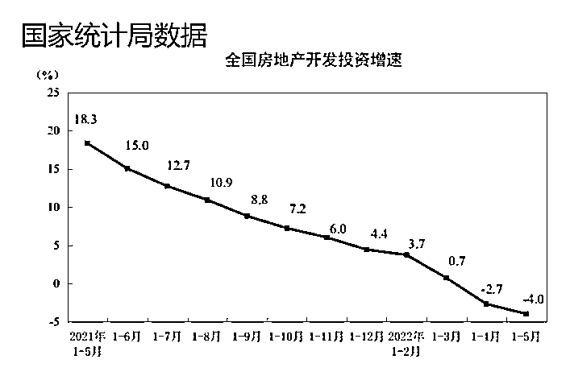
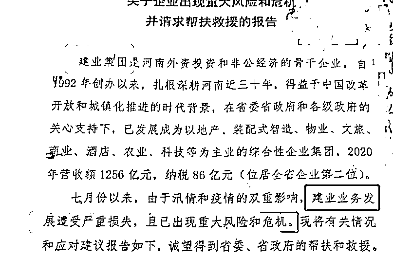
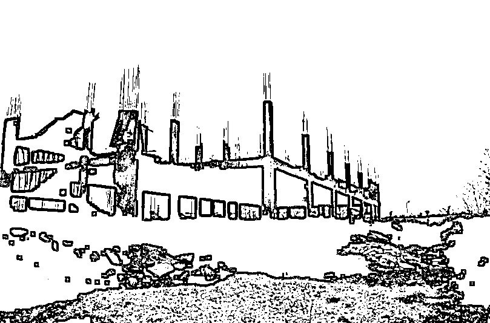
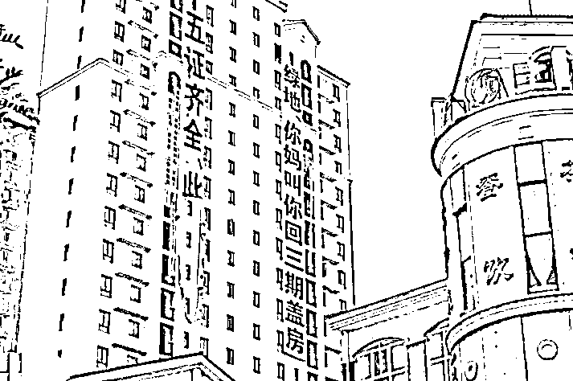
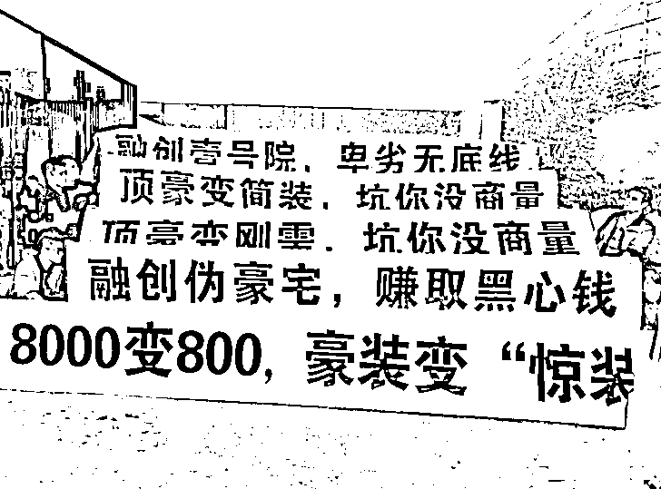

# 房地产商最伟大的发明：小麦换房，2 元/斤！

> 原文：[`mp.weixin.qq.com/s?__biz=MzIyMDYwMTk0Mw==&mid=2247538485&idx=1&sn=7e934543dafb68ba4f56e916a55c1560&chksm=97cb9c0da0bc151bcc35efd14fea2caf19e0febac962498f91d8aa780f9244eeda5e162dff11&scene=27#wechat_redirect`](http://mp.weixin.qq.com/s?__biz=MzIyMDYwMTk0Mw==&mid=2247538485&idx=1&sn=7e934543dafb68ba4f56e916a55c1560&chksm=97cb9c0da0bc151bcc35efd14fea2caf19e0febac962498f91d8aa780f9244eeda5e162dff11&scene=27#wechat_redirect)

**壹**

如果要找一个“富有创新精神”的行业，排名榜上房地产应该有自己的名字！

这不，这两天河南两家房地产开发商的“创意”又一次令人震惊不已！

河南商丘民权一家房地产公司：

**小麦换房，2 元/斤。**

河南开开封杞县一家房地产公司：

**大蒜换房，5 元/斤。**

看着这些花里胡哨的宣传画面，天马行空的营销方案！

不得不说，在长达 30 年的商品房开发历史上，用小麦和大蒜买房子付首付的大手笔，可能还真是空前的！

听说，有些地方的农民已经闻风而动了，当地做活动的楼盘已经收到了 90 万斤的大蒜！ 

按照 5 元一斤的价格，也就是说已经至少有 450 万的“首付”交过了。 

再按照大概 15 万首付的均价推算， 几天下来这个楼盘也已经卖出了 30 多套房子。 

真是一个敢这样卖，一个敢这样买！

**贰**

夸张的营销不仅仅是在河南。

江苏连云港海州区的保利水木芳华项目，618 期间推出了买房送一头 200 斤土猪。

**而且，包杀！**

广西玉林市仁东镇政府，为了鼓励购房，今年以来发布了一系列购房利好政策，其中甚至包括买房“送工作”。

**还承诺有最低薪酬保障！**

**三十年河东，三十年河西！**

跟前些年排队买房相比，今天的开发商竟然显得有些卑微！ 

**但看问题不要看表面，要透过现象看到本质！**

**开发商所有的努力，背后都是因为缺钱导致的焦虑！**

2022 年前五个月，百强房企的累计销售规模同比腰斩，下降 52.3%，降幅仍在继续扩大。

另一方面，反映房地产市场热度的投资，也在同步快速下跌！

而时到今日，2021 年开发商拿到的地，据说到现在有将近 80%都还没有开工。

要知道，这是多么的不可思议！

**数据不会说谎！**

得承认：

**现在的房地产行业，已经在这个炎热的夏天，跌入了扎心的寒冬！**

**叁**

对开发商来说，最冷的一天可能是 2021 年 9 月 9 日！ 

河南房地产一哥——建业集团一封《关于企业出现重大风险和危机并请求帮扶救援的报告》，在网上大肆流传。

尽管几乎所有人都知道，房地产行业日子确实并不好过，并且已经在很多地方暴雷。

但建业那言之切切的求救信内容，依然让人震惊！

房地产都已经到了如此危急的关头？！

**其实，挺不住，干着急的，何止是大大小小的房地产公司啊！**

政府的焦虑也早已经溢于言表！

为了助力开发商，很多地方政府也是频频祭出“怪招”！

**比如在河南郑州等多个城市，“房票”重出江湖！**

这个传说中的古老制度被重新开发利用，一度让我怀疑是不是暗示有些人真的穷疯了！

**而在山东青岛，有街道办干脆直接给社区下文，要求社区的工作人员帮助开发商推销新房子。**

卖房多少，都纳入到年终考核，跟奖金直接挂钩！

而作为强二线城市的武汉，干脆直接推出再次突破底线的“新政”：

**户籍居民在限购区域已经有 2 套住房的可以再买 1 套新的！**

武汉购房新政一出，其“宽松水平”立马秒杀成都、南京、苏州和杭州这些城市。

武汉，可能成为了中国目前购房“裤带”最松的城市！

但这样有用么？ 

**肆**

**一切都可能并没什么卵用！**

所有人都知道，开发商和政府一夜之间，都陷入了房事的焦虑！ 

各种撩拨，各种猛药，怎么就说起不来，就起不来了呢？ 

开发商很急！政府很焦虑！

但老中医们早就断言，有些问题的关键并不在于撩拨的手段，也不在于各种秘方神丹！

**房事这事儿重要的是要树立“信心”！**

什么是信心呢？ 

**举个栗子，就从郑州的“烂尾楼”说起！**

有消息称：

截至 2022 年 6 月 20 日，郑州约有 106 个问题楼盘，约 60 万人受到烂尾楼影响！

可是，郑州主城区才 700 万人左右，也就是说每 70 个人中就有 6 个人买到烂尾楼！

有名有姓的“问题楼盘”在网上并不难找，他们有停工数年之久，已被冠上烂尾楼称号。

有停工数月甚至一年以上，无任何复工迹象。

也有江湖上一直有它躺平、摆烂甚至暴雷的传闻，但还在做个样子“我觉得我还能抢救”的开发商。

轻描淡写之下，是触目惊心的各种问题。

**总之，烂尾楼问题成了影响郑州房事重树信心的关键问题之一！**

但这些问题怎么解决的呢？ 

**我们再看一个活生生的例子——郑州永威金桥西棠！**

这个楼盘据说是“河南最高学历楼盘”，据说其中 900 多名业主，有 72 名博士、近 300 名硕士，超 82%为本科学历，加上大专，超过 97%，小区有超 20%拿着人才补贴款。

有人感慨，大概郑州人才引进的一半儿都在这个小区了！

但可惜现在这个项目，现在却可能成了郑州最著名的“烂尾楼”。 

挣扎反抗了几近半年之后，这些受过高等教育的知识分子们，想了很久也别无良策，只是最终发出了：

**“麻蛋永威，麻蛋金桥，搞欺诈”的呼声！**

经历反复多次斗争无果的海棠业主们，悲愤交加。

用了 2 天时间，洋洋洒洒写下了 7 万字的“控诉书”——《人间剧本 两千作者 》**【后台回复“房”获取全文】**。 

但其实细读之下，字里行间只有四个字： 

**失望透顶！**

**伍**

失望中的人们，怎么会有重振雄风的信心？！

**房地产出了问题，得好好治治病！**

怎么治？

可以学学中医辨证施治的思想：

**“固本培元”“标本兼治”。**

疫情影响，经济下行，大家都没有很多钱，这是问题，但这不是根本问题。 

根本问题是经济下行，众生不易！但偏偏是拿大头儿的房地产守不住底线，工程烂尾的烂尾，质量堪忧的堪忧，食言暴雷的暴雷！

这，极大伤害了大众脆弱的感情和心灵！ 

别说是小麦和大蒜换房子，就算是将来拿柴火棍换房子，也不过是花样百出中的一样而已！

**最终也是于事无补，难成大器。**

有些人应该扪心自问：

**一边是政策松绑，花样营销！一边是哭天喊地，哀鸿遍野！** 

**花里胡哨的想法，有用？**

来源：在下刘三刀 作者：猫二侠

](https://mp.weixin.qq.com/s?__biz=Mzg5ODAwNzA5Ng==&mid=2247487973&idx=1&sn=1b62da6f2018402862a5c375e10c355e&chksm=c06878b2f71ff1a4fbe7df4dec626aa7e696154751693bf16f6c6a302ceaa4d1959040c70518&scene=21#wechat_redirect)

← 向右滑动与灰产圈互动交流 →

