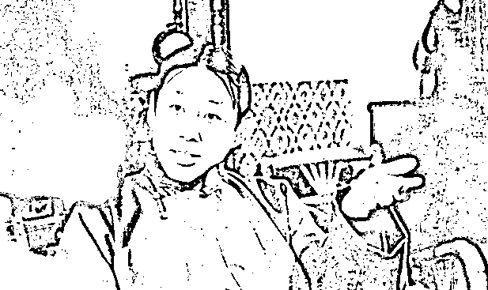
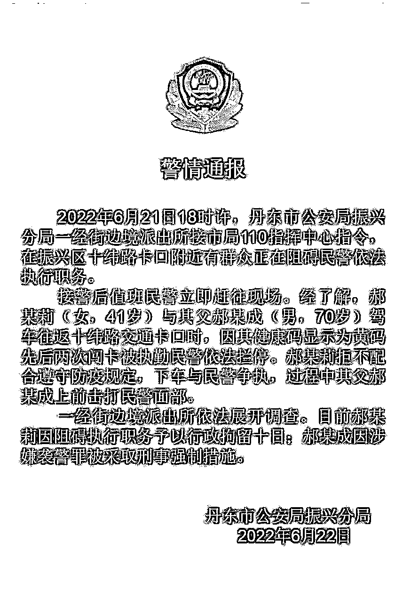
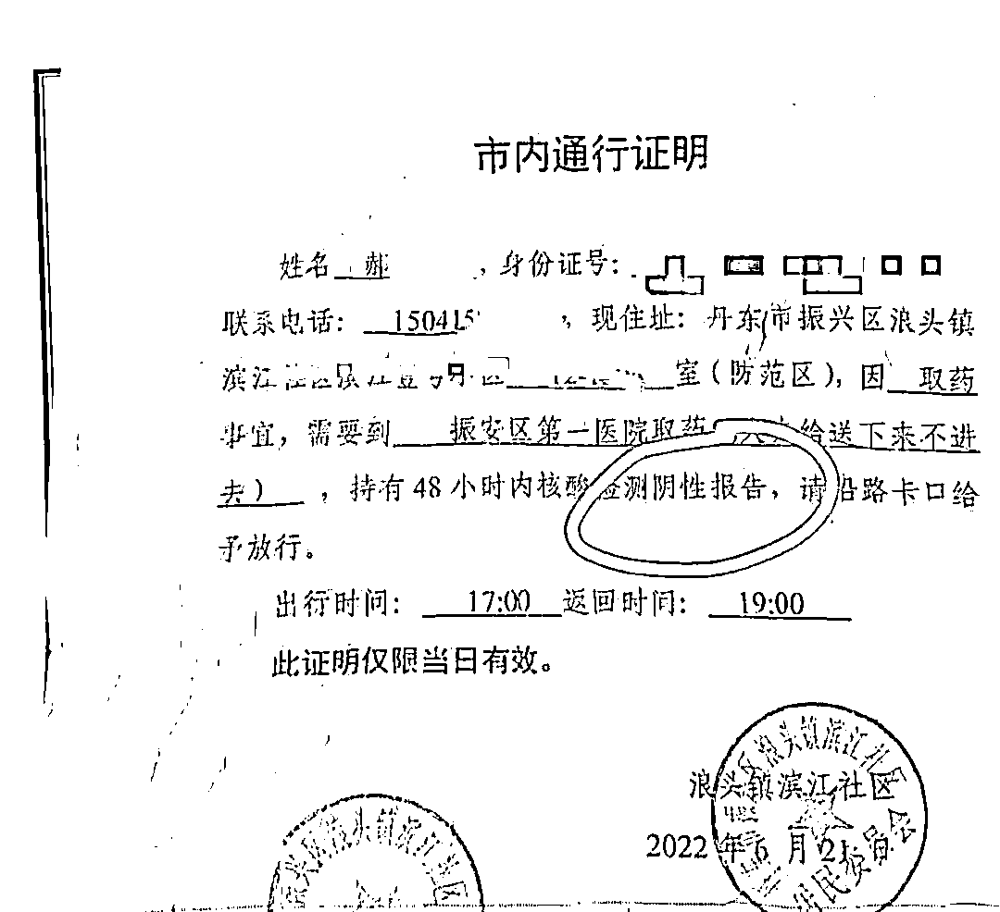
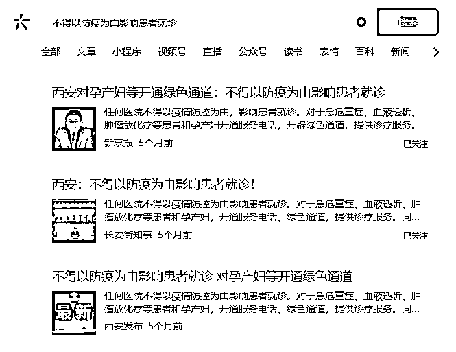
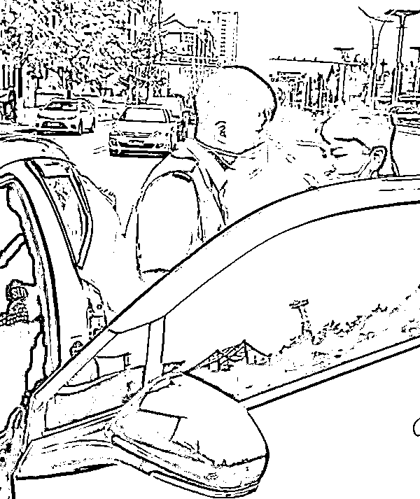
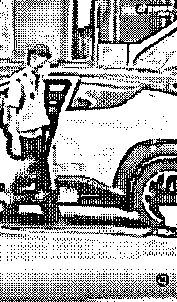
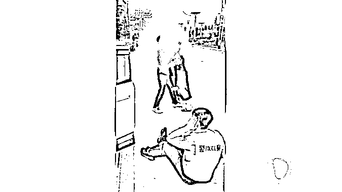
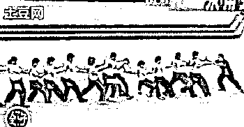
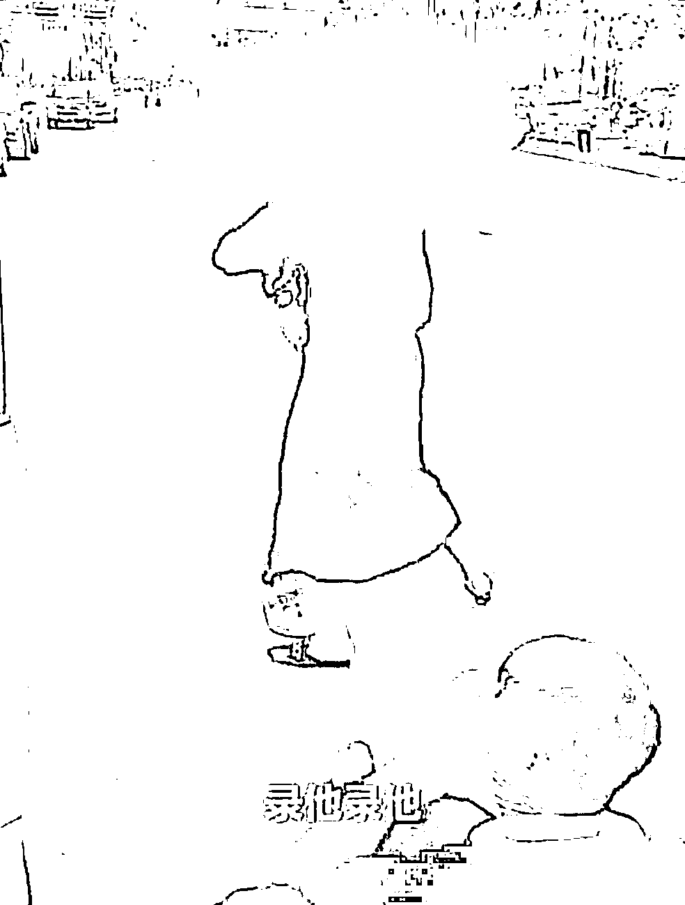
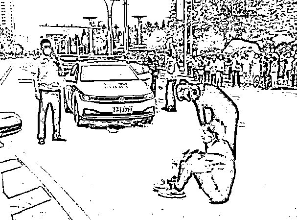

# 丹东父女黄码看病闯卡：袭警，带走，都录上了！

> 原文：[`mp.weixin.qq.com/s?__biz=MzIyMDYwMTk0Mw==&mid=2247538485&idx=3&sn=517738e1e64399a4f08fd0c9e5f8d925&chksm=97cb9c0da0bc151be87c9434024c006df44430492709d4c6ffc255adfa9fa69dbe317324dc72&scene=27#wechat_redirect`](http://mp.weixin.qq.com/s?__biz=MzIyMDYwMTk0Mw==&mid=2247538485&idx=3&sn=517738e1e64399a4f08fd0c9e5f8d925&chksm=97cb9c0da0bc151be87c9434024c006df44430492709d4c6ffc255adfa9fa69dbe317324dc72&scene=27#wechat_redirect)

图源：电视剧《围城》

其实我是个演员。录下来了吗？

丹东上了热搜。 

我是先看了警方通报，才知道有这么回事。

一对父女健康码为黄码，先后两次驾车闯卡，不仅拒不配合防疫规定，还与民警争执，其父还击打民警。

43 岁的涉事女子被行政拘留，她的 70 岁的老父亲被刑事拘留。

**前者阻碍执行职务，后者袭警。**

到这里，我坚决相信官方通报，通报上的行为相当可恨：黄码闯卡、拒不配合防疫、袭警。

可随着执法视频的曝光，看了那个 9 分钟的完整版，我沉默了。

先看看这个 9 分 57 秒的完整版视频，就不打码了。 

[`mp.weixin.qq.com/mp/readtemplate?t=pages/video_player_tmpl&action=mpvideo&auto=0&vid=wxv_2455535235543924739`](https://mp.weixin.qq.com/mp/readtemplate?t=pages/video_player_tmpl&action=mpvideo&auto=0&vid=wxv_2455535235543924739)

**丹东事件完整版视频**我的疑问有三： 

**一、执法人员为什么不放行？**

丹东全市低风险，虽然父女二人黄码，但社区开了证明、也做了核酸，何况老人是以看病的名义，执法人员为什么不放行？ 丹东地区的黄码怎样定性，民警拦截的依据是什么，社区开具的证明效力怎样，这是通报里没说的，疑问重重。但我有一点可以确认，如果老人去医院看病，任何地方都不得以防疫为由影响患者就诊，这是国家明确了的。西安教训
**二、算谁先动的手？真的动手袭警了吗？**为什么我要说算是谁先动的手，因为视频中有疑似该民警推搡女子的动作。 女子气得跟父亲说“根本没道理可讲”，然后说要开车回家，民警却堵住车门不准这个女士上车，女士全程没动手，却疑似被警察直接推倒在地。70 岁老父亲见女儿摔倒在地气不过，便下车给了执法人员一巴掌，把执法人员扇到在地。神奇的是这名警察真是弱不禁风，被一名七十岁老汉拍了一掌立马倒地不起。**更神奇的是，有路人拍到另一个角度的视角，通过慢动作可以看出，实际上老人并没有抽到警察的面部。**这个民警没被扇到却自动倒地了，这碰瓷水平堪称一流。那脆弱的一跌，娇羞的一声“录上了吗”，配着背后鲜明的“警察”二字，更是倒人胃口。**值得一提的是，这位七旬老汉还是在带病的状态下出的这一掌的。**估计老人身怀绝世武功，即使生病了还战力不减。**三、强行拖拽女子是否挟私报复?**这名年轻的警察被一名 70 岁大爷用“气功”打倒在地，倒地后第一时间问同伴“录上了没？”**假摔已有失警察形象，还嚷嚷着让同事录上。**接着从地上麻溜起来将驾驶座上的女子强力拉出摔在地上，这一下可是真摔。交警查酒驾或查摩托电动车，有问题都是第一反应拔车钥匙。咱就提一个小小的建议——为什么不拔车钥匙？ 把车钥匙拔下来就好了，让女子和他的父亲在车里冷静下，等 120 来处理就好。 为什么要如此粗暴？**有网友说该女子是泼妇，你怕是眼瞎，她除了声音大点已经很克制了，还在劝自己的父亲不要碰那个警察。**视频中女子多次提醒：你别碰他，碰他是袭警……但是当父亲的忍得了么？女子哭丧着说：**我回家行吧，我不看病回家行吗？**
民警这边表示：**袭警，带走，都录上了！你不能回家，有问题还要追究！****通报里只说其父打了人，没有提为什么老人要打人，是因为在老人面前女儿被推倒在地上！**从现场完整视频来看，女子一直在主张自己的权利，她认为自己有各种证明，送自己的父亲去医院是一种正常的要求，全程并没有辱骂和打人的行为。这位父亲出于爱女的本能，全程只有一个扇耳光的动作，而且还未触及面部，也没有使用武器追着打施暴，竟然直接定性为刑事犯罪的袭警，我觉得有一点过了。**这件事无论从哪个角度来说，民警似乎都不太占理。**从某种角度上而言，若不是因为“录上了”，那这份通报可能真会合情合理到无懈可击的地步。此刻，我已经不想再多说什么了，免得又有人说我屁股坐歪了。

“一切不受约束的权力必然腐败。”这是法官出身的孟德斯鸠早在几百年前就得出的结论。

**在某些执法部门眼中，自己成了“法无禁止即可为”，百姓则是“法无授权即禁止”。****法律没说我不能拦截黄码，我就可以拦截你。** **法律没说你拿着通行证做了核酸能去医院，我就可以不让你去。**这才是天怒人怨的真正原因。**警察有执法权，但不代表权力可以滥用。****有的人，不能穿上了警服就忘记了为人民服务。**来源：昌南大队长](https://mp.weixin.qq.com/s?__biz=Mzg5ODAwNzA5Ng==&mid=2247487973&idx=1&sn=1b62da6f2018402862a5c375e10c355e&chksm=c06878b2f71ff1a4fbe7df4dec626aa7e696154751693bf16f6c6a302ceaa4d1959040c70518&scene=21#wechat_redirect)

← 向右滑动与灰产圈互动交流 →

